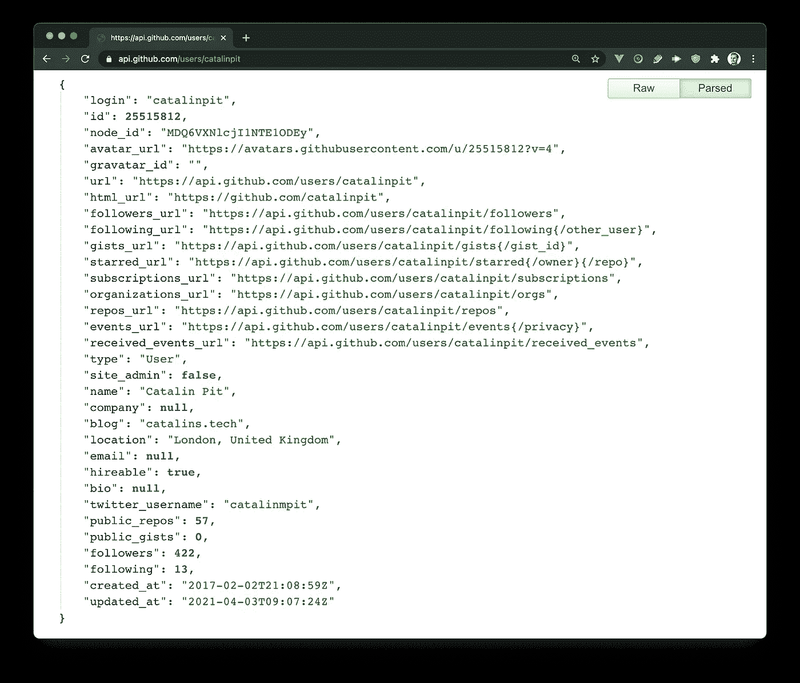
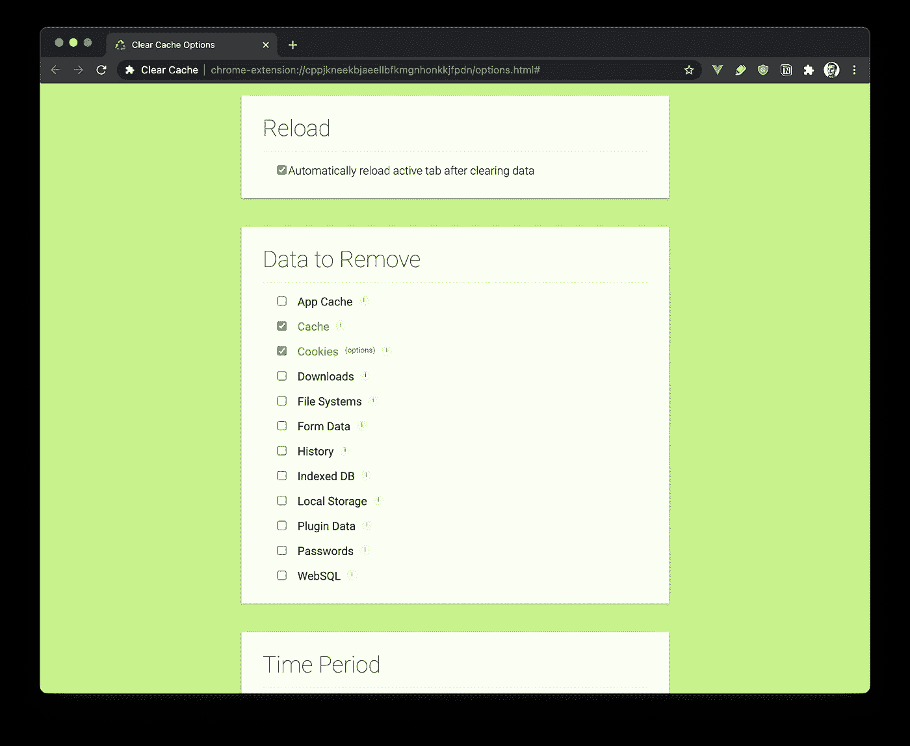
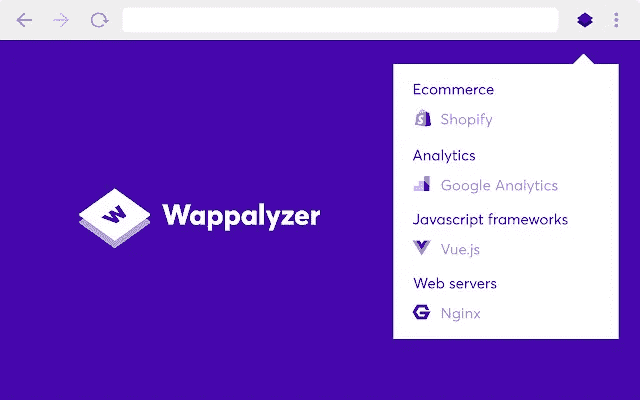
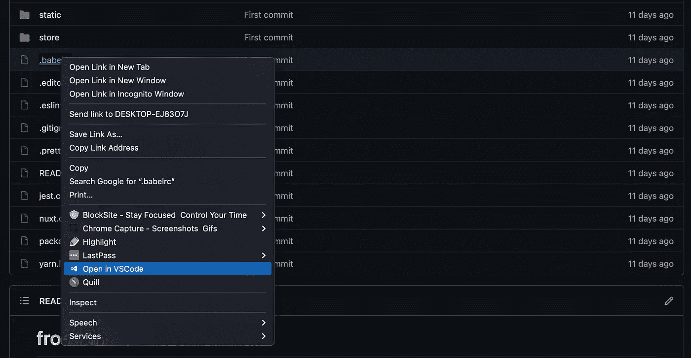
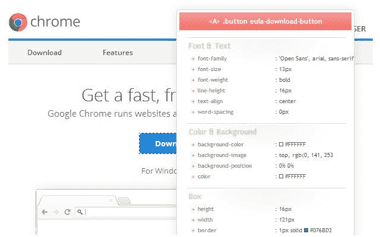
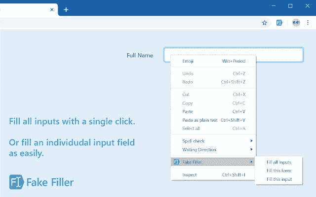
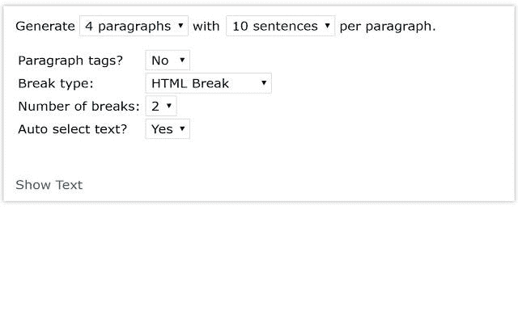
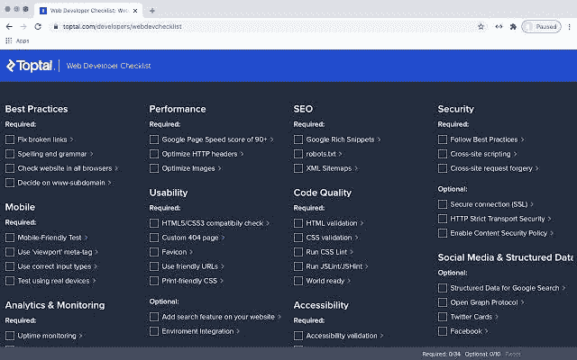
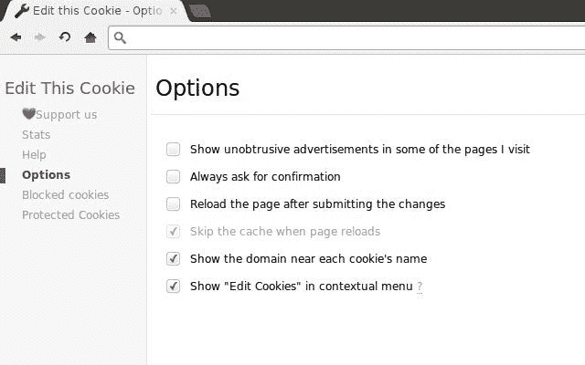

# 提高开发人员工作效率的 14 大浏览器扩展

> 原文：<https://betterprogramming.pub/top-14-browser-extensions-for-better-developer-productivity-19b4efcdd20a>

## 14 个最佳浏览器扩展的精选列表，将帮助开发人员并提高他们的工作效率

维克多·罗德里格兹在 [Unsplash](https://unsplash.com?utm_source=medium&utm_medium=referral) 上的照片

在本文中，您可以看到开发人员的 14 大浏览器扩展。这份精选的最佳浏览器扩展列表旨在帮助您提高工作效率并节省时间。

# 1.[碉堡](https://chrome.google.com/webstore/detail/blocksite-stay-focused-co/eiimnmioipafcokbfikbljfdeojpcgbh?hl=en)

BlockSite 扩展可以很好地阻挡干扰，让你保持专注。它通过允许你屏蔽分心和有害的网站来停止拖延。

每次您尝试访问被阻止的网站时，都会收到一条错误消息。你是否沉迷于社交媒体网站？没问题。你可以挡住它们，这样它们就不会分散你的注意力。

上图显示了 BlockSite 运行时，您尝试访问被阻止的网站时所看到的情况。此外，您可以批准某些网站并阻止所有其他网站。

# 2.[番茄助手](https://chrome.google.com/webstore/detail/marinara-pomodoro%C2%AE-assist/lojgmehidjdhhbmpjfamhpkpodfcodef?hl=en)

如果你不知道番茄工作法，这是一种时间管理方法，你可以用计时器将工作分成几个间隔。每次工作间隔时间为 25 分钟，随后是短暂的休息。

番茄工作法扩展允许你使用番茄工作法。当然，你可以改变工作间隔和休息的时间。您可以根据自己的需要对它们进行定制。

上图显示了扩展和它的可定制性。看看这个浏览器扩展如何提高您的工作效率。

# 3. [JSON 格式化程序](https://chrome.google.com/webstore/detail/json-formatter/bcjindcccaagfpapjjmafapmmgkkhgoa?hl=en)

在浏览器中处理 JSON 数据可能是一件麻烦的事情，尤其是当有大量数据时。扩展 JSON 格式化程序以一种更容易吸收和理解的方式显示 JSON 数据。

该扩展提供了如下功能:

*   可点击的 URL
*   语法突出显示
*   刻痕
*   可折叠部分

上面的截图展示了一个使用 JSON 格式化程序的例子。在这里，您可以看到[原始数据在没有使用 JSON 扩展的情况下是什么样子。](https://api.github.com/users/catalinpit)

# 4.[每日开发](https://chrome.google.com/webstore/detail/dailydev-all-in-one-codin/jlmpjdjjbgclbocgajdjefcidcncaied?hl=en)

Daily Dev 是一个运行在浏览器中的开发者新闻聚合器。每次你打开一个新的浏览器标签，你会得到来自开发者世界的所有新闻。它收集了来自 350 多个来源的新闻，这是了解最新科技新闻的最简单方式。

为什么您会使用此扩展而不是其他来源？

*   这很容易——你只需要把它安装在你的浏览器里，你就可以轻松获得所有的新闻。
*   不需要注册——你不需要注册就可以使用它或者阅读新闻。
*   它是免费的。

上面的截图展示了我的浏览器中的扩展。

# 5.[清除缓存](https://chrome.google.com/webstore/detail/clear-cache/cppjkneekbjaeellbfkmgnhonkkjfpdn?utm_source=chrome-ntp-icon)

有时候你想清除你的浏览器缓存，而你知道只需要点击几下鼠标就可以完成。幸运的是，有一个浏览器扩展可以让你一键清除数据。

上面的截图展示了应用程序的一部分。您可以看到，您可以自定义要清除的数据。您可以在应用缓存、缓存、cookies、下载、文件系统、表单数据、历史、索引数据库、本地存储、插件数据、密码和 WebSQL 之间进行选择。

清除缓存扩展提高了您的生产力，因为您可以清除您的缓存在一次点击，消除了多个步骤。

# 6.[华帕里斯](https://chrome.google.com/webstore/detail/wappalyzer/gppongmhjkpfnbhagpmjfkannfbllamg)

Wappalyzer 是一个浏览器扩展，允许您查看网站和 web 应用程序背后的技术。

使用此扩展，您可以找到以下信息:

*   使用的 CMS
*   使用的框架、电子商务平台或 JavaScript 库
*   支付处理器
*   营销和分析工具

Wappalyzer 示例

上图展示了实际应用中的扩展。

# 7.[在 VS 代码中打开](https://chrome.google.com/webstore/detail/open-in-vscode/pfakkjlkpobjeghlgipljkjmbgcanpji)

在 VS 代码中打开是一个方便的特性，正如它的名字所说——它允许你在 VS 代码中打开 GitHub 和 GitLab 链接。

这是一个巨大的时间节省，因为它消除了耗时的步骤，如下载文件和在 VS 代码中手动打开它们。你所要做的就是右键点击文件，然后点击选项“在 VS 代码中打开”下图说明了这一点。

# 8. [CSS 查看器](https://chrome.google.com/webstore/detail/cssviewer/ggfgijbpiheegefliciemofobhmofgce)

CSS Viewer 扩展允许你检查来自网站的元素并查看它们的 CSS 属性。这可以节省时间，因为您可以快速查看元素的 CSS，而不是检查每个元素并单独搜索 CSS。

你可以在上图中看到 CSS Viewer 扩展的运行。

# 9.[假填充物](https://chrome.google.com/webstore/detail/fake-filler/bnjjngeaknajbdcgpfkgnonkmififhfo?hl=en)

有时当您测试您的应用程序时，您需要在表单中输入虚拟信息。与其手动完成表单，为什么不使用自动完成的假 Filler 扩展呢？

这个浏览器扩展为您节省了大量时间，因为它可以在几秒钟内用随机数据完成字段。这是一个真正的节省时间，我强烈推荐它。你可以在下图中看到。

# 10.[德沃](https://chrome.google.com/webstore/detail/devo/elkhalpmbmbaeoemecpcfdcoekmpgmdm?hl=en)

Devo 是一个浏览器扩展，可以帮助你了解最新的开发动态。该浏览器扩展从以下来源收集信息:

*   GitHub 趋势
*   黑客新闻
*   产品搜索
*   还有更多

下图可以看到扩展。

**注意**:需要注意的是，你不能同时使用 Devo 和 Daily Dev。你必须在它们之间做出选择。如果你问我，我更喜欢每日开发扩展这个。

# 11. [Lorem Ipsum 发生器](https://chrome.google.com/webstore/detail/lorem-ipsum-generator-def/mcdcbjjoakogbcopinefncmkcamnfkdb?hl=en)

有许多可能需要大块占位符文本的用例。幸运的是，Lorem Ipsum 生成器可以帮助解决这个问题。

这个浏览器扩展允许你为一到五个段落生成随机文本，每个段落有一到二十个句子。

上图展示了实际应用中的扩展。当你必须使用占位符文本时，它非常方便。

# 12.[网络开发人员清单](https://chrome.google.com/webstore/detail/web-developer-checklist/iahamcpedabephpcgkeikbclmaljebjp/related?hl=en)

Web Developer 清单扩展分析网页并检查违反最佳实践的情况。这是一个方便的工具，允许 web 开发人员发现互联网上任何网站的问题。

你所要做的就是安装扩展，然后在任何你想查看的网站上运行它。根据网站的不同，它会告诉你问题是什么，以及如何改进或修复。如果您关心 SEO、速度、可访问性等等，您需要这个扩展。

# 13.[编辑 ThisCookie](https://chrome.google.com/webstore/detail/editthiscookie/fngmhnnpilhplaeedifhccceomclgfbg)

此浏览器扩展是一个 cookie 管理器，允许您对 cookie 执行以下操作:

*   增加
*   删除
*   编辑
*   搜索
*   保护和阻止

EditThisCookie 是最受欢迎的 Cookie 管理器之一，拥有 200 万+的下载量和 4.5 星(由 11450 人评级)。除此之外，它是开源的(你可以贡献给它)并且支持 20 多种语言。我强烈推荐。

上图展示了一个具有某些特征的示例。

# 14.[快速编码](https://chrome.google.com/webstore/detail/quickcode-free-online-pro/nnigpbiaggiephcndokoaongeefpbdcj?hl=en)

QuickCode browser 扩展管理免费的在线编程课程，并在您的浏览器选项卡中显示它们。它包括来自 Udacity、Coursera、Udemy、EDX 等公司/平台/大学的课程。

也可以通过编程语言浏览课程。你可以选择 Java、Python、JavaScript、Node、Vue 等等。下图显示了扩展。

# 结论

这些浏览器扩展很有帮助，它们提高了您的工作效率。然而，这个列表并不详尽，所以请在评论中添加更多内容。我们期待看到其他建议。

此外，需要注意的是，有些可能适用于其他浏览器，而有些可能不适用。本文中的浏览器扩展被推荐用于 Chrome 浏览器。然而，它们中的大多数也可以在其他浏览器中使用。