# 开始在生产中使用的 3 大 CSS 网格特性

> 原文：<https://betterprogramming.pub/top-3-css-grid-features-to-start-using-in-production-b0fe59b2e0f7>

## 深入探究一些广泛支持的 CSS 网格特性


照片由[西格蒙德](https://unsplash.com/@sigmund?utm_source=medium&utm_medium=referral)在 [Unsplash](https://unsplash.com?utm_source=medium&utm_medium=referral) 上拍摄

网格最初由微软团队起草，并于 2011 年发布到 Internet Explorer 10 中。经过近九年的时间，我们现在可以说它的浏览器支持变得足够好，我们可以在生产中使用它。

我们将看一看具有可靠浏览器支持的三大特性。尽管有一些很酷的新特性，比如`subgrid`，但是请注意不要在产品中使用它们。在运输任何东西之前，检查一下[我能使用](https://www.caniuse.com)总是一个好习惯。

# 简短的复习

网格到底是什么？网格是一个以容器为中心的多维布局系统。简而言之:它可以在任意 x/y 方向生长，所有的布局信息都存储在父节点中。孩子们大多掌握着如何在网格上定位的信息。


一维布局与二维布局

使用 Grid 进行开发时，建议使用 Firefox 浏览器。它的开发工具比任何竞争对手都要好。它是支持网格最好的浏览器。这是目前唯一实现了`subgrid`的浏览器。

现在，让我们深入了解三大生产就绪的 CSS 网格特性。

# **1。网格模板区域**

这是我最喜欢的 CSS 网格特性。它允许您以声明的方式定义网格布局。

只需几行 CSS 代码，您就可以创建一个非常复杂且响应迅速的布局:

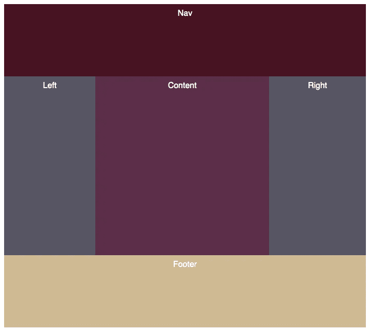

复杂网格布局

所有的魔法都发生在`grid-templates-areas`和`grid-area`里。前者定义了所有的网格轨迹，而后者只是在这些区域上定位网格元素。

提示:网格轨迹是两条网格线之间的空间。

让我们用 Firefox inspector 检查一下，以便清楚地看到我们创建的网格布局。

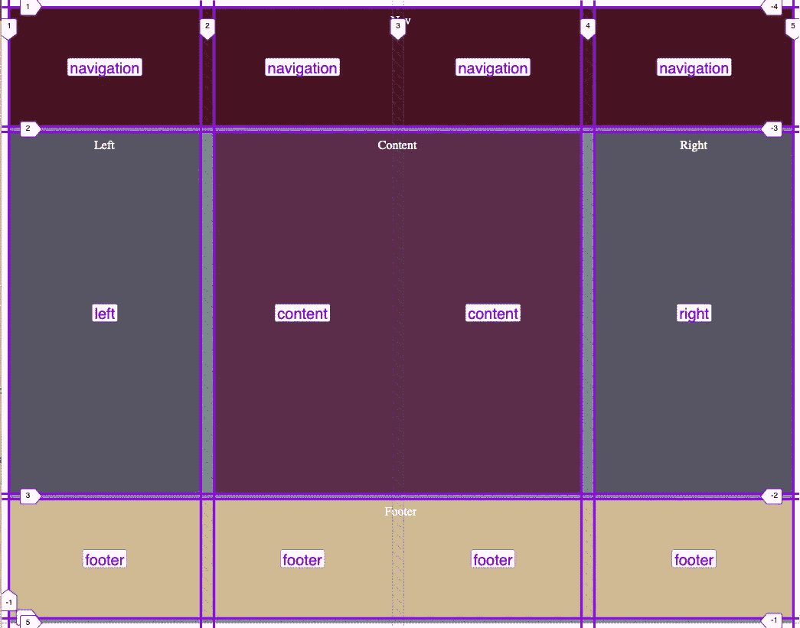

网格布局的内部

如果我们希望内容周围有一些空白空间，而不是左/右栏，我们可以使用`.` / `...`符号。

```
#grid {
  background-color: #73937E;
  height: calc(100vh - 20px);
  display: grid;
  grid-template-rows:1fr 2fr 1fr;
  grid-template-areas:
    "navigation navigation navigation navigation"
    ". content content ."
    "footer footer footer footer";
}
```

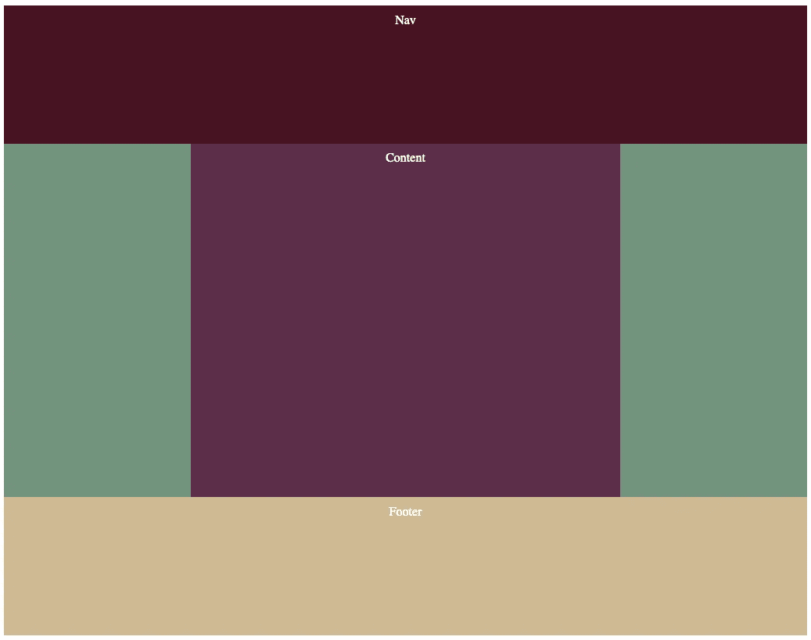

在内容 div 的左侧和右侧定义空网格

注意:在使用网格区域时，有几件事情需要注意:

*   每个区域名只能定义一次。如果具有相同区域名称的单元格没有连接，它们将计为两个声明。
*   网格区域单元格必须形成一个矩形。否则，声明无效。

```
// Example of an invalid Grid
#grid {
  background-color: #73937E;
  height: calc(100vh - 20px);
  display: grid;
  grid-template-areas:
    "navigation navigation navigation navigation"
    "left content content right"
    "content content content content"
    "left content content right"
    "footer footer footer footer";
}
```

上面的例子不成立。`right`和`left`有两种定义。移除那一行`"content content content content"`将修复它，因为`left`和`right`将被连接。

```
// Example of an invalid Grid
#grid {
  background-color: #73937E;
  height: calc(100vh - 20px);
  display: grid;
  grid-template-areas:
    "navigation navigation navigation navigation"
    "content right"
    "content content"
    "right"
    "footer";
}
```

上面的例子不成立。我们已经描述了一个非矩形区域。网格不是为此而构建的，也不支持它。

提示:可以将`grid-template-rows`与`grid-template-areas`配合使用。但是，结果会不一样。你必须选择一个适合你的具体情况。

```
// Approach A
grid-template-rows: 1fr 3fr 1fr;
grid-template-areas:
  "navigation navigation navigation navigation"
  "left content content right"
  "footer footer footer footer";// Approach B
grid-template-areas:
  "navigation navigation navigation navigation"
  "left content content right"
  "left content content right"
  "left content content right"
  "footer footer footer footer";
```


方法 A

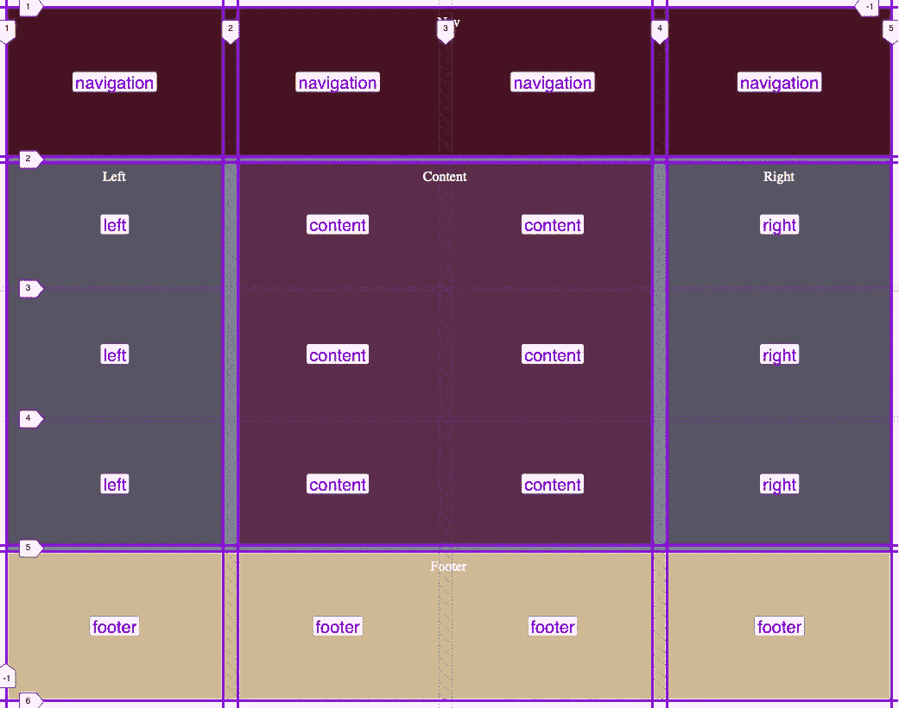

方法 B

提示:使用`grid-template-area`时，网格线是免费创建的。这意味着即使使用`grid-template-area`，你仍然可以使用网格线的位置逻辑。那我们就简单查一下负指数`-1`吧。

```
.customContent {
  background-color: white;
  grid-row: 1 / -1; 
  grid-column: 1;
}
```

添加负索引会使 CSS 更加健壮。您变得不知道网格线的数量:您设置您的内容扩展到最后一个网格线。

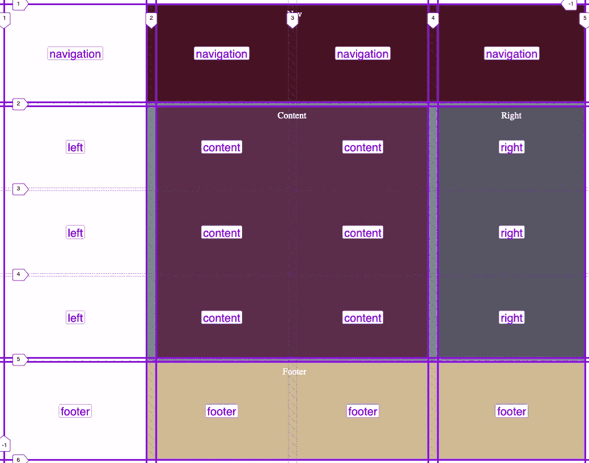

对行使用负索引的结果

# **2。网格间隙**

Grid `gap`使用起来超级简单直观。使用`column-gap`、`row-gap`或`gap`定义网格布局中的间隙。

```
#grid {
  background-color: #73937E;
  height: calc(100vh - 20px);
  display: grid;
  row-gap: 5px;
  column-gap: 15px;
  grid-template-areas:
    "navigation navigation navigation navigation"
    "left content content right"
    "content content content content"
    "left content content right"
    "footer footer footer footer";
}
```

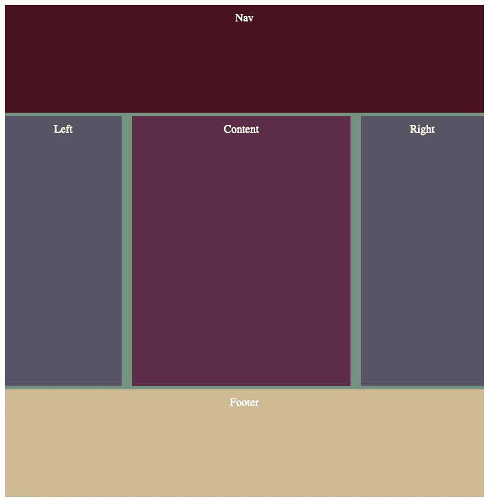

使用间隙功能

注意:不要使用`grid-gap`、`grid-column-gap`或`grid-column-gap`:这些现在被认为是过时的，将会失去支持。

# **3。最小最大值**

起初`MinMax`看起来不像是一个令人兴奋的功能。API 非常简单:

```
minmax(min, max)
```

它将获得`min`和`max`之间的最大值。它接受:`length`、`percentage`、`max-content`、`min-content`和`auto`值。它是为网格构建的，这一事实使它变得非常强大。

让我们创建一个有三列的布局，并使用`minmax`让它们扩展到整个网格区域。

```
grid-template-columns: repeat(3, minmax(100px, 1fr));
```

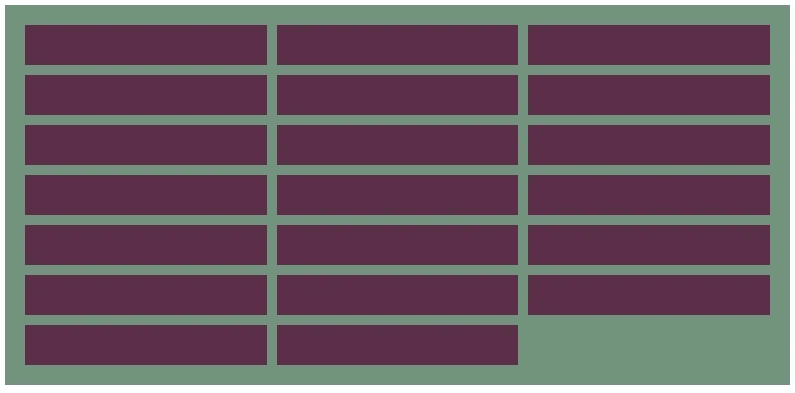

用 minmax 定义三列布局

注意:它看起来很可爱，但是有一个很大的缺点:如果容器小于`3 * 100px + 2 * 10px`，内容就会溢出。

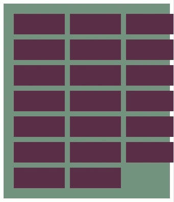

没有足够的空间来呈现最小列宽为 100 像素的三列布局

我们如何解决这个问题？以响应的方式构建网格布局。我们可以让网格容器通过使用`auto-fill`或`auto-fit`来决定自己的列数。

通过这一简单的更改，我们的三列布局现在可以响应视窗的大小:

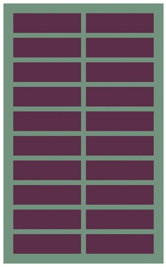

响应式网格布局

我们所有的魔法发生的地方:

```
grid-template-columns: repeat(auto-fill, minmax(200px, 1fr));
```

我们告诉网格布局创建填充网格空间的轨迹，它们应该有最小的`200px`和最大的`1fr`。

注意:有一个警告:你不能使用`auto-fill`并设置最大列数。事情不应该是这样的。要设置最大列数，您必须使用媒体查询并调整`minMax`的值。另一种选择是使用`css variables`。任一选项都需要使用媒体查询。

```
// Example of using media queries + css variables to have responsive fixed column layout.grid {
  --repeat: auto-fit;
}@media screen and (max-width: 700px) {
  .grid {
    --repeat: 3;
  }
}grid-template-columns: repeat(var(--repeat, auto-fit), minmax(200px, 1fr));
```

最后，让我们充分理解`auto-fit`和`auto-fill`的区别:

*   `auto-fill`:根据给定的约束条件，尝试用尽可能多的列填充行
*   `auto-fit`:行为方式与`auto-fill`相同，但是任何空的重复轨道将被折叠，并且它将扩展其他轨道以占据所有可用空间(如果有的话)

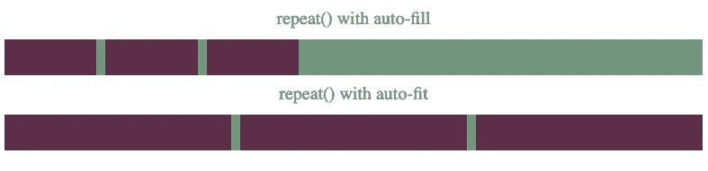

自动填充与自动适应

当有足够的元素填充网格时，这两个属性的行为方式相同。这意味着根据不同的分辨率，它们可能看起来是一样的。这就是为什么了解它们的内部是有好处的。

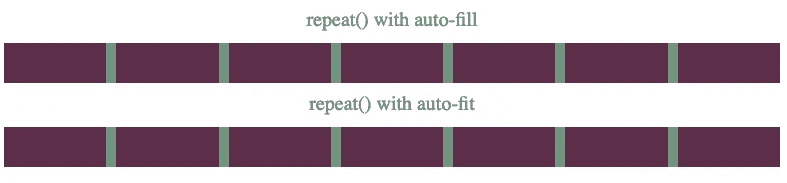

在某些分辨率下，它们可能看起来是一样的

# **总结**


[Denys Nevozhai](https://unsplash.com/@dnevozhai?utm_source=medium&utm_medium=referral) 在 [Unsplash](https://unsplash.com?utm_source=medium&utm_medium=referral) 上拍摄的照片

我们已经深入研究了三个主要的网格特性以及如何最好地使用它们。现在，您可以用更少的 CSS 代码以更高的性能和效率构建您的布局。破解 Flex API 的日子已经一去不复返了——用网格增强自己的能力。

不幸的是，我们不能等待探索者 11 号消失，因为它至少在四年内不会发生。它仍然在企业级使用。只要确保添加一些 polyfills 来为 100%的用户提供支持。

我希望我的文章能够为您提供在生产中开始使用网格所需要的最后推动力。一旦开始使用，就没有回头路了。

如果您对 Subgrid 感兴趣，我建议您查看另一篇文章:

[](https://medium.com/better-programming/using-css-subgrid-for-pixel-perfection-6d4343b057cd) [## 使用 CSS 子网格实现像素完美

### 展示 CSS 的子网格特性的简单美丽

medium.com](https://medium.com/better-programming/using-css-subgrid-for-pixel-perfection-6d4343b057cd) 

干杯！