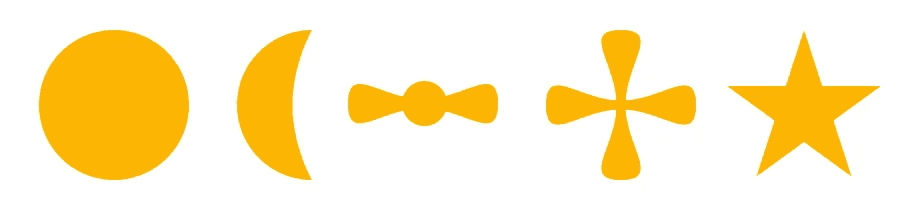
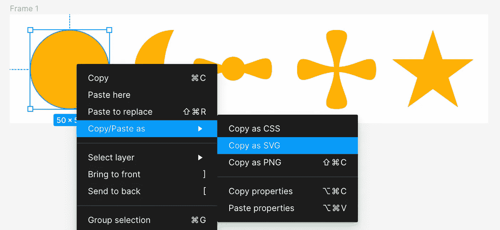
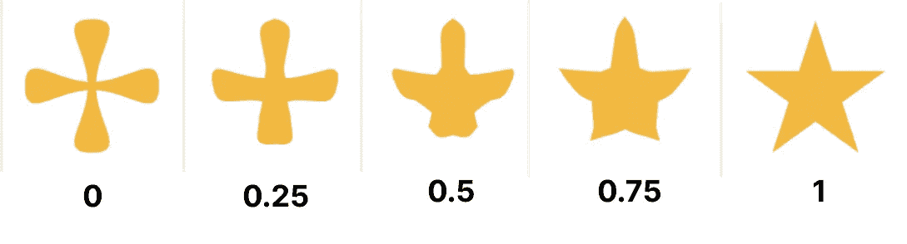
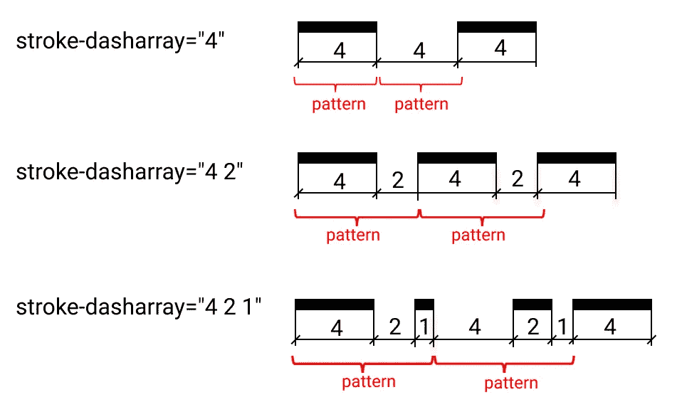
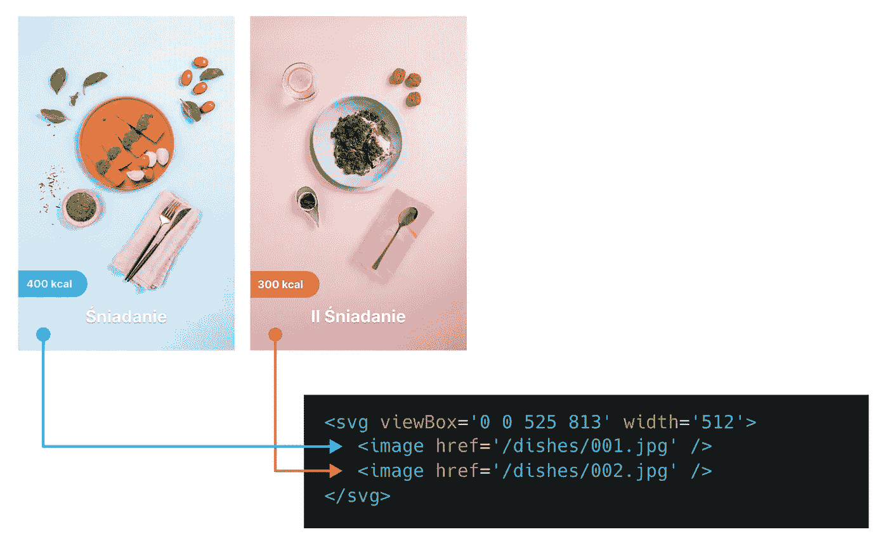
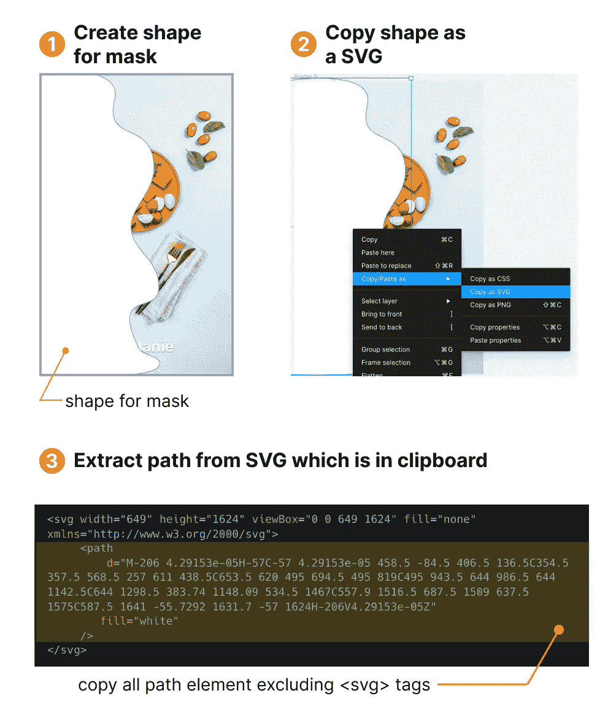
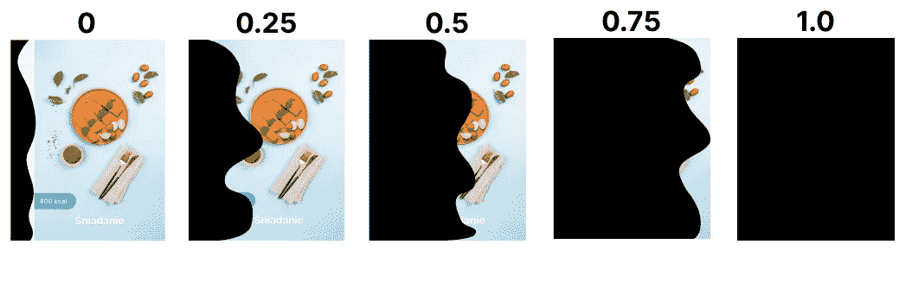

# 三大 SVG 动画技术

> 原文：<https://betterprogramming.pub/top-3-svg-animation-techniques-317225194230>

## 这些奇妙功能的简要指南


作者图片

# 1.变形路径

我们知道 SVG 具有允许绘制复杂形状的`<path/>`元素。其中一个有趣的技术是使用这个库，它可以为从一个路径到另一个路径的平滑过渡创建插值。

首先，让我们在 Figma 中创建一些任意对象。它看起来可能是这样的(如果一个对象包含几个形状，请注意，您应该以 Figma 将其转换为一个路径的方式合并它们):



之后，我们需要转换 SVG 路径中的每个形状——右键单击所选形状，然后选择“复制/粘贴为->复制为 SVG”选项:



以下 SVG 被复制到剪贴板中:

```
<svg width="50" height="50" viewBox="0 0 50 50" fill="none" >
    <path d="M50 25C50 38.8071 38.8071 50 25 50C11.1929 50 0 38.8071 0 25C0 11.1929 11.1929 0 25 0C38.8071 0 50 11.1929 50 25Z" fill="#FBB503"/>
</svg>
```

我们对字符串感兴趣，它是内部的`d`属性。一旦我们对所有形状执行了这些步骤，我们就会得到以下路径集:

```
const circlePath = 'M50 25C50 38.8071 38.8071 50 25 50C11.1929 50 0 38.8071 0 25C0 11.1929 11.1929 0 25 0C38.8071 0 50 11.1929 50 25Z';;
const moonPath = 'M18.5 25C18.5 38.8071 25 50 25 50C11.1929 50 0 38.8071 0 25C0 11.1929 11.1929 0 25 0C25 0 18.5 11.1929 18.5 25Z';;
const bowPath = 'M32.5634 4.97243C34.8622 4.36552 37.0171 3.59038 38.9747 2.88622C45.6264 0.493523 50 -1.07968 50 7.55108C50 16.1818 45.6264 14.6086 38.9747 12.2159C37.0075 11.5083 34.841 10.729 32.5294 10.1207C31.4665 12.9705 28.7202 15 25.5 15C22.1937 15 19.387 12.8605 18.389 9.89044C15.7317 10.523 13.251 11.4153 11.0253 12.2159C4.37355 14.6086 0 16.1818 0 7.55108C0 -1.07968 4.37355 0.493523 11.0253 2.88622C13.2423 3.68369 15.7123 4.57219 18.3579 5.20427C19.3276 2.18508 22.1586 0 25.5 0C28.7552 0 31.5261 2.07386 32.5634 4.97243Z';;
const crossPath = 'M20.3352 39.5258C17.9425 46.1775 16.3692 50.5511 25 50.5511C33.6308 50.5511 32.0576 46.1775 29.6649 39.5258C28.3742 35.9377 26.845 31.6866 26.5505 27.1015C31.1355 27.3961 35.3866 28.9252 38.9747 30.2159C45.6265 32.6086 50 34.1818 50 25.5511C50 16.9203 45.6265 18.4935 38.9747 20.8862C35.3866 22.1769 31.1355 23.7061 26.5505 24.0006C26.845 19.4156 28.3742 15.1645 29.6649 11.5764C32.0576 4.92464 33.6308 0.551086 25 0.551086C16.3692 0.551086 17.9425 4.92464 20.3352 11.5764C21.6258 15.1645 23.155 19.4156 23.4496 24.0006C18.8645 23.7061 14.6134 22.1769 11.0253 20.8862C4.37354 18.4935 0 16.9203 0 25.5511C0 34.1818 4.37354 32.6086 11.0253 30.2159C14.6134 28.9252 18.8645 27.3961 23.4496 27.1015C23.155 31.6866 21.6258 35.9377 20.3352 39.5258Z';;
const starPath = 'M26 0L32.0619 18.6565H51.6785L35.8083 30.1869L41.8702 48.8435L26 37.3131L10.1298 48.8435L16.1917 30.1869L0.321474 18.6565H19.9381L26 0Z';;
```

库 [flubber](https://github.com/veltman/flubber\) 帮助我们创建两个形状之间的平滑过渡。

```
yarn add flubber
```

这个 API 非常简单。我们需要创建一个传递两条路径的插值器，它返回一个函数。使用从 0 到 1 的值调用此函数会返回一个新的中间路径，用于平滑过渡。代码如下:

```
const interpolator = flubber.interpolate(crossPath, starPath);

interpolator(0); // returns an SVG cross path string
interpolator(0.5); // returns something halfway between the cross and the star
interpolator(1); // returns an SVG star path string
```

看起来是这样的:



我们需要将它与 React 集成。为了简化我们的任务，我将使用两个依赖项:
- `usehooks-ts`:一个包含许多有用钩子的库。我们将使用`useInterval`钩子(实现[这里是](https://usehooks-ts.com/react-hook/use-interval))；
- `framer-motion`:动画库，我们将使用`animate`——一个动画化任何值的函数(更多细节[在这里](https://www.framer.com/docs/animate-function/))。

让我们创建我们的`MorphPath`组件。正如我们所料，道具应该是两条路径:`fromPath`和`toPath`。此外，我们可能会公开一些参数，这些参数允许我们更具体地设置动画行为:

```
import { interpolate } from 'flubber';
import { animate, Spring, Tween } from 'framer-motion';
import { useEffect, useRef, useState } from 'react';

type MorphPathProps = {
  fromPath: string;
  toPath: string;
  animation?: (Tween | Spring) & { delay?: number; type?: 'tween' | 'spring' };
};

const MorphPath = ({ fromPath, toPath, animation }: MorphPathProps) => {
  // create interpolator for smooth transition paths from fromPath to toPath
  const interpolatorRef = useRef<any>();
  useEffect(() => {
    interpolatorRef.current = interpolate(fromPath, toPath, {
      maxSegmentLength: 0.1,
    });
  }, [fromPath, toPath]);

  // animate value from 0 to 1 
  const [progress, setProgress] = useState(0);
  useEffect(() => {
    animate(0, 1, {
      ...animation,
      onUpdate: (val) => {
        setProgress(val);
      },
    });
  }, [fromPath, toPath, animation]);

  // for each new animated progress value invoking
  // interpolator and set a new inperpolated path into React state
  const [path, setPath] = useState<null | string>(null);
  useEffect(() => {
    if (interpolatorRef.current) {
      setPath(interpolatorRef.current(progress));
    }
  }, [progress]);

  if (!path) {
    return null;
  }

  return <path d={path} fill='#FBB503' />;
};
```

我们需要使用这个组件，每两秒钟，我们创建一个新的序列`fromPath`和`toPath`:

```
const circlePath = '...';
const moonPath = '...';
const bowPath = '...';
const crossPath = '...';
const starPath = '';

const paths = [circlePath, moonPath, bowPath, crossPath, starPath];

const MorphMoonToSun = () => {
  const [index, setIndex] = useState(0);

  useInterval(() => {
    setIndex((prev) => prev + 1);
  }, 2000);

  return (
    <div style={styles.container}>
      <svg viewBox='0 0 52 52' style={styles.svg}>
        <MorphPath
          fromPath={paths[index % paths.length]}
          toPath={paths[(index + 1) % paths.length]}
          animation={{ duration: 1 }}
        />
      </svg>
    </div>
  );
};
```

干得好。没那么难。

# 2.动画描边属性

另一个非常常用的动画。这是一个笔画属性的动画，我们可以看一下如何动态绘制路径，如下所示:

这里最酷的部分是它实现起来非常简单。该动画仅基于两个 CSS 属性`— stroke-dasharray`和`stroke-dashofset`。这些属性负责定义用于绘制形状轮廓的虚线和间隙图案:



因此，如果我们知道路径的长度(我们可以通过 JS API 提取它)，我们可以创建一个模式，其中间隔和破折号的长度等于路径的长度。通过操纵偏移值，我们可以创建一个类似于开始绘制笔画的效果，但从字面上看，这意味着我们沿着笔画路径移动一条虚线:


你可以玩这个沙盒来更深入地理解正在发生的事情(改变滚动条，看看路径是如何变化的):

让我们总结一下我们将要实现的内容:

*   定义路径长度(JS 为`path.getTotalLength()`提供了一个特殊 API，并将这个值设置为`stroke-dasharray`。它将在动画时间内保持静态
*   将`stroke-dashofset`属性从`-totalLengthPath`动画到`0`

该组件可能如下所示:

```
import { animate, Spring, Tween } from "framer-motion";
import { useEffect, useRef, useState } from "react";

type AnimatedPathProps = {
  path: string;
  animation?: (Tween | Spring) & { delay?: number; type?: "tween" | "spring" };
};

const AnimatedPath = ({ path, animation }: AnimatedPathProps) => {
  const pathRef = useRef<SVGPathElement>(null);
  const [totalPathLength, setTotalPathLength] = useState(0);
  const [animatedOffset, setAnimatedOffset] = useState(-totalPathLength);

  // via JS API calculate length of path
  // and defining stroke-dasharray propert with pattern
  // where length of dash and gap equal total length of path
  useEffect(() => {
    if (pathRef.current) {
      const pathLength = pathRef.current.getTotalLength();
      setTotalPathLength(pathLength);
      setAnimatedOffset(-pathLength);
    }
  }, []);

  // animate offset of dashes and change
  // value in a range [-totalPath:ength, 0]
  useEffect(() => {
    animate(-totalPathLength, 0, {
      ...animation,
      onUpdate: (val) => {
        setAnimatedOffset(() => val);
      }
    });
  }, [totalPathLength, animation]);

  return (
    <path
      d={path}
      ref={pathRef}
      stroke="red"
      fill="none"
      strokeWidth={10}
      strokeDasharray={totalPathLength}
      strokeDashoffset={animatedOffset}
    />
  );
};

export default AnimatedPath;
```

下面是我们如何使用这个组件:

```
import AnimatedPath from "./components/AnimatedPath";
import { useInterval } from "usehooks-ts";
import "./styles.css";
import { useState } from "react";

const defaultPath = [
  { path: "...path for letter 1" },
  { path: "...path for letter 2" },
  // ... other path letters
];

const animationDuration = 0.8;

export default function App() {
  return (
    <div style={styles.container}>
      <svg
        viewBox="0 0 2600 1350"
        width="500"
        style={styles.svg}
      >
        {defaultPath.map((path, i) => (
          <AnimatedPath
            path={path.path}
            key={i}
            animation={{
              duration: animationDuration,
              delay: i * animationDuration * 0.5
            }}
          />
        ))}
      </svg>
    </div>
  );
}
```

对于任何其他细节，你可以看看上面附加的代码沙箱。

# 3.使用 SVG 遮罩

您应该注意到`<mask/>`元素，它定义了将当前对象合成到背景中的 alpha 蒙版。当你将遮罩应用于特定元素时，白色像素下的所有内容都将可见，黑色像素下的所有内容都将不可见。

假设我们有两张由波兰餐饮服务提供的令人惊叹的菜肴图片，让我们将它们一张一张地放在 SVG 中:



在 Figma 中，让我们也创建任何填充白色的任意形状(记住，白色像素下的所有内容都将在蒙版中可见)。它可能看起来像这样:



最后一步是使用我们在上一步中得到的路径作为 SVG 中的掩码:

最终的 SVG 如下所示:

```
<svg viewBox='0 0 1050 1624' width='300'>
  <mask id='transition'>
    <path d="M-206 4.29153e-05H-57C-57 4.29153e-05 458.5 -84.5 406.5 136.5C354.5 357.5 568.5 257 611 438.5C653.5 620 495 694.5 495 819C495 943.5 644 986.5 644 1142.5C644 1298.5 383.74 1148.09 534.5 1467C557.9 1516.5 687.5 1509 637.5 1575C587.5 1641 -55.7292 1631.7 -57 1624H-206V4.29153e-05Z" fill="white"/>
  </mask>
  <image href='/src/media/001.jpg' width="1050"/>
  <image href='/src/media/002.jpg' width="1050" mask='url(#transition)' />
</svg>
```

在这里，我们用`id="transition"`在`<mask/>`元素内放置蒙版路径，并为第二个图像分配一个新属性`mask`，并定义将要使用哪个蒙版:`mask='url(#transition)'`。

最后，我们得到以下结果:

但是挺无聊的。让我们在第一章中开发的组件`MorphPath`的基础上添加一些动画。但在此之前，让我们在 Figma 中描绘一些中间路径(假设为 0%、25%、50%、75%和 100%)。它有助于更好地管理插值路径转换:



像往常一样，我们需要从每个路径的`d`属性中提取字符串并定义常量:

```
const path00 =
  "M-192 -1H-43C-43 -1 -129 87 -135 164C-141 241 -67.2419 331.14 -43 405C3 545.151 34.5 685 -14 815C-62.5 945 -91.5 928 -25.5 1128.5C40.5 1329 -94.0519 1351 -25.5 1504C9 1581 -41.1948 1633.94 -43 1623H-192V-1Z";
const path25 =
  "M-206 0H-57C-57 0 102.5 27.5 179 151.5C255.5 275.5 179 275.5 179 467C179 658.5 395.5 699.5 395.5 824C395.5 948.5 90 980 90 1136C90 1292 373.5 1155 303.5 1496C276.832 1625.91 -55.1948 1634.94 -57 1624H-206V0Z";
const path50 =
  "M-206 4.29153e-05H-57C-57 4.29153e-05 458.5 -84.5 406.5 136.5C354.5 357.5 568.5 257 611 438.5C653.5 620 495 694.5 495 819C495 943.5 644 986.5 644 1142.5C644 1298.5 383.74 1148.09 534.5 1467C557.9 1516.5 687.5 1509 637.5 1575C587.5 1641 -55.7292 1631.7 -57 1624H-206V4.29153e-05Z";

const path75 =
  "M-206 8.7738e-05H-57C-57 8.7738e-05 831.5 -107.5 944.5 146C1057.5 399.5 798 289 840.5 470.5C883 652 1048.5 696.5 1048.5 821C1048.5 945.5 743.5 960 805.5 1119.5C867.5 1279 874.063 1218.5 944.5 1367.5C967.9 1417 1003.5 1573 910 1622.5C816.5 1672 -55.7292 1631.7 -57 1624H-206V8.7738e-05Z";
const path100 =
  "M-206 7.62939e-05H-57C-57 7.62939e-05 975.5 -291.5 1088.5 -38C1201.5 215.5 1118 274 1160.5 455.5C1203 637 1048.5 696.5 1048.5 821C1048.5 945.5 1081 1022 1143 1181.5C1205 1341 1115.06 1391 1185.5 1540C1208.9 1589.5 1094 1622 1000.5 1671.5C907 1721 -55.7292 1631.7 -57 1624H-206V7.62939e-05Z";

const paths = [path00, path25, path50, path75, path100];
```

因为我们已经实现了`MorphPath`组件，所以最终的代码应该是这样的:

```
// some code skipped for brevity, the full version
// see in codesanbox attech below
import { MorphPath } from "./components/MorphPath";

const path00 = '...';
const path25 = '...';
const path50 = '...';
const path75 = '...';
const path100 = '...';

const paths = [path00, path25, path50, path75, path100];

export default function App() {
  const [pathIndex, setPathIndex] = useState(0);

  useInterval(() => {
    setPathIndex((prev) => prev + 1);
  }, 1000);

  return (
    <div style={styles.container}>
      <svg viewBox="0 0 525 813" style={styles.svg}>
        <mask id="transition">
          <MorphPath
            fromPath={paths[pathIndex % paths.length]}
            toPath={paths[(pathIndex + 1) % paths.length]}
            fill="white"
            animation={{ duration: 1 }}
          />
        </mask>
        <image href="/001.jpg" />
        <image href="/002.jpg" mask="url(#transition)" />
      </svg>
    </div>
  );
}
```

最终的结果看起来是这样的:

我希望你喜欢阅读这篇文章。我很高兴看到任何关于应该被涵盖的项目的评论，并且我感谢任何对改进文章的帮助。

谢谢你。