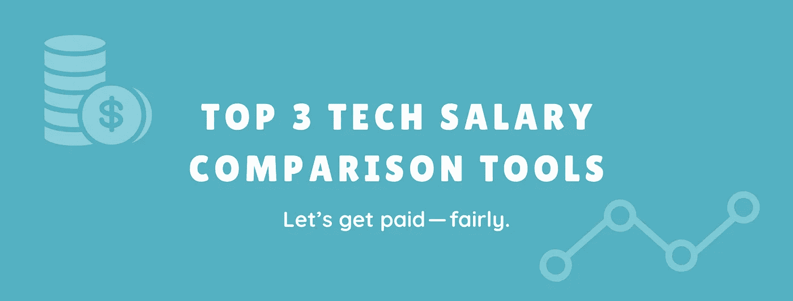

# 三大科技薪资工具

> 原文：<https://betterprogramming.pub/top-3-tech-salary-comparison-tools-1bd7808c76fa>

## 知道你的职位值多少钱，然后坚持下去

作者照片。

技术人员的工资是一个热门话题。作为多样性、公平和包容的倡导者，我认为获得公平的报酬是第一步。我分享这些工具的目的是让技术人员的工资信息变得容易获取，这样你就能得到公平的报酬。

注意:这些是我个人用过的工具。我没有得到任何组织的赞助来分享我的观点。

# 1.Levels.fyi

[Levels.fyi](https://www.levels.fyi/) 是一个在线工具，从各大科技公司的科技员工那里收集经过核实的薪酬信息。这个工具无疑是许多技术人员用于职业决策、标杆管理和薪资谈判的最高机密之一。

## **好人**

*   涵盖了美国大多数大型科技公司
*   按职位级别和工作经验年限细分总薪酬。
*   将总薪酬分为基本工资、股票和奖金。这是它最好的特性之一——在我看来相当准确。
*   可以导出数据以供进一步分析。我建议剔除异常值，然后查看角色、级别、经验和公司的平均值。

## **坏的**

*   仅限于知名的技术工作家庭。
*   炫耀偏见。由于这是基于自愿提交的薪水，它可能会吸引那些想要炫耀的收入最高的人。这不是数据点而是我的假设。
*   鉴于平台上分享的高薪，如果你还没有赚那么多，这可能会令人难过或不安。几年前，当我第一次在这个工具上查看工资时，我知道这让我很沮丧。

# 2.盲目的

[盲](https://www.teamblind.com/salaryComparison)是一个匿名的专业网络，拥有超过 350 万名经过验证的专业人士。所有用户都必须使用工作电子邮件来验证他们的身份，这使得它具有包容性和独特性。工资由这些经过认证的专业人士提供。

## 好人

*   包括从科技初创公司到大中型科技公司各种职位的薪酬。
*   根据工作经验、职位、公司和地点对工资进行细分。
*   按基本工资、股票、股权和奖金细分总薪酬。
*   提供专业网络，获取未经加工和过滤的建议。

## 坏事

*   限于有员工在盲人注册的公司。
*   薪资比较工具是新的，所以它的数据点数量有限。
*   要查看薪资对比，你得把你的薪资贡献给平台。
*   您必须是拥有授权工作电子邮件的专业人士才能访问该工具。
*   炫耀偏见。人们在应用程序上的一个常见抱怨是工资太高，这可能是炫耀偏见的结果。与 levels.fyi 一样，看到“高”工资可能会令人不安。

# 3.你的网络(你认识的人)

一个容易获得的工具是你的网络——你认识的人。如果你得到了一份工作，并试图评估薪酬，那就和你的人际网谈谈。向他们伸出手，告诉他们你得到了什么，还有多少谈判的空间。这对一些人来说可能有点尴尬，但是 100%是值得的。

在我知道上面的工具之前，我利用我的网络来评估报价和获得建议。现在我使用三者的结合。

## 好人

*   你在和你认识并信任的人交谈。
*   您的网络可以提供的不仅仅是一个基准。例如，当我在评估我的提议时，我的网络主管不仅分享了我可以谈判的薪酬领域，还指导我谈判技巧。

## 坏事

*   仅限于你网络中的几个人。
*   根据他们的个人经验，建议可能是有偏见的或主观的。

# 额外奖励:玻璃门(不推荐)

[Glassdoor](https://www.glassdoor.com/member/home/index.htm) 是最大的工作和招聘平台之一，也提供薪资信息。虽然它是一个受欢迎的工具，但平台上的工资是一个很低的数字。我不会推荐 Glassdoor 作为薪资基准，因为它的薪资很低。尽管如此，对于面试准备和员工评估来说，这是一个很好的工具。

# 我的个人经历

我个人在为上一个雇主工作时，就用这些工具来协商我的薪酬。我有一个想法，那就是我的报酬过低，但我无法量化它。在通过这些工具了解了与我的角色、经验和水平相关的行业薪酬后，我决心获得公平的薪酬。我得到了一个还价，并把它交给了我的经理。这导致了一场谈判，我的总薪酬增加了 2 倍**。**是的，不开玩笑。 *2x* 。

# 最后的想法

谈判规则 1:尽量不要第一个给出数字(有些情况下很难避免)。了解这些工具并获得行业薪酬信息应该会对你有所帮助。

以下是这篇文章的要点:

*   有几个工具，但很难找到准确的工资信息。
*   [Levels.fyi](http://Levels.fyi) 、[盲](https://www.teamblind.com/salaryComparison)和你的人脉都是比较薪资的绝佳工具。
*   在使用这些工具时，运用你的判断力，注意炫耀的偏见。