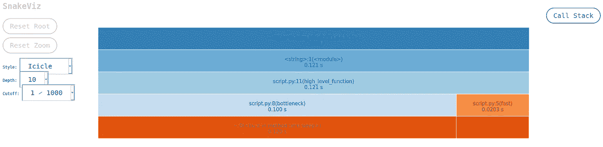
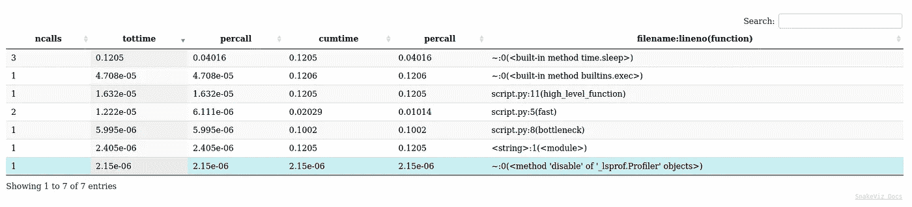

# 为 Python 代码计时的 3 种简单方法

> 原文：<https://betterprogramming.pub/top-3-ways-to-time-python-code-d46b37d418e0>

## 我的代码太慢了吗？太快了？速度刚刚好？


照片由 [Pexels](https://www.pexels.com/photo/person-using-macbook-pro-1181373/?utm_content=attributionCopyText&utm_medium=referral&utm_source=pexels) 的 [Christina Morillo](https://www.pexels.com/@divinetechygirl?utm_content=attributionCopyText&utm_medium=referral&utm_source=pexels) 拍摄。

有时，您将在一个项目中工作，其中代码的速度很重要，并且您想知道代码在时间上的执行情况。

也许你注意到你的程序太慢了，你想找到性能瓶颈，或者你只是想测量你的代码运行所花费的时间。

无论哪种方式，您都需要以某种方式为您的代码计时。

有许多方法可以实现这一点，但我将分享我最简单/最容易使用的三个技巧。

所以让我们开始吧！

# 使用函数装饰器

这是一个简单、强力的计时函数解决方案，在项目中非常有用(例如，您可能希望记录每个函数调用需要多长时间)。它没有[的时间表](https://docs.python.org/3/library/timeit.html)精确。我不建议将它用于更快的代码，但它对于计时“较慢”的函数很有好处:

# 使用 timeit

这是一个[简单的内置工具](https://docs.python.org/3/library/timeit.html),非常适合计时小块代码。

从[文档](https://docs.python.org/3/library/timeit.html)中:

> “这个模块提供了一种简单的方法来计时 Python 代码的小片段。它既有一个[命令行界面](https://docs.python.org/3/library/timeit.html#timeit-command-line-interface)也有一个[可调用界面](https://docs.python.org/3/library/timeit.html#python-interface)。它避免了许多测量执行时间的常见陷阱。”

我将为所有基本用例提供一些例子。

*   计时不带参数的函数:

*   用参数计时函数:

*   时间λ表达式:

*   计时代码片段:

# 将 cProfile 与 snakeviz 一起使用

这里有一个更详细的分析组合。我建议对复杂的代码使用这种方法，因为它对于发现潜在的性能瓶颈非常有用。

*   cProfile 是一个内置的 C 扩展，它提供了一组统计数据，描述了程序的各个部分执行的频率和时间。这组统计数据被称为*简档*。
*   [snakeviz](https://github.com/jiffyclub/snakeviz/) 是一个第三方 Python 库，用于在浏览器中可视化这些统计数据，并以更加用户友好的方式解释它们。

如果您想要特定代码段的精确计时，我仍然会推荐 [timeit](https://docs.python.org/3/library/timeit.html) ，但是对于寻找潜在的瓶颈，在我看来这是最好的选择。

根据[文件](https://docs.python.org/3/library/profile.html#module-cProfile):

> “分析器模块旨在为给定的程序提供一个执行概要，而不是为了进行基准测试(为此，有`[timeit](https://docs.python.org/3/library/timeit.html#module-timeit)`来获得相当准确的结果)。这尤其适用于 Python 代码与 C 代码的基准测试:分析器为 Python 代码引入了开销，但没有为 C 级函数引入开销，因此 C 代码看起来比任何 Python 代码都要快。”

*注意:需要先* [*安装 snakeviz*](https://github.com/jiffyclub/snakeviz/) *！*

运行这个脚本。 [cProfile](https://docs.python.org/3/library/profile.html#module-cProfile) 会将结果转储到名为`results.prof`的文件中:

通过运行以下命令，使用 [snakeviz](https://github.com/jiffyclub/snakeviz/) 在浏览器中查看结果:

```
snakeviz results.prof
```



函数调用堆栈(从顶部开始)



统计数据(更多信息见[https://jiffyclub.github.io/snakeviz/#interpreting-results](https://jiffyclub.github.io/snakeviz/#interpreting-results)

从第一张图片中，我们可以很容易地看到`bottleneck()`函数执行时间最长，因此这可能表明存在潜在的性能瓶颈。而且还可以看到导致它运行这么久的底层`sleep()` 函数。

我们还获得了一些额外的统计数据，比如调用堆栈中每个函数的调用次数，这可能有助于检测也会影响性能的冗余调用。

在 GitHub 上找到更多关于如何解释结果[的信息。](https://jiffyclub.github.io/snakeviz/#interpreting-results)

# 荣誉奖

*   [line_profiler](https://github.com/pyutils/line_profiler)
*   [pycallgraph](https://github.com/gak/pycallgraph)
*   [个人资料查看](https://github.com/mgedmin/profilehooks)

# 结论

这些是我认为应该涵盖几乎所有用例的前三项技术。我希望这能对你有所帮助。

编码快乐！