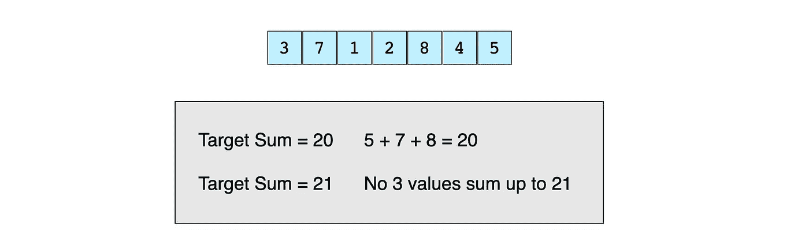
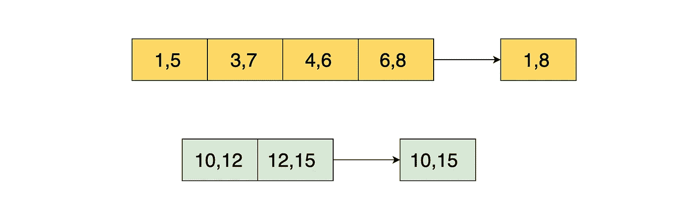
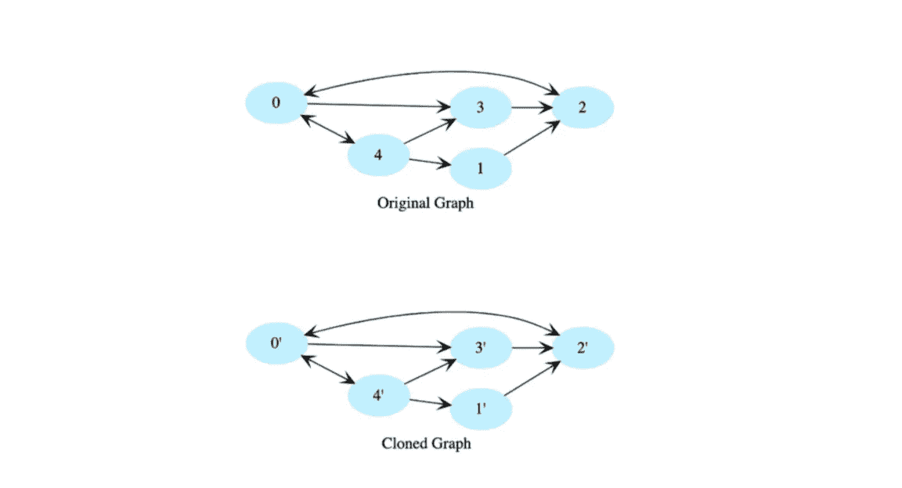
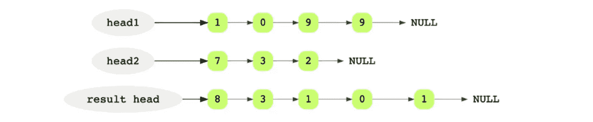
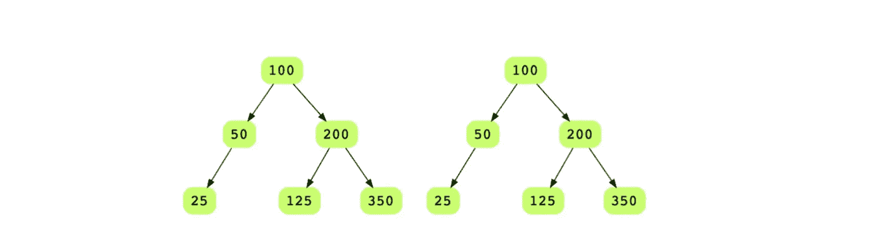
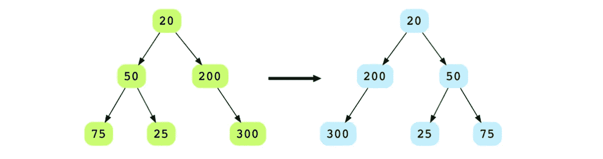
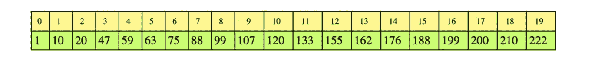
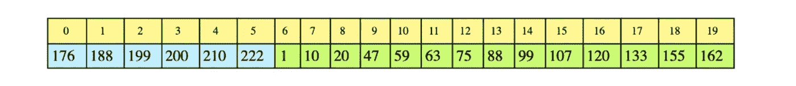

# 30 个苹果编码面试问题(附解答)

> 原文：<https://betterprogramming.pub/top-30-apple-coding-interview-questions-with-solutions-19990071ebfc>

## 通过设计、行为、图形问题等，在苹果技术面试中胜出


作者图片

在苹果工作是许多开发人员的梦想——但是准备编码面试并不是一件容易的事情。为了让你的生活更轻松，我们整理了你在苹果公司技术面试中可能遇到的 30 个面试问题。

我们从软件工程面试流程的概述开始，然后通过深入的代码解决方案和复杂性度量来分解苹果面试中的主要问题。我们将用 C++提供我们的解决方案。

**本指南一览:**

*   苹果面试流程概述
*   数组和图形问题
*   链接列表问题
*   树木问题
*   字符串问题
*   动态规划问题
*   数学、统计和回溯
*   搜索和设计问题
*   行为问题
*   准备面试的技巧

# 苹果面试流程概述

苹果公司的软件工程师面试流程与其他大型科技公司不同，因为他们举行的面试次数和现场流程不同。

如果你被邀请去苹果面试，流程通常是这样的:

*   **与招聘人员进行预筛选:**从提交简历到第一次联系大约需要一周时间。招聘人员通常会通过 LinkedIn 或电子邮件联系，安排时间打电话。这个电话屏幕将持续 15-30 分钟，问题不会过于专业。你可能会问类似*你为什么想为苹果工作？*或*你最喜欢的苹果产品或服务是什么？*
*   通常一周后，他们会安排你的下一次技术电话面试。会有一两个技术电话屏幕，询问你的简历和一个关于数据结构和算法的编码问题。编码面试大约 45-60 分钟，其中 30 分钟用于完成挑战。
*   **现场面试:**现场面试大约持续六个小时。你将会见 8-12 名苹果员工，面试将包括行为、领域知识和编码挑战。每次面试大约 45 分钟到一个小时，你会遇到一些技术问题。行为问题对招聘经理来说也非常重要。

**你应该知道的数据结构:**数组、链表、栈、队列、树、图、堆、哈希集、哈希映射

**你应该知道的算法:**深度优先搜索、广度优先搜索、二分搜索法、快速排序、归并排序、动态规划、分治

# 数组和图形问题

## 确定三个整数的和

这个练习的目标是确定三个整数的和是否等于给定值。

**问题陈述:**给定一个整数数组和一个值，确定数组中是否有任意三个整数的和等于给定值。

考虑这个数组和目标和:



```
bool find_sum_of_two(vector<int>& A, int val,
  size_t start_index) {
  for (int i = start_index, j = A.size() - 1; i < j;) {
    int sum = A[i] + A[j];
    if (sum == val) {
      return true;
    }if (sum < val) {
      ++i;
    } else {
      --j;
    }
  }return false;
}bool find_sum_of_three_v3(vector<int> arr,
  int required_sum) {std::sort(arr.begin(), arr.end());for (int i = 0; i < arr.size() - 2; ++i) {
    int remaining_sum = required_sum - arr[i];
    if (find_sum_of_two(arr, remaining_sum, i + 1)) {
      return true;
    }
  }return false;
}int main(){
    vector<int> arr = {-25, -10, -7, -3, 2, 4, 8, 10};

    cout<<"-8: " <<find_sum_of_three_v3(arr, -8)<<endl; 
    cout<<"-25: "<<find_sum_of_three_v3(arr, -25)<<endl;
    cout<<"0: " <<find_sum_of_three_v3(arr, 0)<<endl;
    cout<<"-42: " <<find_sum_of_three_v3(arr, -42)<<endl; 
    cout<<"22: " <<find_sum_of_three_v3(arr, 22)<<endl; 
    cout<<"-7: " <<find_sum_of_three_v3(arr, -7)<<endl;
    cout<<"-3: " <<find_sum_of_three_v3(arr, -3)<<endl; 
    cout<<"2: " <<find_sum_of_three_v3(arr, 2)<<endl; 
    cout<<"4: " <<find_sum_of_three_v3(arr, 4)<<endl; 
    cout<<"8: " <<find_sum_of_three_v3(arr, 8)<<endl; 
    cout<<"7: " <<find_sum_of_three_v3(arr, 7)<<endl; 
    cout<<"1: " <<find_sum_of_three_v3(arr, 1)<<endl;

    return 0;
}
```

在这个解决方案中，我们对[数组](https://www.educative.io/blog/data-structures-arrays-javascript-tutorial)进行排序。然后，固定一个元素`e`并在剩余的数组中找到一对(a，b)使得`required_sum - e`是`a + b`。

从数组中的第一个元素`e`开始，尝试在剩余的数组(即`A[i + 1]`到`A[n - 1]`)中找到这样一个满足条件:`a+b = required_sum - e`的对(a，b)。如果找到了对，就找到了解:`a`、`b`、`e`。现在我们可以停止迭代了。

否则，我们对`index i = 1`到`n - 3`的所有元素`e`重复上述步骤，直到找到满足条件的一对。

**运行时复杂度:**二次，O(n)

**记忆复杂度:**常数，O(1)

## 合并重叠间隔

本练习的目标是合并给定列表中所有重叠的区间，以生成一个只有互斥区间的列表。

**问题陈述:**您有一个区间对的数组(列表)作为输入，其中每个区间都有一个开始和结束时间戳，按开始时间戳排序。合并重叠的间隔并返回一个新的输出数组。

考虑下面的输入数组。间隔`(1, 5)`、`(3, 7)`、`(4, 6)`、`(6, 8)`重叠，应合并为一个间隔`(1, 8)`。同样，区间`(10, 12)`和`(12, 15)`也是重叠的，应该合并到`(10, 15)`中。



```
class Pair{
  public:
    int first, second;
    Pair(int x, int y){
      first = x;
      second = y; 
    }
};vector<Pair> merge_intervals(vector<Pair>& v) {if(v.size() == 0) {
    return v;
  }vector<Pair> result;
  result.push_back(Pair(v[0].first, v[0].second));for(int i = 1 ; i < v.size(); i++){
    int x1 = v[i].first;
    int y1 = v[i].second;
    int x2 = result[result.size() - 1].first;
    int y2 = result[result.size() - 1].second;if(y2 >= x1){
      result[result.size() - 1].second = max(y1, y2);
    }
    else{
      result.push_back(Pair(x1, y1));
    }
  }
  return result;
}int main() {
  vector<Pair> v {
                  Pair(1, 5),
                  Pair(3, 7),
                  Pair(4, 6),
                  Pair(6, 8),
                  Pair(10, 12),
                  Pair(11, 15)
                  };vector<Pair> result = merge_intervals(v);

  for(int i = 0; i < result.size(); i++){
    cout << "[" << result[i].first << ", " << result[i].second << "] ";
  }
}
```

这个问题可以用线性扫描算法解决。给出了输入区间的列表，我们将在输出列表中保留合并的区间。对于输入列表中的每个间隔:

*   如果输入间隔与输出列表中的最后一个间隔重叠，请合并这两个间隔，并用合并后的间隔更新输出列表的最后一个间隔。
*   否则，向输出列表添加一个输入间隔。

**运行时复杂度:**线性， *O* ( *n*

**记忆复杂度:**线性， *O* ( *n* )

## 克隆一个有向图

本练习的目标是克隆一个有向图，并使用哈希表和深度优先遍历打印一个输出图。

**问题陈述:**给定一个[有向图](https://www.educative.io/blog/data-structures-101-graphs-javascript#types)的根节点，通过创建深度副本克隆该图。克隆的图形将具有相同的顶点和边。



```
struct Node {
  int data;
  list<Node*> neighbors;
  Node(int d) : data(d) {}
};Node* clone_rec(Node* root, 
        unordered_map<Node*, 
        Node*>& nodes_completed) {

  if (root == nullptr) {
    return nullptr;
  }Node* pNew = new Node(root->data);
  nodes_completed[root] = pNew;

  for (Node* p : root->neighbors) {

    auto x = nodes_completed.find(p);

    if (x == nodes_completed.end()){
      pNew->neighbors.push_back(clone_rec(p, nodes_completed));
    } else {
      pNew->neighbors.push_back(x->second /*value*/);
    }
  }

  return pNew;
}Node* clone(Node* root) {
  unordered_map<Node*, Node*> nodes_completed;
  return clone_rec(root, nodes_completed);
}// this is un-directed graph i.e.
// if there is an edge from x to y
// that means there must be an edge from y to x
// and there is no edge from a node to itself
// hence there can maximim of (nodes * nodes - nodes) / 2 edgesin this graph
void create_test_graph_undirected(int nodes, int edges, vector<Node*>& vertices) {
  for (int i = 0; i < nodes; ++i) {
    vertices.push_back(new Node(i));
  }vector<pair<int, int>> all_edges;
  for (int i = 0; i < vertices.size(); ++i) {
    for (int j = i + 1; j < vertices.size(); ++j) {
      all_edges.push_back(pair<int, int>(i, j));
    }
  }std::random_shuffle(all_edges.begin(), all_edges.end());for (int i = 0; i < edges && i < all_edges.size(); ++i) {
    pair<int, int>& edge = all_edges[i];
    vertices[edge.first]->neighbors.push_back(vertices[edge.second]);
    vertices[edge.second]->neighbors.push_back(vertices[edge.first]);
  }
}void print_graph(vector<Node*>& vertices) {
  for (Node* n : vertices) {
    cout << n->data << ": {";
    for (Node* t : n->neighbors) {
      cout << t->data << " ";
    }
    cout << "}" << endl;
  }
}void print_graph(Node* root, unordered_set<Node*>& visited_nodes) {
  if (root == nullptr || visited_nodes.find(root) != visited_nodes.end()) {
    return;
  }visited_nodes.insert(root);cout << root->data << ": {";
  for (Node* n : root->neighbors) {
    cout << n->data << " ";
  }
  cout << "}" << endl;
  for (Node* n : root->neighbors) {
    print_graph(n, visited_nodes);
  }
}void print_graph(Node* root) {
  unordered_set<Node*> visited_nodes;
  print_graph(root, visited_nodes);
}int main() {
  vector<Node*> vertices;
  create_test_graph_undirected(7, 18, vertices);

  print_graph(vertices[0]);Node* cp = clone(vertices[0]);
  cout << endl << "After copy" << endl;
  print_graph(cp);

  return 0;
}
```

我们使用深度优先遍历，并在遍历图时创建每个节点的副本。使用一个哈希表来存储每个完成的节点，这样我们就不会重新访问哈希表中存在的节点。hashtable 键将是原始图中的一个节点，它的值将是克隆图中相应的节点。

**运行时复杂度:**线性， *O* ( *n* )

**记忆复杂度:**对数， *O* ( *n* )，其中 *n* 为图中顶点的个数。

# 链接列表问题

## 将两个整数相加

这个练习的目标是将两个链表中的两个整数相加。

**问题陈述:**给你两个链表的头指针，每个链表代表一个整数(即每个节点是一个数字)。添加它们并返回新的链表。



```
// assuming both integers are stored in a linked list
// e.g. 415 is stored as 5->1->4
// 32 is stored as 2->3
LinkedListNode* add_integers(
    LinkedListNode* integer1, 
    LinkedListNode* integer2) {LinkedListNode* result = nullptr;
  LinkedListNode* last = nullptr;
  int carry = 0;

  while (
      integer1 != nullptr ||
      integer2 != nullptr ||
      carry > 0) {int first = 
        (integer1 == nullptr ? 0 : integer1->data);
    int second = 
        (integer2 == nullptr ? 0 : integer2->data);int sum = first + second + carry;LinkedListNode* pNew = 
          new LinkedListNode(sum % 10);

    carry = sum / 10;if (result == nullptr) {
      result = pNew;
    } else {
      last->next = pNew;
    }last = pNew;

    if (integer1 != nullptr) {
      integer1 = integer1->next;
    }

    if (integer2 != nullptr) {
      integer2 = integer2->next;
    }
  }

  return result;
}int main(int argc, char* argv[]) {
 vector<int> v1 = {1, 2, 3}; // 321
  vector<int> v2 = {1, 2}; // 21

  LinkedListNode* first = LinkedList::create_linked_list(v1);
  LinkedListNode* second = LinkedList::create_linked_list(v2);// sum should be 321 + 21 = 342 => 2->4->3
  LinkedListNode* result = add_integers(first, second);
  vector<int> r = {2, 4, 3}; // 342
  LinkedListNode* expected = LinkedList::create_linked_list(r);
  assert(LinkedList::is_equal(result, expected));cout << endl << "First:";
  LinkedList::display(first);
  cout << endl << "Second:";
  LinkedList::display(second);
  cout << endl << "Result:";
  LinkedList::display(result);result = add_integers(first, nullptr);
  assert(LinkedList::is_equal(result, first));result = add_integers(nullptr, second);
  assert(LinkedList::is_equal(result, second));
}
```

为了更好地理解这一点，让我们考虑一个例子。假设我们想把整数 9901 和 237 相加。相加的结果是 10138。

整数在链表中是倒序存储的，这样更容易。数字的最高有效位是链表的最后一个元素。要开始添加，我们从两个链表的头部开始。

在每次迭代中，我们将两个列表的当前数字相加，并在结果链表的尾部插入一个新节点，结果数字位于结果链表的尾部。我们还需要保持每一步的进位。

我们对两个链表中的所有数字都这样做。如果其中一个链表结束得更快，我们将继续另一个链表。一旦两个链表都完成，并且没有进位留下来添加，算法将终止。

**运行时复杂度:**线性， *O* ( *n* )

**记忆复杂度:**线性， *O* ( *n* )

## 合并两个排序的链表

这个练习的目标是合并两个排序的[链表](https://www.educative.io/blog/data-structures-linked-list-java-tutorial)。

**问题陈述:**给定两个已排序的链表，合并它们，这样得到的链表也是已排序的。

```
typedef LinkedListNode* NodePtr;NodePtr merge_sorted(NodePtr head1, NodePtr head2) {

  // if both lists are empty then merged list is also empty
  // if one of the lists is empty then other is the merged list
  if (head1 == nullptr) {
    return head2;
  } else if (head2 == nullptr) {
    return head1;
  }NodePtr mergedHead = nullptr;
  if (head1->data <= head2->data) {
    mergedHead = head1;
    head1 = head1->next;
  } else {
    mergedHead = head2;
    head2 = head2->next;
  }NodePtr mergedTail = mergedHead;

  while (head1 != nullptr && head2 != nullptr) {
    NodePtr temp = nullptr;
    if (head1->data <= head2->data) {
      temp = head1;
      head1 = head1->next;
    } else {
      temp = head2;
      head2 = head2->next;
    }mergedTail->next = temp;
    mergedTail = temp;
  }if (head1 != nullptr) {
    mergedTail->next = head1;
  } else if (head2 != nullptr) {
    mergedTail->next = head2;
  }return mergedHead;
}void test(vector<int>& v1, vector<int>& v2, vector<int>& expected) {
  LinkedListNode* list_head1 = LinkedList::create_linked_list(v1);

  cout<<"List 1: "<<LinkedList::getList(list_head1)<<endl;LinkedListNode* list_head2 = LinkedList::create_linked_list(v2);

  cout<<"List 2: "<<LinkedList::getList(list_head2)<<endl;LinkedListNode* merged = merge_sorted(list_head1, list_head2);

  cout<<"Result: "<<LinkedList::getList(merged)<<endl;LinkedListNode* expected_list = LinkedList::create_linked_list(expected);assert(LinkedList::is_equal(merged, expected_list));
}int main(int argc, char* argv[]) {vector<int> v1 = {1, 3, 5, 6};
  vector<int> v2 = {2, 4, 6, 20, 34};
  vector<int> expected = {1, 2, 3, 4, 5, 6, 6, 20, 34};test(v1, v2, expected);v1 = {1, 3, 5, 6};
  v2 = {};
  expected = {1, 3, 5, 6};test(v1, v2, expected);v1 = {1, 3, 5, 6};
  v2 = {2, 4, 6, 20};
  expected = {1, 2, 3, 4, 5, 6, 6, 20};test(v1, v2, expected);
  v1 = {4, 4};
  v2 = {4, 4, 4};
  expected = {4, 4, 4, 4 ,4};test(v1, v2, expected);
}
```

在合并的链表上保持一个头指针和一个尾指针。通过比较两个链表的第一个节点来选择合并链表的头。

对于所有后续节点，选择较小的当前节点，并将其链接到合并列表的尾部。将列表的当前指针向前移动一步。

如果只有一个列表中还有一些元素，将剩余的列表链接到合并列表的尾部。最初，合并的链表是`NULL`。

比较前两个节点的值，将值较小的节点作为合并链表的头节点。在这个例子中，从`head1`开始是 4。因为它是合并列表中的第一个也是唯一的节点，所以它将是尾部。然后向前移动`head1`一步。

**运行时复杂度:**线性，*O*(*m*+*n*)，其中 *m* 和 n 是我们链表的长度

**记忆复杂度:**常数，*O*①

# 树木问题

## 确定两个二叉树是否相同

本练习的目标是比较两个[二叉树](https://www.educative.io/blog/data-structures-trees-java)以确定它们是否相同。

**问题陈述:**给你两个二叉树的根，你必须确定这两棵树是否相同。相同的树在每个节点上具有相同的布局和数据。



提示:拥有相同数据的树不一定完全相同。重要的是它们的结构。

```
bool are_identical(
  BinaryTreeNode* root1,
  BinaryTreeNode* root2) {if (root1 == nullptr && root2 == nullptr) {
    return true;
  }

  if (root1 != nullptr && root2 != nullptr) {
    return ((root1->data == root2->data) &&
            are_identical(root1->left, root2->left) &&
            are_identical(root1->right, root2->right));
  }return false;
}int main() {
  BinaryTreeNode *root1 = new BinaryTreeNode(100);
  insert_bst(root1, 50);
  insert_bst(root1, 200);
  insert_bst(root1, 25);
  insert_bst(root1, 125);
  insert_bst(root1, 350);display_level_order(root1);

  BinaryTreeNode *root2 = create_random_BST(15);display_level_order(root2);

  // Try changing the roots being passed
  if(are_identical(root1, root2)) {
    cout<< " the trees are identical" << endl;
  } else {
    cout<< "the trees are not identical" << endl;
  }
}
```

这个问题可以递归解决。这个解决方案的递归的基本情况是如果两个被比较的节点为空或者其中一个为空。

两棵树`A`和`B`是相同的，如果:

*   它们的根上的数据相同，或者两个根都为空
*   `A`的左子树与`B`的左子树相同
*   `A`的右子树与`B`的右子树相同

同时在两棵树上使用深度优先遍历，并不断比较每一层的数据来解决这个问题。

**运行时复杂度:**线性， *O* ( *n* )

**内存复杂度:最好的情况下为** *O* ( *h* )，或者平衡树的情况下为 *O* ( *logn* )，最坏的情况下可以为 *O* ( *n* )。

## 镜像二叉树节点

本练习的目标是使用深度优先遍历和自底向上镜像来镜像二叉树的节点。

**问题陈述:**给你一个二叉树的根节点，你必须交换每个节点的`left`和`right`子节点。



```
void mirror_tree(BinaryTreeNode* root) {
  if (root == nullptr) {
    return;
  }// We will do a post-order traversal of the binary tree.if (root->left != nullptr) {
    mirror_tree(root->left);
  }if (root->right != nullptr) {
    mirror_tree(root->right);
  }// Let's swap the left and right nodes at current level.BinaryTreeNode* temp = root->left;
  root->left = root->right;
  root->right = temp;
}int main(int argc, char* argv[]) {BinaryTreeNode* root = create_random_BST(15);
  display_level_order(root);
  mirror_tree(root);
  cout << endl << "Mirrored tree = " << endl;
  display_level_order(root);
}
```

我们对二叉树进行后序遍历。对于每个节点，将其左子节点与其右子节点交换。我们在树上使用[DFS](https://www.educative.io/blog/tree-traversal-algorithms#how)——这样在从一个节点返回之前，它的所有子节点都已经被访问过(并被镜像)。

**运行时复杂度:**线性， *O* ( *n* )

**记忆复杂度:**线性，最坏情况下 *O* ( *n* )

# 字符串问题

## 查找所有回文子字符串

这个练习的目标是找到给定字符串的回文子字符串。

**问题陈述:**给定一个字符串，找出所有为回文的非单字母子串。给出的字符串是`"aabbbaa"`。

```
int find_palindromes_in_sub_string(const string& input, int j, int k) {
  int count = 0;
  for (; j >= 0 && k < input.length(); --j, ++k) {
    if (input[j] != input[k]) {      
      break;
    } 
    cout << input.substr(j, k - j + 1) << endl;
    ++count;
  }
  return count;
}int find_all_palindrome_substrings(const string& input) {
  int count = 0;
  for (int i = 0; i < input.length(); ++i) {    
    count += find_palindromes_in_sub_string(input, i - 1, i + 1);
    count += find_palindromes_in_sub_string(input, i, i + 1);
  }
  return count;
}int main() {
  string str = "aabbbaa";cout << "Total palindrome substrings: "  << find_all_palindrome_substrings(str) << endl;
}
```

对于输入字符串中的每个字母，开始向左和向右扩展，同时检查偶数和奇数长度的回文。如果我们知道一个回文不存在，就移到下一个字母。

我们向左和向右扩展一个字符并进行比较。如果两者相等，我们打印出回文子串。

**运行时复杂度:**多项式，O(n)

**记忆复杂度:**常数，O(1)

## 颠倒句子中的单词

这个练习的目标是颠倒给定字符串中的单词。一定要注意单词是如何被空格分开的。

**问题陈述:**反转给定句子中的单词顺序(字符数组)。给出的词是`"Hello World!"`。

```
void str_rev(char * str, int len) {if (str == nullptr || len < 2) {
    return;
  }char * start = str;
  char * end = str + len - 1;while (start < end) {
    if (start != nullptr && end != nullptr) {
      char temp = * start;
      * start = * end;
      * end = temp;
    }
    start++;
    end--;
  }
}void reverse_words(char * sentence) {// Here sentence is a null-terminated string ending with char '\0'.if (sentence == nullptr) {
    return;
  }// To reverse all words in the string, we will first reverse
  // the string. Now all the words are in the desired location, but
  // in reverse order: "Hello World" -> "dlroW olleH".int len = strlen(sentence);
  str_rev(sentence, len);// Now, let's iterate the sentence and reverse each word in place.
  // "dlroW olleH" -> "World Hello"char * start = sentence;
  char * end;
  while (true) {
    // find the  start index of a word while skipping spaces.
    while (start && * start == ' ') {
      ++start;
    }if (start == nullptr || * start == '\0') {
      break;
    }// find the end index of the word.
    end = start + 1;
    while (end && * end != '\0' && * end != ' ') {
      ++end;
    }// let's reverse the word in-place.if (end != nullptr) {
      str_rev(start, (end - start));
    }start = end;
  }
}int main() { string str = "Hello World!";
  char* a = const_cast<char*>(str.c_str());cout << a << endl;
  reverse_words(a);
  cout << a << endl;
}
```

这个问题有两个步骤。首先，反转弦。然后，遍历字符串，将每个单词颠倒过来。

**运行时复杂度:**线性， *O* ( *n* )

**记忆复杂度:**常数， *O* (1)

# 动态规划问题

## 最大和子阵列

这个练习的目标是使用你的[动态编程](https://www.educative.io/blog/6-dp-problems-to-solve-for-your-next-coding-interview)技能和 Kadane 的算法找到最大和子阵列。

**问题陈述:**求最大和子数组。在下面的数组中，最大和子数组从索引`3`开始，到`6`结束，最大和为`12`。


```
int find_max_sum_sub_array(int A[], int n) {
  if (n < 1) {
    return 0;
  }

  int curr_max = A[0];
  int global_max = A[0];
  for (int i = 1; i < n; ++i) {
    if (curr_max < 0) {
      curr_max = A[i];
    } else {
      curr_max += A[i];
    }if (global_max < curr_max) {
      global_max = curr_max;
    }
  }return global_max;
}int main() {

    int v[] = {-4, 2, -5, 1, 2, 3, 6, -5, 1};
    cout << "Sum of largest subarray: " << find_max_sum_sub_array(v, sizeof(v) / sizeof(v[0])) << endl;
    return 0;
  }
```

我们使用 Kadane 的算法来解决这个问题。该算法的基本思想是扫描整个阵列，并在每个位置找到结束于此的子阵列的最大和。这是通过为当前数组索引保留一个`current_max`和一个`global_max`来实现的。

算法如下:

```
current_max = A[0]
global_max = A[0]
for i = 1 -> size of A
    if current_max is less than 0
        then current_max = A[i]
    otherwise 
        current_max = current_max + A[i]
    if global_max is less than current_max 
        then global_max = current_max
```

**运行时复杂度:**线性， *O* ( *n* )

**记忆复杂度:**常数， *O* (1)

# 数学和统计

## 数的幂

这个练习的目标是使用*分治*并编写一个函数来计算一个数的幂。

**问题陈述:**给你一个双精度、`x`和一个整数`n`，写一个函数计算`x`的幂`n`。

*幂* (2，5)=32

*幂* (3，4)=81

*幂* (1.5，3)=3.375

*功率* (2，2)=0.25

```
double power_rec(double x, int n) {
  if (n == 0) return 1;
  if (n == 1) return x;

  double temp = power_rec(x, n/2);
  if (n % 2 == 0)  {
    return temp * temp;
  } else {
    return x * temp * temp;
  }
}double power(double x, int n) {
  bool is_negative = false;
  if (n < 0) {
    is_negative = true;
    n *= -1;
  }double result = power_rec(x, n);if (is_negative) {
    return 1 / result;
  }return result;
}bool test_power(double x, int n) {
  double r1 = power(0.753, n);
  double r2 = pow(0.753, n);
  double diff = r1 - r2;
  if (diff < 0) {
    diff = diff * -1;
  }
  if (diff > 0.00000000001) {
    cout << "Failed for " << x << ", " << n << endl;
    return false;
  }
  return true;
}
int main(int argc, char* argv[]) {

  bool pass = true;
  for (int n = -5; n <= 5; ++n) {
    bool temp_pass = test_power(0.753, n);
    pass &= temp_pass;
  }pass &= test_power(0, 0);cout << "Power(0, 0) = " << pow(0, 0) << endl;if (pass) {
    cout << "Passed." << endl;
  } else {
    cout << "Failed." << endl;
  }
}
```

我们可以使用分而治之的方法来最有效地解决这个问题。在除法步骤中，我们继续递归地用`2`除`n`，直到我们到达基本情况。

在组合步骤中，我们得到子问题的结果`r`，并使用以下两条规则计算当前问题的结果:

*   如果`n`是偶数，则结果是`r * r`(其中`r`是子问题的结果)
*   如果`n`是奇数，结果是`x * r * r`(其中`r`是子问题的结果)

**运行时复杂度:**对数， *O* ( *logn* )

**记忆复杂度:**对数， *O* ( *logn* )

## 查找所有求和组合

这个练习的目标是用你的回溯技巧找到所有的和组合。

**问题陈述:**给定一个正整数，`target`，打印加到`target`数上的正整数的所有可能组合。

输出将是列表的列表或数组的数组的形式，因为列表中的每个元素将是包含可能的总和组合的另一个列表。例如，如果给你输入`5`，这些是可能的总和组合:

```
1, 4
2, 3
1, 1, 3
1, 2, 2
1, 1, 1, 2
1, 1, 1, 1, 1
```

解决方案讨论如下:

```
void print(vector<vector<int>> output){
  for(int i = 0; i < output.size(); i++){
    cout << "[ ";
    for(int j = 0; j < output[i].size(); j++){
      cout << output[i][j] << ", "; 
    }
    cout << "]" << endl;
  }
}void print_all_sum_rec(
    int target,
    int current_sum,
    int start, vector<vector<int>>& output,
    vector<int>& result) {if (target == current_sum) {
    output.push_back(result);
  }for (int i = start; i < target; ++i) {
    int temp_sum = current_sum + i;
    if (temp_sum <= target) {
      result.push_back(i);
      print_all_sum_rec(target, temp_sum, i, output, result);
      result.pop_back();} else {
      return;
    }
  }
}vector<vector<int>> print_all_sum(int target) {
  vector<vector<int>> output;
  vector<int> result;
  print_all_sum_rec(target, 0, 1, output, result);
  return output;
}int main(int argc, const char* argv[]) {
  int n = 4;
  vector<vector<int>> result = print_all_sum(n);

  print (result);
}
```

我们递归地遍历所有可能的总和组合，当运行总和等于目标时，打印该组合。该算法将递归地检查所有能够加起来达到`target`的数字。

在每个递归调用中，有一个从`start`运行到`target`的`for`循环，其中`start`最初是`1`。`current_sum`是随着每次递归调用而递增的变量。

每次值被添加到`current_sum`时，它也被添加到`result`列表中。每当`current_sum`等于`target`时，我们知道`result`列表包含了`target`的一个可能组合，然后这个列表被追加到最终的`output`列表中。以下是一些示例代码:

```
Base condition of recursion:

if current_sum equals target
  print the output contents
```

在每次递归调用之前，向`result`添加一个元素。但是，每次调用后，这个元素也会从列表中删除，以重置列表。

**运行时复杂度:**指数级，O

**记忆复杂度:**线性，O(n)

# 搜索和设计问题

## 在旋转数组中搜索

这个练习的目标是在一个循环数组中搜索一个排序数组中的给定数字。试着用二分搜索法解决这个问题。

**问题陈述:**在一个排序的数组中搜索一个给定的数字，该数组具有唯一的元素，并且已经旋转了某个任意的数字，假设该数组不包含重复的元素。如果号码不存在，返回`-1`。

下面是旋转前的原始数组:



对该阵列执行六次旋转后，它会变为:



```
int binary_search(vector<int>& arr, int start, int end, int key) {
  // assuming all the keys are unique.

  if (start > end) {
    return -1;
  }int mid = start + (end - start) / 2;if (arr[mid] == key) {
    return mid;
  }if (arr[start] <= arr[mid] && key <= arr[mid] && key >= arr[start]) {
    return binary_search(arr, start, mid-1, key);
  }else if (arr[mid] <= arr[end] && key >= arr[mid] && key <= arr[end]) {
    return binary_search(arr, mid+1, end, key);
  }else if (arr[end] <= arr[mid]) {
    return binary_search(arr, mid+1, end, key);
  }else if (arr[start] >= arr[mid]) {
    return binary_search(arr, start, mid-1, key);
  }return -1;
}int binary_search_rotated(vector<int>& arr, int key) {
  return binary_search(arr, 0, arr.size()-1, key);
}int main(int argc, char* argv[]) {
    vector<int> v1 = {6, 7, 1, 2, 3, 4, 5};

    cout<<"Key(3) found at: "<<binary_search_rotated(v1, 3)<<endl;
    cout<<"Key(6) found at: "<<binary_search_rotated(v1, 6)<<endl;

    vector<int> v2 = {4, 5, 6, 1, 2, 3};

    cout<<"Key(3) found at: "<<binary_search_rotated(v2, 3)<<endl;
    cout<<"Key(6) found at: "<<binary_search_rotated(v2, 6)<<endl;    
}
```

这个解决方案就像一个经过一些修改的二分搜索法。请注意，数组中至少有一半总是被排序的。如果数字`n`位于数组排序后的一半，那么我们的问题就是一个基本的二分搜索法。否则，丢弃已排序的一半，并检查未排序的一半。

**运行时复杂度:**对数， *O* ( *logn* )

**记忆复杂度:**对数， *O* ( *logn* )

## 实现 LRU 缓存

本设计练习的目标是实现最近最少使用(LRU)，这是一种常见的缓存策略，使用双向链表和散列法。

**问题陈述:**最近最少使用(LRU)定义了当缓存已满时从缓存中驱逐元素以便为新元素腾出空间的策略，这意味着它首先丢弃最近最少使用的项目。

以具有四个元素容量的高速缓存为例。我们缓存了元素`1`、`2`、`3`和`4`。下图显示了首次访问所有四个元素后的缓存状态:


我们现在需要缓存另一个元素`5`。


让我们看看再次访问`2`会发生什么。现在`3`成为下一个从缓存中被逐出的队列。


```
// Linked list operations
// void add_at_tail(int val)
// void delete_node(ListNode* node)
// void delete_from_head()
// void delete_from_tail()
// ListNode* get_head()
// void set_head(ListNode* node)
// ListNode* get_tail()
// void set_tail(ListNode* node)// simple single threaded LRUCache
class LRUCache {unordered_set<int> cache;// each entry in linked list is the value of the element
  LinkedList cache_vals;
  int capacity; // total capacity
public:LRUCache(int capacity) {
    this->capacity = capacity;
  }

  ~LRUCache() {
    cache.clear();
  }ListNode* get(int val) {
    auto p = cache.find(val);
    if (p == cache.end()) {
      return nullptr;
    }
    else{
      ListNode* i = cache_vals.get_head();
      while(i != nullptr){
        if (i->value == val){
          return i;
        }
        i = i->next;
      }
    }
  }void set(int value) {
    ListNode* check = get(value);
    if(check == nullptr){
      if(cache.size() >= capacity){
        cache_vals.add_at_tail(value);
        int head_val = cache_vals.get_head()->value;
        cache.erase(head_val);
        cache_vals.delete_from_head();
      }
      else{
        cache_vals.add_at_tail(value);
        cache.insert(value);
      }
    }
    else{
      if(check == cache_vals.get_tail()){
        return;
      }
      if(check == cache_vals.get_head()){
        cache_vals.add_at_tail(check->value);
        cache_vals.delete_from_head();
        return;
      }
      if(check->prev != nullptr){
        check->prev->next = check->next;
      }
      if(check->next != nullptr){
        check->next->prev = check->prev;
      }
      cache_vals.add_at_tail(check->value);
      delete check;
    }
  }void print() {
    ListNode* i = cache_vals.get_head();
      while(i != nullptr){
        cout << i->value << ", ";
        i = i ->next;
      }
    cout << endl;
  }
};int main(int argc, char const *argv[])
{
  LRUCache cache(4);
  cache.set(1);
  cache.print();cache.set(2);
  cache.print();cache.set(3);
  cache.print();cache.set(4);
  cache.print();cache.set(5);
  cache.print();cache.set(2);
  cache.print();return 0;
}
```

缓存是一种将数据存储在更快的存储器(通常是 RAM)中以更快地满足未来请求的技术。缓存存储通常不够大，无法存储完整的数据集。当缓存变满时，我们需要从缓存中清除数据。

对于这个过程，LRU 是一个非常简单和常用的算法。我们从缓存中清除最旧的数据，以容纳新数据。

为了实现 LRU 缓存，我们使用了两种数据结构:一个**哈希表和一个双向链表**。双向链表有助于维护驱逐顺序，散列表有助于 O(1) *O* (1)查找缓存的键。算法是这样的:

```
If the element exists in hashmap
    move the accessed element to the tail of the linked list
Otherwise,
    if eviction is needed i.e. cache is already full
        Remove the head element from doubly linked list and delete its hashmap entry
    Add the new element at the tail of linked list and in hashmap
Get from Cache and Return
```

**注意:**双向链表用于跟踪最近访问的元素。双向链表尾部的元素是最近访问的元素。

所有新插入的元素都放在尾部，任何被访问的元素都放在尾部。

**运行时复杂性:**

*   `get (hashset)`:常数，O(1)
*   `set (hashset)`:常数，O(1)
*   添加新元素时删除头部:常量，O(1)
*   搜索删除和添加到尾部:线性，O(n)

**内存复杂度:**线性，O(n)，其中 *n* 是缓存的大小

# 行为问题

既然我们已经讨论了最重要的技术问题，让我们来看看你在苹果面试中可能遇到的最常见的行为面试问题，这些问题对你的成功同样重要。

正如你将从这个列表中看到的，苹果想了解你是哪种类型的思考者，你如何处理冲突，以及你带来了哪些投资。

1.  在过去的四年里，你有过哪些最美好和最糟糕的日子？
2.  你最喜欢的苹果产品或服务是什么，为什么？
3.  描述一个你特别自豪的成就。
4.  你曾经和你的经理在工作决策上有过分歧吗？发生了什么事？你是如何处理这种情况的？
5.  你是如何战胜失败的？你从中学到了什么？
6.  你为什么想去苹果工作？
7.  走进苹果专卖店，你注意到的第一件事是什么？
8.  描述你面临的最具挑战性的软件开发问题。你是怎么解决的？
9.  如果你接受了苹果公司的一份工作，你会最想念你现在这个职位的什么？你最不会错过什么？
10.  工作之外，你有没有采取任何措施来提高自己的技能？
11.  描述一次你为客户付出的努力。
12.  向一个 8 岁的孩子解释什么是调制解调器/路由器及其功能。
13.  这个角色如何融入你的五年职业生涯或人生计划？
14.  如果我们雇用你，你想做什么？
15.  你会如何测试你最喜欢的应用程序？
16.  如果一个人打电话寻求技术支持，但他有一个过时的或传统的产品，你会如何处理？

**提示:**无论是什么问题或职位，都建议使用 STAR 方法来回答基于行为的面试问题:

*   描述一下情况。
*   描述任务。
*   描述处理任务所采取的行动。
*   说明你取得的成果。

# 准备面试的技巧

为面试而练习需要大量的时间和耐心，而且没有破解编码面试的金科玉律。但是这些年来我们学到了一些最佳实践。

*   **用不同的工具练习。**最好将白板练习、在线课程和模拟面试结合起来，以充分利用您的时间。当你解决问题时，练习大声说话是至关重要的，这样你就可以使用不同种类的工具进行练习。
*   **制定学习计划。**还建议制定一份 3-6 个月的详细准备计划。这样，你就有了一个可以遵循的结构，避免遗漏重要的概念。
*   **避免死记硬背。**也建议避免背题。相反，通过构建苹果可能使用的真实产品来练习。这是准备面试的理想方式:你学习相同的概念，练习解决问题，并获得为苹果公司实际建立的信心。

感谢您的阅读。

祝你面试好运！