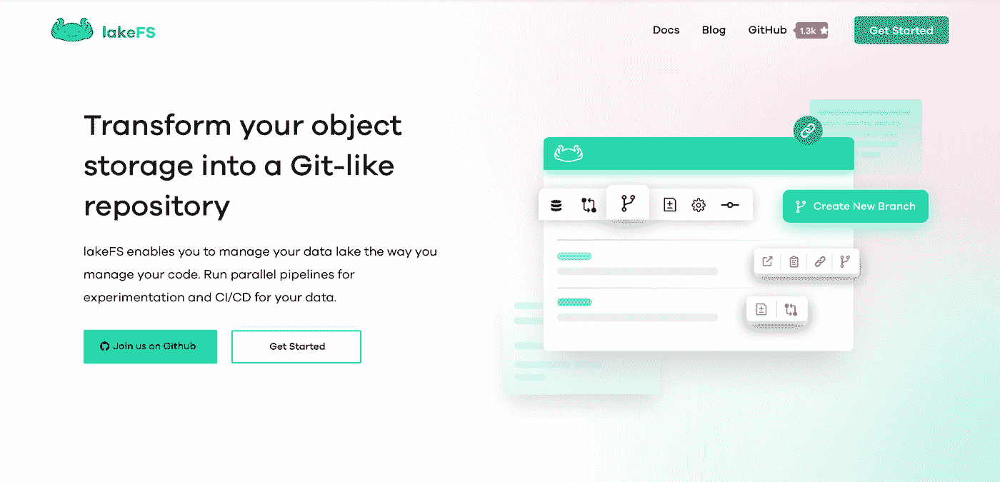
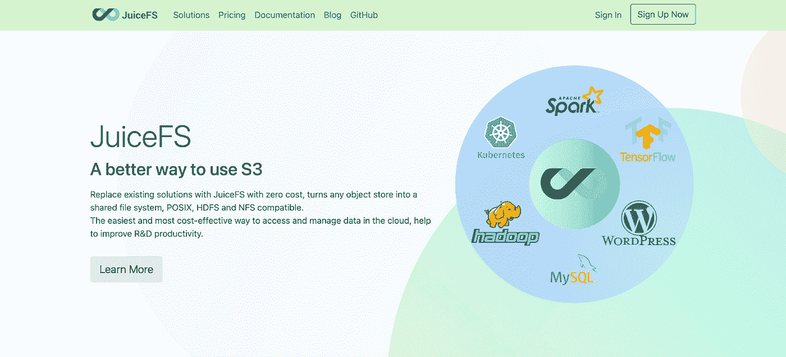
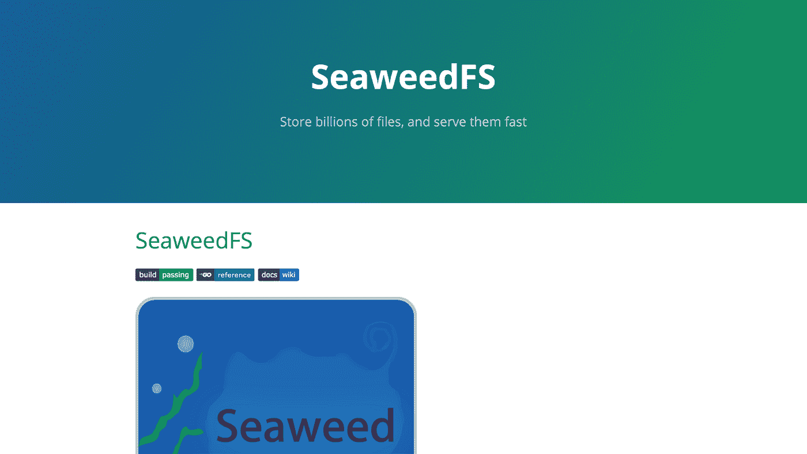

# 对象存储的 4 个必备开源解决方案

> 原文：<https://betterprogramming.pub/top-4-open-source-tools-for-object-storage-e43267bcd724>

## 免费发现实现对象存储系统的最流行的工具

Joshua Coleman 在 [Unsplash](https://unsplash.com/photos/ZVkDLrXGMdw) 上拍摄的照片。

正如《福布斯》所指出的，当今组织中 80%以上的数据是非结构化的。传统上，公司忽略了这种类型的数据，因为他们面临着分析数据和生成有意义的见解的挑战。然而，随着其他类型的存储系统的发明，如基于数据块、基于文件和基于对象的存储系统，形势正在迅速变化。

在这三者中，对象存储似乎最有前途，事实证明了这一点，亚马逊、谷歌和 IBM 等巨头已经为基于对象的数据存储库提供了企业解决方案。

虽然这种商业选项确实提供了许多功能，但是值得探索一些免费的附加功能，以便在您的公司中成功地实现对象存储。在本文中，我们将讨论四大开源[对象存储](https://lakefs.io/object-storage/)工具以及它们之间的比较。

 [## 通过我的推荐链接加入 Medium-BEXGBoost

### 获得独家访问我的所有⚡premium⚡内容和所有媒体没有限制。支持我的工作，给我买一个…

ibexorigin.medium.com](https://ibexorigin.medium.com/membership) 

获得由强大的 AI-Alpha 信号选择和总结的最佳和最新的 ML 和 AI 论文:

 [## 阿尔法信号|机器学习的极品。艾总结的。

### 留在循环中，不用花无数时间浏览下一个突破；我们的算法识别…

alphasignal.ai](https://alphasignal.ai/?referrer=Bex) 

# 1.莱克夫斯

图片来自 [lakeFS](https://lakefs.io/)

在增强底层存储系统的几个开源工具中， [lakeFS](https://lakefs.io/) 允许您对对象存储库进行版本控制。

它的目标是提供一个类似 Git 的数据版本化工具，同时也兼容现有的云存储。有了 lakeFS，您可以像控制代码一样对万亿字节的数据进行版本控制。此外，它允许您在数据存储库上构建可重复的原子操作，使执行大规模 ETL 作业、数据分析和机器学习成为可能。

LakeFS 允许您创建一个开发环境，您可以在其中执行实验并以可重复的方式记录它们。像 Git 一样，您可以创建提交和分支，这使得您可以沿着应用程序开发的时间线前进，并独立地尝试新特性。令人惊讶的是，lakeFS 在不复制任何数据的情况下执行所有这些操作——一切都是使用特殊的元数据管理完成的。

LakeFS 还实现了严格的数据集成和部署最佳实践。它提供格式、模式和文件元数据验证，以防止低质量的数据进入数据湖并将其变成数据沼泽。

# 2.果汁

来自 [JuiceFS](https://juicefs.com/?hl=en) 的照片

有了 3.3k GitHub stars，接下来是 [JuiceFS](https://juicefs.com/?hl=en) 。它的主要目的是将任何对象存储转换成与 POSIX、HDFs 和 NFS 兼容的完整文件系统。

对象存储的一个定义性特征是它没有任何组织层次。所有数据都存储在一个中央存储库中，并且只能通过其 GUI(全局唯一标识符)访问数据。虽然此功能提供了高速度和存储灵活性，但在与现有的基于文件系统的应用程序交互时会产生问题。

JuiceFS 通过提供完全兼容 POSIX 的工具来解决这一问题，该工具允许您与其他应用程序无缝协作，而不会受到任何业务干扰。此外，它可以构建在几乎任何云存储提供商的基础上，以对象形式存储数据。它还通过将元数据保存在熟悉的数据库引擎(如 Redis、MySQL、PostgreSQL、SQLite 等)中来提供更好的管理。

JuiceFS 以其出色的性能而自豪，提供了可以以毫秒计的低网络延迟。该工具还提供了 Hadoop Java SDK，因此可以轻松集成到 Hadoop 生态系统中，并为使用 Kubernetes 的企业提供 Kubernetes CSI 驱动程序。

# 3.SeaweedFS

图片来自 [SeaweedFS](http://seaweedfs.github.io/)

就功能而言，SeaweedFS 是 JuiceFS 的直接替代品，但它更受欢迎。开源项目的可信度和未来取决于它的社区和它的活跃程度，SeaweedFS 在这两个方面都做了检查。截至 2021 年 6 月，GitHub 知识库拥有超过 12k 颗恒星和 119 名活跃贡献者。

SeaweedFS 将速度和可伸缩性作为重中之重。根据他们的网站，他们的目标是:

1.  存储数十亿个文件！
2.  快速提供这些文件！

与其他对象存储系统不同，SeaweedFS 不会将所有数据保存在一个存储库中。相反，它使用一个中央主服务器来控制卷服务器集群，这些卷服务器管理文件和元数据。这个特性使得这个工具更快，因为它解除了中央主机的所有并发问题。

SeaweedFS 通过其无状态服务器 Filer 引入并处理目录。它是线性可扩展的，支持数十种可定制的元数据存储，如 MySQL、PostgreSQL、Redis、Cassandra、HBase、MongoDB、Elastic Search、LevelDB、RocksDB、SQLite、MemSQL、TiDB、Etcd、CockroachDB 等。

# 4.米尼奥

照片来自 [MinIO](https://min.io/)

另一个比 JuiceFS 和 SeaweedFS 更强大的替代品是 [MinIO](https://min.io/) 。尽管 MinIO 还很年轻，但它已经成为混合云领域的领导者。它在私有云和公共云中无缝运行，提供了最广泛的使用案例-AI/ML、分析、备份/恢复以及移动和 web 应用程序。

该项目在 GitHub 上拥有超过 28k 颗星和近 300 名活跃贡献者，使其成为领先的开源对象存储系统工具。对于更严格的安全和持续的支持，也有两个付费计划。

MinIO 还提供最高质量的软件设计。从一开始，它就是库伯内特-本地的和 S3-兼容的。它在 AWS、Azure 和 GCP 上有超过 770 万个正在运行的实例，比其他私有云的总和还要多。

在性能方面，它可以分别以 183 GB/s 和 171 GB/s 的读写速度运行，并可以无缝集成到 Hadoop 生态系统中。

# 摘要

今天，我们讨论了用于对象存储系统的四种最流行的开源工具。虽然 JuiceFS、SeaweedFS 和 MinIO 提供了构建在云提供商之上的对象存储解决方案，但是 lakeFS 提供了一个类似 Git 的数据版本化系统，可以与这里提到的任何其他工具一起使用。

选择哪一种取决于您的公司和业务需求。例如，如果您想要一个完全开源的工具，SeaweedFS 是一个不错的选择。另一方面，如果您想要实现一个由大型社区支持的工具，并且能够为您的特定需求提供企业解决方案，MinIO 是完美的候选。此外，将这些工具与 lakeFS 结合起来可能是一个好主意，这样您就可以拥有将非结构化数据用于大数据和机器学习操作的完美设置。