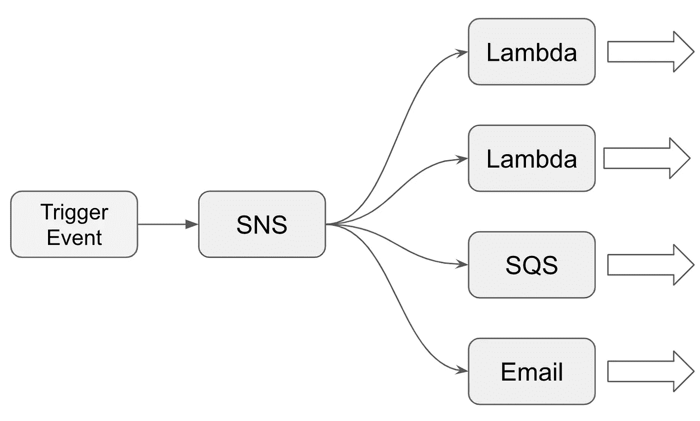

# 启动任何项目的五大 AWS 服务

> 原文：<https://betterprogramming.pub/top-5-aws-services-to-launch-any-project-875457b6f309>

## 最大限度地利用云功能

美国宇航局在 [Unsplash](https://unsplash.com/s/photos/launch?utm_source=unsplash&utm_medium=referral&utm_content=creditCopyText) 拍摄的照片

2021 年，亚马逊网络服务(AWS)提供超过 200 种不同的服务。其中一些你可能已经很熟悉了。其他的看起来比较新鲜。毫无疑问，它们都有各自的用途。有些服务甚至会给你留下深刻的印象，让你产生“我无法想象还有这样的服务”的印象。就我个人而言，当我发现亚马逊木材场时，我感到非常惊讶。

与此同时，一些稳固的“摇滚明星”服务已经存在了相当一段时间。它们已经被时间和软件工程师证明了。在他们的帮助下，数字世界中的大多数解决方案都可以构建和发布。这些服务充当 web 项目的引导。让我们来发现他们和他们的能力。

# 1.简单存储服务

每个云提供商都有保存文件的地方。在 AWS 中，它是简单的存储服务，被称为 S3。这种类型的存储专用于保存不同种类的对象:文件、图片、视频、文档。它对此没有限制。对于任何类型的文件，它都是一个持久且可伸缩的地方。

S3 具有安全和性能特性。文件可以加密并支持版本控制。根据访问频率，S3 有多种类型的存储。例如，有些类型专用于存档数据(S3 冰川)。这将降低成本，但增加检索时间。还有一些类型是为高效的频繁访问而设计的。

除了方便的 web 界面，还有针对最流行的框架、命令行界面和 REST API 的 SDK。使用什么是你的选择。所有这些都使得 S3 成为一个开始与云系统合作的简单服务。

# 2.关系数据库服务

几乎没有不收集用户数据的解决方案。用户配置文件、支付状态和角色管理是被广泛使用的最常见的功能。所有这些类型的数据都需要以结构化的方式持久化。关系数据库是一个完美的选择。但是，我们必须把它放在某个地方，并不断地维护它。

谢天谢地，AWS 上有专门的服务。它就是[关系数据库服务](https://aws.amazon.com/rds/)，或 RDS。它支持最流行的数据库引擎，如 PostgreSQL、MySQL、SQL Server 等。AWS 还提供了自己的数据库引擎 Amazon Aurora 和 Aurora Serverless，具有更多性能和可伸缩性特性。

我们可以确保数据安全地保存在那里，如果服务器变得不可用，我们也不必担心。该服务负责可用性和数据复制。

# 3.希腊字母的第 11 个

云计算现在越来越受到关注。不是每个人都准备好为一个琐碎的计算任务启动一个服务器舰队。想象一下，一个应用程序只获取一些用户数据。让服务器一直运行是对资源的浪费。

T2 T3 服务公司来救援了。它已经被许多公司用于不同的目的，并且越来越受欢迎。简单的模型“只为你使用的东西付费”使得 Lambda 非常有吸引力。简而言之:服务在不提供专用基础设施的情况下运行功能。

图片来自官方[教程](https://aws.amazon.com/blogs/compute/working-with-aws-lambda-and-lambda-layers-in-aws-sam/)

数据操作和转换、向数据库表添加新条目或者从图像创建缩略图都是使用 Lambda 的完美选择。我们只需要编写完成实际工作的函数。不需要包含服务器、负载平衡器和子网的完整基础架构。美妙之处在于，您只需为该功能运行的时间付费。

所有这些都使开发者和企业能够更快地推出原型和产品。

# 4.简单通知服务

或许你可以在没有 SNS 服务的情况下启动一个项目。首先想到的是，不是每个应用程序都必须发送通知。一些应用可能严重依赖推送通知和电子邮件，而其他应用没有它们也很好。

但是还有一点不为人知，SNS 可以用来建立发布/订阅消息。那是什么？

扇出模式

在上面的例子中，我们可以看到扇出模式是什么样子的。它是利用 SNS 构建的。当一个特定的事件发生时，SNS 会捕捉它并发送给所有订阅者。例如，当一个新文件上传到 S3 时，我们可以为多个服务发送一个通知。在这种情况下，社交网站的行为就像一个“通风机”，进一步传播事件。SNS 支持为某些服务建立基于事件的管道。

# 5.弹性豆茎

最后一个有助于加快项目进度的服务是 [Elastic Beanstalk](https://aws.amazon.com/elasticbeanstalk/) 。这项服务负责所有需要的资源。您只需要向它提供您的项目，其余的将由 AWS 自动完成。Elastic Beanstalk 将提供必要的服务，如 EC2 实例、VPC 网络、负载平衡器和监控。

Elastic Beanstalk 支持各种流行的平台，如 Java、.NET、Python 和 Docker。上传项目后，您的解决方案将很快公之于众。确保您设置了项目配置，然后您就可以放松了。它使这项服务变得卓越而有价值。

如果您想了解关于 Elastic Beanstalk 的更多信息，请查看下面这篇文章，其中的技术细节包含了真实的示例。

 [## 10 分钟内在 AWS 上创建一个部署设置

### 让您的应用更快上线

better 编程. pub](/create-a-deployment-setup-on-aws-in-10-minutes-490d225e6446) 

# 结论

亚马逊网络服务是一个强大的云提供商，被许多不同规模的企业证明是合理的。但是第一次开始使用它会很有挑战性。有了上面列出的服务，您完全有能力最终交付您的项目。多年来，软件工程师已经验证了它们的可靠性。文档很好，所有的复杂问题都已经解决了。不要犹豫，去探索它们吧！