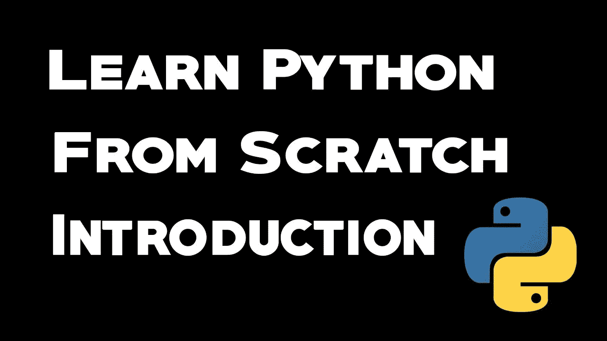
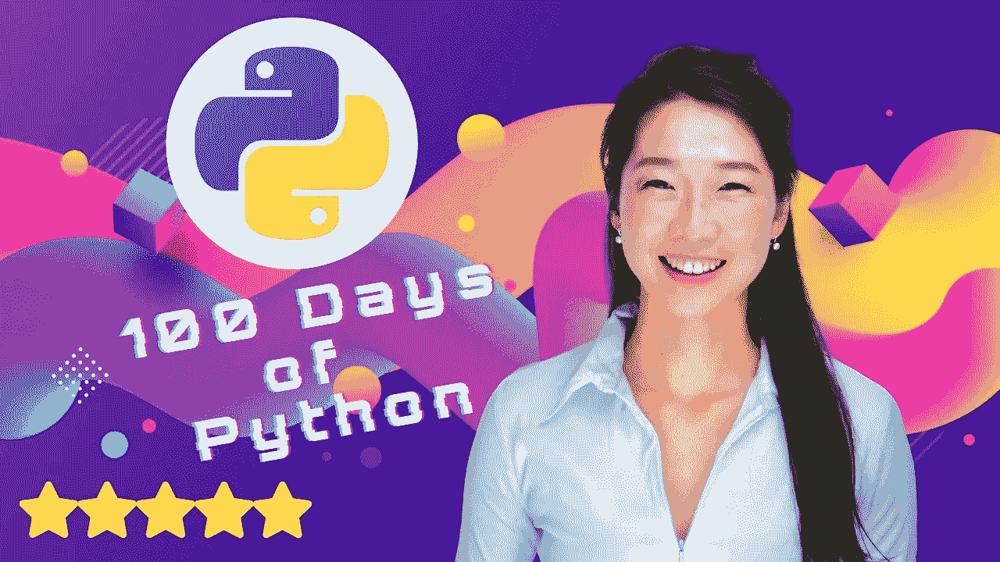
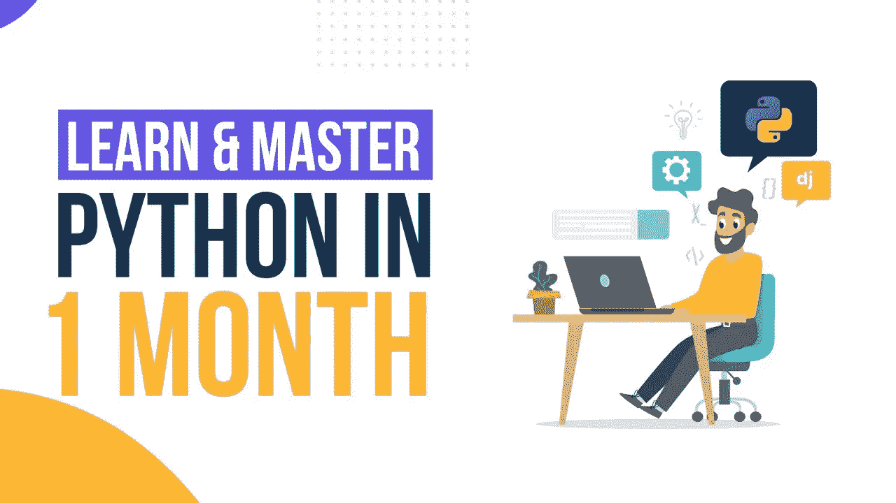
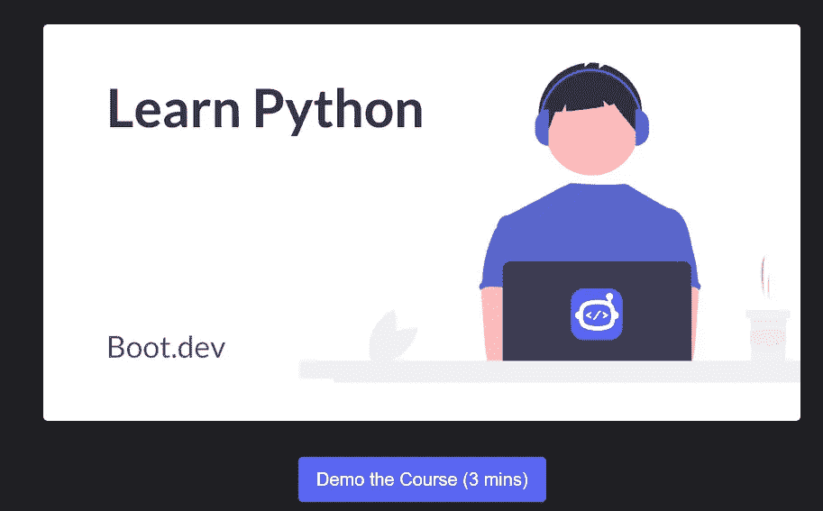
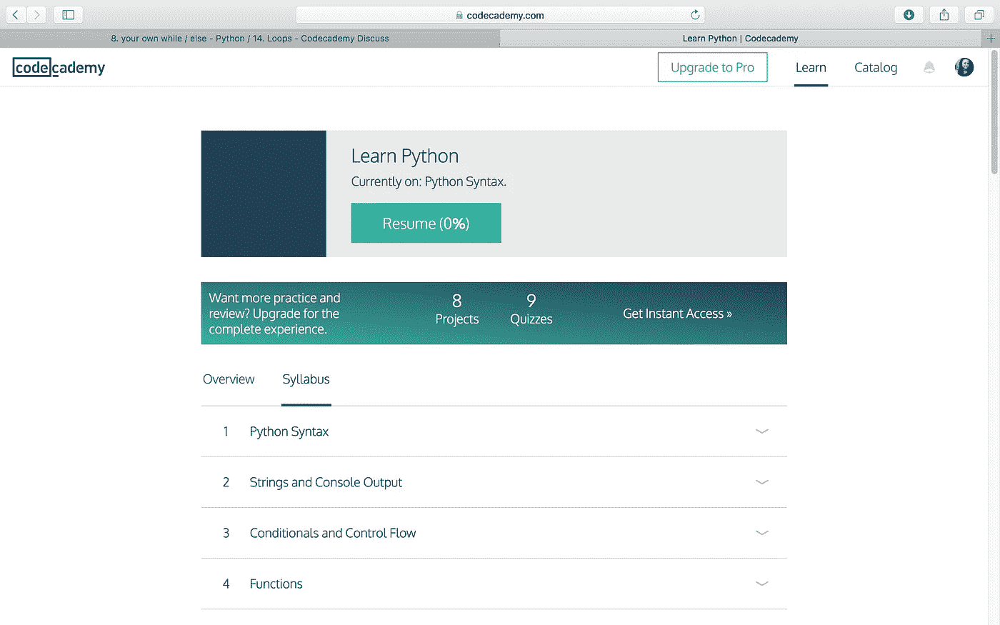

# 2023 年学习 Python 的 10 大课程——最佳课程

> 原文：<https://betterprogramming.pub/top-5-courses-to-learn-python-in-2018-best-of-lot-26644a99e7ec>

## 2023 年 Udemy、Coursera、Educative 和 Pluralsight 上面向初学者和中级程序员的 12 门最佳 Python 课程

无论你是刚开始学习编码还是计算机科学毕业生，如果你对学习 Python 感兴趣，那么你来对地方了。在这篇文章中，我将分享我最喜欢的在线课程到 2023 年**学习 Python。**

*披露——顺便说一句，其中一些链接是附属链接，如果你使用我的链接加入这些课程，我可能会得到报酬。*

这个列表是由 [Udemy](https://medium.com/javarevisited/10-best-python-3-courses-on-udemy-ddd4e3ec5dbf) 、 [Coursera](https://medium.com/javarevisited/10-best-python-certification-courses-from-coursera-4576890eb6b3) 、Pluralsight、CodeCademy、ZTM 学院、Educative、One Month 和其他知名在线学习平台提供的最好和最高质量的 Python 课程组成的，这些课程是我在花了一年半时间研究了无数[书籍](https://javarevisited.blogspot.com/2019/07/top-5-books-to-learn-python-in-2019.html)、[免费课程](https://javarevisited.blogspot.com/2018/12/10-free-python-courses-for-programmers.html)、[在线培训](https://dev.to/javinpaul/7-python-online-courses-for-beginners-and-intermediate-programmers-1h4k)、[网站](https://medium.com/javarevisited/10-free-python-tutorials-and-courses-from-google-microsoft-and-coursera-for-beginners-96b9ad20b4e6)、文章和教程后选择的。

Python 是最流行的编程语言之一，它被用于许多领域，例如 web 开发、自动化、数据科学和机器学习等等。

近年来，Python 也成为了[数据科学和机器学习](https://javarevisited.blogspot.sg/2018/03/top-5-data-science-and-machine-learning-online-courses-to-learn-online.html)项目的默认语言，这也是 2023 年很多有经验的程序员都在学习 Python 的另一个原因。

它也是我在 2023 年要学习的编程语言清单上的顶级语言之一。但是，尽管 Python 具有强大的功能和灵活性，但它仍然是一种非常容易学习的语言，并且经常被吹捧为初学者的理想编程语言。

如果你是一名 Java 或 web 开发人员，使用 [JavaScript](http://www.java67.com/2018/04/top-5-free-javascript-courses-to-learn.html) 创建 web 应用程序，学习 Python 仍然是值得的，因为成为一名[多语言程序员](http://javarevisited.blogspot.sg/2014/01/10-tips-to-improve-programming-skill-become-better-programmer.html)，即学习一种以上的编程语言，不仅可以提高你的知识和经验，还可以让你对雇主更有吸引力。

如果你正在考虑学习一门新的编程语言，那么 Python 是一个很好的选择，特别是如果你正在寻找一条数据科学或机器学习的有利可图的职业道路。

过去，我在博客上写过[为什么一个初学者在开始编程时应该选择 Java 而不是 Python](http://javarevisited.blogspot.sg/2013/11/java-vs-python-which-programming-laungage-to-learn-first.html) ，但是事情已经有了很大的进展。近年来，Python 发展显著，这给 Python 开发者带来了越来越多的机会。

# 2023 年面向初学者的 13 门最佳 Python 在线课程

以下是我从 Udemy、Coursera、Educative、CodeCademy 和 Pluralsight 这些 2023 年在线学习 Python 编程的最佳地点列出的 2023 年学习 Python 的 10 大在线课程。

## 1. [100 天代码:2023 年完整的 Python Pro 训练营](https://click.linksynergy.com/deeplink?id=JVFxdTr9V80&mid=39197&murl=https%3A%2F%2Fwww.udemy.com%2Fcourse%2F100-days-of-code%2F)

如果你完全是初学者，并且想在 2023 年学习 Python，那么没有比这 100 天的代码更好的课程了:Udemy 上 Angela Yu 博士的 2023 年完整 Python Pro Bootcamp 课程。

这是一门令人惊叹的课程，它将以训练营的方式教你 Python 编程，你将通过在 100 天内构建 100 个项目来学习 Python，并在此过程中学习数据科学、自动化、构建网站和游戏。

以下是您将在本 Python 课程中学到的内容:

1.  Python 基础、变量、数据结构和函数
2.  您将学习基本的 Python 库，如 Selenium、Beautiful Soup、Request、Flask、Pandas、NumPy、Scikit Learn、Plotly 和 Matplotlib。
3.  您还将创建一个包含 100 个 Python 项目的投资组合来申请开发人员职位

余博士是 Udemy 最好的导师之一，她的训练营课程质量很高。这并不奇怪，因为她已经在训练营教了很多学生，花费大约 10，000 美元，但你可以从同样的老师那里学到东西，只需要 10 美元，这就是很大的区别。

**这里是加入本课程的链接—** [100 天代码:2023 年完整的 Python Pro 训练营](https://click.linksynergy.com/deeplink?id=JVFxdTr9V80&mid=39197&murl=https%3A%2F%2Fwww.udemy.com%2Fcourse%2F100-days-of-code%2F)

## 2. [Python 为大家特殊化](https://coursera.pxf.io/c/3294490/1164545/14726?u=https%3A%2F%2Fwww.coursera.org%2Fspecializations%2Fpython)【Coursera】

如果你不知道，Coursera Specializations 是帮助你学习和掌握一项技能的课程集合。

这个专业是学习 Python、 [web 开发](https://medium.com/javarevisited/7-best-courses-to-learn-data-structure-and-algorithms-d5379ae2588#axzz59jmqy3uB)，[大数据](http://www.java67.com/2018/01/top-10-web-mobile-and-big-data-framework-libraries-technologies-programmers-should-learn-in-2018.html)，数据科学，[机器学习](https://javarevisited.blogspot.sg/2018/03/top-5-data-science-and-machine-learning-online-courses-to-learn-online.html)等等。

这是一门非常实用的课程，不仅对初学者有用，对熟悉其他编程语言如 [Java](http://www.java67.com/2018/02/3-books-to-learn-java-from-scratch-in.html) 或 [C++](http://www.java67.com/2018/02/5-free-cpp-courses-to-learn-programming.html) 并想学习 [Python](http://www.java67.com/2018/02/5-free-python-online-courses-for-beginners.html) 的程序员也有用。

在 30 天的时间里，本课程将教你编写复杂的 Python 应用程序，从几乎任何网站收集数据，并为所有类型的自动化构建自己的 Python 应用程序。它非常适合忙碌的开发人员，他们通过做严肃的事情来学习。

 [## 30 天的 Python |释放您的 Python 潜能

### Python 对于初学者来说足够简单，对于专业人士来说足够强大。将其用于 IOT、网络抓取、大数据等。

udemy.com](https://click.linksynergy.com/fs-bin/click?id=JVFxdTr9V80&subid=0&offerid=323058.1&type=10&tmpid=14538&RD_PARM1=https%3A%2F%2Fwww.udemy.com%2F30-days-of-python%2F) 

## 11.[一个月学会 Python](http://onemonth.refr.cc/javarevisited)

在这个在线课程中，你将学习使用 [Python](https://javarevisited.blogspot.com/2018/12/10-free-python-courses-for-programmers.html) 编程的基础，但重点是业务用例。

您将学习如何编写脚本来自动化繁琐的任务、废弃网站、阅读他人的代码、解析和解释数据、与 API 交互以及构建 web 抓取器。

*所以，如果你想在一个月内成为一名 Python 开发者，你应该提前一个月查看* [***学习 Python*** *课程*](http://onemonth.refr.cc/javarevisited) *。*

## 12.[学习 Python @ Boot。发展](https://boot.dev/learn/learn-python?via=javin)

靴子。Dev 是另一个在线平台，在这里你可以通过做一些事情来学习 Python，比如解决交互式测验和练习。这门名为“Python 基础”的课程非常适合从头开始学习 Python。

[“Python 基础知识”](https://boot.dev/learn/learn-python?via=javin)教你需要知道的一切，以便立即开始使用真正的 Python 代码。Boot.dev 的 Python 课程不仅会让你在浏览器中用 Python 编写真正的 coe，还会让你为他们的下一套 Python 课程“Big-O 算法”和“Big-O 数据结构”做好准备。

当涉及到平台 Boot.dev 时，它会教你常青的计算机科学概念，帮助你尽快达到“高级开发人员”的水平。

## 12.[在 CodeCademy 上学习 Python 3](https://bit.ly/learnpython3codecademy)

本课程很好地介绍了基本编程概念和 Python 编程语言。它既互动又全面，有 25 小时的内容。

如果您不知道，Python 3 是该语言的最新版本，它做了许多改进，以提高您编写的代码的效率和简单性。如果你想学习 Python 3 交互方式，那么这个 CodeCademy 课程是最好的开始。

**这里是加入 CodeCademy Python 课程**——[学习 Python 3](https://bit.ly/learnpython3codecademy) 的链接

顺便说一句，你需要一个 [**CodeCademy Pro 会员**](https://www.pntrs.com/t/TUJGR0lLR0JHRklJSkhCR0ZISk1N?url=https%3A%2F%2Fwww.codecademy.com%2Flearn%2Flearn-python-3) 这个课程每月花费大约 15.99 美元，但提供许多高质量的课程和高级测验、作品集制作项目和定制路径，这使它完全值得。你可以在这里了解更多[。](https://javarevisited.blogspot.com/2022/02/top-10-codecademy-career-paths-to-start.html)

好了，2023 年学习 Python 编程的一些 [**最佳课程**](https://javarevisited.blogspot.com/2020/02/10-best-coursera-courses--for-python.html) 。Python 是一种非常强大的语言，它允许你做任何事情，从创建简单的脚本到自动化复杂的面向对象的应用程序，但它仍然是一种容易学习的语言。

我强烈推荐 [Python](https://dev.to/javinpaul/7-python-online-courses-for-beginners-and-intermediate-programmers-1h4k) 给所有初学编程编码的人。和 [Java](http://javarevisited.blogspot.sg/2017/11/top-5-free-java-courses-for-beginners.html) 一起，Python 编程经验会让你在职业生涯中受益很久。

## 结束语

感谢你阅读这篇文章。

还有很多有用的[免费资源](https://javarevisited.blogspot.com/2018/12/10-free-python-courses-for-programmers.html)可以用来学习 Python 我把下面的一些链接到了其他资源上，其中一些当然不是免费的，但是物有所值。

最终，如果你付出努力，你应该能够获得足够的关于 [Python 编程语言](https://medium.com/javarevisited/my-favorite-books-to-learn-python-in-depth-77465633b46e)的知识和经验。

祝您的 Python 之旅好运！当然**不会很容易**，但是通过遵循这些课程和指南，你离成为你一直想成为的 [Python 程序员](https://medium.com/javarevisited/python-or-java-which-programming-language-beginners-should-learn-in-2020-de992b2650ec)更近了一步。

> 如果你想翻译这篇文章，或者在你的博客、网站或出版物上重新发表，请给我的电子邮件 savingfunda@gmail.com 留言，我通常会答应的。

# 其他**编程资源**

[2023 年 Java 开发者路线图](https://javarevisited.blogspot.com/2019/10/the-java-developer-roadmap.html#123)
[5 门课程 2023 年学习 Web 开发](http://javarevisited.blogspot.sg/2018/02/top-5-online-courses-to-learn-web-development.html#axzz57wed1PWd)
[5 门课程学习 Spring 微服务用 Spring Boot 和云](http://javarevisited.blogspot.sg/2018/02/top-5-spring-microservices-courses-with-spring-boot-and-spring-cloud.html#axzz59dN6YO2K)
[5 门在线课程免费学习核心 Java](http://javarevisited.blogspot.sg/2017/11/top-5-free-java-courses-for-beginners.html#axzz4zuIICRs9)
[5 门课程学习大数据和 Apache Spark](http://javarevisited.blogspot.com/2017/12/top-5-courses-to-learn-big-data-and.html)
[5 门课程学习 React Native 2023 年](http://javarevisited.blogspot.sg/2018/02/5-react-native-courses-to-learn-mobile-development-using-JavaScript.html)
[前 5 门课程学习 TensorFlow 和 面向移动应用开发者的 5 大 React Native 课程](https://hackernoon.com/top-5-tensorflow-and-ml-courses-for-programmers-8b30111cad2c)
[面向高级开发者的 10 大免费 Docker 课程](https://hackernoon.com/10-free-courses-to-learn-docker-for-programmers-and-devops-engineers-7ff2781fd6e0)
[面向程序员学习 Python 的 10 大理由](https://hackernoon.com/10-reasons-to-learn-python-in-2018-f473dc35e2ee)
[面向 Web 开发学习 Python 的 10 大课程](https://medium.com/javarevisited/top-10-courses-to-learn-python-for-web-development-in-2020-best-of-lot-efe11fb6d212)
[面向初学者学习 Django 的最佳课程](https://medium.com/javarevisited/my-favorite-courses-to-learn-django-for-beginners-2020-ac172e2ab920)
[来自微软和谷歌的最佳 Python 教程](https://medium.com/javarevisited/10-free-python-tutorials-and-courses-from-google-microsoft-and-coursera-for-beginners-96b9ad20b4e6)
[免费学习 Python 编码的 5 大网站](https://javarevisited.blogspot.com/2019/09/5-websites-to-learn-python-for-free.html)

***P. S.*** *—你想在 2023 年成为一名 Python 开发者吗？如果是，那么我强烈推荐你参加 Udemy 上由 Angela Yu 博士举办的* [**代码 100 天:2023**](https://click.linksynergy.com/deeplink?id=JVFxdTr9V80&mid=39197&murl=https%3A%2F%2Fwww.udemy.com%2Fcourse%2F100-days-of-code%2F) 完整 Python Pro 训练营课程。这是初学者在线学习的最好的 Python 课程。

**P.S. S.** —所有这些都是付费课程，如果你正在寻找一些免费的东西，那么你应该看看这个 [**免费 Python 课程**](http://www.java67.com/2018/02/5-free-python-online-courses-for-beginners.html) 的列表。

 [## 15 门免费 Python 课程，供初学者在线学习

### 学习 Python 的一些免费在线课程的精选列表。

medium.com](https://medium.com/swlh/5-free-python-courses-for-beginners-to-learn-online-e1ca90687caf)