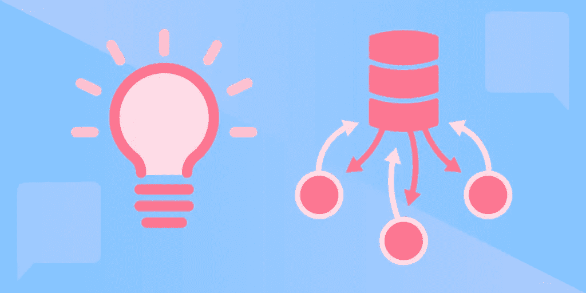

# 五大分布式系统设计模式

> 原文：<https://betterprogramming.pub/top-5-distributed-system-design-patterns-ae9482f49128>

## 通过高级系统设计面试

图片由作者提供。

分布式应用程序是现代软件开发行业的主要组成部分。它们是云存储服务的关键，并允许大规模的 web 应用程序保持反应性。当程序员构建这些系统时，他们需要一些基本的构建模块，以此作为起点，并使用共享的词汇表进行交流。

这就是分布式系统设计模式变得无价的地方。虽然它们有时会被过度使用，但理解如何使用它们是招聘人员寻找的一项关键技能，也是在高级系统设计面试中脱颖而出的关键。

今天，我们将探索五种顶级分布式系统设计模式，以帮助您了解它们的优点、缺点以及何时使用它们。

以下是我们今天要讲的内容:

*   什么是分布式系统设计模式？
*   1.命令和查询责任分离
*   2.两阶段提交
*   3.冒险故事
*   4.复制负载平衡服务
*   5.分片服务
*   接下来学什么

# 什么是分布式系统设计模式？

设计模式是构建适合特定用例的系统的经过试验和测试的方法。它们不是实现，而是构建系统的抽象方式。大多数设计模式已经由许多不同的开发人员开发和更新了多年，这意味着它们通常是非常有效的起点。

设计模式是构建模块，允许程序员从现有的知识中提取，而不是从每一个系统开始。他们还为系统设计创建了一套标准模型，帮助其他开发人员了解他们的项目如何与给定的系统交互。

创建设计模式在构建新对象时提供了一个基线。结构模式定义了解决方案的整体结构。行为模式描述了对象以及它们如何相互通信。

分布式系统设计模式是在开发分布式系统时使用的设计模式，分布式系统本质上是计算机和数据中心的集合，对于最终用户来说，它们就像一台计算机。这些分布式设计模式概述了不同节点如何相互通信、哪些节点处理每个任务以及不同任务的流程的软件架构。

在设计大规模云计算和可扩展微服务软件系统的分布式系统架构时，这些模式被广泛使用。

## 分布式设计模式的类型

大多数分布式设计模式根据它们使用的功能分为三类:

*   对象通信:描述系统不同组件通信的消息协议和权限。
*   安全性:处理机密性、完整性和可用性问题，以确保系统不会受到未经授权的访问。
*   事件驱动的:描述系统事件的产生、检测、消费和响应的模式。

# 1.指挥和查询责任分离(CQRS)

CQRS 模式侧重于分离分布式系统的读写操作，以提高可伸缩性和安全性。该模型使用命令将数据写入持久存储，并使用查询来定位和获取数据。

这些由接收用户请求的指挥中心处理。然后，命令中心获取数据，进行必要的修改，保存数据，并通知读取服务。然后，读取服务更新读取模型，以向用户显示更改。

## 优势

*   通过委派任务降低系统复杂性。
*   强制在业务逻辑和验证之间进行清晰的分离。
*   帮助按工作对流程进行分类。
*   减少对共享数据的意外更改。
*   减少拥有数据修改权限的实体数量。

## 不足之处

*   需要在命令和读取模型之间不断地来回通信。
*   在发送高吞吐量查询时会导致延迟增加。
*   无法在服务进程之间进行通信。

## **用例**

CQRS 最适合数据密集型应用程序，如 SQL 或 NoSQL 数据库管理系统。这对数据密集型微服务架构也很有帮助。它非常适合处理有状态的应用程序，因为写入者/读取者的区别有助于处理不可变的状态。

# 2.两阶段提交(2PC)

2PC 在事务性方法和对中央命令的依赖方面类似于 CQRS，但是分区是根据它们的类型和完成的阶段来处理的。这两个阶段是*准备*阶段(在此阶段，中央控制告诉服务准备数据)和*提交*阶段(通知服务发送准备好的数据)。

默认情况下，2PC 系统中的所有服务都是锁定的，这意味着它们不能发送数据。锁定时，服务完成准备阶段，因此一旦解锁就可以发送。协调器逐个解锁服务并请求它们的数据。如果服务没有准备好提交它的数据，协调器就转移到另一个服务。一旦发送了所有准备好的数据，所有服务解锁以等待来自协调器的新任务。

2PC 本质上确保了一次只能运行一个服务，这使得该过程比 CQRS 更具抵抗性和一致性。

## 优势

*   一致并能抵抗由于缺少并发请求而导致的错误。
*   可扩展—可以像处理单台机器上的数据一样轻松地处理大数据池。
*   允许同时进行隔离和数据共享。

## 不足之处

*   不具备容错能力，由于其同步性，容易出现瓶颈和阻塞。
*   比其他设计模式需要更多的资源。

## **用例**

2PC 最适合处理高风险事务操作的分布式系统，这些操作注重准确性而不是资源效率。它可以防止错误，并且在错误发生时很容易跟踪错误，即使是大规模的错误。

# 3.冒险故事

Saga 是一种异步模式，它不使用中央控制器，而是完全在服务之间进行通信。这克服了前面提到的同步模式的一些缺点。

Saga 使用事件总线来允许微服务系统中的服务相互通信。总线在服务之间发送和接收请求，每个参与的服务创建一个本地事务。然后，每个参与服务都发出一个事件供其他服务接收。其他服务都监听事件。接收事件的第一个服务将执行所需的操作。如果该服务未能完成操作，它将被发送到其他服务。

这种结构类似于 2PC 设计，因为如果不能完成任务，服务就会循环。然而，Saga 删除了中央控制元素，以更好地管理流程并减少所需的来回通信量。

## **优势**

*   单个服务可以处理更长的事务。
*   由于分散化，非常适合分布式系统。
*   由于服务之间的点对点通信，减少了瓶颈。

## **劣势**

*   异步自治使得很难跟踪哪些服务正在执行单独的任务。
*   由于复杂的编排而难以调试。
*   比以前的模式更少的服务隔离。

## **用例**

Saga 的分散方法非常适合可伸缩的无服务器功能，可以同时处理许多并行请求。AWS 在许多函数中使用基于 Saga 的设计，如阶跃函数和 lambda 函数。

# 4.复制负载平衡服务(rlb)

RLBS 模式是最简单和最常用的设计模式。在最基本的层面上，它由多个相同的服务组成，这些服务都向一个中央负载平衡器报告。每个服务都能够处理任务，并且在失败时可以复制。负载平衡器接收来自最终用户的请求，并以循环方式或有时通过使用更复杂的路由算法将它们分发到服务。

重复的服务确保应用程序为用户请求保持高可用性，并且可以在服务的一个实例失败时重新分配工作。

RLBS 经常与 Azure Kubernetes 一起使用，这是一种由微软开发的开源容器编排技术，提供基于工作流的自动服务扩展。

## **优点**

*   从最终用户的角度来看，性能始终如一。
*   可以从失败的服务中快速恢复。
*   高度可扩展，支持更多服务。
*   非常适合并发。

## **缺点**

*   基于负载均衡算法的不一致性能。
*   管理服务需要大量资源。

## **用例**

RLBS 非常适合全天工作负载不一致但必须保持低延迟的前端系统，如网飞或亚马逊 Prime 等娱乐 web 应用。

# 5.分片服务

基于副本的设计的一个替代方案是创建一个服务选择，每个服务只完成特定类型的请求。这被称为“分片”,因为您将请求流分成了多个不相等的部分。例如，您可能有一个接受所有缓存请求的 shard 服务和一个只处理高优先级请求的 shard 服务。负载均衡器在收到每个请求时对其进行评估，并将其分配给适当的碎片来完成。

分片服务通常用于构建有状态服务，因为状态的大小对于单个无状态容器来说通常太大了。分片允许您缩放单个分片以满足状态的大小。

分片服务还允许您更快地处理高优先级请求。专用于高优先级请求的碎片总是可以在这些请求到来的那一刻处理它们，而不是将它们放在队列中。

## **优势**

*   允许您为常见请求缩放碎片。
*   容易区分请求的优先级。
*   由于自然排序，调试简单。

## **劣势**

*   维护许多碎片会耗费大量资源。
*   如果不成比例地使用碎片，会导致性能下降。

## **用例**

当您的系统接收到可预测的请求类型不平衡时，分片服务是最好的，但是有些请求有优先级。

# 接下来学什么

分布式系统设计模式是任何成功的后端系统的重要组成部分。然而，这些只是专业软件工程师使用的一些模式。

接下来您需要学习的一些模式是:

*   边车模式
*   预写日志
*   裂脑模式
*   暗示切换
*   读取修复