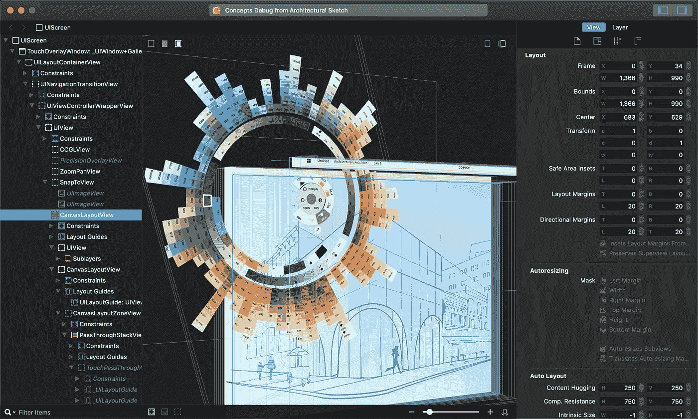

# iOS 中 UI 调试的 5 个工具

> 原文：<https://betterprogramming.pub/top-5-tools-for-debugging-your-ios-app-views-ac53cba4cf3b>

## 帮助您更好地调试 iOS 应用程序的工具

reveal app—【https://revealapp.com 

# 1.谢洛克

 [## 夏洛克-给你的 iOS 模拟器超能力

### 实时编辑视图和布局约束，模拟在其他设备上运行，并直接跳到源代码…

sherlock.inspiredcode.io](https://sherlock.inspiredcode.io) 

实时编辑视图和布局约束，模拟在其他设备上运行，并直接跳转到源代码，所有这些都从您的模拟器中完成，无需任何配置。

## **要求**

零设置是必需的，只需启动夏洛克，然后从 Xcode 或模拟器的主屏幕启动你的应用程序，夏洛克就会自动连接到它。

*   macOS 10.11 以上
*   iOS 10.3 以上

## 价格

起价 49 美元。

# 2.土卫七

 [## 柳树应用程序/Hyperion-iOS

### Hyperion 是一个隐藏的插件抽屉，可以很容易地集成到任何应用程序中。抽屉放得很小心🙊在…下面

github.com](https://github.com/willowtreeapps/Hyperion-iOS) 

Hyperion 是一个隐藏的插件抽屉，可以很容易地集成到任何应用程序中。

抽屉被小心翼翼地放在应用程序下面，这样当你需要它的时候它就在那里，当你不需要的时候它就不会碍事。Hyperion 插件旨在快速简单地检查您的应用程序

## **要求**

由于 Hyperion 主要是一个调试库，不应该包含在产品中，所以您需要以一种不包含在产品版本中的方式安装 Hyperion。

Hyperion 不需要任何代码来集成，所以它应该只需添加一次即可工作。

*   iOS 9+
*   Xcode 10.1+版本

## **价格**

免费。

# 3.展示应用程序

 [## 通过小应用程序揭示

### 检查您附加到所有视图的手势识别器，以及 iOS 添加的识别器。你可以…

revealapp.com](https://revealapp.com) 

它允许您在运行的应用程序中动态地编辑和修改视图，而无需重新编译。

通过 2D 和 3D 可视化实时检查 iOS 应用程序的视图元素和层次，并快速调试视图布局和渲染问题。

## **要求**

要使用 Reveal 检查您的 iOS 或 tvOS 应用程序或应用程序扩展，您必须首先将其与 Reveal 服务器框架链接。

*   macOS 10.11 以上
*   iOS 8+
*   tvOS 9+
*   Xcode 7+

## **价格**

起价 59 美元。

# 4.布局检查员

 [## isavynskiy/LayoutInspector

### 要运行示例项目，首先克隆 repo，并从示例目录运行 pod install。iOS 11.0 及更高版本…

github.com](https://github.com/isavynskyi/LayoutInspector) 

直接在 iOS 设备上检查布局。只有当应用程序在`DEBUG`构建配置下运行时，才能触发检查，因此它不会影响任何其他类型的应用程序构建(即`RELEASE`)。目标-C 兼容。

## **要求**

LayoutInspector 可通过[co capods](https://cocoapods.org/)获得。

*   iOS 11.0 以上
*   Xcode 10.3+版本
*   Swift 5.0 以上

## **价格**

免费。

# 5.弯曲

 [## 翻页板/FLEX

### FLEX (Flipboard Explorer)是一套用于 iOS 开发的应用内调试和探索工具。展示时，灵活…

github.com](https://github.com/Flipboard/FLEX) 

FLEX (Flipboard Explorer)是一套用于 iOS 开发的应用内调试和探索工具。

当呈现时，FLEX 会在应用程序上方的窗口中显示一个工具栏。从这个工具栏中，您可以查看和修改正在运行的应用程序中的几乎所有状态。

## **要求**

*   iOS 9+

## **价格**

免费。