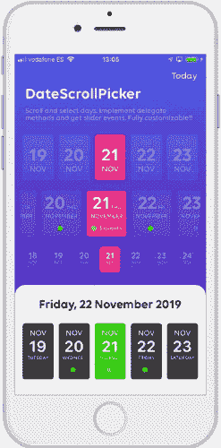
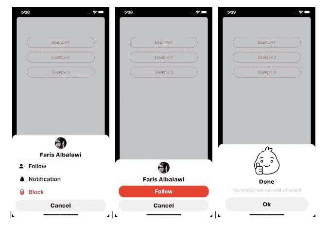
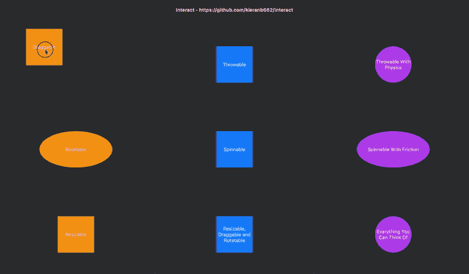

# 11 月的五大热门 iOS 库

> 原文：<https://betterprogramming.pub/top-5-trending-ios-libraries-in-november-fbff6cf18c59>

## 了解 2019 年 11 月期间是什么制造了噪音

在 [Unsplash](https://unsplash.com?utm_source=medium&utm_medium=referral) 上 [Alfred Twj](https://unsplash.com/@alfredtwj?utm_source=medium&utm_medium=referral) 拍摄的照片

继 9 月[版](https://medium.com/better-programming/top-10-trending-android-and-ios-libraries-in-september-b2db51e94f6c)和 10 月[版](https://medium.com/better-programming/top-10-trending-android-and-ios-libraries-in-october-e7dd18f8b75b)报道了 Android 和 iOS 库的十大趋势后，这里是 11 月版的 iOS 库，它试图不陷入 SwiftUI。

# 1.BSZoomGridScrollView

从一个纯粹的基于 [UIKit 框架的库](https://github.com/boraseoksoon/BSZoomGridScrollView)开始，它在网格滚动视图上提供了一些出色的基于触摸的缩放控件。它允许通过跟踪触摸区域来放大图像，还支持图像上的拖动和平移手势。

该库提供了对 SwiftUI 的全面支持，以及对网格 UI 的行和列的定制。

# 2.DateScrollPicker

接下来是一个日期滚动视图，带有一个基于 picker 特性的[库](https://github.com/alberdev/DateScrollPicker)，旨在支持 Swift 5。这提供了一个无限日期选择器视图，它支持动画选择，显示定制数据，还可以使用`DateScrollPickerFormat`定制日历中的字体和颜色。

# 3.AlertUI

这里有一个很棒的[警报视图库](https://github.com/FarisAlbalawi/AlertUI)，它本质上是一个动作表，拥有相当多的定制选项，比如颜色、图标、图像、标题和按钮动作。这个库看起来像是为基于社交网络的应用程序量身定制的。

# 4.AMTabView

接下来，我们有一个定制的[基于标签栏的库](https://github.com/Abedalkareem/AMTabView)，当选择各种标签栏项目时，它提供了惊人的动画(圆形跳跃)。它为圆圈颜色、跳跃的动画持续时间等提供定制。

# 5.互动

这里有一个[基于 SwiftUI 的库](https://github.com/kieranb662/Interact)，它通过手势提供视图之间的交互。它提供了大量不同的交互，从拖动和旋转到调整大小、旋转和投掷(可拖动但有速度)视图，只有一个`ViewModifier`。

这个库对于开发人员来说非常方便，他们可以集成一些照片编辑工具，或者简单地在应用程序中调整子视图和布局。

# 特别提及

除了这五个热门的 iOS 库，这里还有几个有趣的作品是 11 月份的亮点:

*   [**pose kit**](https://github.com/d1l4y/PoseKit)—由巴西库里蒂巴苹果开发者学院的学生制作，这个库使用 ARKit 和 RealityKit 来跟踪身体位置，并在 JSON 中返回当前四百万个可能位置中的位置。
*   [**OpenSwiftUI**](https://github.com/Cosmo/OpenSwiftUI)—虽然 SwiftUI 仅支持苹果平台，但该库旨在构建 SwiftUI DSL 的开源实现，可在 Windows、Linux 以及基本上所有支持 Swift 的平台上运行。
*   [**Ink**](https://github.com/JohnSundell/Ink)—这是一个用 Swift 编写的 markdown 解析器，允许将 markdown 格式的字符串转换成 HTML，并且还解析元数据。

11 月 iOS 版到此结束。我希望你喜欢阅读。

# 11 月安卓版

 [## 11 月的五大热门 Android 库

### 为您的 Android 应用程序带来最新的精华

medium.com](https://medium.com/better-programming/the-top-5-trending-android-libraries-in-november-cc0832aae4ce)