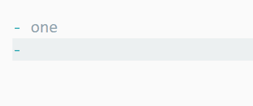
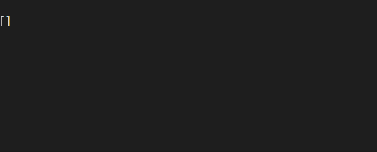
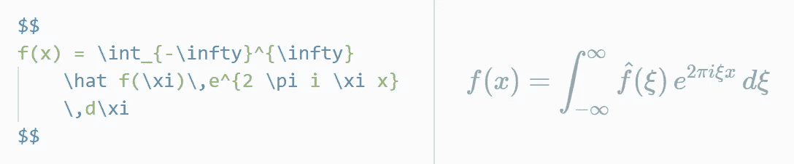
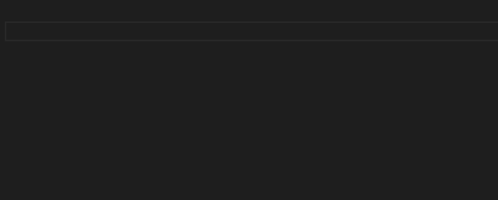
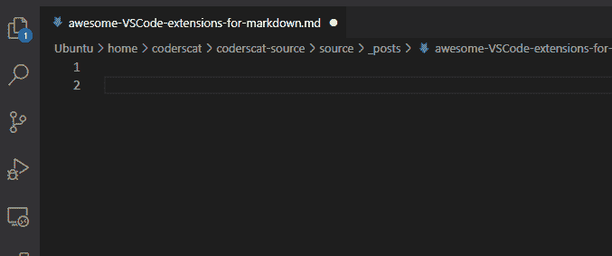
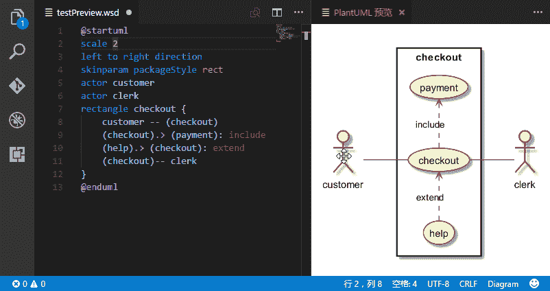
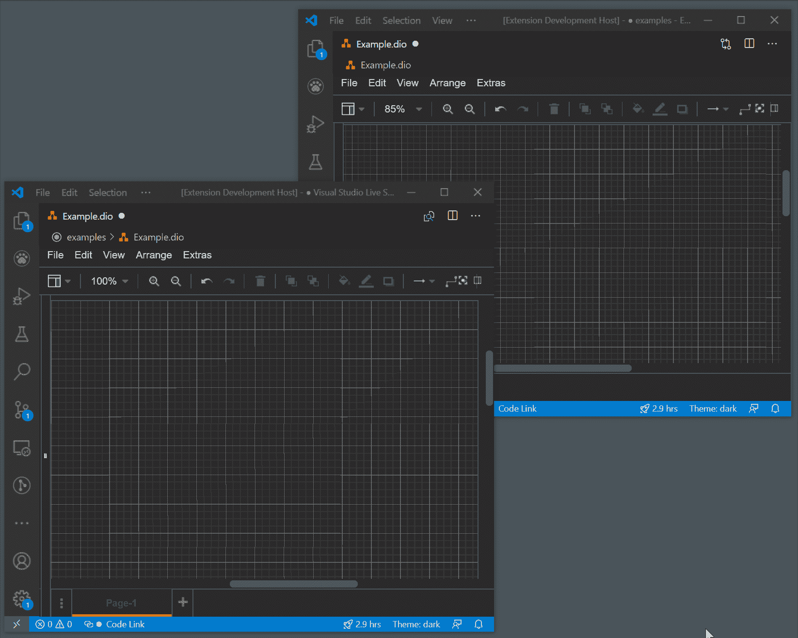
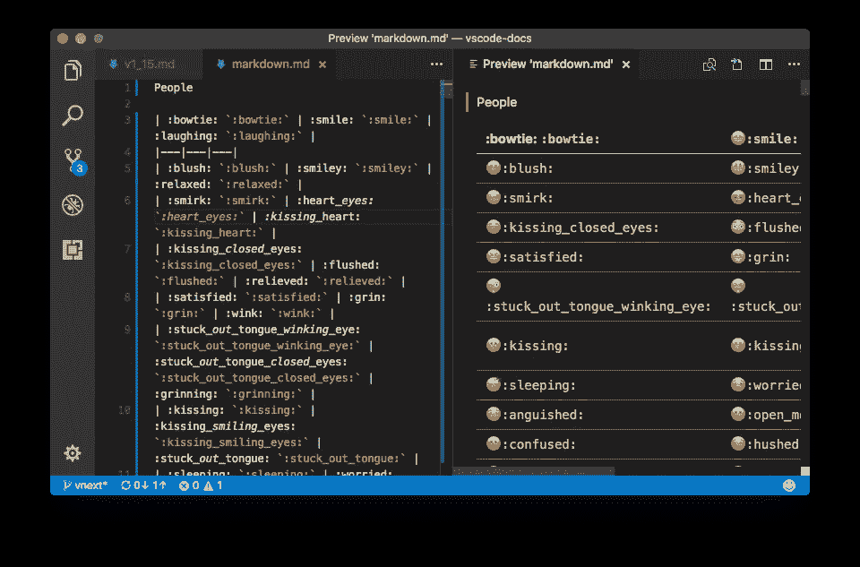
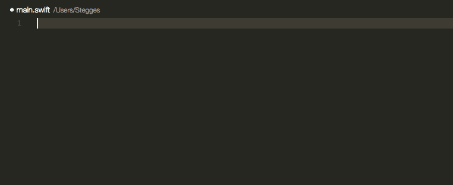

# 使用 Markdown 时提高生产力的五大 VSCode 扩展

> 原文：<https://betterprogramming.pub/top-5-vscode-extensions-to-boost-productivity-when-using-markdown-b4d1bbeb7175>

## 让您的降价编辑更快

unsplash.com 的[帕特里克·福尔](https://unsplash.com/@patrickian4)

我从 Emacs 转到 VSCode 已经快一年了，我对自己的工作效率很满意。

大部分时间，我都在编辑 Markdown。

让我来分享这五个扩展，它们有助于提高你的降价效率。

# 1.一次降价

[Markdown All in One](https://github.com/yzhang-gh/vscode-markdown) 是编辑 Markdown 的必备。它包含 Markdown 预览、键盘快捷键、自动预览等等。

快捷键将使编辑减价变得更加容易:

完成还包含路径查找:

我们可以用命令:`Markdown: Print current document to HTML`将 Markdown 打印成 HTML。

此外，它还带有漂亮的数学支持:

# 2.词典补全

词典补全是另一个帮助你更快输入英语单词的扩展。因为我的母语不是英语，这有助于我正确地写单词:

默认情况下，Markdown 不支持快速建议；我们需要添加以下代码片段，以便在键入减价文件时显示提示:

> `"[markdown]": {
> "editor.quickSuggestions": true
> }`

# 3.粘贴图像

我喜欢在我的减价文件中插入更多的截图。[粘贴图像](https://marketplace.visualstudio.com/items?itemName=mushan.vscode-paste-image)帮助我保存 xclip 中的图像。这个扩展支持 Mac/Windows/Linux。

# 4.PlantUML

如果你需要画图表，PlantUML 是一个很棒的扩展。
在 PlantUML 中，图表是用简单直观的语言[定义的](https://plantuml.com/)。当您编辑图的源文件时，您还可以预览结果:

PlantUML 支持开发人员使用的各种图，如序列图、对象和类图等。

如果你已经熟悉 Draw.io，你会喜欢另一个扩展: [Draw.io 集成](https://marketplace.visualstudio.com/items?itemName=hediet.vscode-drawio)。

# 5.减价表情符号

我们需要更多的微笑！

[Markdown 表情符号](https://marketplace.visualstudio.com/items?itemName=bierner.markdown-emoji)做一件简单的事情:给你的文档添加一些表情符号。

但是我在这个扩展中发现了一个缺陷。我的 Hexo 渲染结果无法在 HTML 中正确显示表情符号。有一个类似的扩展[表情符号](https://marketplace.visualstudio.com/items?itemName=Perkovec.emoji)解决了这个问题。你甚至可以在代码中添加表情符号:

仅此而已。快乐的编辑降价！

*原载于 2021 年 5 月 29 日 https://coderscat.com**的* [*。*](https://coderscat.com/awesome-vscode-extensions-for-markdown/)