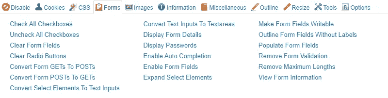

# 面向开发者的 6 大 Google Chrome 扩展

> 原文：<https://betterprogramming.pub/top-6-google-chrome-extensions-for-developers-968e22c343dd>

## 这些扩展将帮助您更有效地开发和更快地提高您的技能水平！

Emile Perron 在 [Unsplash](https://unsplash.com?utm_source=medium&utm_medium=referral) 上的照片

# 1.Web 开发人员

作者截图

Web Developer 是一个全能的扩展，有很多特性。它可以改变样式，查找 CSS，禁用 JavaScript 执行，启用(和修改)隐藏的表单字段等等。

 [## Web 开发人员

### 添加带有各种 web 开发人员工具的工具栏按钮。

chrome.google.com](https://chrome.google.com/webstore/detail/web-developer/bfbameneiokkgbdmiekhjnmfkcnldhhm) 

作者截图

# 2.坦帕蒙基

作者截图

Tampermonkey 是一个浏览器扩展，允许你定制网页的外观和功能。您可以使用 Tampermonkey 为网站添加特性和功能，或者更改网站的外观和感觉。Tampermonkey 有很多公共脚本可用(比如 GitHub 的新功能，游戏机器人等。)，也可以自己创作。

 [## 坦帕蒙基

### 世界上最受欢迎的用户脚本管理器

chrome.google.com](https://chrome.google.com/webstore/detail/tampermonkey/dhdgffkkebhmkfjojejmpbldmpobfkfo) 

# 3.精制 GitHub

作者截图

如果你在 GitHub 上做很多事情，那么精致的 GitHub 是必备的。它总共有 200 多种功能，你可以根据个人喜好打开或关闭。这些功能包括在代码中链接问题/PR 参考和 URL，使空白字符可见，将标签大小减少到四个空格，一键合并冲突修复程序，反应化身，构建/CI 状态图标，查看降价文件源的按钮，等等。

 [## 精制 GitHub

### 简化 GitHub 界面并增加有用的功能

chrome.google.com](https://chrome.google.com/webstore/detail/refined-github/hlepfoohegkhhmjieoechaddaejaokhf) 

# 4.瓦帕里斯

作者截图

Wappalyzer 是一个分析网页的工具，它可以告诉你网页使用了哪些技术。如果你喜欢某个网站的某个功能，并想知道他们是如何做到的，这将非常有用。

 [## 技术剖析器

### 识别网络技术

chrome.google.com](https://chrome.google.com/webstore/detail/wappalyzer-technology-pro/gppongmhjkpfnbhagpmjfkannfbllamg) 

作者截图

# 5.肖丹

作者截图

Shodan.io 是“物联网”(IoT)的搜索引擎。他们的 Chrome 扩展显示了服务器托管的位置及其开放的端口。

 [## 肖丹

### Shodan 插件告诉你网站托管在哪里(国家，城市)，谁拥有 IP 和其他什么服务/端口…

chrome.google.com](https://chrome.google.com/webstore/detail/shodan/jjalcfnidlmpjhdfepjhjbhnhkbgleap) 

# 6.GitHub 的通知程序

这个扩展显示了一个带有你的 GitHub 通知号码的小图标。当您处理大量开源项目和/或在 GitHub 上拥有自己的存储库时，这非常有用。

 [## GitHub 的通知程序

### 显示您的 GitHub 通知未读计数

chrome.google.com](https://chrome.google.com/webstore/detail/notifier-for-github/lmjdlojahmbbcodnpecnjnmlddbkjhnn) 

作者截图

感谢阅读！

如果你有一个扩展应该在这个列表中，请随意在评论中输入它的名字:)。