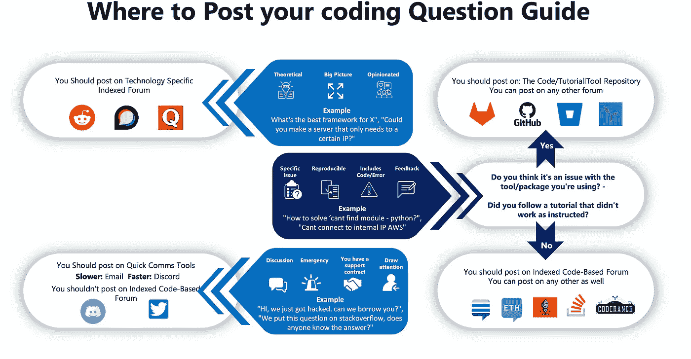
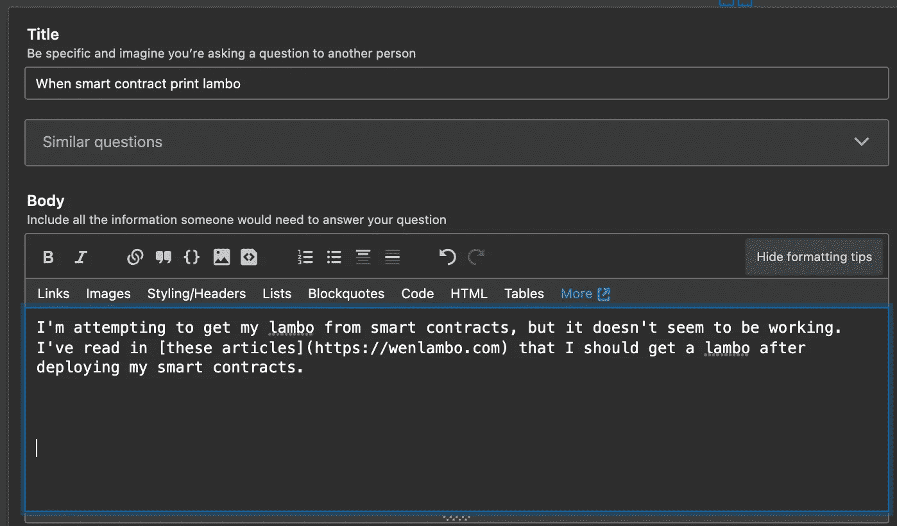
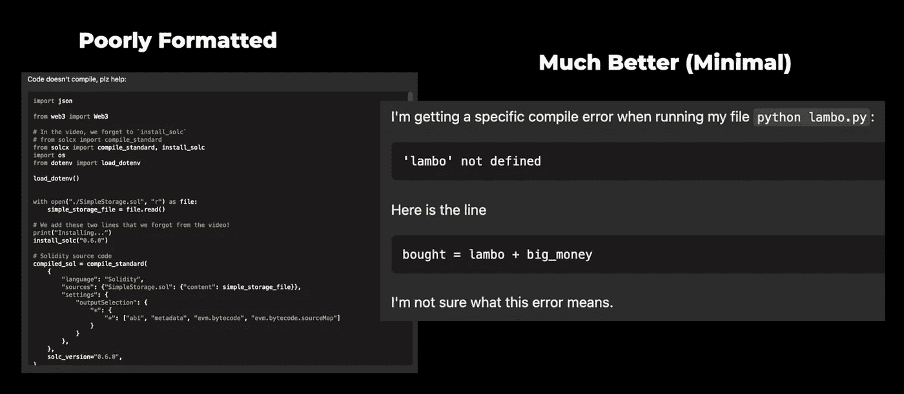
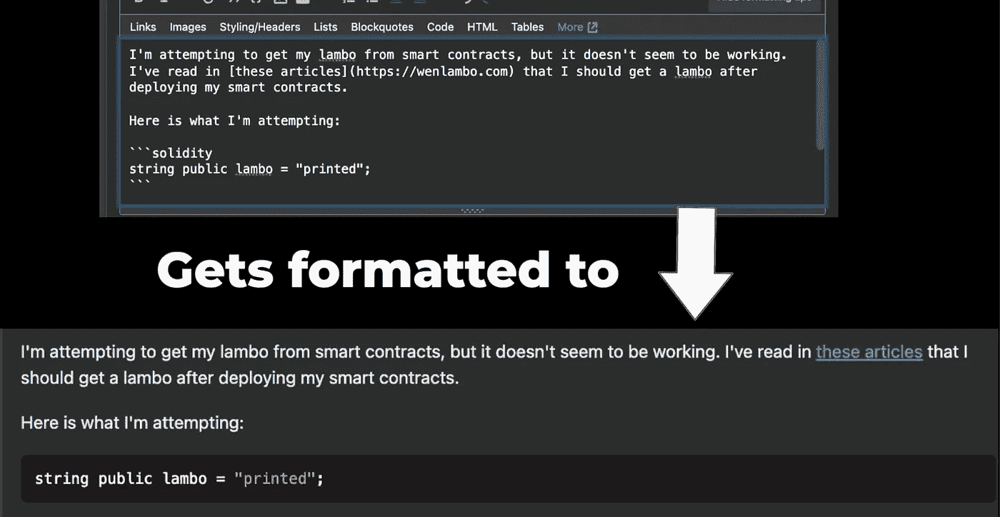
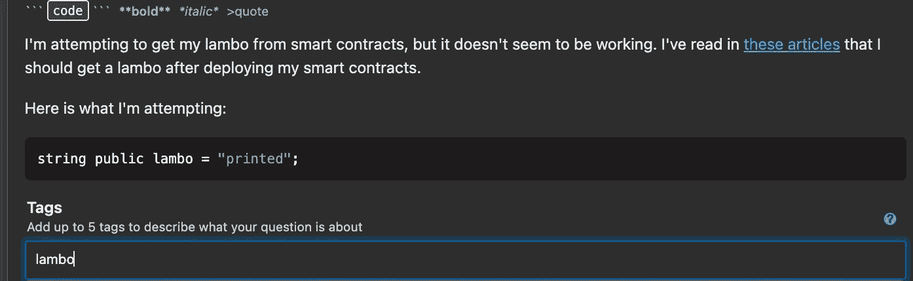

# 解决任何软件工程错误的 6 大技巧

> 原文：<https://betterprogramming.pub/top-6-tips-to-solve-any-software-engineering-error-a794a162fcaf>

## 我们将互联网视为您的文档，作为一名开发人员，您如何使用社区工具来消除您遇到的任何编码错误。

原始图片来自 dkidpix 来自 Getty Images

每个开发人员以前都遇到过这样的问题:

随机误差

有些事情中断了，或者也许你不知道如何做一些事情，但是你不必让这些打嗝阻止你完成你的项目。

人们应该采取一系列步骤来最大化他们解决任何编码问题的机会，但是你会惊讶于目前很少有开发人员有效地使用这种超能力。让我们现在就学习它们，这样下次发生这种情况时，你就可以避免额头因敲击键盘而流血。

第一个我们会花最少的时间，因为它只是。

你也可以在这里查看我们的视频。

# 1.修补和试验

当你遇到问题时，不断尝试你*认为*可能有效的不同方法，直到你用尽所有的想法。也许可以尝试在整个文件中使用 print 语句，学习一些调试技巧，但是不要太自大，以为只做这一步。我相信你可以“自己解决”，但我们是工程师，作为优秀的工程师，我们会找到更简单的方法来做事。

理想情况下，你试图准确地指出是什么导致了你的错误。一旦你进行到第 3 步，你也需要这个。如果你只是漫无目的地尝试，你不会走远。试着找出问题所在。

# 2.查看文档

并不是所有的问题都有“好”的文档，但是花些时间浏览文档可能是找到答案的快捷方式。你需要学习如何用`CMD + F`或`CTRL + F`搜索网页，这样你就可以在网页中寻找特定的关键词。或者希望他们有一个好用的搜索栏。

*   他们有搜索栏吗？
*   -Command + f || Ctrl + f 是你的朋友
*   寻找他们使用你想要的东西的例子

有时文档可能非常密集，如果您不是特定技术领域的专家，就很难阅读，所以您可能会进入下一步。

# 3.进行网络搜索

归根结底，优秀的软件工程师实际上只是专业的谷歌员工，这是他们最强大的工具之一，能够在网上搜索到已经遇到你的问题并解决了它的人。

大多数搜索引擎，比如谷歌，都有工具可以让你更具体地了解你在找什么:

*   使用引号之类的工具来查找与文本完全匹配的内容。例子:`"error: segfault"`
*   寻找近似匹配的星号。示例:`"error: package * not installed"`
*   或冒号来查找特定站点的结果，如[堆栈溢出](https://stackoverflow.com/)。示例:`error: undefined site:stackoverflow.com`

通常，对于特定的错误，最好的办法是复制准确的错误代码，并将其粘贴到带有引号的搜索栏中。或者在你可能过于具体的错误中使用星号。

你将得到的大多数结果将来自论坛或问答网站，这将引导我们进入下一步。

# 4.在论坛和问答网站上提问

## 停止

在阅读这一部分之前，您必须庄严宣誓，如果您在论坛上提出任何问题，您至少会不时尝试就您擅长的编码主题进行反馈和回答。

你还发誓在进行到这一步之前，你已经在第三步中花了“充足”的时间。

明白了吗？

很好。

## 让我们继续

不过，在问你问题之前，我们应该先了解一下*哪里是问*的最佳地点。

在这里，我将论坛/问答网站分为四种不同类型:

*   基于代码的索引论坛
*   索引存储库
*   特定于技术的索引论坛
*   无索引讨论平台

或者，用具体的例子

*   [堆栈溢出](https://stackoverflow.com/)
*   Github[问题](https://github.com/)
*   r/ethdev (Reddit)
*   [链环不协调](https://discord.com/invite/aSK4zew)

这些类别中的关键词是“索引”关键词。我们想在网络爬虫经过的论坛上提问，并粘在他们的数据库(索引)中。这样，三周后当我们回顾我们写的代码时，我们可以谷歌一下当我们忘记时发生了什么。这有助于其他遇到同样问题的开发人员，反过来，如果你让他们变得更聪明，他们可能会变得更聪明，并在以后帮助你。

出于这个原因，理想情况下，你的大多数问题应该在索引论坛上提出。你在和朋友聊天时问的任何问题都不会被其他人知道，也许你和你的朋友会从社区中其他人的意见中受益。然而，有些问题更适合 DMs、twitter 或 discord，它们没有被编入索引。我们制作了一个小图表来帮助您确定在哪里张贴您的问题。

在哪里张贴你的编码问题指南

不过，在你发帖到任何论坛之前，一定要找到他们的规则，因为他们可能会声明某些类型的问题是明确禁止的，你不想浪费你或他们的时间来问不允许的问题。

理论性的、宏观的或者有观点的问题可以上 Quora 这样的普通 Q & A 论坛，或者具体的技术论坛，比如具体的 subreddits 或者话语论坛。通常，这些子主题和讨论论坛充满了对主题非常了解并乐于帮助他人成长的人的社区。

**特定的编码问题**也可以在这些技术论坛上讨论，但通常会更多地关注特定的代码论坛，如堆栈溢出或堆栈交换社区。然而，这些论坛通常对问题的种类更严格，所以在提问之前一定要阅读指南。严格程度保持了问答的高质量。

不能保证一个论坛会比另一个论坛做得更好，所以在不同的论坛上用不同的技术试水是有好处的。

通常，询问特定堆栈交换、堆栈溢出和特定论坛的区别是模糊的。

不是我的笑话

**如果你在使用你非常擅长的软件工具**时遇到了一个错误，并且你认为*不应该*出错，那么这就是你向他们的开源代码库提出问题的机会。如果他们没有开源代码库，你就把闭源垃圾扔进 gar——开玩笑，闭源技术在我们的生活中也有它的位置，但是你必须在他们的反馈工具上给出你的反馈。

此外，如果你正在跟随一个教程，并且他们有一个与之相关的 git repo(就像我所有的视频和博客一样),那将是留下你的问题的最好地方。因此，尽管我讨厌这么说，但经常在 YouTube / Medium 评论中问我问题并不是你获得答案的最佳选择:然而，评论、喜欢、订阅和分享 100%帮助我和这个领域的其他开发人员了解所有这些…反过来，他们可能会加入社区并回答你的问题！

与其把问题编码成评论，不如留下一条评论，说说你喜欢这个博客的哪些具体方面？你不喜欢哪些具体的事情？或者现在花点时间来评论一些奥运举重表情符号。谢谢大家！它帮助了我。

此外，对于 GitHub 问题，您可以经常跟踪进度，甚至自己解决问题！

这些快速聊天点有利于与真正活跃的团体和社区快速交谈，或者可能是一家公司付钱给某人来回答问题，然而在开源世界中，情况往往不是这样。对于你和其他社区成员来说，这是一个很棒的地方，他们可以进行理论研究，讨论新事物、想法、事件和其他不需要被网络爬虫索引的事情。它们也是与人们见面和交流的好地方，当你们相互了解时，你们可以直接交流想法，这就引出了我们关于加入社区的最后一节。

但在此之前，我们先来学习如何问一个格式良好的问题！

# 如何问一个格式良好的问题，以便得到回答

当你在其中一个论坛上提问时，你提问的格式越好，你得到回答的机会就越大，你对社区的帮助就越大。现在已经没有不好的问题了，但是有一些格式很差的问题，所以让我们教你总是尽可能好地问问题。

我们将使用一个堆栈溢出问题作为模板，因为它无疑是最受欢迎的基于代码的索引论坛。

## 1.搜索

在你提问之前，请确保你已经完成了母视频中的所有步骤，并确保这个问题还没有在这个论坛上被问过！这也会给你一些线索和资源，可能会帮助那些回答你的人…

## 2.做一个总结问题细节的标题。

重要问题

## 3.在你写任何代码之前引入这个问题。

不错的介绍

## 4.添加极简的可复制代码。

非最小与最小的示例

极简代码意味着它不仅仅是你整个文件的复制粘贴。如果你在某一行有问题，也许就贴上那一行。可重复意味着其他人应该能够遇到你遇到的确切错误。或者至少发布它的步骤。这并不意味着你应该写“我正跟着 Patrick 的视频走，在第 5 个小时我碰到了这个，只要看他的视频，你就能到达这里”。尽管这很讨人喜欢，但让每个人都去看我的视频是不合理的。

> “但是他们应该”——帕特里克

所以你要给出技术步骤来达到你已经达到的错误。

## 5.学习 markdown 来格式化你的代码。

尤其是 3 个反勾号和一个语言标签。

学习[降价](https://www.markdownguide.org/)

## 6.添加标签。

向我的问题添加标签

通常，关心某些技术的人和监视在这些特定标签上提问的人。

## 7.发帖前请务必阅读论坛指南。

不同的论坛有不同的规则，允许什么和不允许什么，所以熟悉会增加你得到答案的机会。

好了，现在，回到我们的主博客。如果你从这个博客中拿走任何东西，请用反勾号。

现在，特别注意一下[堆栈溢出](https://stackoverflow.com/)。堆栈溢出可能有点…咄咄逼人，这就是为什么有时在社区论坛上发帖，如[堆栈交换以太坊](https://ethereum.stackexchange.com/)可能对你的可靠性问题更好。如果你的问题遭到了大量的反对，不要让它困扰你，只是把它作为一个学习的机会来了解 Stack Overflow 喜欢什么样的问题，或者也许把它发布到另一个论坛。

我有一个[视频，在描述中解释了](https://www.youtube.com/watch?v=9-lufAA1a6Y)我对栈溢出的更多想法。

不管怎样，我们解除对你提问的最后一步是:

# **5。加入&加强你的工具社区**

开始时，很难“回馈”，但随着你对技术的掌握越来越好，你会想尝试回答一些新出现的问题。

这将:

1.  给你一个机会去了解更多你喜欢的工具
2.  加强你最喜欢的工具的社区。如果你帮助回答某个工具上的问题，这将鼓励其他人相信这个工具有一个强大的追随者，并可能在将来的某个时候再次帮助你。
3.  让你对帮助别人感觉良好——:)我把这称为你开源职责的一部分。

此外，在 Reddit 等许多论坛上，mods 通常会查看您发布问题的频率以及您帮助他人的频率，并可能会因您滥用论坛而开始阻止您的帖子。如果你参与进来，而不仅仅是索取，你和社区将会更加成功。

对于 reddit 来说，一个很好的经验法则是每一个帖子/问题评论 10 次。

此外，我无法告诉你我通过与社区中与我使用相同工具的其他成员合作，遇到了多少人。我经常与我遇到的同事进行一些头脑风暴，我们能够从彼此身上学到更多。在这个空间里有一些都有开源思维的伙伴是一笔惊人的财富。

[我的推特资料](https://twitter.com/PatrickAlphaC)

# 6.重复这些步骤

现在，这里的问题是，有时，你会经历所有这些步骤，你会到达#4，但仍然没有找到答案。一些问题:

1.  可能还没有被发现
2.  只有极少数人知道
3.  没有足够的人理解这些问题的重要性
4.  可能不明白你的问题。

这就是为什么回过头来重复这些步骤如此重要。也许你已经达到了第四步，但是你已经在这个过程中学到了很多，所以你要重新开始，学一些能给你答案的东西！或者你学到了新的东西，修补，问一个关于你从修补中学到了什么的问题并得到答案。或者也许你们只是在堆栈溢出帖子的评论中来来回回，最终你们两个解决了这个问题。

这种疏通自己的超能力与其说是科学，不如说是艺术。但是现在你已经有了基本的构建模块，我鼓励每个人都去尝试一下，并告诉我进展如何。

下次再见。