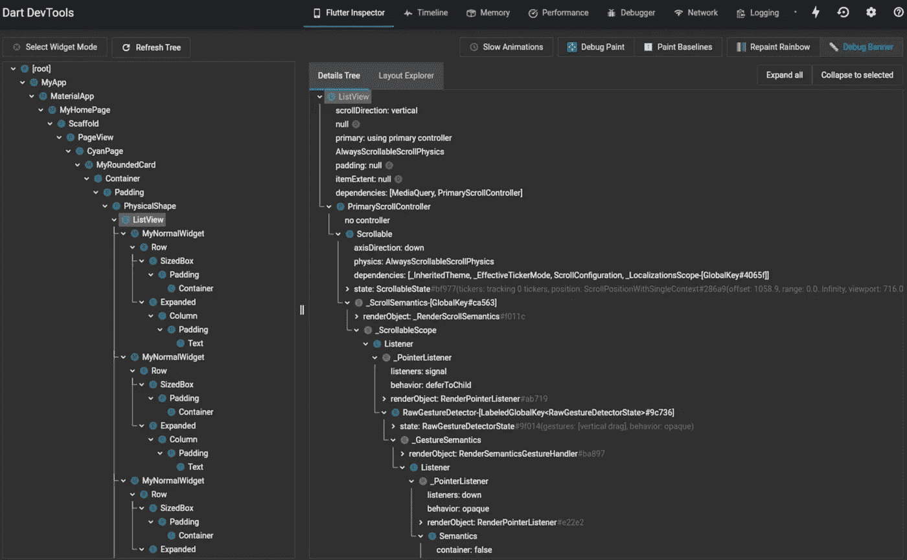

# 更干净的 Flutter 应用程序的 7 大镖技巧和窍门

> 原文：<https://betterprogramming.pub/top-7-dart-tips-and-tricks-for-cleaner-flutter-apps-562664a15826>

## 利用 inspect 小部件、同步和异步生成器


照片由[Lucie hoová](https://unsplash.com/@marjorylucabaxter?utm_source=unsplash&utm_medium=referral&utm_content=creditCopyText)在 [Unsplash](https://unsplash.com/s/photos/dart?utm_source=unsplash&utm_medium=referral&utm_content=creditCopyText) 上拍摄

[Dart](https://www.educative.io/blog/dart-2-language-features) 是一种客户端优化编程语言，用于快速构建移动、桌面和服务器应用。Dart 由 Google 开发，用于他们的跨平台 Flutter 框架。使用 Flutter 和 Dart，您可以构建具有流畅 UI 和原生感觉的应用程序。

今天，我们提供我们的七大镖提示，将帮助您改善您的应用程序开发。您可以使用这些技巧来编写简洁的代码，并充分利用 Dart 提供的许多特性。

**提示和技巧一览:**

1.  使用匿名函数作为参数
2.  使用`call`方法使类像函数一样可调用
3.  使用`.entries`遍历地图
4.  如何使用 getters 和 setters
5.  使用`Set`收集独特的物品
6.  使用 inspect 小部件
7.  使用同步和异步生成器

# 1.使用匿名函数作为参数

在 Dart 语言中，函数可以作为参数传递给其他函数。Dart 提供了不需要名字的匿名函数，可以直接使用。

下面是 Dart 中匿名函数的一个例子。这里，我们将一个匿名立方体函数传递给一个内置方法`forEach`。我们试图获得列表中每一项的立方体。

```
main() {
  var list = [1,2,3];
  list.forEach((item) {
   print(item*item*item);
  });
}
```

`sayHello`被传递给`intro`函数，该函数接受函数参数。在第 6 行，`String Function(String)`是一个函数类型，它从给定的字符串参数中返回一个字符串。我们使用的匿名函数具有相同的签名，因此它作为参数传递。

# 2.使用 call 方法使类像函数一样可调用

使用 Dart，您可以创建一个可调用的类，该类允许该类实例作为一个函数被调用。我们用`call()`方法来做这件事。请参见下面的语法。

```
class class_name {
  ... // class 

  return_type call ( parameters ) {
    ... // call the function content
  }

}
```

让我们通过一个例子来看看这一点。

**注意:** Dart 不支持多个可调用方法。

# 3.使用条目遍历地图

在 Dart 中，您可以使用`entries`以空安全的方式遍历地图。假设我们有一张地图，可以追踪不同产品的消费金额。通常，我们会用`!`操作符遍历这个地图。

```
for (var key in moneySpent.keys) {
  final value = moneySpent[key]!;
  print('$key: $value');
}
```

我们可以使用一个循环来改进这段代码，使它更加空安全。当我们用`entries`变量迭代时，我们可以以空安全的方式访问我们的键值对。

```
for (var entry in moneySpent.entries) {
  // do something with keys and values
  print('${entry.key}: ${entry.value}');
}
```

# 4.如何使用 Getters 和 Setters

Getters 和 setters 是提供对对象属性的读写访问的特殊方法。Getters 和 setters 的调用类似于实例变量:一个点操作符(`.`)后面简单地跟着函数名。

Getters 是用于检索对象属性值的函数。我们使用`get`关键字。

在下面的例子中，我们在第 13 行创建了一个 getter 函数，它将返回当前实例的名称值。在第 21 行，我们调用 getter 函数，输出应该显示`Sarah`。

Setters 是用来写对象属性值的函数。我们使用`set`关键字。

从第 9 行到第 15 行，我们创建了一个 setter 函数来设置`age`的值。我们也给它一个条件，使我们不能输入一个负的年龄。在第 23 行，我们使用`personAge` setter 函数为`firstPerson`设置年龄值。

# 5.使用集合来收集独特的项目

列表是 Dart 中最常见的集合类型之一，但是列表可以包含重复的项目。有时，我们只想要唯一值的集合。这就是`Set`有用的地方。

```
final countriesSet = {'USA','India','Iceland','USA',};
```

在一个`Set`中，两个元素不能相等，所以上面的代码会给出一个警告，并且不会被编译。如果我们使用`const set`，情况也是如此。

# 6.使用 Inspect 小部件

在 web 开发中，通常使用 Inspect 元素，它会告诉您应用于 HTML 标记的所有属性。Dart 提供了一个类似的功能，称为 Inspect 小部件，可以使使用 Flutter 开发应用程序更加容易。Flutter Widget 检查器可用于定位屏幕上的任何 Widget，并查看应用于它的属性。

检查器还可以帮助您可视化颤动的部件树，以了解布局或识别布局问题。

要使用它，请按照下列步骤操作:

*   点击“颤动检查器”
*   点击“启用选择部件模式”
*   选择屏幕上的一个小部件以获取更多信息



# 7.使用同步和异步生成器

在 Dart 中，生成器使得生成一系列值成为可能。有两种发生器功能:

*   **同步生成器:**返回一个可迭代对象
*   **异步生成器:**返回一个流对象

换句话说，同步生成器返回一组可以顺序访问的值。我们通过将函数体标记为`sync*`来做到这一点。然后，我们对这些值使用 yield 语句。

```
Iterable<int> count(int n) sync* {
  for (var i = 1; i <= n; i++) {
    yield i;
  }
}
```

另一方面，异步生成器返回一个流对象。流使得接收一系列事件成为可能。我们通过将函数体标记为`async*`来做到这一点。然后，我们对这些值使用 yield 语句。

```
Stream<int> countStream(int n) async* {
  for (var i = 1; i <= n; i++) {
    yield i;
  }
}
```

# 你学习的下一步

我们希望这些提示能够帮助您充分利用 Dart 及其提供的所有功能。Flutter 和 Dart 是构建感觉自然流畅的应用程序的强大组合。接下来要研究的其他高级 Dart 工具有:

*   嵌套的`if`语句的扩展运算符
*   命名构造函数和初始化列表
*   Dart 库
*   枚举类型

快乐学习！