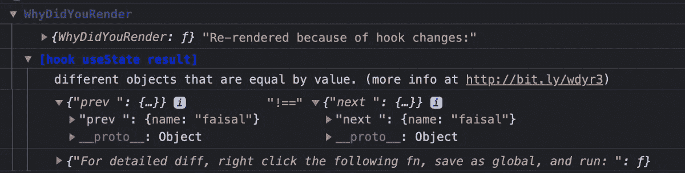

# 快速反应应用的 7 大库

> 原文：<https://betterprogramming.pub/top-7-libraries-for-blazingly-fast-reactjs-applications-c0069e87c8b7>

## 摇滚明星开发人员的必备工具

照片由 [Pexels](https://www.pexels.com/photo/people-woman-street-lamp-6651330/?utm_content=attributionCopyText&utm_medium=referral&utm_source=pexels) 的 [Eduardo Torre](https://www.pexels.com/@eduardo-torre-22992527?utm_content=attributionCopyText&utm_medium=referral&utm_source=pexels) 拍摄

[ReactJS](https://reactjs.org/) 默认情况下性能很好。但是偶尔你会有机会让它变得更好。令人敬畏的 React 社区提供了一些很棒的库。

今天我们将讨论七个这样的库，它们可以提高代码的质量，同时提高性能。

我们开始吧。

# 1.反应查询

[React 查询](https://react-query.tanstack.com/)是 React 缺少的状态管理库。在它的[文档](https://react-query.tanstack.com/)中，它说，“在你的 React 应用程序中获取、缓存和更新数据都不涉及任何‘全局状态’。”

是的。这正是它所做的。它有助于我们轻松管理服务器状态。它可以减少使用像 Redux 这样的状态管理库的必要性。

## 优势

*   自动缓存
*   在后台自动更新数据
*   大量减少代码

## 在反应查询之前

这是一个使用我们自己的定制钩子获取数据的钩子的例子。它甚至不支持缓存。

useFetch.js

## 反应后查询

如果我们想使用 React Query，下面是代码。看它有多小。

useReactQuery.js

看看它减少了多少代码。

# 2.反应挂钩形式

React Hook Form 是一个现代的表单处理库，可以将表单的性能提升到一个全新的水平。

## 优势

*   减少代码
*   减少不必要的重新渲染
*   与现代用户界面库轻松集成

下面的例子演示了 React 钩子如何提高代码质量。

## 没有反作用钩形

下面是一个手动构建登录表单的示例。

## 带有反应形式

下面是 React 钩子形式的同一个例子。

它非常干净，同时又很有表现力。试试看。

# 3.反应窗口

[React 窗口](https://github.com/bvaughn/react-window)用于渲染长列表。假设您有一个包含 1000 个项目的列表。一次只能看到 10 个，但是您的代码试图同时呈现所有 1，000 个项目。

这可能会在你的申请中引起严重的混乱。这是一个非常受欢迎的库，也是你的武器库中的必备工具。

## 手动渲染 1，000 个项目

但是这段代码一次呈现 1000 个项目，尽管您在屏幕上最多只能看到 10-20 个项目。

## 使用反应窗口

现在让我们使用反应窗口。

LongList.js

这段代码只呈现您在屏幕上看到的内容。一开始这可能有点吓人，但是如果你有一个很长的列表要呈现，这是必要的。

# 4.反应迟钝

惰性加载是一种只加载你需要的东西的技术。因此，它通过不过度使用计算能力来提高性能。

[React LazyLoad](https://www.npmjs.com/package/react-lazyload) 是一个专门为此目的而构建的库。您只需包装您的组件，这个库会处理剩下的事情。

## 优势

*   改进的性能
*   支持服务器端呈现

## 没有 LazyLoad

这是一个我们手动加载五张图片的例子。

## 用 LazyLoad

下面是 LazyLoad 组件的相同示例。

# 5.你为什么渲染

不必要的渲染会损害 React 应用程序的性能。但有时我们甚至不知道。

这个很棒的软件包，[你为什么渲染](https://www.npmjs.com/package/@welldone-software/why-did-you-render)，帮助我们发现性能问题并解决它们。你只需在任何组件中打开它，它就会准确地告诉你为什么要渲染。

以下是有渲染问题的组件。

一旦打开，这个库将控制台记录以下输出。

渲染原因

从这个日志中，我们可以看到我们正在用相同的值更新对象，这对性能是不利的。

# 6.重新选

如果你用的是 [Redux](https://redux.js.org/) ，那么这就是救命稻草。我们知道 Redux reducers 可以存储大量数据，如果您将完整的存储提供给任何组件，将导致它在该存储中的任何内容更新时重新呈现。

[Reselect](https://github.com/reduxjs/reselect) 通过记忆值并只传递必要的内容来解决这个问题。

## 优点(来自[文档](https://github.com/reduxjs/reselect)

*   选择器可以计算派生的数据，允许 Redux 存储最小可能的状态。
*   选择器是高效的。除非选择器的一个参数发生更改，否则不会重新计算选择器。
*   选择器是可组合的。它们可以用作其他选择器的输入。

## 例子

下面是一个从存储内部获取值并在选择器中修改它们的示例。

# 7.深度相等

[深等](https://www.npmjs.com/package/deep-equal)是一个著名的库，可以用来比较。这很方便。毕竟，在 JavaScript 中，虽然两个对象可以有相同的值，但它们被认为是不同的，因为它们指向不同的内存位置。

这就是为什么我们会看到下面这种结果。

NormalEqual.js

但是如果你需要检查相等性(为了记忆)，这就变成了一个昂贵(并且复杂)的操作。

如果我们使用[深度等于](https://www.npmjs.com/package/deep-equal)，那么它将性能提高 **46 倍。下面是我们如何使用它的一个例子。**

DeepEqual.js

给你。这些是一些最重要的库，可以用来最大化 React 应用程序的性能。

如果你有其他的想法，请留下评论。祝您愉快！

**有什么话要说？通过** [**LinkedIn**](https://www.linkedin.com/in/56faisal/) 联系我

 [## 清洁 React 项目的 21 个最佳实践

### 提高代码质量的实用建议

better 编程. pub](/21-best-practices-for-a-clean-react-project-df788a682fb) 

# 资源

1.  [React 查询网站](https://react-query.tanstack.com/)
2.  [React Hook 表单网站](https://react-hook-form.com/)
3.  [React 窗口示例](https://react-window.vercel.app/#/examples/list/fixed-size)
4.  [你为什么渲染包](https://www.npmjs.com/package/@welldone-software/why-did-you-render)
5.  [反应迟缓的加载包](https://www.npmjs.com/package/react-lazyload)
6.  [重新选择仓库](https://github.com/reduxjs/reselect)
7.  [深等包](https://www.npmjs.com/package/deep-equal)