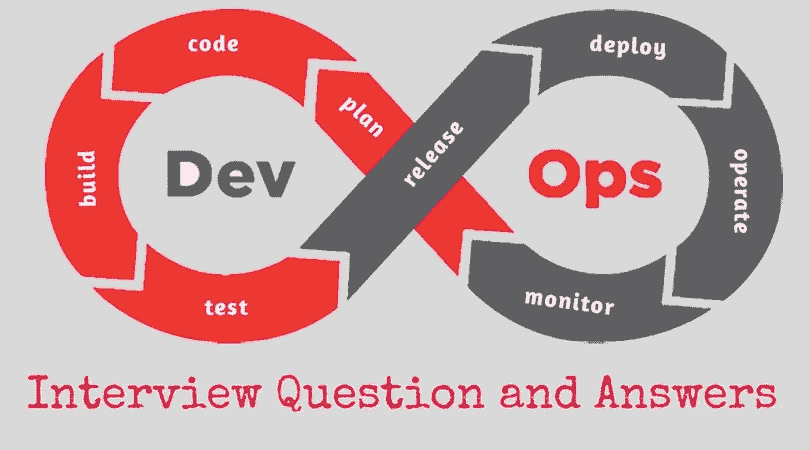
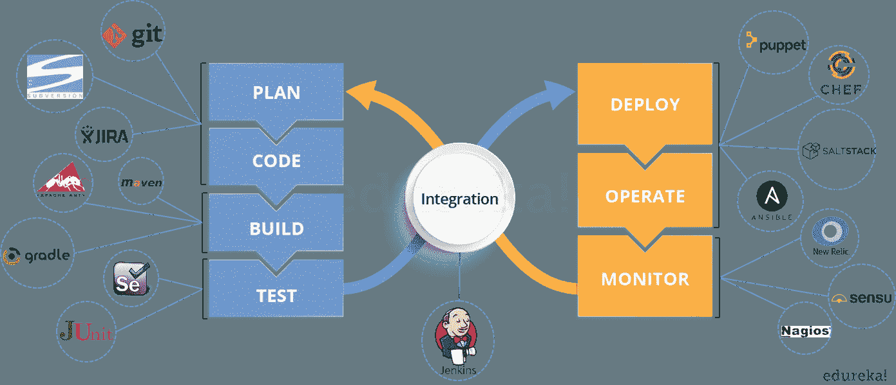

# 8 大 DevOps 面试问题(和答案)

> 原文：<https://betterprogramming.pub/top-8-devops-interview-questions-and-answers-9120f554d1b9>

## 用这些为你的下一次面试做准备

来源:[https://onlineitguru . com/interview questions/devo PS-interview-questions](https://onlineitguru.com/interviewquestions/devops-interview-questions)

21 世纪 20 年代将是 DevOps 工程师的十年。这一职称已经成为行业标准，企业也在不断寻求改进他们的应用交付渠道。

面试将询问的一些高级开发运维主题如下:

*   一般问题—定义术语等。
*   版本控制
*   连续累计
*   连续测试
*   结构管理
*   连续监视
*   集装箱化和虚拟化

下面是八个 DevOps 面试问题(和答案),让你为面试做好准备。

# **问题 1**

您如何将*配置定义为代码*，它提供了哪些安全优势？解释再水合的重要性，因为它与作为代码的配置相关。

## **回答**

a.作为代码的配置可以描述为管理源存储库中的配置资源。应用程序配置资源被视为版本化的工件。

通过管理应用程序环境和应用程序代码，您可以获得与代码相同的好处。

b.再水合提供了以自动化方式从代码中完全重新创建云环境及其资源的能力。

通过利用再水化的概念，可以将此类环境中的数据恢复到新的更新实例，该实例将具有最新的基础架构补丁、配置设置和其他相关的安全策略设置。

# **问题 2**

解释云计算安全架构模型在基础设施即服务(IaaS)、平台即服务(PaaS)、平台即服务和软件即服务(SaaS)之间的差异。

## **回答**

IaaS:主要关注按需提供数据中心基础架构。基于云的服务，即付即用的服务，如存储、网络和虚拟化。它非常依赖应用编程接口(API)来允许企业管理云并与云交互。

PaaS:允许部署应用程序，而没有购买和管理底层硬件和软件以及提供托管功能的成本和复杂性。

PaaS 供应商通过互联网提供硬件和软件工具，人们使用这些工具来开发应用程序。PaaS 用户往往是开发者。

SaaS:这些平台通过互联网向用户提供软件，通常收取月费。用户通常可以随时从任何设备访问该软件(只要有互联网连接)。

# **问题 3**

DevOps 的需求是什么？

## **回答**

依我看，这个回答应该从解释市场大趋势开始。

公司不是发布大的功能集，而是试图看看小的功能是否可以通过一系列的发布系列传递给他们的客户。

这有许多优点，如客户的快速反馈，更好的软件质量等。，进而带来高客户满意度。

为此，公司必须:

1.  增加部署频率。
2.  降低新版本的失败率。
3.  缩短修复之间的交付周期。
4.  在新版本崩溃的情况下，更快的平均恢复时间。

DevOps 满足所有这些需求，并帮助实现无缝软件交付。

你可以举出 Etsy、Google 和 Amazon 等公司的例子，它们采用 [DevOps 来实现甚至在五年前都无法想象的性能水平](https://www.edureka.co/blog/why-devops-improves-organization-performance/)。

他们每天进行数十、数百甚至数千次代码部署，同时提供世界一流的稳定性、可靠性和安全性。

# **问题 4**

哪些是顶尖的 DevOps 工具？你用过哪些工具？

## **回答**

下面提到了最流行的 DevOps 工具:

*   [Git](https://git-scm.com/) :版本控制系统工具
*   [詹金斯](https://jenkins.io/):持续集成工具
*   [硒](https://www.selenium.dev/):连续测试工具
*   [傀儡](https://puppet.com/)、[主厨](https://www.chef.io/products/chef-infra/)、[负责](https://www.ansible.com/):配置管理和部署工具
*   Nagios :持续监控工具
*   码头工人:集装箱工具

如果你愿意，你也可以提到任何其他工具，但要确保在你的回答中包括上述工具。

答案的第二部分有两种可能:

1.  如果你有使用以上所有工具的经验，那么你可以说你已经使用了所有这些工具来开发高质量的软件，并且已经轻松、频繁、可靠地部署了这些类型的软件。
2.  如果您只使用过上面的一些工具，那么请提及这些工具，并说您精通这些工具，并且对其余的工具有所了解。

# **问题 5**

所有这些工具是如何协同工作的？

## **回答**

下面给出的是一个通用的逻辑流程，其中所有的东西都自动实现无缝交付。然而，根据需求，这个流程可能因组织而异。

1.  开发人员开发代码，这些源代码由 Git 等版本控制系统工具管理。
2.  开发人员将这些代码发送到 Git 存储库，代码中的任何更改都会提交到这个存储库中。
3.  詹金斯使用 Git 插件从存储库中取出这些代码，并使用像 [Ant](https://ant.apache.org/) 或 [Maven](https://maven.apache.org/) 这样的工具来构建它。
4.  像 Puppet 这样的配置管理工具部署并提供测试环境，然后 Jenkins 在测试环境中发布这些代码，在测试环境中使用 Selenium 这样的工具进行测试。
5.  一旦代码被测试，Jenkins 就将它发送到生产服务器上进行部署(甚至生产服务器也是由 Puppet 之类的工具提供和维护的)。
6.  部署之后，它会被 Nagios 之类的工具持续监控。
7.  Docker 容器提供了一个测试环境来测试构建特性。

来源:[https://www . cloud bees . com/blog/orchestrating-devsecops-security-speed](https://www.cloudbees.com/blog/orchestrating-devsecops-security-speed)

# **问题 6**

DevOps 有哪些反模式？

## **回答**

模式是通常遵循的常见用法。如果其他人普遍采用的模式对您的组织不起作用，而您继续盲目地遵循它，那么您实际上是在采用一种反模式。

关于 DevOps 有很多神话。其中一些包括:

*   DevOps 是一个过程。
*   敏捷等于 DevOps。
*   我们需要一个独立的开发团队。
*   DevOps 会解决我们所有的问题。
*   DevOps 的意思是开发人员管理生产。
*   DevOps 是开发驱动的发布管理。
*   DevOps 不是开发驱动的。
*   DevOps 不是 IT 运营驱动的。
*   我们不能做 DevOps，我们是独一无二的。
*   我们不能做 DevOps，我们抓错人了。

# **问题 7**

请解释当我在浏览器中键入 URL 并点击 go 时会发生什么？

## **回答**

 [## 当您在浏览器中键入一个 URL 并按 enter 键时会发生什么？

### 如果你从事任何技术职业，我肯定有人在某个时候问过你这个问题。无论你是一个…

medium.com](https://medium.com/@maneesha.wijesinghe1/what-happens-when-you-type-an-url-in-the-browser-and-press-enter-bb0aa2449c1a) 

# **问题 8**

采用 DevOps 的业务需求或业务驱动因素是什么？

## **回答**

 [## DevOps 的商业价值

### 我在以前的一篇文章中提到过“DevOps 不是一种技术。这不是一个标题。它甚至不是一个 CI/CD…

medium.com](https://medium.com/devops-dudes/the-business-value-of-devops-10315d032fc5) 

# **结论**

显然，这只是潜在 DevOps 面试问题的一个样本。潜在的问题会非常多。在面试过程中，你最喜欢被问到哪些问题？