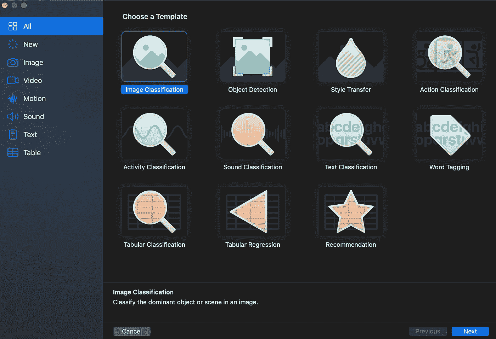
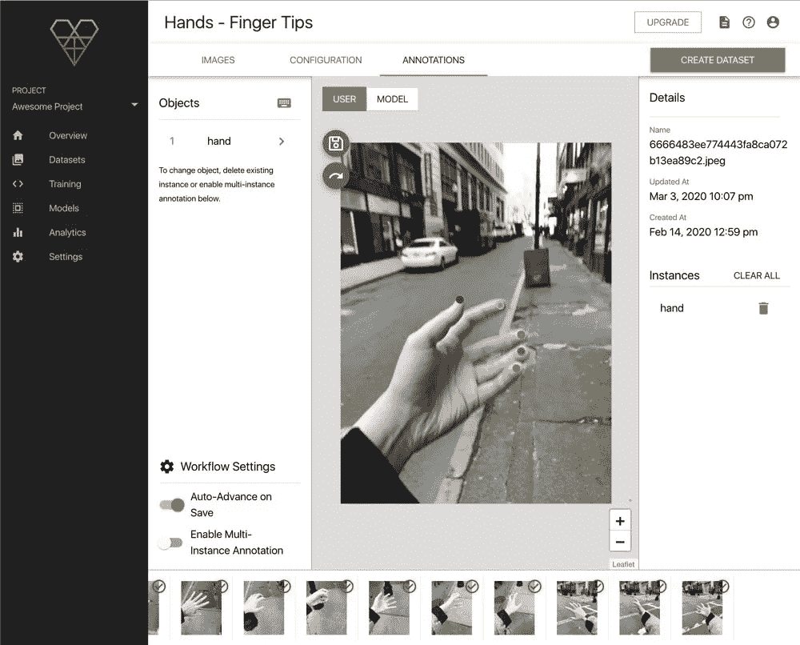
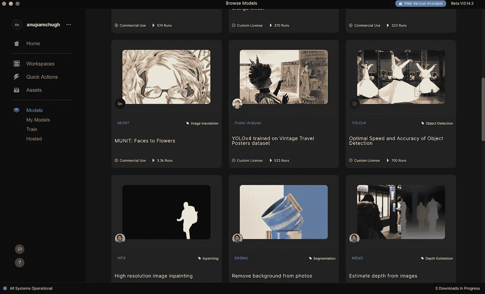
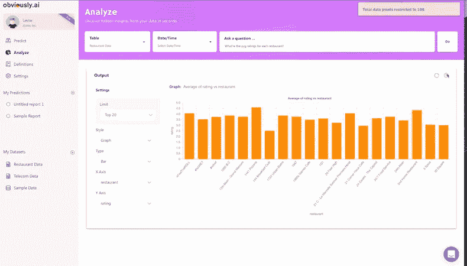
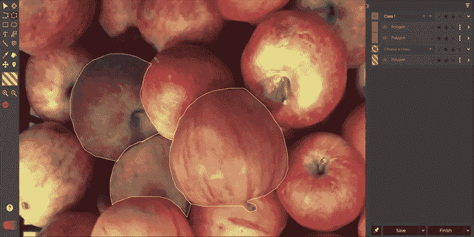
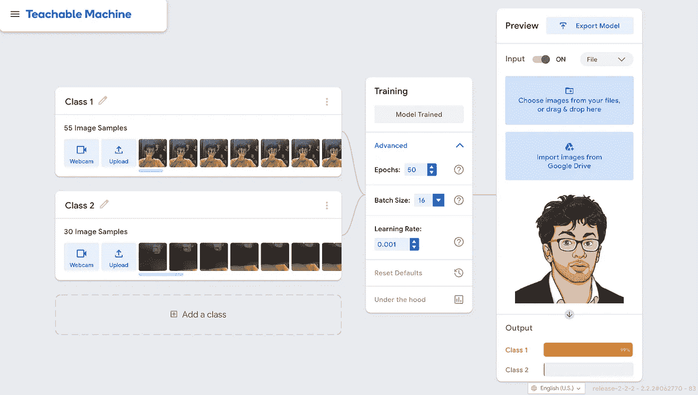

# 2020 年你应该使用的 8 大“无代码”机器学习平台

> 原文：<https://betterprogramming.pub/top-8-no-code-machine-learning-platforms-you-should-use-in-2020-1d1801300dd0>

## 是时候采用拖放设计工具来训练模型了

[UX 店](https://unsplash.com/@uxstore?utm_source=medium&utm_medium=referral)在 [Unsplash](https://unsplash.com?utm_source=medium&utm_medium=referral) 上拍照

在这个十年之交，无代码人工智能平台激增。越来越多的企业正在寻求利用人工智能的力量来构建更智能的基于软件的产品。

但是对许多人来说，执行成了一个障碍。对于创业公司来说，找到具有相关机器学习专业知识的人是一个挑战，因为这个领域总是在发展中。

许多公司投入巨资雇佣拥有博士学位和机器学习学术研究背景的工程师，却未能推出他们的产品。

这为图片带来了无代码的可视化拖放工具，有助于填补数据科学家的空白，并使人工智能对非技术人员来说不那么可怕。

现在，企业只需很少甚至不需要编码知识，就可以在显著减少的时间内生成数据集、训练和部署模型，同时保持经济性。

对于移动应用程序开发者来说，这无疑是一个变相的福音，因为现在对设备上的机器学习需求很高。他们不需要拥有机器学习的博士学位，并且可以在他们希望训练的数据和模型上更具创造力。

在接下来的几节中，我们将介绍一些目前最好的无代码机器学习工具。其中一些是完全免费的，而另一些可能会收取超出免费试用的费用。尽管如此，他们中的每一个都将帮助你把你的人工智能应用想法变成现实。

# 创建 ML

作为一名 iOS 开发人员，我不得不从苹果的无代码拖放工具 CreateML 开始。在最初用 Xcode 启动之后，现在 CreateML 是一个独立的 macOS 应用程序，附带了一堆预先训练好的模型模板。

通过使用迁移学习，您可以构建自己的定制模型。从图像分类器到风格转换到自然语言处理到推荐系统，它几乎涵盖了所有套件。您需要做的就是以所需的格式传递训练和验证数据。

此外，在开始培训之前，您可以微调指标并设置自己的迭代次数。Create ML 提供了模型验证数据的实时结果，例如样式转换。最后，它将生成一个 CoreML 模型，您可以在您的 iOS 应用程序中测试和部署它。

作者截屏

# 谷歌汽车

虽然苹果在 Create ML 方面处于领先地位，但谷歌不能落后。AutoML 工具的工作方式与 CreateML 非常相似，尽管是在云上。

[谷歌的云 AutoML](https://cloud.google.com/automl) 目前在其机器学习产品套件中包括视觉(图像分类)、自然语言、AutoML 翻译、视频智能、表格。

这使得具有有限机器学习专业知识的开发人员能够训练特定于其用例的模型。云上的 AutoML 通过为经过全面测试的深度学习模型提供开箱即用的支持，消除了了解迁移学习或如何创建神经网络的需要。

模型训练完成后，您可以测试并导出`.pb`、`.tflite`、CoreML 等格式的模型。

作者截屏

# MakeML

[MakeML](https://makeml.app/?from=github_potato_weigher) 是一款开发者工具，用于创建无代码的对象检测和语义分割模型。

它为 iOS 开发人员提供了一个 macOS 应用程序，用于创建和管理数据集(例如在图像中执行对象注释)。有趣的是，他们还有一个数据集商店，里面有一些免费的计算机视觉数据集，只需几次点击就可以训练一个神经网络。

MakeML 在基于体育的应用中展示了他们的潜力，在这些应用中，你可以做[球跟踪](https://makeml.app/soccer-ball-tutorial)。此外，他们有一个用于训练指甲和土豆分割模型的端到端教程，这应该给任何非机器学习开发人员一个良好的开端。

使用他们内置的视频注释工具，你可以建立一个用于板球和网球比赛的鹰眼探测器。

[来源](https://github.com/makeml-app/Potato-Scales)

# 弗里茨·艾

[Fritz AI](https://www.fritz.ai/) 是一个不断发展的机器学习平台，有助于弥合移动开发者和数据科学家之间的鸿沟。

iOS 和 Android 开发人员可以快速训练和部署模型，或者使用他们预先训练的 SDK，该 SDK 像模型一样提供对样式转换、图像分割和姿势估计的现成支持。

他们的 [Fritz AI Studio](https://www.fritz.ai/product/studio.html) 通过提供数据注释工具和合成数据以无缝方式生成数据集，让你快速将想法转化为生产就绪的应用。

除了在苹果之前引入对风格转移的支持，Fritz AI 的机器学习平台还提供了模型再训练、分析、轻松部署和防范攻击者的解决方案。

[来源](https://docs.fritz.ai/overview/studio/)

# RunwayML

这是另一个专为创造者和创客设计的伟大的机器学习平台。它提供了一个令人愉快的可视化界面，可以快速训练从文本和图像生成(GANs)到运动捕捉、对象检测等各种模型，而无需编写或思考代码。

[RunwayML](https://runwayml.com/) 让您浏览从超分辨率图像到背景去除和风格转换的一系列模型。

虽然从应用程序中导出模型不是没有成本的，但设计师总是可以利用他们预先训练的生成对抗网络的力量，从原型中合成新的图像。

他们的[生成引擎](https://experiments.runwayml.com/generative_engine/)是一个亮点，它可以在你键入句子时合成图像。您可以在 macOS、windows 上下载他们的应用程序，或者直接在浏览器上使用它(目前处于测试阶段)。

作者截屏

# 显然是艾

[很明显，AI](https://www.obviously.ai/) 使用最先进的自然语言处理技术对用户定义的 CSV 数据执行复杂的任务。这个想法是上传数据集，选择预测列，用自然语言输入问题并评估结果。

平台通过为你选择合适的算法来训练机器学习模型。因此，只需点击几次，您就可以获得预测报告，无论是预测收入还是预测库存需求。这对于寻求涉足人工智能领域而没有内部数据科学团队的中小型企业来说非常有用。

显然，人工智能可以让你整合其他来源的数据，比如 MySQL、Salesforce、RedShift 等。因此，在不了解线性回归和文本分类的情况下，您可以利用他们的平台对您的数据进行预测分析。

[来源](https://www.youtube.com/watch?v=XnOCxwfwEvc)

# 超壬酸盐

除了模型训练，数据处理还消耗了开发机器学习项目的大量时间。清理和标注数据肯定会耗费大量时间，尤其是在处理成千上万的图像时。

[SuperAnnotate](https://www.superannotate.ai/) 是一个人工智能驱动的注释平台，它使用机器学习功能(特别是迁移学习)来推动您的数据注释过程。通过使用他们的图像和视频注释工具，您可以在内置预测模型的帮助下快速注释数据。

因此，为对象检测、图像分割生成数据集将变得更加容易和快速。SuperAnnotate 还处理视频帧中常见的重复数据注释。

[来源](https://blog.superannotate.com/annotate.online-updates-june-2021)

# 可教机器

最后但同样重要的是，我们有另一个谷歌无代码机器学习平台。与对开发者友好的 AutoML 不同，[可教机器](https://teachablemachine.withgoogle.com/)可以让你快速训练模型识别来自浏览器的图像、声音和姿势。

您可以简单地拖放文件来教授您的模型，或者使用网络摄像头来创建一个快速而肮脏的图像或声音数据集。Teachable Machine 使用您浏览器中的 [Tensorflow.js](https://www.tensorflow.org/js) 库，并确保您的训练数据保留在设备上。

对于那些想在没有任何编码知识的情况下练习机器学习的人来说，这当然是谷歌迈出的一大步。最终模型可以导出为 Tensorflow.js 或`tflite`格式，然后可以在您的网站或应用程序中使用。您还可以使用 Onyx 将模型转换成不同的格式。

这是一个简单的图像分类模型，我在不到一分钟的时间里就训练好了。

作者图片

# 结论

我们看到没有代码机器学习平台如何在数据科学家和非 ML 从业者之间架起桥梁。虽然没有放之四海而皆准的解决方案，但您总是可以选择一个平台来快速构建模型或生成数据集。

此外，这些工具让机器学习变得更加有趣。SnapML 是另一个伟大的无代码机器学习工具，让你训练或上传自己的定制模型，并在 Snap 镜头中使用。这当然有助于独立开发者和创作者在数百万人面前展示他们的创造力。

这一次到此为止。感谢阅读。