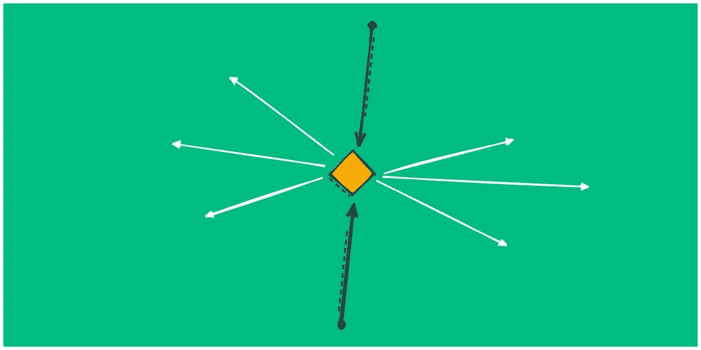
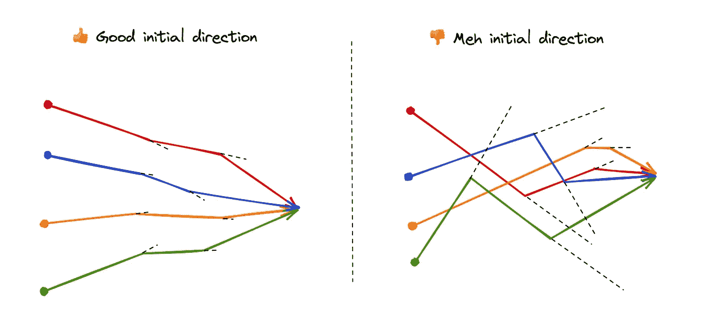

# 自上而下、自下而上以及介于两者之间的所有方式

> 原文：<https://betterprogramming.pub/top-down-bottom-up-and-everything-in-between-a89656a8a887>

## 平衡 B2B 产品导向型公司的战略工作和日常工作

鸣谢:作者

当一家公司达到 50 人以上(或更快)，事情就开始变得复杂了。部门开始形成，每个部门都有不同的 KPI、目标和激励措施。产品工程变成了销售、营销、社区和支持。你开始听到高管们谈论预算和“公司战略”在这一点上，许多科技创业公司感到有点不舒服。他们习惯于自下而上的方法，事情自然发生，方向可以很快决定。

好消息是，您不必失去自下而上的方法。用几个(很少)坚实清晰的自上而下的策略来平衡它。

# 当你不得不开枪时，就开枪。不要说话。

> “为每一种可能做好计划和准备，你就永远不会行动。当我们遇到一半我们害怕的事情时有勇气比分析每一个可能的障碍而什么都不做更高尚。伟大的事情是通过拥抱巨大的危险来实现的。” *— Xerexes(可能)*

领导有沉迷于策略的倾向，但简单的道理是，很多事情不需要任何策略。该团队将工作几个星期，只开发他们知道他们需要做的完全相同的行动。

把你的战略工作留给真正复杂的需要研究和与其他部门协调的工作。

但是你如何决定做什么“第一件事”呢？

1.  业务影响是显而易见的。(增加 10%的订阅量，关闭三个大客户，减少 30%的支持压力)
2.  工程影响是显而易见的。(提高 10%的生产力，减少 25%的错误)
3.  工程或产品标准的危险信号。(开发者无法快速部署，用户不了解如何使用产品)
4.  公司里每个人都知道这件事，都想去做。(我们做 X 的方式很烂)

# 让自上而下变得值得

既然你已经解决了你的“第一件事”(我强烈建议你在任何战略工作之前做)，是时候考虑你的工程策略了。你并不孤单，你必须承认这一点。由于工程对你创业的成功有着巨大的影响，你的决定会影响到其他部门。如果您只关注可伸缩性，您可能会忽略销售人员迫切需要实现其目标的新功能。

## 一个团队，一个目标

整体优先考虑你公司的几个战略。和你的领导团队坐下来，问他们:“你的目标是什么，你打算如何实现？”。从众多绝妙的技巧中选择一种来实现这一点(OKRs 或[机会解决方案树](https://www.producttalk.org/opportunity-solution-tree/))，并确保知道你的同事部门的目标是什么。

使用协作方法，而不是验证机制——不要各自为政，最后才提交策略供批准，而是进行协作会议，一起讨论问题，即使在不确定的情况下也能形成简短的反馈。

## 之前，之后，还是中间？

一旦溪流移动，调整它们就更具挑战性了，但是通过调整它们的初始方位，你可以避免很多摩擦。自然界的一切都是如此，方向改变引起的每一次摩擦都会耗尽你团队的能量。创业公司每一步都需要效率。

你与领导层的会面将帮助你确定最合适的方向。当然，你将需要不断监测你的部门的位置，并作出调整。

## 致力于专注

通常，在这一阶段，该部门将有 5-6 个战略到位，试图解决所有的关键问题。听起来很合理，不是吗？不，那只是太多自上而下的方向。选择 1–2 是使自上而下有价值的最有效的方法。推剩下的。

赢得 1-2 个策略，然后继续前进。宣扬专注很容易，但只有将团队的注意力集中在正确的策略上，你才能真正有所作为。

# 要实现自下而上，就必须工作

自上而下只能将你带到某一点，但自下而上可以将最成功的组织区分开来，在这些组织中，个人引领创新并保持产品标准。

这篇文章不打算关注如何授权给团队(也许在一篇单独的文章中)，但是我会提到一些经常被认为是策略但实际上是自下而上的事情。

## 方向和愿景

人们把愿景/方向文件和战略联系在一起，并没有错。愿景对于开始讨论至关重要，但最终它们会对个人的日常工作产生难以置信的影响。

**方向**
系统可用性改进——我们将提高系统可用性和质量水平的标准。

你的策略是专注于给你带来一个特定的结果，但同时，团队必须坚持每天的工作。一个明确的方向将有助于工程师们举起那些危险的信号，并识别出不属于战略的高影响力的工作。有人可能会带来一个他们发现的绝佳机会。

## 没有法律，就不能违反。

另一个可以驱动你的工程师的因素是标准。设定对质量、成功、速度、价值以及基本上你所关心的任何东西的期望，你的团队就能发现差距，发现机会或痛点。创造这种文化的关键实际上是当事情发生时做一些事情。如果你的回答总是“不优先”，在某个时候，人们会停止来找你。

*原载于 2022 年 6 月 7 日*[*https://newsletter . engstuff . XYZ*](https://newsletter.engstuff.xyz/p/top-down-bottom-up-and-everything?s=w)*。*