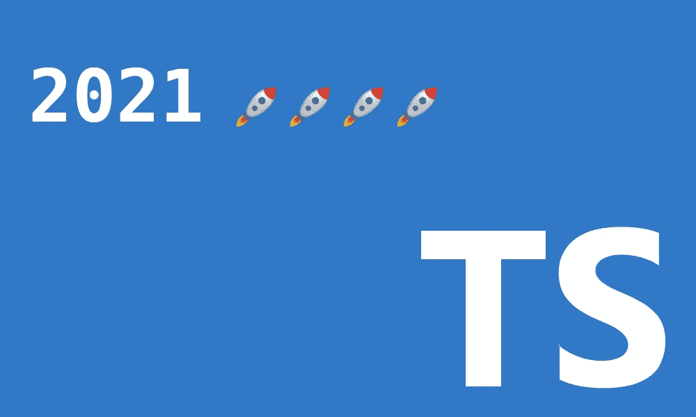
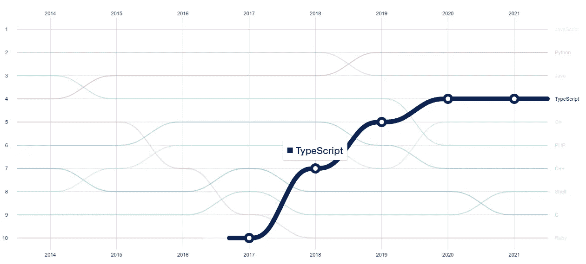

# 2021 年发布的顶级类型脚本功能

> 原文：<https://betterprogramming.pub/top-typescript-features-released-in-2021-426905a9c6e7>

## 概述 2022 年将使用的新功能



作者图片

Typescript 以一个伟大的`4.1`发布结束了 2020 年。在那里，推出了期待已久的`Template Literal String`和`Remapping`功能。这些为许多可能性和模式打开了大门。

不过，那次`4.1`发布只是为`Template Literal Types`做铺垫。随着 2021 版本的发布，这一特性已经变得越来越成熟。例如，在`4.5`发布之后，我们现在可以使用`Template Literal Types`作为 union discriminates。

在 2021 年，已经有 4 个 Typescript 版本。它们包含了许多优秀的特性。核心和开发人员体验得到了显著改善。在这篇文章中，我将总结我 2021 年的首选。这些对我的日常打字工作有着更大的影响。

如果你想检查任何版本，特别是，我会在文章的最后链接这些。

# 1.元组中的前导/中间元素

Tuple 基本类型早就出现在 Typescript 中了。它允许我们表达固定数量的数组类型元素。

我们可以将可选元素定义为元组的一部分:

```
// ✅ last 2 elements are optional
let arrayOptions: **[string, boolean?, boolean?]**;// ❌ A required element cannot follow an optional element
let arrayOptions: **[string, boolean?, boolean]**;
```

通过使用可选的修饰符，我们暗示我们的数组可以有多种长度。我们甚至可以更进一步，定义一个类型的动态长度数组:

```
// ✅ last 2 elements are optional
let arrayOptions: **[**string, **...boolean[]]**;// the below will be all valid
arrayOptions = ['foo', true];
arrayOptions = ['foo', true, true];
arrayOptions = ['foo', true, true, false];
```

在这个新的 TypeScript 中，版本元组变得更加强大。以前，我们可以使用 spread 操作符，但是我们不能定义最后的元素类型。

然而，在`4.2`发布之前，类似上面的内容是无效的:

```
// ❌ An optional element cannot follow a rest element.
let arrayOptions: [string, ...boolean[], number?];
```

在`4.2`之前，rest 操作符必须总是元组中的最后一个元素。在`4.2`版本中，这不再是一个要求。没有这种限制，我们可以添加任意多的尾随元素。然而，我们不能在 spread 操作符后添加可选元素。

```
// ❌ Prior to 4.2, Error: rest element must be last in a tuple type
let arrayOptions: **[string, ...boolean[], number]**;// ✅ works from 4.2
let arrayOptions: **[string, ...boolean[], number]**;// ❌ Error: An optional element cannot follow a rest element
let arrayOptions: **[string, ...boolean[], number?]**;
```

让我们在下面的例子中详细了解一下:

```
let arrayOptions: **[string, ...boolean[], number]**;
arrayOptions = ['config', 12]; // works
```

# 2.始终如一的承诺检查中的错误

从`4.3`版本开始，作为`strictNullChecks`配置的一部分，当断言一个承诺时，TypeScript 将给出一个错误。

由于`if (promise)`条件总是为`true`，编译器要求我们改变`if`语句。

在配置编译器选项中没有额外的标志来配置它。

# 3.类型保护引用保存在常量/只读变量中

Typescript 现在将在断言 if 语句时做一些额外的工作。如果变量是一个`const`或`readonly`，它将保留它的类型保护(如果有的话)。

让我们检查以下代码:

如果`isString`变量在`let`范围内，上面的代码就不会工作。不考虑类型保护，代码将失败，如下所示:

```
// isString is instead declared as let
**let isString** = typeof text === "string";// ❌ this statement won't work as a Type Guard
**if (isString) {
** ...
}
```

## 组合多个变量

类型保护别名现在更加智能，甚至可以理解多个变量的组合。

`bothNonEmpty`常量变量保存两种类型守卫的信息。所以`a`和`b`都是`if`语句中的`string`类型。

## 它是过渡性的

当组合具有关联类型保护的变量时，这些变量仍将被传播。这意味着它将能够根据需要组合任意多的类型保护，而不会丢失任何类型信息。

我们可以在上面的例子中看到,`bothNonEmpty`属性保留了类型保护信息。

综上所述，`Control Flow Analysis`已经有了很大的改进。最好的部分是这将在 Typescript `4.4`中开箱即用。

# 4.精确的可选属性类型

当使用 Typescript 时，有一个反复出现的争论:使属性可选还是使属性`undefined`？这确实取决于个人偏好。

那是什么问题呢？Typescript 编译器以同样的方式处理这两者。这导致代码不一致和一些摩擦。

让我们看一个例子:

为了结束这种不一致性，Typescript 现在包含了一个标志:`--exactOptionalPropertyTypes`。启用后，当试图将可选值视为可空值时会显示错误，反之亦然🚀

让我们检查一个将`--exactOptionalPropertyTypes`设置为 true 的代码示例:

如果没有启用`--exactOptionalPropertyTypes`，上面的代码都不会有问题。

为了防止任何破坏性的改变，它在默认情况下被禁用。由我们来决定它是否是一个值得拥有的特性。在我看来，这是必须的。

# 5.符号和模板文字字符串的索引签名

该功能是已经工作了三年的`Generalized index signatures`的超集。可以在[这里](https://github.com/microsoft/TypeScript/pull/26797)找到那个 PR。

Typescript `4.4`现在支持索引签名中的`symbol`、`unions`和`template literal string`。只要是由`string`、`number`或`symbol`组成的工会都是支持的。

使用`symbol`的例子:

使用`literal template string`的例子:

通过能够使用联合，我们可以减少许多样板文件。我们可以更好地表达我们的接口和类型。

索引签名仍然不完美。它们有局限性。他们仍然不支持`Generic Types`也不支持`Template Literal Types`:

尽管如此，这仍然是一个很棒的特性，它将帮助我们用更少的代码行创建更强大的界面。

# 6.等待的类型

在`4.5`之前，为了获得承诺的返回类型，我们必须使用`infer`功能，如下所示:

`4.5`版本带有一种新型`Awaited`。我们不需要像上面描述的`Unwarp`那样的自定义映射类型。

让我们看看它的语法:

```
type Result = **Awaited**<T>;
```

让我们看一些不同的用例示例:

# 7.仅限类型的导入说明符

从版本`3.8`开始，我们可以通过将`type`添加到`import`关键字来显式使用类型导入。这确实告诉 TypeScript 编译器该导入只包括 Typescript 类型。这有什么关系？在将代码转换为 JavaScript 时，TSC 可以安全地对导入进行分段。

```
// ✅ importing the FC type from React
import **type** { FC } from 'react';
import { useEffect } from 'react';
```

正如您在上面看到的，问题在于，如果您想要明确您的导入类型，有时您需要导入语句。您仍然可以执行以下操作:

```
import { FC, useEffect } from 'react';
```

但是你牺牲了一点可读性。从版本`4.5`你可以将它们混合在一起。

```
import { **type** FC, useEffect } from 'react';
```

这使得代码更加清晰，而没有添加任何额外的样板文件。

# 包裹

这些年来，打字稿变得越来越重要。我们可以预期 Typescript 将很快成为基于 JavaScript 的项目的默认语言。



octoverse.github.com 历年最热门的语言

Typescript 在 2021 年有了很大的改进。它的核心变得越来越聪明，让我们进一步依赖推理。这使得从 JavaScript 代码中移植变得不那么麻烦和容易。

2022 年看起来也令人兴奋。一些很酷的功能即将出现。TypeScript 编译器现在专注于 Node.js 中的 ECMAScript 模块支持。它已经在夜间版本中发布，预计很快就会足够稳定，可以用于生产。

你可以在这里查看我之前版本的笔记: [4.2](/whats-new-in-typescript-4-2-97f722689c43) ， [4.3](/whats-new-in-typescript-4-3-72f74289e765) ， [4.4](/whats-new-in-typescript-4-4-e17d63b84b86) ， [4.5](/whats-new-in-typescript-4-5-57d6b88b1e72)

干杯。

[](/6-killer-features-from-remix-3d7e01b0789e) [## 混音版的 6 个黑仔特色

### 改变游戏规则的全栈 JavaScript 框架的主要亮点

better 编程. pub](/6-killer-features-from-remix-3d7e01b0789e)