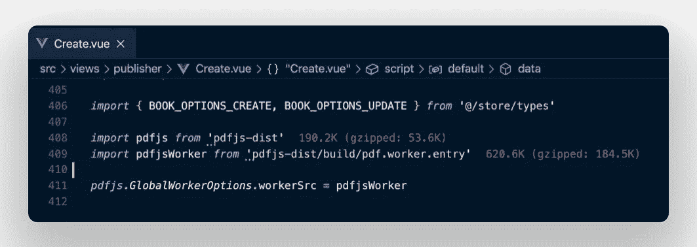
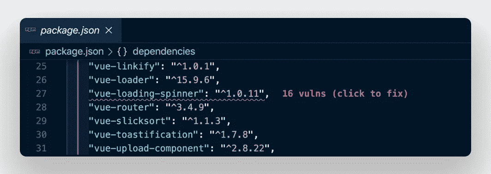
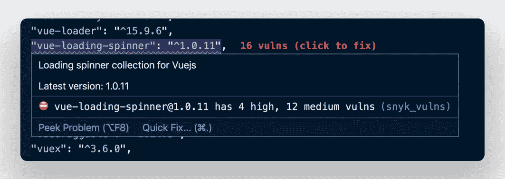
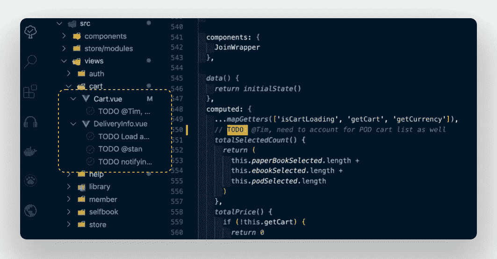
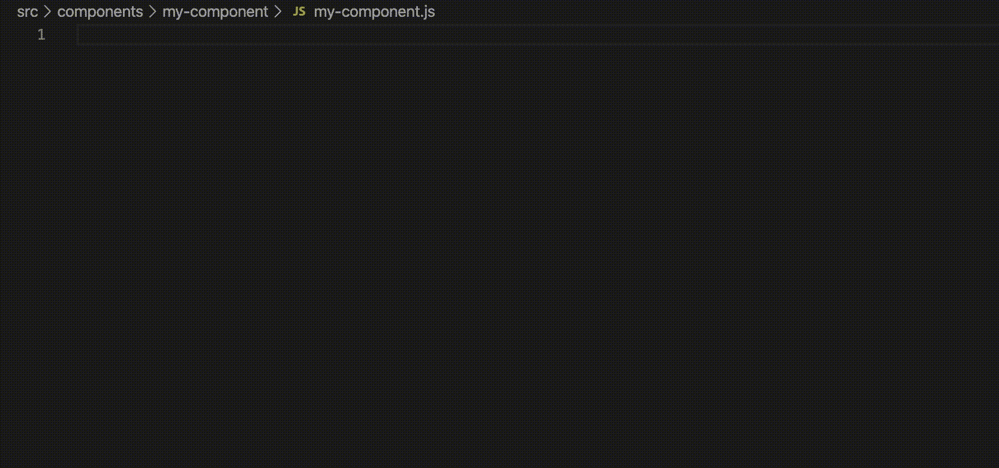
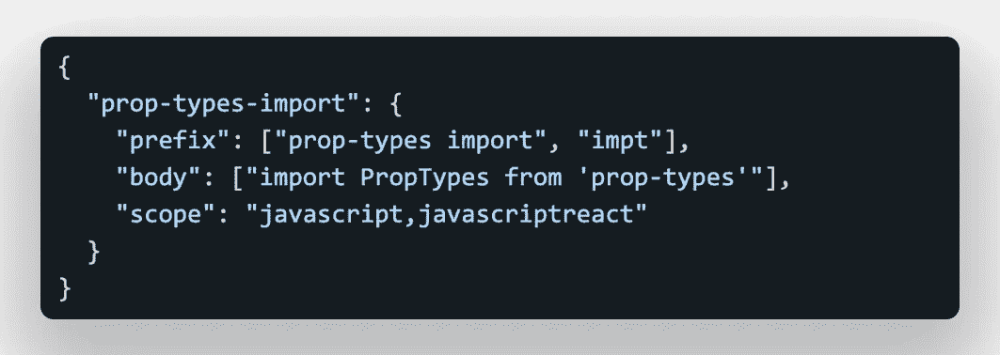
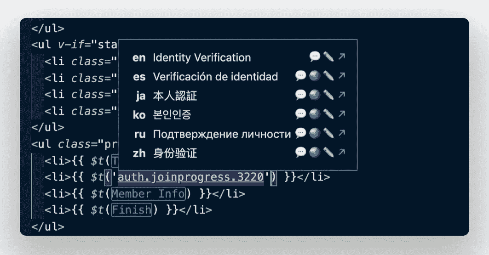
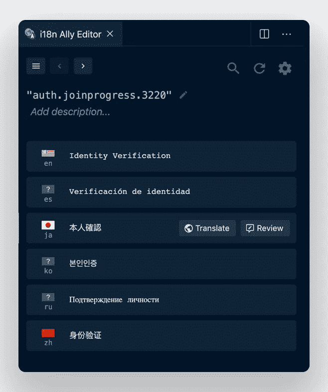

# JS 开发的 8 大 VS 代码扩展

> 原文：<https://betterprogramming.pub/top-vscode-extensions-for-js-devs-f066ab889b6>

## 聪明地工作，而不是努力

托尼·里德在 [Unsplash](https://unsplash.com/wallpapers/colors/neon?utm_source=unsplash&utm_medium=referral&utm_content=creditCopyText) 拍摄的照片

下面的列表是我在 [VS Code](https://code.visualstudio.com/) 扩展商店中幸运发现的组合，以及来自我最喜欢的开发播客的策划建议，如 [Syntax](https://podcasts.apple.com/us/podcast/syntax-tasty-web-development-treats/id1253186678) 、 [Full Stack Radio](https://fullstackradio.com/) 和 Vue 上的[Views](https://devchat.tv/views-on-vue/?fbclid=IwAR3n9euljQK70c37szL4gmOfyKZ23YuNSNO5MrPfn3eAc8g7d-a7Fdm-9fg)。

# 版本镜头

一键更新您的软件包版本。

版本镜头

[版本镜头](https://marketplace.visualstudio.com/items?itemName=pflannery.vscode-versionlens)是那些让你说‘哇！’的插件之一

安装完成后，点击右上角的大 V，然后点击版本标签图标来获取你正在使用的每个包的当前版本。只需一次点击，您就可以更新任何软件包，无需任何额外的搜索。太神奇了！

# 进口成本

看看你为了进口牺牲了多少尺寸。

进口成本

当使用外部库时，我们通常不会充分考虑使用它们所带来的大小成本。 [Import Cost](https://marketplace.visualstudio.com/items?itemName=wix.vscode-import-cost) 在这里向您展示当使用任何特定的包时，您的项目会变得有多重，它还显示了 gzipped 的大小！

如果您的包裹进口被认为偏高，进口成本的高亮文本将从绿色变为红色。使用一个胖包可能没问题，但是看到这些红线，你可能会被激励去寻找更轻的东西来解决你的项目需求。

# 损伤

发现任何导入包中的漏洞。

安装 [Vuln](https://marketplace.visualstudio.com/items?itemName=snyk-security.vscode-vuln-cost) 后，转到你的`package.json`文件，观察它检查你列表中的每一项，看看是否存在任何已知的漏洞。如果有，它们将如下所示:

发现问题时 Vuln

将鼠标悬停在某个问题上，会显示一个弹出窗口，让您可以确切地看到漏洞是什么，还会为您提供修复它的选项(如果可用)。

悬停在某个问题上时

现在，您可以确保您的项目是安全的，没有漏洞，而无需花费数小时手动搜索和仔细检查您安装的每个软件包。

# 待办事项树

轻松回顾项目中的每一个`TODO`。

待办事项树

安装后，通过点击 VS 代码侧边栏中的树图标激活 [Todo 树](https://marketplace.visualstudio.com/items?itemName=Gruntfuggly.todo-tree)。只有带有`TODO`的文件才会显示在文件面板中。

它不仅使列出你的`TODO`变得容易，而且在你的模板中突出显示每一个。我之前使用了[来突出显示](https://marketplace.visualstudio.com/items?itemName=wayou.vscode-todo-highlight)来完成这个任务。然而，由于 Todo Tree 也包括这个特性，我现在只需要一个插件来满足我所有的`TODO`列表需求。

对于项目的重构阶段，这是一个特别方便的插件。

# 快照

标准化您使用的每种语言的代码片段。

快照

[SnipSnap](https://marketplace.visualstudio.com/items?itemName=snipsnapdev.snipsnap-vscode) 的建立是为了解决几个问题:

*   在单个扩展中访问每种语言的所有代码片段
*   标准化您如何访问每种语言的代码片段
*   让您自己的自定义片段易于访问

SnipSnap 目前处于测试阶段；然而，这些特性已经非常有用了，从现在开始只会变得更好。

忘记为你使用的每一种语言安装代码片段，然后浪费时间去弄清楚它们是如何工作的，以及开发者选择了什么样的个人怪癖。只需使用 SnipSnap，让使用代码片段变得轻而易举。

想要使用您自己的自定义代码片段吗？只需使用下面的`JSON`格式添加您自己的代码片段，并使它们基于相关的语言或框架可访问。

自定义片段格式

# 代码时间

一个发现你的最佳编码流程状态的全球社区。

代码时间

[编码时间](https://marketplace.visualstudio.com/items?itemName=softwaredotcom.swdc-vscode)是将你锁定在那种令人惊奇的流畅状态模式中，你的手指在键盘上飞舞，你像编码之神一样敲出项目特性。

这是一个你可能不会每天使用的插件，但是当你使用的时候，你会感谢你安装了它来跟踪你的进度。

它给你一个关于你的编码生活的详细概述，包括你在某一天或一天中的某个时间的效率，它可能会给你洞察你身体的生物节律，以便你什么时候编码最好。这是一些有用的信息！

# 音乐时间

一个关于流动状态的全球开发者社区。

音乐时间

来自代码时间的创造者的另一个惊人的插件！

简单来说，[【音乐时间】](https://marketplace.visualstudio.com/items?itemName=softwaredotcom.music-time)解锁一个你最擅长编码的音乐的视图。
只需连接您的 Spotify 帐户并开始编码。音乐时间会做剩下的。在你使用它几天后，根据你听的音乐，回头看看你什么时候效率最高。

不确定从哪里开始？看看他们关于世界上其他开发者最有效编码的音乐的全球统计，也许你会找到你下一个最喜欢的艺术家。

# 额外奖励—我的盟友

直接在模板中显示、翻译和编辑所有本地化语言。

**i18n 盟友**

这是一个额外收获，因为我在之前的一篇文章中提到过。然而，我认为这值得再次讨论，因为他们已经大大改善了界面。

这里只是让你做的一些令人惊奇的事情:

*   为模板翻译字符串设置默认显示语言
*   获取模板中任何 i18n 关键字的即时谷歌翻译
*   在模板中直接编辑翻译文件
*   一键链接到相关的翻译文件

它还附带了一个编辑 UI 的扩展版本，您可以通过单击上图中的白色语音气泡图标来获得它。当您这样做时，以下内容将显示在新的选项卡中，并允许您编辑、翻译和审阅每个翻译字符串:

i18n Ally 的高级编辑用户界面

# 想要更多吗？

要获得更多优秀的 VScode 扩展，请查看我以前关于更好编程的文章:

 [## 5 VS 代码扩展将改变您的开发生活

### 每一次击键都让你脸上带着微笑

medium.com](https://medium.com/better-programming/5-vs-code-extensions-thatll-change-your-dev-life-9786756a8121)  [## 5 个 VS 代码扩展将改变您的开发生活

### 节省的时间越多，做的工作就越多

medium.com](https://medium.com/better-programming/5-more-vs-code-extensions-thatll-change-your-dev-life-16da5d563dbc)