# 5 个我离不开的 Vue.js 库

> 原文：<https://betterprogramming.pub/top-vue-libraries-for-your-next-app-af10de6c2b74>

## 每个都有指南


照片由 [Jaredd Craig](https://unsplash.com/@jaredd_craig?utm_source=unsplash&utm_medium=referral&utm_content=creditCopyText) 在 [Unsplash](https://unsplash.com/s/photos/library?utm_source=unsplash&utm_medium=referral&utm_content=creditCopyText) 上拍摄，由 Titus Decali 编辑

正如有经验的开发人员所知，有时使用另一个人的软件包来解决你的应用程序的一个特性，最终会耗费你更多的时间，而不是节省的时间。固执己见的系统和缺乏边缘案例的解决方案经常把我们埋在一个洞里，让我们后悔当初安装它。

虽然我也有过很多次这样的经历，但是有几个包是我在很多项目中依赖的，并且从长远来看证明非常有用。在测试了这些软件包解决的每个问题的各种选项后，我根据易用性、功能多样性和视觉吸引力列出了以下个人选择。

# 单击关闭以关闭

有时候，当用户在元素外部单击时，我们需要触发一个事件。最常见的情况是当你想通过点击关闭下拉菜单或对话框时。这是一个基本的包，我几乎在我构建的每个应用程序中都使用它。

顶部选择: [vue-clickaway](https://github.com/simplesmiler/vue-clickaway)

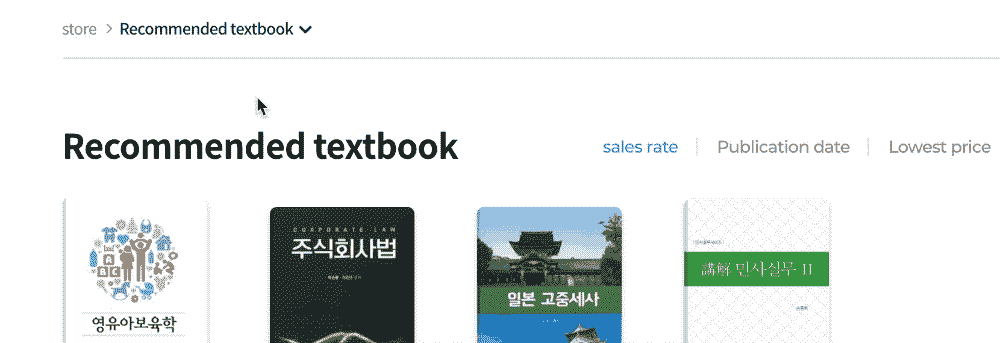

[vue-clickaway](https://github.com/simplesmiler/vue-clickaway)

## 使用

我通常将它安装在`main.js`中，使它在我的应用程序中可用。如果您只在一个或两个页面上使用它，您可能希望单独导入它。

如果你单独导入它，记住指令需要在指令下公开:
✅ `directives: { onClickaway }`

而不是组件:
❌ `components: { onClickaway }`

使其全球可用(在`main.js`):

```
*import* { directive *as* onClickaway } *from* 'vue-clickaway'*Vue.directive*('on-clickaway', onClickaway)
```

在模板中:

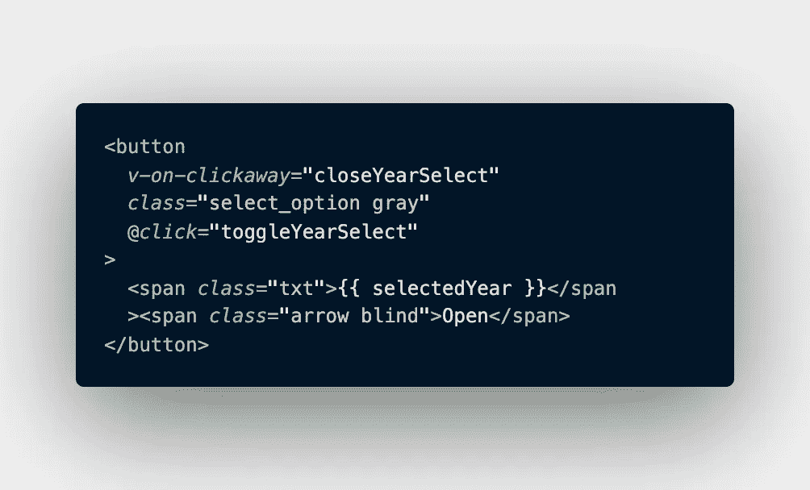

**为了简单起见，部分查看代码。*

假设我有一个完整的选择框，包括一个`li`元素的列表(这里没有显示)。上面的按钮用于触发我的自定义选择框项目列表，当我在该元素之外单击时，我将触发一个关闭选项列表的方法。这是一个比强迫你的用户总是点击你的元素角上的“关闭 X”按钮更好的 UX。我们可以简单地通过在我们的按钮上添加以下内容来获得这个功能:
`v-on-clickaway=“closeMethodName”`。

**注意:**你应该总是使用 vue-clickaway 和一个`close`方法，而不是一个`toggle`方法。我的意思是，连接到
`v-on-clickaway`的方法应该是这样的:

```
closeMethod() {
 this.showSomething = false
}
```

而不是像这样:

```
toggleMethod() {
 this.showSomething = !this.showSomething
}
```

如果你使用一个`toggle`方法，那么每当你点击那个元素之外的时候，无论你点击什么，它都会反复地打开然后关闭这个元素。这很可能不是你想要的结果，所以记住使用`close`方法来防止这种情况发生。

# 祝酒词(通知栏)

顶部选择:[vue-to-stification](https://maronato.github.io/vue-toastification/)

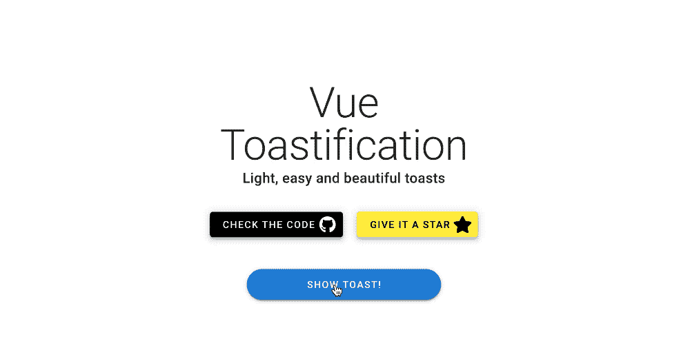

[真空灌浆](https://maronato.github.io/vue-toastification/)

你有很多敬酒和类似通知的选择，但我是 Maronato 的超级粉丝。它提供了大量的选项来覆盖几乎所有的边缘情况，并且样式和动画产生了远远超过其他软件包的优秀用户体验。

## 使用

vue-toastifation 给了你一些在他们的文档中使用它的方法。您可以在组件级、全局级，或者甚至在 [Vuex](https://vuex.vuejs.org/) 中这样做，如果您喜欢显示基于状态或服务器相关动作的祝酒词。

全球使用(在`main.js`):

你可以在每个组件中单独控制样式，但是在上面的例子中，我通过将它导入到`main.js`中，然后设置我想要使用的选项，使它在我的应用程序中随处可见。这样我就不用每次想用的时候都写同样的选项道具了。vue-toastifation 有一个很棒的[游乐场](https://maronato.github.io/vue-toastification/)，在那里你可以看到每个选项道具的结果，只要复制并粘贴你想要的选项，就像我上面做的那样。

**备选方案 1:在组件(模板)中使用祝酒词**

```
<button [@click](http://twitter.com/click)="showToast">Show toast</button> 
```

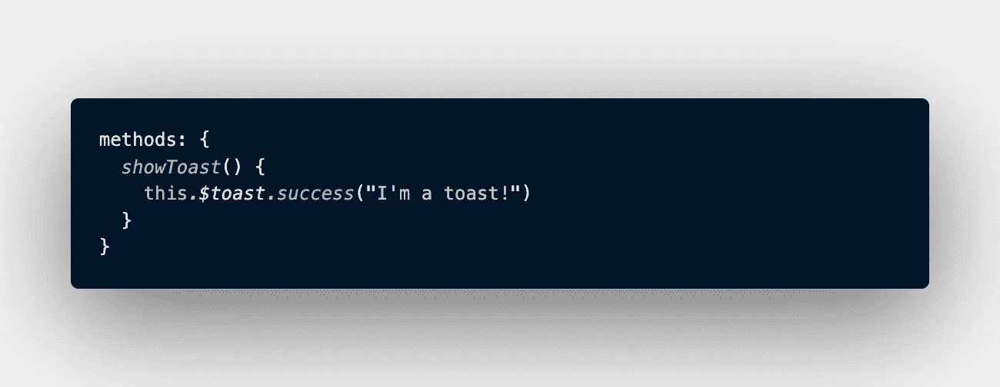

您的@click 触发的方法

**选项 2:当在 Vuex 操作中发现错误(或成功)时，调用祝酒词**

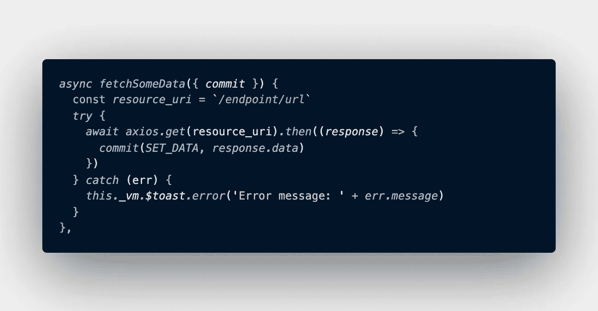

利用这个。_vm。Vuex 中的$toast.error，用于显示错误发生的时间

您可以简单地通过将单词`.error`更改为`.success`、`.info`、`.warning`来更改您想要的祝酒词的类型，或者您可以将它完全删除以获得`default`祝酒词通知。

Toasts 使您能够根据实时状态变化或发生意外错误时显示消息，这极大地改善了用户的体验。举例来说，Toasts 比 modals 或丑陋的警告框提供了更好的视觉指示，用户必须提供额外的点击才能关闭。用户会感谢你给了他们一个视觉提示，告诉他们哪里出了问题，防止他们盯着屏幕发呆，等待永远不会发生的事情。确认他们执行的操作是否成功完成也很有用。

# 桌子

顶部选择: [vue-good-table](https://xaksis.github.io/vue-good-table/)

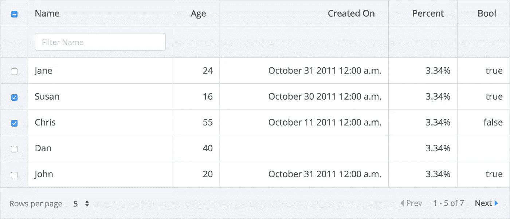

[vue-good-table](https://xaksis.github.io/vue-good-table/)

表格是许多网络应用的重要组成部分，选择错误的表格会让你陷入无尽的痛苦。在尝试了一长串餐桌套装选项后，我相信 [vue-good-table](https://xaksis.github.io/vue-good-table/) 将解决您的大部分餐桌需求。它不仅仅是为了好玩而被称为“好桌子”。它真的很好，提供了更多的选项和功能，比你可以摇一摇棍子。

## 使用

在下面的例子中，我将我的`:rows`数据绑定到一个名为`getOrderHistory`的 Vuex getter。

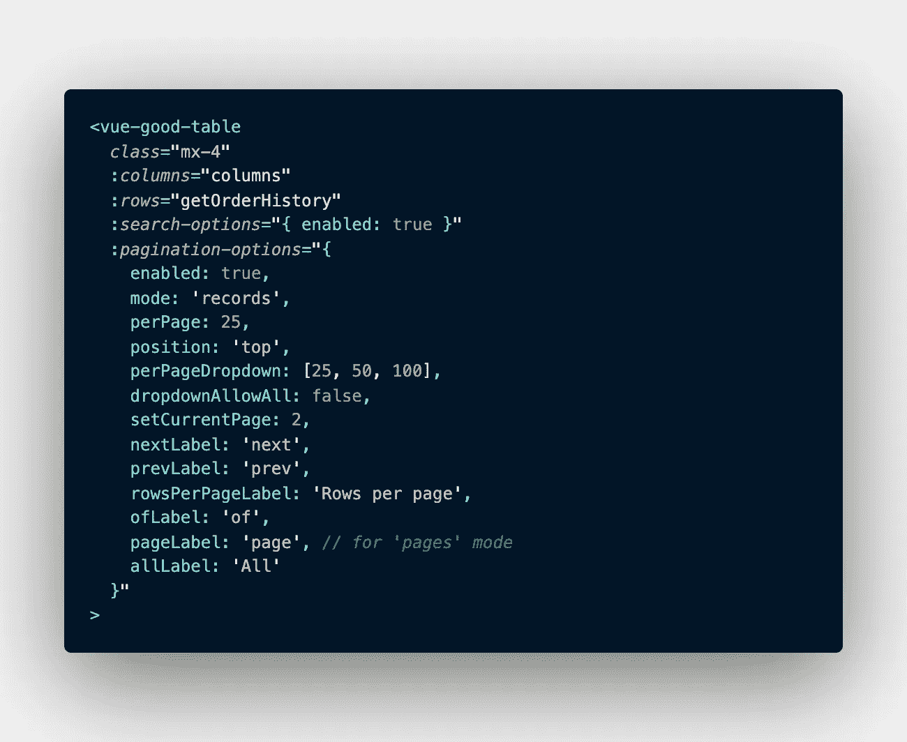

使用 vue-good-table 的一些选项

在本地定义我的列`data()`:

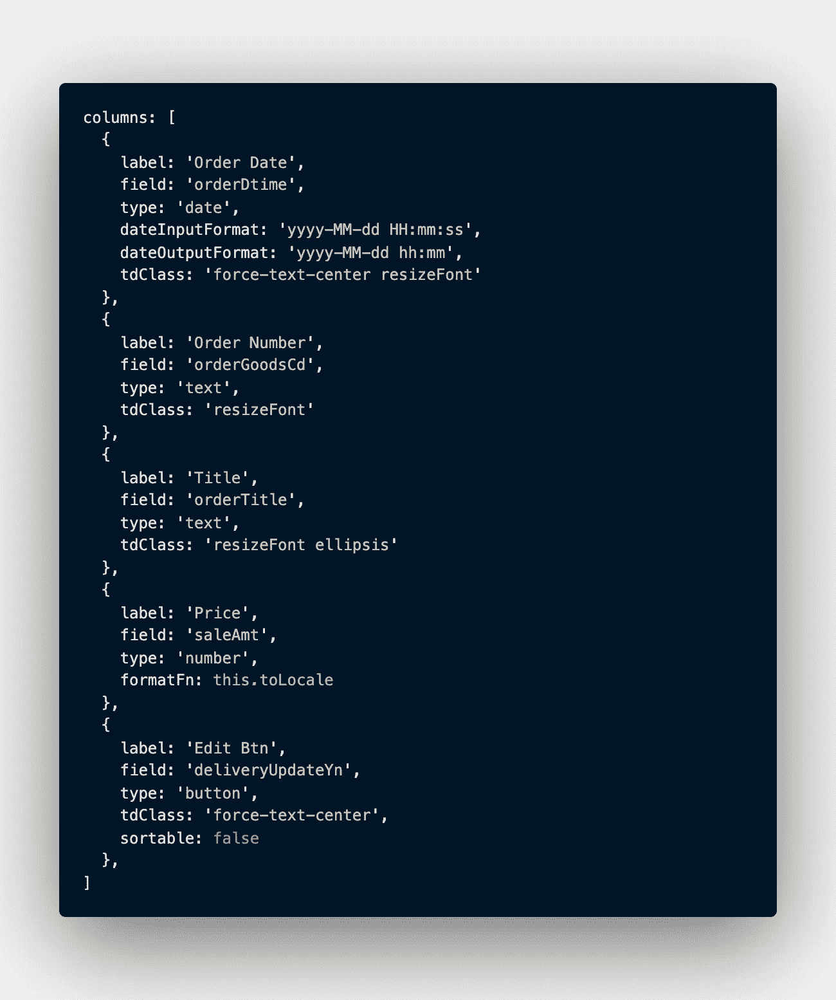

`label`是显示的列标题，而`field`是我在 Vuex getter 中绑定到的数据。

在上面，我还使用了 vue-good-table 的一些定制选项，比如设置我的日期的输入和输出格式(这允许我获取服务器提供的长时间戳，并将其更改为对我的用户更可读的内容)。我还使用`formatFn`来格式化我的价格，调用一个我命名为`toLocale`的独立方法。然后，我通过将`tdClass`绑定到我在本地`<style>`中设置的类来定制每个单元格的外观。Vue-good-table 真的内置了无限的可定制性，它们已经涵盖了非常广泛的边缘情况。

## **自定义模板**

Vue-good-table 还可以很好地使用自定义模板，这样你就可以很容易地将一个按钮、一个选择框或者任何你喜欢的东西插入到表格的单元格中。为此，您只需使用一个`v-if`来定义它应该被注入的位置。

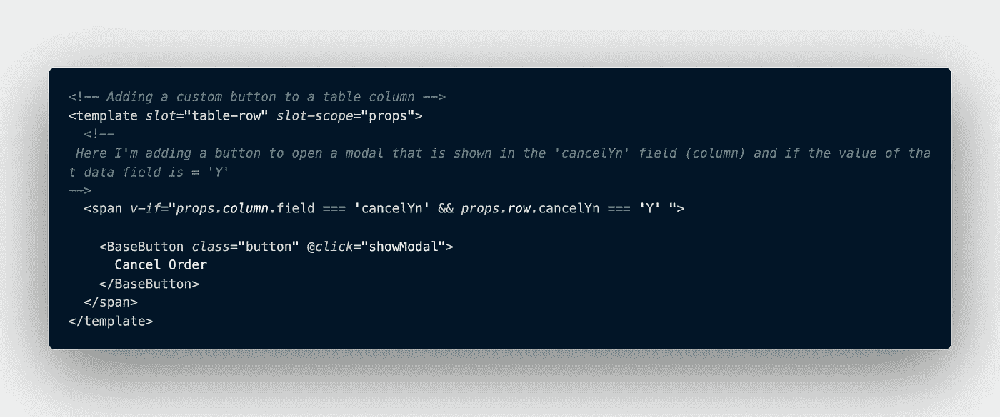

要添加另一个定制列，只需在结束的`v-if`标签后添加一个`v-else-if`(在上面的例子中是一个 span)，然后在那里添加第二个定制模板的逻辑。无论您需要什么，vue-good-table 都能满足您的需求。

# 日期选择器

顶部选择: [vue2-datepicker](https://mengxiong10.github.io/vue2-datepicker/index.html#Basic)

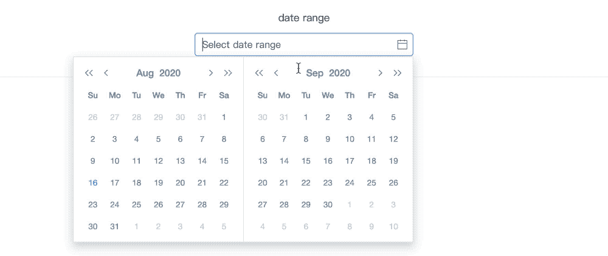

[vue 2-日期选择器](https://mengxiong10.github.io/vue2-datepicker/index.html#Basic)

啊，日期选择器。这是许多生活在野外的应用程序的重要组成部分。在这个列表中，日期选择器的选择比其他任何东西都多，但是由梦熊制作的 [vue2-datepicker](https://mengxiong10.github.io/vue2-datepicker/index.html#Basic) 是我不断返回的一个。它很容易设计风格，提供了广泛的选择日期和日期范围的选项，并被包装在一个光滑的用户友好的用户界面中。它甚至支持 i18n 语言和日期格式本地化。

注意:虽然这个包的名字是 vue2-datepicker，但是将它(或者这里列出的其他包)添加到 Vue 3.0 应用程序应该没有问题。

## 使用

导入组件或视图以使其可用。

```
import DatePicker from 'vue2-datepicker';
**// styles**
import 'vue2-datepicker/index.css';
```

在模板中:

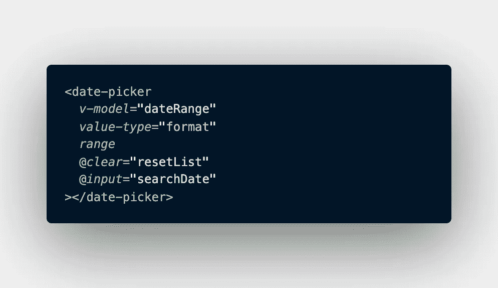

这里我使用 range 选项允许用户选择一个日期范围，并将用户输入的日期转换成一个名为`dateRange`的数据值。`dateRange`然后被 vue-good-table(如下)用来对我的表的结果进行排序。我还使用事件选项`@clear`和`@input`来触发重置表(`resetList`)或发送对表数据的服务器请求(`searchDate`)的方法。Vue2-datepicker 为您提供了更多的选项和事件，但这些是我发现自己最常使用的。

# 用户评级

最佳选择: [vue 星级](https://github.com/craigh411/vue-star-rating)

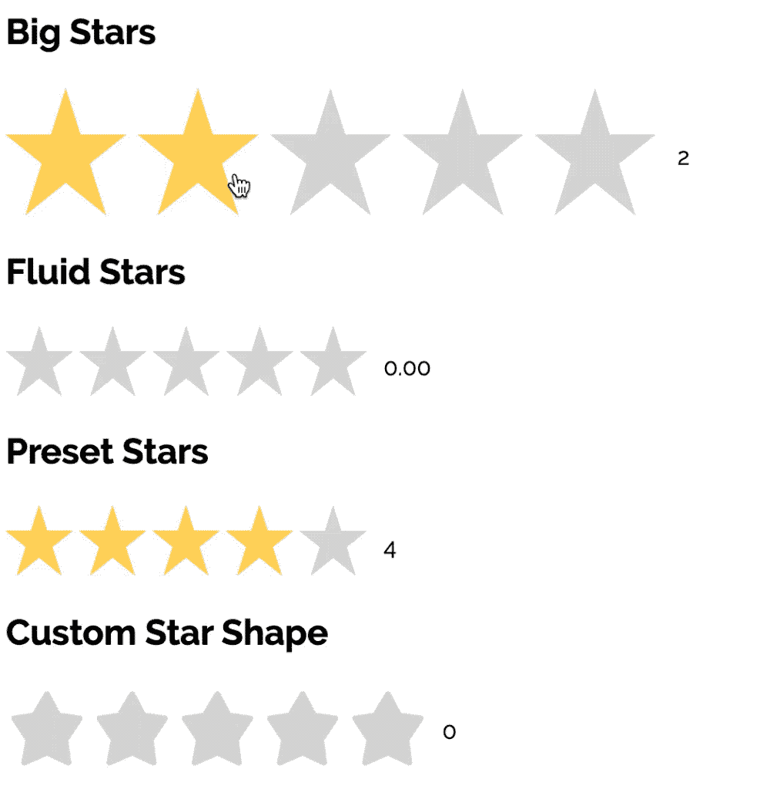

[vue 星级](https://github.com/craigh411/vue-star-rating)

虽然你可能不会在每个项目中都使用这个功能，但对于任何需要用户评级元素的网站(比如亚马逊或烂番茄)，vue-star-rating 是我的首选。这可能看起来像是一件小事，但是当你进入细节时，星级评定会很快变得比你想象的更复杂。如果您需要一些特殊的东西，它允许您使用定制的 SVG 形状，并且可以轻松定制大小、间距和颜色。

这些选项使用户可以很容易地选择评级到任何你想使用它们的地方，并且你可以用一个道具将评级设置为可变的或只读的。

如果你发现需要更多的选项，看看创造者的扩展包[vue-rate-it](https://github.com/craigh411/vue-rate-it) **。**

## 使用

在模板中(带选项):

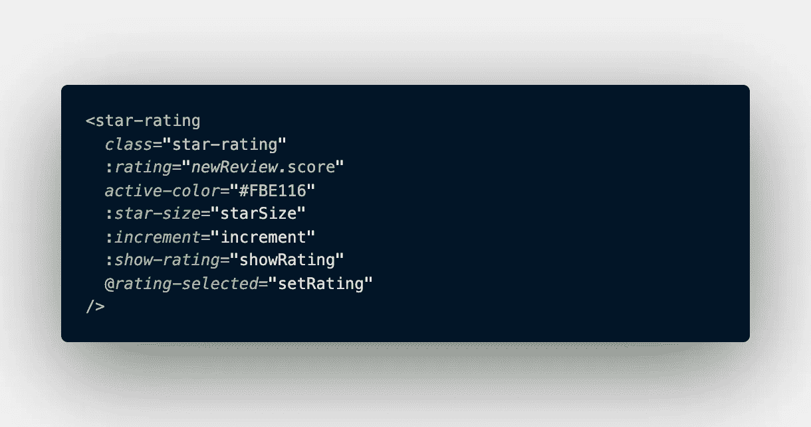

将其导入到组件或视图中:

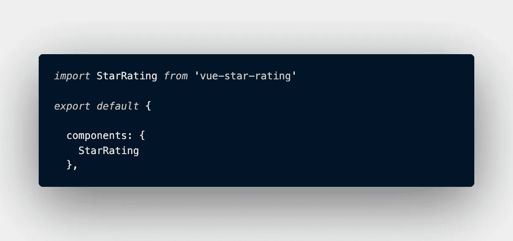

如果你正在寻找一个没有在这里列出的特定类型的库，请在评论中留言，我会尽力为你提供一些选择。