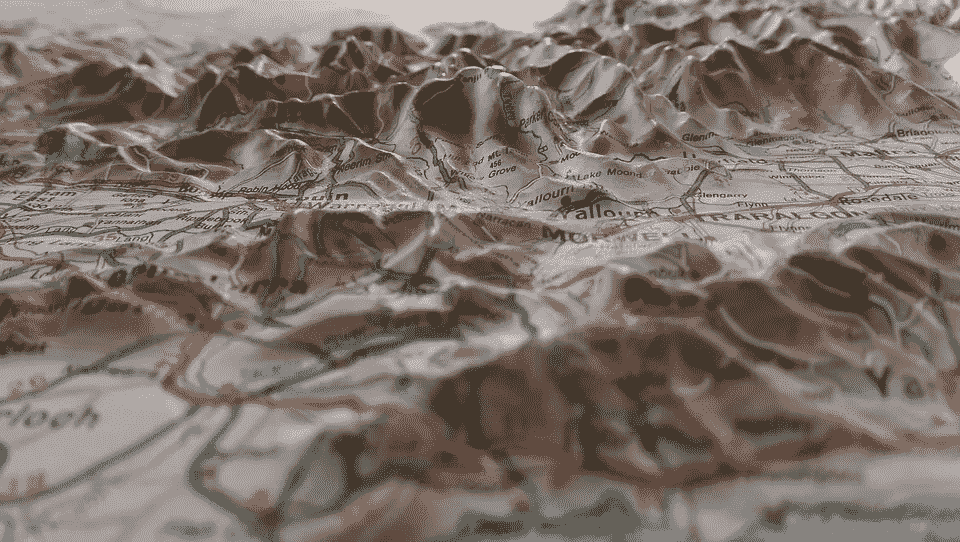
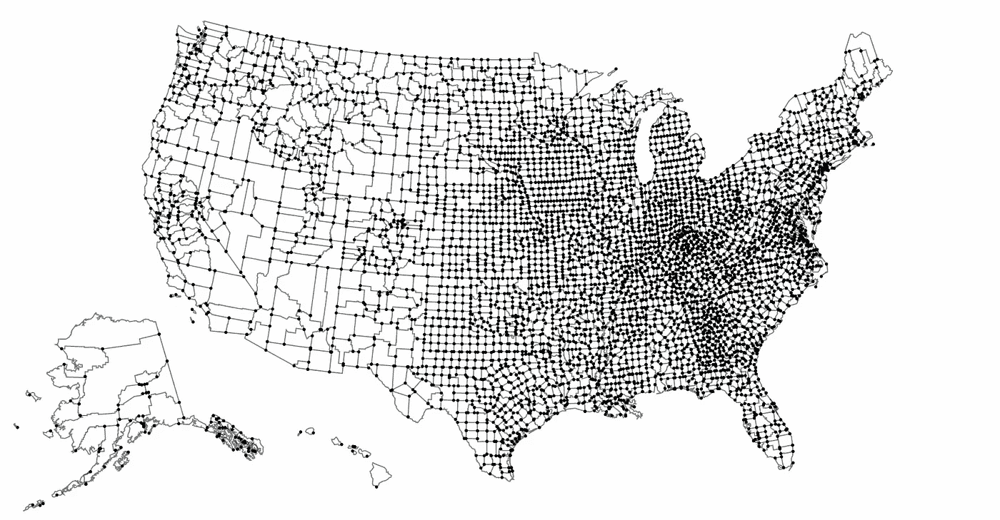
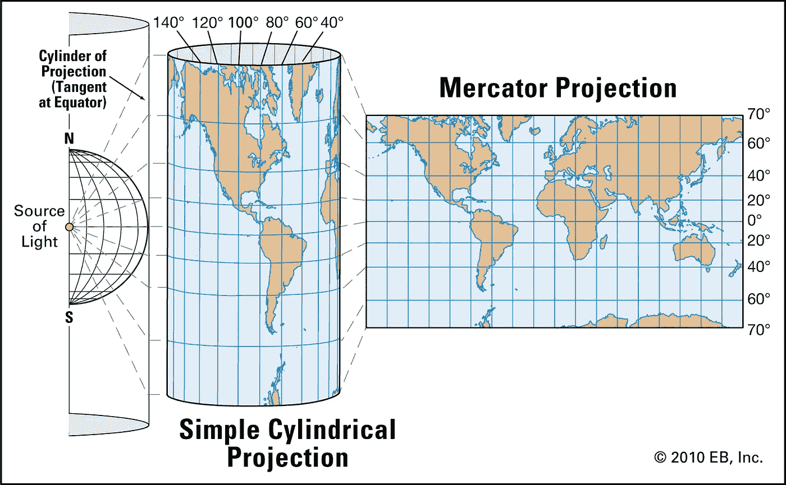
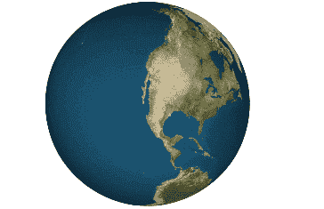
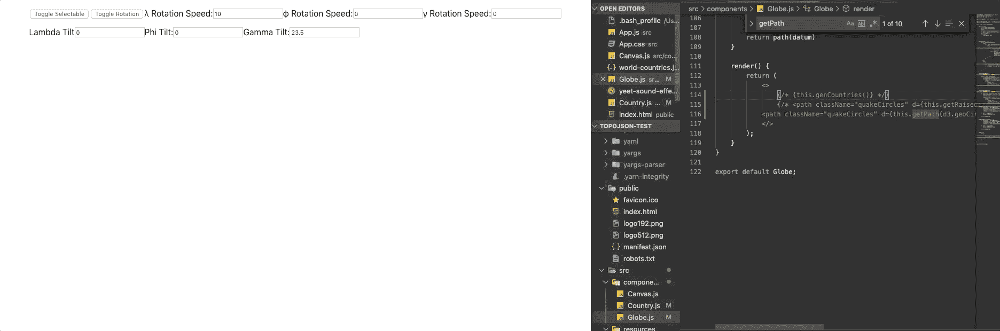
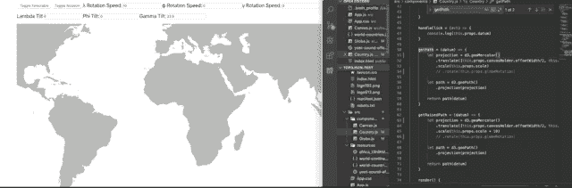
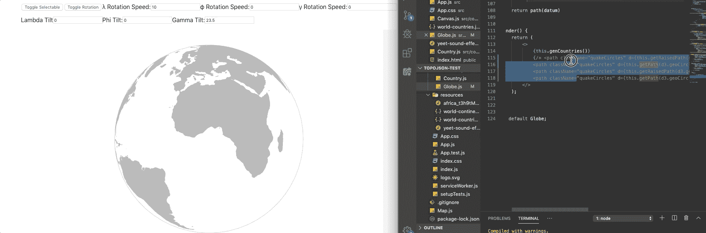

# TopoJSON、GeoJSON 和投影:为 Web 应用程序开发交互式地图视觉效果

> 原文：<https://betterprogramming.pub/topojson-geojson-and-projections-developing-interactive-map-visuals-for-web-apps-79e2d50abb19>

## 如果你以前不喜欢地图，你可能现在也不会喜欢——但是请听我说完

图片由[克劳迪娅·斯潘塞](https://pixabay.com/users/claudia0spencer-5304639/)在 [Pixabay](https://pixabay.com/photos/maps-topographical-maps-geography-2294276/) 上拍摄

几周前，我开始了一个小型的概念验证项目，作为学习 D3 库的后续工作。

我刚刚结束了一段时间的数据可视化工作，我觉得能够将这些视觉效果转化为更贴近现实世界的格式是一件令人兴奋的事情。两周前，我参观了纽约的现代艺术博物馆，看到了他们在 21 世纪技术展上的一个展览，在那里，艺术家用动画展示了美国多年来的风的图案。

这个实现看起来如此优雅，让我印象深刻，我发现自己在想象他们是如何做到的。我越想这件事，就觉得越难。那天我离开了博物馆，留下了深刻的印象，一段足以作为艺术品展出的优雅代码的珍贵记忆。

有人能够收集大量的风数据，处理到它们的位置和方向，并把它们放在美国地图上，以一种优雅的，易于理解的视觉效果。它是干净的，它是相关的，它看起来很好。人们非常喜欢它，甚至把它放在博物馆里。

这一经历，结合我对 D3 库的探索，启发我研究地理框架中的地图数据。这是一个我们每天都可以看到的概念:谷歌地图中的 GPS 路线，新闻中的天气模式，以及你所在地区的当地餐馆/商店。将数据映射到地理位置的功能非常强大，因为它易于解释且具有关联性。如今，我们如此频繁地接触到地图，以至于我们一眼就能认出它们的背景——并几乎立即将它们与我们自己联系起来。

因此，我为自己设立了一个项目，一开始很简单，但很容易扩展:我想编写一个 web 应用程序，它可以呈现一个响应我的操作并支持基于纬度和经度绘制数据的地球地图。在我从事这项工作的几天里，我了解了各种使用地图编码的工具和资源，但我想特别强调两个我认为对入门最重要的工具:GeoJSON/TopoJSON 文件格式和地图投影库。

# GeoJSON vs. TopoJSON:它们是什么？

当试图渲染一张地图时，你需要的第一个也是最重要的资源，不出所料，就是地图。有许多 API 和格式存储地图绘制的数据，但最流行的两种(也是我使用的)是 TopoJSON 和 GeoJSON 文件。

那么它们是什么呢？TopoJSON 文件是 GeoJSON 的衍生物，所以让我们从父文件开始。

## 杰奥森

GeoJSON 文件是一种以 JavaScript 对象表示法(JSON)存储地图形状的格式。它们通常被格式化为一个`Feature Collection`以供编码库解释，并包含要绘制的属性数组(每个属性被称为一个`Feature`)。

GeoJSON 特性有两个键:`geometry`和`properties`。

`properties`键存储通常用于特征识别/标签的一般信息。

`geometry`键是渲染更关键的部分。它存储了`Feature`的几何类型和一组坐标，其格式因几何类型而异。`Feature`的类型范围为:`Point`、`LineString`、`Polygon`、`MultiPoint`、`MultiLineString`和`MultiPolygon`。

从这些类型中，可以生成可视属性的任何排列。渲染库将此类型与坐标集合结合使用，以正确绘制彼此相关的地图要素。

GeoJSON 文件的显著特点是可读性相对较好，并且能够像简单的复制粘贴一样方便地在集合中提取/添加/传输要素。通过 GeoJSON 在地图上绘制的每个形状都有相应的要素，并且可以像这样进行操作。

然而，GeoJSON 的缺点来自同样的原理——geo JSON 中的每个形状都有自己的特征。因此，相邻要素之间的许多边界最终会在内存中存储两次/三次/四次。众所周知，GeoJSON 文件非常大，尤其是对于像下面的美国地图这样的详细布局，而且它们并不总是最适合于通过网络轻松传输。

这就是 GeoJSON 的表亲 TopoJSON 文件的用武之地。

美国的铁丝网地图，取自 [TopoJSON GitHub 页面](https://github.com/topojson/topojson/wiki)

## 托普杰松

TopoJSON 文件与 GeoJSON 相似，都是作为 JavaScript 对象存储的。

但是，从可读性来说，TopoJSON 文件是非常非常卑鄙的。下面我复制了一个记录到浏览器控制台的 TopoJSON 对象的粗略描述。要点是:TopoJSON 文件不是将每个要素存储为其自身的形状，而是将地图上的每条线/边存储为一个`arc` *。*

它们还存储了一组要绘制的对象，作为一个引用回 arc 数组的`Geometry Collection` 。就可读性而言，数组中的数组和引用嵌套数组中索引的嵌套几何对象是一场噩梦。除非您对格式非常感兴趣，否则我不会费心去理解它，但是语法确实有一些主要的好处。

由于 TopoJSON 文件从共享边构建形状，而不是单独追踪每个形状，因此它们的文件大小通常比引用同一地图的 GeoJSON 文件小一个数量级。例如，存储上述美国地图几何的 TopoJSON 文件的大小约为其对应 GeoJSON 的五分之一。为了便于移植和传输，TopoJSON 文件脱颖而出，尤其是当您的地图变得更加复杂时。

许多渲染库需要 GeoJSON-esque 文件格式来绘制，但是有很多工具可以在两者之间进行转换。例如，在 JavaScript 中，`topojson-client`库有一个从 TopoJSON 对象中提取 GeoJSON 要素的`Feature`函数，允许以较小的文件大小存储，并具有 GeoJSON 格式的处理优势。

现在我们有了地图的来源，我们如何绘制它呢？或者更准确的说，我们*希望*怎么画？

# **地图投影库**

地图地理文件根据地理坐标系存储要素、坐标和几何图形，即，它们根据纬度、经度及其在地球上的空间位置来确定所有事物的方向。

对我们来说不幸的是，电脑屏幕不是球形的——它们是平的。所以为了解决这个问题，我们最终探索了地图投影的世界和支持它们的代码库。

## 什么是地图投影？

最简单地说，地图投影是一种在地图上绘制时展平坐标的方式。这很容易做到，但从头开始实现可能非常困难。

墨卡托投影如何拉伸和展开的视觉效果

地图投影通常会展平、压缩和扭曲地图要素，以使其适合可展开到平面页面上的表面。

例如，墨卡托投影是学校中最常用的投影类型之一，是一种*圆柱投影。*圆柱形投影是最常见的投影，因为它们可以在地球上人口最稠密的地区保持地图的准确性。

然而，有数百种其他选择，各有各的好处。例如，下面是 Dymaxion 投影的动画，这是我个人的最爱之一。它以极低程度的地图失真而闻名([对那些感兴趣的人来说](https://en.wikipedia.org/wiki/Tissot%27s_indicatrix))，并且几乎完全避免了展开时的陆地中断。这对绘制人类迁徙模式很有帮助。

Dymaxion 投影展开的近似示例

但是回到正题:我们如何获取地图文件并生成平面视觉投影以便在屏幕上呈现？我们的答案是`libraries-code`图书馆。

在数学方面比我强得多的人已经把将经度/纬度转换成 2D *x* 和 *y* 位置所需的函数和运算放在了一起，并且他们已经在代码库中包含了这些函数。几乎每一种主要语言都有为此目的而构建的库，开源的或其他的。因为我们使用的是 JSON 格式，所以理想情况下我们会在 JavaScript 中使用。幸运的是，我发现 D3 有一个子库，d3-geo，专门用于这个。

有了这个库，我们能够将地图数据转换成 D3 支持的任何 2D 投影。我们终于拥有了开始处理、渲染和操作地图所需的所有工具和知识。也就是说，让我们开始建造我们的地球。

# 制作地球仪

为了生成我的 globe，我在 React 框架中构建了应用程序，部分作为测试，部分使用 React 状态的响应性作为与我的地图动态交互的方式。

首先，我在一个名为`Canvas`的组件中呈现了一个 SVG，以包含我需要为 globe 特性绘制的所有下游路径。然后，我渲染了一个名为`Globe`的子组件，它处理地图特征的生成。

在 SVG 内部，我们可以开始绘制的步骤。首先，我将我的 TopoJSON 文件导入到组件中，然后使用`topojson-client`将特征提取为 GeoJSON 格式。

这将把我们的特性存储在一个新的数组中，我们将其命名为`data`。这些特性是我们可以插入 D3 来生成绘图路径的。

为此，我们首先使用`d3-geo`生成一个投影函数。为了测试，我们将从墨卡托投影开始。一旦我们配置了投影函数，我们就把它传递给另一个`d3-geo`函数`geoPath`。这将为我们返回另一个函数，该函数接受 GeoJSON 要素并返回路径属性。如果这很难做到，请随意参考下面的代码。

现在，`path`将存储一个函数来生成我们的 SVG 路径。使用它，我们可以传递每个 GeoJSON 特性的路径，它将返回路径的 *d* 属性。

为了实现这一点，我制作了一个`Continent`组件，它将一个特性作为`datum`道具。使用这个道具和我的`path`生成器，我可以为集合中的每个特征渲染路径。例如:

请注意，因为每个洲`path`都是它自己的组件，所以我可以专门为每个洲添加事件监听器，并让它们做出独特的响应。结合所有这些函数，我可以将我的所有特性绘制到我的 SVG 中，并让它们做一些有趣的事情。像这样:

我的地形地球项目中的墨卡托投影

现在我们已经渲染好了路径，但是还有一些工作要做。首先，它不完全是一个地球仪。第二，它不是旋转的。第三，也是最后一点，我们需要确保我们可以基于纬度/经度适当地渲染全球的视觉效果。第一个问题实际上很容易解决，第二个问题很容易解决。

`d3-geo`有正投影类型，所以渲染成地球仪就像改变我们的投影函数一样简单。

然而，这只会向我们展示地球的前部，覆盖应该出现在它后面的任何东西。我们可以通过在投影中添加一个旋转配置来补偿这一点，它可以在三个轴上旋转地图。通过定制这些价值观，我们可以改变地球面对我们的那一面。此外，如果我们使这个旋转值依赖于状态，我们可以让用户随心所欲地旋转地球。

将投影类型更改为正交，并将旋转设置为依赖于状态

我们快到了。由于旋转取决于状态，添加自动旋转就像设置一个计时器/时间间隔来定期增加状态一样简单。最后，我们需要确保我们可以在地图上渲染对应于适当纬度/经度的数据点。

由于我们实现这个地图的方式，这变得非常容易。只要我们能够生成一个合适的 GeoJSON 对象，我们实际上可以将它传递给我们用来制作大陆的路径生成器。投影和路径生成功能将为我们处理所有困难的部分，GeoJSON 格式比其他格式更容易自定义创建和操作。

事实证明，`d3-geo`再次帮助了我们，它为我们提供了一种只使用纬度、经度和半径生成 GeoJSON 圆的方法。使用`geoCircle`功能，我们可以自定义创建我们的圆，如下所示:

这样，我们为视觉效果生成了两个圆及其阴影:`0, 0`处的`circle1`和东经 10 度的`circle2`。

我们可以在投影中用较高的比例值绘制圆，使它们看起来高出地球表面。然后我们可以用和地球一样的比例画阴影，让它们看起来像是我们的飞碟投下的。

最后，你会得到这样的东西:

它将给我们的地球带来美观、精确的视觉效果。

飞行中的红色圆盘出现在赤道上

# 结论

在过去的一个月中，地图生成和数据绘制已经成为我的一个小爱好，我正在使用这些技术进行几个项目，以巩固理解和测试限制。当我第一次开始探索地图绘制和地理渲染时，我并不知道它到底能有多深。这是一个难以置信的深兔子洞，但玩投影类型和动态地图渲染是我编码时最有趣的事情。

理解地图数据格式并能够遍历它们是非常强大的技能，我强烈鼓励任何对这种材料感兴趣的人探索它的库和资源。D3 的网站上有[几十个](https://bl.ocks.org/atanumallick/8d18989cd538c72ae1ead1c3b18d7b54) [的](https://bl.ocks.org/larsvers/dab7c2d6ea5ab964d10df0ef1470b90e) [类似实现的例子](http://bl.ocks.org/PatrickStotz/1f19b3e4cb848100ffd7)。

我将在下面链接我的`topojson-test`项目的 Git repo，我希望我已经激励了你们中的一些人将类似的项目作为对自己的挑战。感谢您的阅读，祝您好运！

 [## gritheorange/topo JSON 测试

### 这个项目是用 Create React App 引导的。在项目目录中，您可以运行:在…中运行应用程序

github.com](https://github.com/griftheorange/topojson-test)  [## D3/D3-地理

### 地理投影、球面形状和球面三角学。-D3/D3-地理

github.com](https://github.com/d3/d3-geo)  [## 杰奥森

### GeoJSON 是一种用于编码各种地理数据结构的格式。GeoJSON 支持以下几何图形…

geojson.org](https://geojson.org/)  [## 托普杰松/托普杰松

### TopoJSON 是 GeoJSON 的扩展，对拓扑进行编码。几何图形不是离散地表示，而是…

github.com](https://github.com/topojson/topojson)