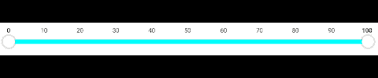
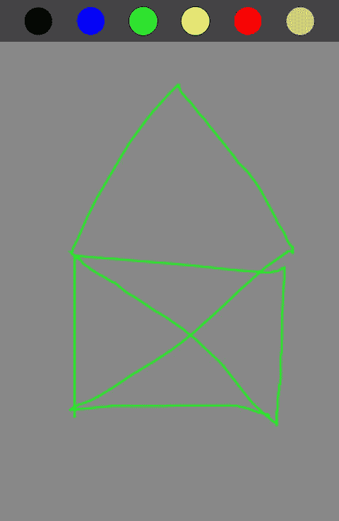
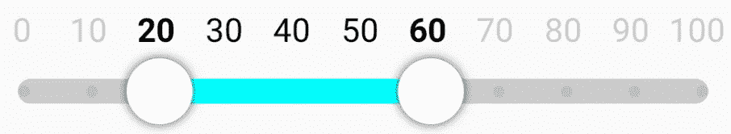

# Jetpack Compose 中的触摸交互

> 原文：<https://betterprogramming.pub/touch-interactions-in-jetpack-compose-caf88adcae61>

## 构建一个可拖动的标签范围滑块


安德烈·利亚科夫在 [Unsplash](https://unsplash.com?utm_source=medium&utm_medium=referral) 上拍摄的照片

在系列的第一部分[中我们学习了如何在画布上绘制不同的形状之后，让我们看看在第二部分中如何处理触摸交互。](https://medium.com/@alex.frank84/custom-composable-with-jetpack-compose-912d8c53b810)

提醒一下，有了这个主题，我们将能够使我们的标签范围滑块可拖动。



为了简单起见，我们将创建一个可组合的 Scribble，来探索我们如何处理触摸交互。



可组合的涂鸦

# 触摸交互

对于常规的交互式可组合组件，我们通常使用修饰符 clickable:

```
*Canvas*(
   modifier = Modifier.*clickable* **{** Log.i("Tag", "Canvas clicked")
   }
) {
   // draw something
}
```

还是实验性的`combinedClickable`:

```
*Canvas*(
   modifier = Modifier.*combinedClickable*(
      onClick = { Log.i("Tag", "Canvas clicked") },
      onLongClick = { Log.i("Tag", "Canvas long clicked") },
      onDoubleClick = { Log.i("Tag", "Canvas double clicked") }
   )
) {
   // draw something
}
```

如果我们只想处理整个可组合组件上的一次单击，这两种方法都很有效。

但是对于我们的例子，我们希望有更多的控制。我们需要知道点击发生的确切位置，以及用户是否在屏幕上拖动手指。幸运的是，Compose 为我们提供了修饰语`pointerInput` **，**，这提供了我们需要的信息。

# 手势检测器

使用`**pointerInput**`最简单的方法是实现一个已经提供的手势检测器。

*   `detectTapGestures`:这与`combinedClickable`修改器非常相似，处理轻击、双击、按压和长按。这个修饰符为我们提供了用户在我们的可组合对象中粘贴的确切位置。
*   `detectDragGestures`:使用这个检测器，我们可以检测手指在我们的组件中拖动的起点、终点和路径。
*   `detectHorizontalDragGestures`:顾名思义，这类似于`detectDragGestures`，但是只为我们提供了水平拖动运动的更新。
*   `detectVerticalDragGestures`:类似`detectHorizontalDragGestures`，但只提供垂直拖动动作。
*   `detectDragGesturesAfterLongPress`:使用这个检测器，我们获得了与`detectDragGestures`相同的信息，但只是在用户执行了长按之后。
*   `detectTransformGestures`:变换手势检测器为我们提供旋转、平移和缩放手势的更新位置信息。

如果这些预定义的检测器仍然不够，并且您想要完全控制如何处理触摸，您可以使用`awaitPointerEventScope`。

对于我们的可组合的 Scribble 示例，我们将重点关注使用`detectDragGestures` **。**因为这个检测器让我们知道用户从哪里开始触摸，并且在手指拖过我们的可组合组件时不断更新。

```
*Canvas*(
   modifier = modifier
      .*pointerInput*(key1 = *Unit*) {
         detectDragGestures(
            onDragStart = { touch ->
               Log.i("Tag", "Start of the interaction is $touch")
            },
            onDrag = { change, dragAmount ->
               Log.i("Tag", "Dragged $dragAmount; Result $change")
            }
         )
      }
) {
   // draw something
}
```

这里我们在`pointerInput`中注册了一个拖拽手势检测器。对于参数`key1`，我们简单地提供`Unit`。因为我们不希望当`key1`改变时我们的检测被取消。在`pointerInput`中，我们调用`detectDragGestures`。这为我们提供了用户在回调`onDragStart`中开始交互的信息，以及手指在`onDrag`中采取的路径的连续更新。

`onDrag`回调有两个参数，第二个给我们最后一次拖动的增量。这不是手指现在所在位置的绝对位置，而只是到最后一次位置更新的变化。另一方面，第一个参数为我们提供了更多的细节，比如历史数据和手指在组件上的绝对位置。

为了简单起见，我们将使用第一个参数`change`来获得创建线条画的绝对位置。

```
var points by *remember* { *mutableStateOf*<List<Offset>>(*emptyList*()) }

...
         detectDragGestures(
            onDragStart = { touch ->
               points = *listOf*(touch)
            },
            onDrag = { change, _ ->
               val newPoint = change.position
               points = points + newPoint
            }
         )
...
```

首先，我们创建一个可变状态`points`,它可以保存一个偏移量列表，该列表将保存手指在画布上拖动的路径。当拖动手势开始时，我们创建一个新的列表，并向其中添加触摸点。之后，我们只需查看`change.position`，它给出了画布上触摸的绝对位置，我们可以将它添加到我们的路径中。

这种方法是可行的，当我们现在绘制路径时，我们可以得到一个不错的结果。但是如果我们想要有一个更平滑的结果，我们也应该考虑历史数据。

```
...
onDrag = **{** change, _ **->** val pointsFromHistory = change.historical
      .*map* **{ it**.position **}** .*toTypedArray*()
   val newPoints = *listOf*(*pointsFromHistory, change.position)
   points = points + newPoints
**}
...**
```

这里我们迭代历史数据，它代表两个`**onDrag**`****之间的点更新，并得到其位置。这样，我们只需将历史位置和当前位置添加到路径列表中。****

****现在剩下要做的就是在画布上绘制路径，使用我们在本系列第一部分看到的`**drawPath**` 方法。****

```
**...
if (points.size > 1) {
   val path = *Path*().*apply* {
      val firstPoint = points.*first*()
      val rest = points.subList(1, points.size - 1)

      moveTo(firstPoint.x, firstPoint.y)
      rest.*forEach* {
         lineTo(it.x, it.y)
      }
   }

   drawPath(path, color, style = Stroke(width = lineWidth.*toPx*()))
}
...**
```

****当列表中有多个点时，我们创建一个新的`Path`对象，将路径的起点移动到第一个点，然后将列表中的所有线添加到路径中。因为我们希望只绘制线条而不填充区域，所以我们用样式`Stroke`绘制路径。****

****在这个实现中，要绘制的线条的紧密度被参数化为类型`Dp`的`lineWidth`，但是 Stoke 想要像素作为它的宽度参数。幸运的是，我们画布的`DrawScope`为我们提供了扩展函数`toPx`，用它我们可以将 Dp 转换成像素。****

# ****结论****

****我们现在能够在自定义的可组合组件上处理触摸交互，并将其转化为动作。这样，我们就可以画出我们的标签范围滑块，并与之交互。****

********

****但是在我们开始实现它之前，我们先来看看第 3 部分中新的 Kotlin 上下文接收器。敬请关注。****

****Scribble Composable 的完整代码可以在 [GitHub](https://github.com/a-frank/touch-interaction-composable) 上找到。****