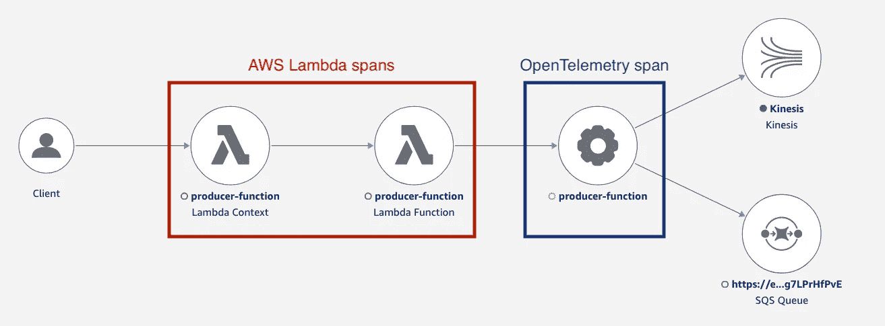
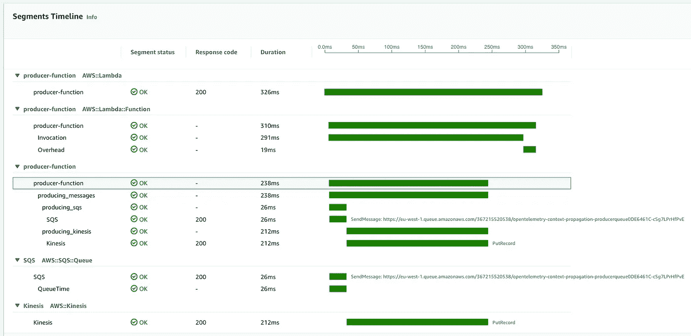
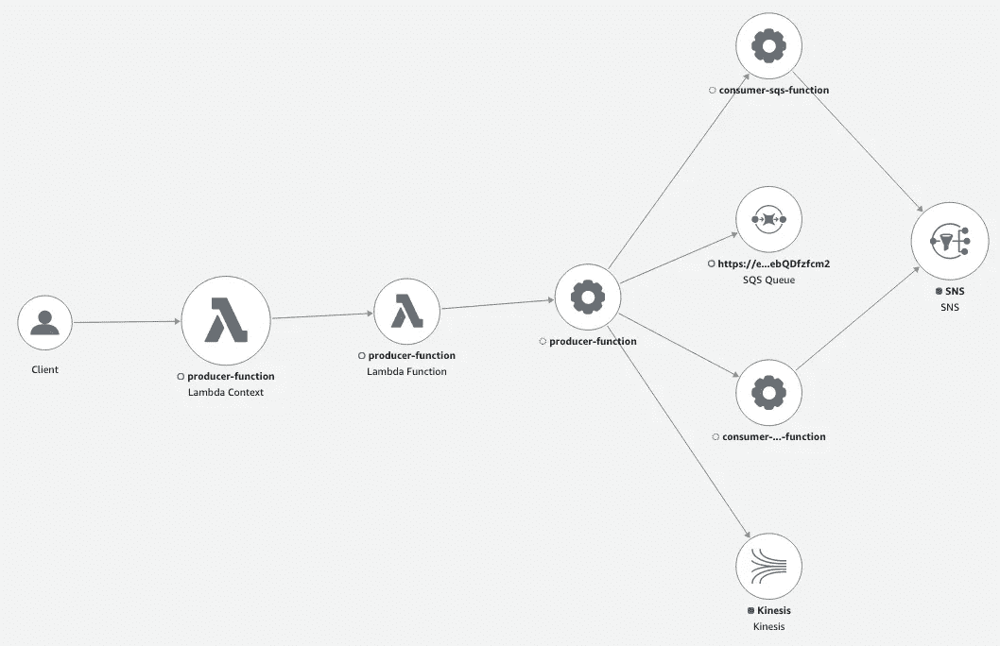

# 使用 OpenTelemetry 跟踪上下文传播

> 原文：<https://betterprogramming.pub/trace-context-propagation-with-opentelemetry-b8816f2f065e>

## [寻踪思考](https://medium.com/@dmitrykolomiets/list/musings-on-tracing-3d7bd0d2093c)

## 将 AWS 发行版用于 OpenTelemetry 的实用说明


由[安妮·尼加德](https://unsplash.com/@polarmermaid?utm_source=medium&utm_medium=referral)在 [Unsplash](https://unsplash.com?utm_source=medium&utm_medium=referral) 上拍摄

```
**Table of Contents**[Summary](#03f1)
[Trace context propagation](#c370)
[End to end trace](#9687)
[Dangling AWS Lambda traces](#e3e7)
[Conclusion](#762b)
[Resources](#456e)
```

> 到目前为止，我一直在谈论 OpenTelemetry 和 ADOT，没有讨论具体的编程语言。下面的帖子是基于 ADOT Python 的 [AWS 托管 Lambda 层。我相信其他语言的结论也是一样的。](https://aws-otel.github.io/docs/getting-started/lambda/lambda-python)

# 摘要

这篇文章的目的与前一篇文章中的[ADOTλ层](https://medium.com/@dmitrykolomiets/trace-context-propagation-in-event-driven-architectures-ba9181b1b57#add-the-arn-of-the-lambda-layer)添加到您的函数中——这将安装 OpenTelemetry SDK、ADOT 收集器、AWS 特定扩展等。

*   [通过添加带有`/opt/otel-instrument`值的`AWS_LAMBDA_EXEC_WRAPPER`变量启用自动仪表](https://aws-otel.github.io/docs/getting-started/lambda/lambda-python#enable-auto-instrumentation-for-your-lambda-function)

即使不了解幕后发生的一切，这看起来已经很不错了。

## 自动化仪器——跟踪结构

作为健全性检查，我们可以在控制台中调用 Producer 函数(使用任何有效负载),并在 X 射线控制台中查看结果跟踪:



让我们回顾一下捕获的 X 射线轨迹的结构——当我们稍后转向手动仪器时，会有一个重要的区别。

> x 射线服务使用[段](https://docs.aws.amazon.com/xray/latest/devguide/xray-concepts.html#xray-concepts-segments)和[子段](https://docs.aws.amazon.com/xray/latest/devguide/xray-concepts.html#xray-concepts-subsegments)的概念来表示组成跟踪的工作单元之间的父/子关系。出于同样的目的，OpenTelemetry 使用了一个[跨度](https://opentelemetry.io/docs/concepts/data-sources/#traces)的概念——可能有父跨度和子跨度。
> 尽管我们使用 X 射线控制台来查看结果轨迹，但我将在本文中使用 OpenTelemetry 术语。

AWS Lambda 服务将前两个跨度添加到跟踪中。理解这两个跨度甚至在调用我们的生成器 lambda 之前*就被捕获并导出到 X 射线是很重要的。*

> AWS Lambda 将这两个跨度**直接**导出到 X 射线。在撰写本文时，无法配置 AWS Lambda 并指定另一个遥测后端，如 Jaeger、Splunk 等。
> 暗示—如果 OpenTelemetry 配置了另一个遥测后端，AWS Lambda 特定的跨度将**而不是**导出到那里。

下一个`producer-function`跨度是由 OpenTelemetry 捕获的跨度——这是由自动仪器启动脚本创建的跨度(还记得我们设置为`AWS_LAMBDA_EXEC_WRAPPER`环境变量的`/opt/otel-instrument`脚本吗？).

如果我们选择`producer-function` span，我们将看到我们在 lambda 函数中手动创建的子`producing_messages` span。AWS SQS 和 AWS Kinesis 服务还有两个额外的跨度——这些是从`boto3`库中捕获的。当使用自动检测时，启动脚本检测最常见的 Python 库，以从它们自动捕获跨度。注意*仪器*应该[安装和包装](https://aws-otel.github.io/docs/getting-started/python-sdk/trace-auto-instr)带有你的 lambda 功能，这样才能工作。你可以在 GitHub 上找到[受支持库的完整列表。](https://github.com/open-telemetry/opentelemetry-python-contrib/tree/main/instrumentation)



生产者函数跟踪

希望您对使用自动仪器时会发生什么有更好的了解。让我们继续下一个λ。

## 消费者 SQSλ函数

该函数需要从 SQS 消息中提取跟踪上下文，并确保该函数生成的新范围“继续”消息的原始跟踪。同样，我们对这个 lambda 使用自动仪器。下面是实现过程:

与生产者 lambda 一样，我们不需要为 OpenTelemetry 配置太多的麻烦。我们从 SQS 消息中提取出`traceId`和`spanId`字段——这一部分与我们之前使用 X 射线的[文档](https://medium.com/@dmitrykolomiets/trace-context-propagation-in-event-driven-architectures-ba9181b1b57#creating-custom-spans):

> 请注意，只有`Server`类型的跨度被转换为 X 射线段，所有其他跨度都被转换为 X 射线子段。

如果您计划将 OpenTelemetry 轨迹导出到 AWS X-Ray，请记住这个模糊的细节。如果你使用另一个遥测后端-其他[跨度种类](https://opentelemetry.io/docs/instrumentation/js/api/tracing/#span-kind)可能是有用的。

**跨度链接**
注意，我们在创建`consuming_sqs`跨度时添加了一个可选的`links`参数。

这个想法很简单——每个 lambda 调用可能会促成*多个*跟踪，有一种方法将它们关联起来可能会很有用。在我们的例子中，我们有一个由 SQS 服务触发的 lambda 函数。以下是用一批 N 条消息触发该函数时所涉及的跟踪:

*   **λ调用痕迹**。当 SQS 服务触发 lambda 函数时，会创建一个隐式跟踪。这是“默认”跟踪，即您通常在 AWS X 射线控制台中看到的跟踪。默认情况下，AWS Lambda 服务会发出两个跨度(我们在前面讨论自动检测跟踪结构时讨论过它们)。该跟踪还可以包括 lambda 冷启动或在我们开始处理 SQS 消息之前发生的任何事情的跨度
*   **SQS 消息追踪**——*最多* N 个。请记住，每个 SQS 消息可能属于不同的跟踪，我们希望在处理消息时“继续”原来的跟踪，而不是创建新的跟踪

因此，当我们处理 SQS 消息(向消息的原始跟踪添加跨度)时，我们希望保留到 Lambda 调用跟踪的链接——这对于故障排除场景可能特别有用。

跨度/轨迹之间的联系可能是表达因果关系的有力方式。很难在 AWS X 射线控制台中演示这些链接，因为 X 射线不支持链接(目前？).在下一篇文章中，我将展示相同的 OpenTelemetry trace 在不同的遥测后端(Jaeger)中的样子，并展示链接的有用性。

## 消费者运动学λ函数

最后一个 Kinesis 消费者 lambda 是最棘手的一个，主要是由于[ADOT Python](https://github.com/aws-observability/aws-otel-lambda/issues/238)的 [AWS 托管 Lambda 层中的问题](https://aws-otel.github.io/docs/getting-started/lambda/lambda-python)迫使我放弃自动检测(删除`AWS_LAMBDA_EXEC_WRAPPER`环境变量)。这是一件好事，因为我将演示如何在没有 ADOT 魔法的情况下添加 OpenTelemetry 支持。当心，有许多东西需要吸收:

让我们一步一步地介绍 OpenTelemetry 初始化:

初始化跟踪程序提供程序

我们需要做的第一件事是初始化*跟踪提供者*——这是处理跟踪收集并导出到 OpenTelemetry 收集器的对象。当我们初始化提供者时，我们指定一个 ID 生成器[与 X 射线](https://docs.aws.amazon.com/xray/latest/devguide/xray-api-sendingdata.html#xray-api-traceids)兼容(如果不需要 X 射线支持，则不需要)以及我们希望附加到跨度的其他属性。对于这个例子，我们设置了一个显式的服务名，并捕获了其他特定于 AWS Lambda 的属性(函数 ARN、名称、内存/CPU 分配等)。)

> 跟踪器提供程序只能初始化**一次** —如果您尝试设置另一个提供程序，第二次调用将被忽略。

让我们打开下一行:

*   `add_span_processor`—向跟踪器提供程序注册一个 span *处理器*。处理器是 OpenTelemetry 引入的一种构造，用于在导出数据之前对数据进行预处理(例如，修改属性或样本)或帮助确保数据成功通过管道(例如，批处理/重试)。OpenTelemetry 处理器的一个很好的总结可以在[收集器 GitHub 库](https://github.com/open-telemetry/opentelemetry-collector/tree/main/processor)中找到。
*   `BatchSpanProcessor` —批处理机接受量程并将它们放入批处理。批处理有助于更好地压缩数据，并减少传输数据所需的传出连接数
*   `OTLPSpanExporter` —以[开放式遥测协议](https://github.com/open-telemetry/opentelemetry-specification/blob/main/specification/protocol/otlp.md) (OTLP)格式导出量程。默认情况下，导出器连接到与 lambda 代码一起运行的本地 ADOT 收集器实例。ADOT 收集器负责进一步转发跨度，默认情况下，收集器配置为将跨度传递给 AWS X 射线服务。

概括一下——Tracer Provider 使用`BatchSpanProcessor`和`OTLPSpanExporter`来管理踪迹的收集和向 ADOT 收集器的导出。随着自动化工具的启用，所有这些底层细节都被隐藏了，但是现在我们可以完全控制跨度的处理和导出。我将在以后的帖子中使用这种方法来演示我们如何扩展 ADOT lambda 层提供的功能，并添加对额外遥测后端的支持。

继续前进:

该行启用`boto3` API 的仪器。对于手动插装，插装我们感兴趣的库是我们的责任。

最后(这是双关语)，您可能已经注意到了这段代码:

这是必要的，以确保即使在未处理异常的情况下，所有跨度都正确导出到 ADOT 收集器。当使用`BatchSpanProcessor`时，这一点尤其重要——记住，在将多个跨度转发给收集器之前，它会将它们批处理在一起。如果没有`force_flush`调用，一些跨度可能会丢失(当然，这些将是最重要的跨度)

就是这个！现在你应该对 OpenTelemetry 初始化和基本配置有了一个不错的心理模型，并且理解了 ADOT lambda layer 提供的自动和手动仪器模式之间的区别。

# 端到端跟踪

在我们结束之前，我们应该运行生产者 lambda 函数并检查产生的端到端跟踪:



与我的[前一篇文章](https://medium.com/@dmitrykolomiets/trace-context-propagation-in-event-driven-architectures-ba9181b1b57?source=friends_link&sk=ad98d9cc52bebc6b92074d908b2eb20e)不同，我不知道我在这个跟踪传播的例子中使用了任何“黑客”或不支持的 API。根据 OpenTelemetry 规范，这是一个正确的实现。更好的是，我们可以通过 OpenTelemetry 获得端到端的 X 射线追踪。

# 悬空 AWS Lambda 轨迹

我们在上面简要介绍了 AWS Lambda 服务导出的跨度。当我们在 X 射线中查看完整的服务地图时，这些跨度清晰可见:


消费者 lambdas 发射 OpenTelemetry 跨度“继续”我们的主要端到端跟踪。同时，我们仍然有 AWS Lambda 服务为这些函数发出的跟踪。这些迹线与主端到端迹线分离或“悬空”。由于 AWS Lambda 和 AWS X 射线服务之间的直接集成，它们在 X 射线控制台中是可见的。请记住，如果您要使用 OpenTelemetry 的不同遥测后端，这些 AWS Lambda 跨度将*而不是*被导出。

# 结论

通过展示如何将 OpenTelemetry 集成到事件驱动的 AWS 架构并获得完整的端到端跟踪，我们已经在这篇文章中涵盖了很多内容。我们仍然使用 AWS X-Ray 作为我们的主要遥测后端，但我们没有必要这样做——使用 OpenTelemetry，我们可以将轨迹导出到另一个后端，或者同时将事件导出到多个后端。这就是我们在下一篇文章中要做的——我将向你展示如何与 [Jaeger](https://www.jaegertracing.io/) 集成——一个流行的开源分布式追踪后端。

# 资源

*   您可以在[Kolo miets/tracing-playground](https://github.com/kolomiets/tracing-playground/tree/main/opentelemetry-context-propagation)GitHub 资源库中找到我们上面讨论过的完整项目
*   为了感受一下 OpenTelemetry 生态系统的规模，请看一下 [OpenTelemetry Registry](https://opentelemetry.io/registry/)