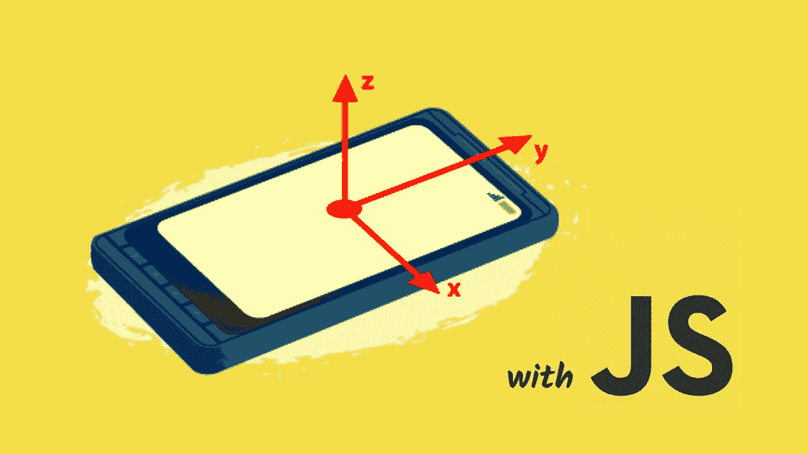
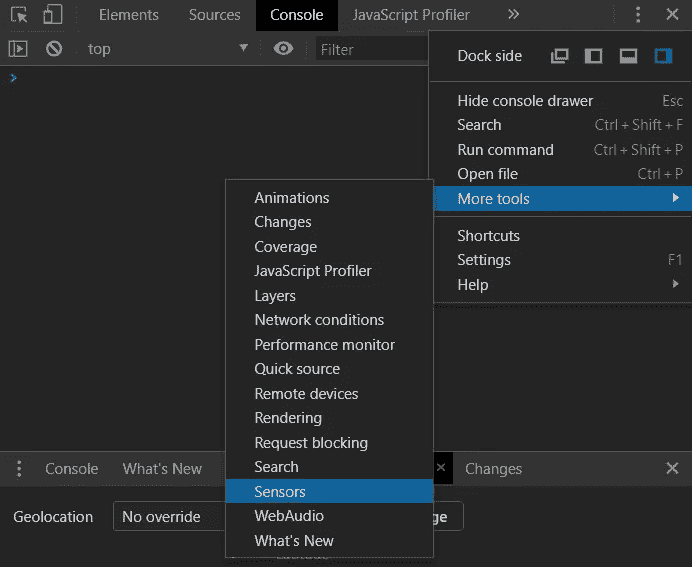
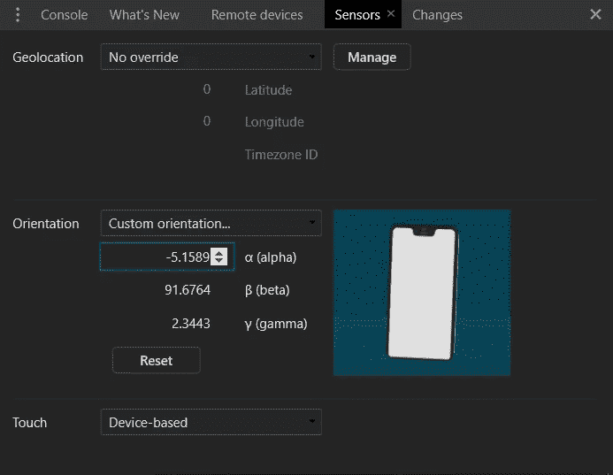
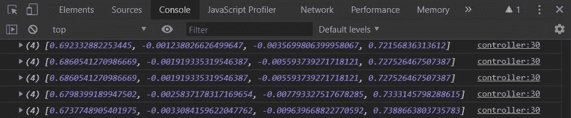
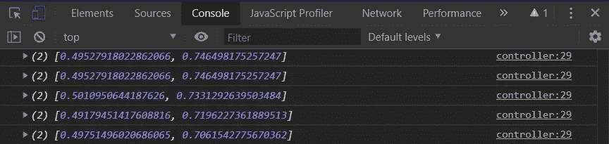
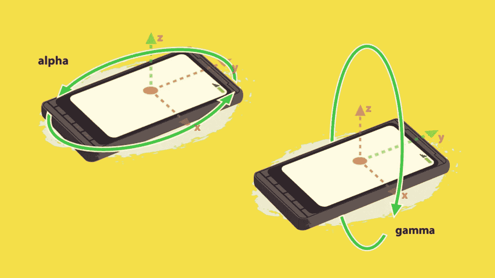
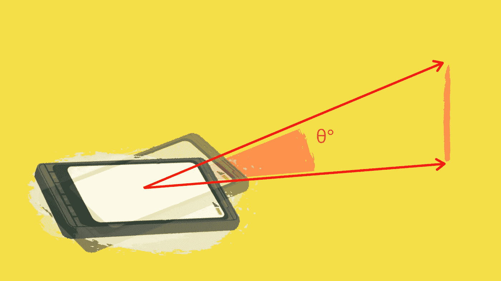
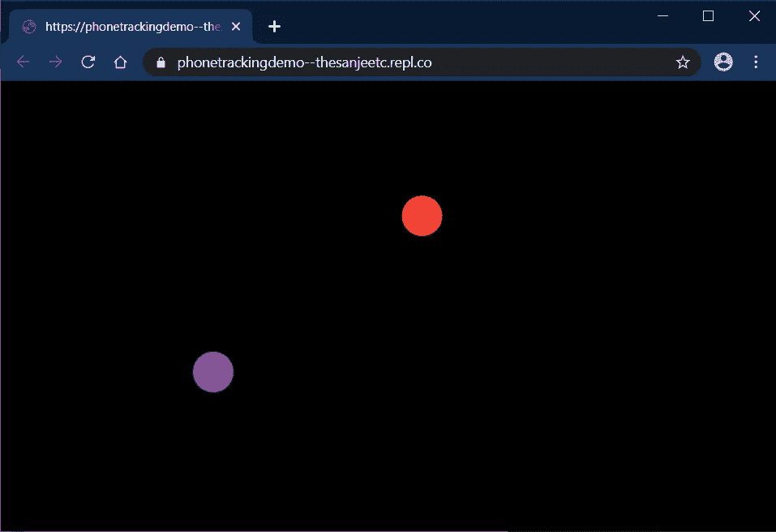

# 用 JavaScript 在 2D 追踪你的智能手机

> 原文：<https://betterprogramming.pub/track-your-smartphone-in-2d-with-javascript-1ba44603c0df>

## 想象一下你可以用这种新的互动媒介做什么

作者照片。

随着向网络的根本性转变，我们能够直接在浏览器上做非常酷的事情。在本教程中，我们将利用[通用传感器 API](https://developer.mozilla.org/en-US/docs/Web/API/Sensor_APIs) 将你的智能手机变成一个具有实时跟踪功能的指针。

这是我们要做的:

# 先决条件

*   截至发稿时，iOS 上还不支持通用传感器 API。此外，一些 Android 智能手机没有所需的传感器。但是，仍然可以使用 Chrome DevTools 中的模拟传感器来完成本教程:

*   也可以通过 USB 从 Android 智能手机上查看 Chrome 的控制台输出，尽管这需要一些进一步的设置。
*   通用传感器 API 需要安全上下文。因此，HTTPS 需要。你既可以用传感器模拟器在本地主机上工作，也可以用智能手机在在线代码编辑器(比如 [Repl.it](http://repl.it) )上工作。

*注意:教程的所有内容都可以在*[*this*](https://repl.it/@thesanjeetc/PhoneTrackingDemo)*Repl 中找到，在这里你可以浏览和编辑代码，也可以尝试演示。*

# 跟踪您的智能手机

让我们从一个通用的`controller.html`文件和相应的`controller.js` 脚本开始:

通用传感器 API 支持[多传感器](https://mobiforge.com/design-development/the-generic-sensor-api)。但是，对于我们的需求，我们将使用 AbsoluteOrientationSensor。

根据 [MDN web 文档](https://developer.mozilla.org/en-US/docs/Web/API/AbsoluteOrientationSensor),`AbsoluteOrientationSensor`*是一个传感器融合 API，它“描述了设备相对于地球参考坐标系的物理方向”*

*通过合并来自多个真实传感器的数据，可以实现新的虚拟传感器，这些传感器可以合并和过滤数据，以便更容易使用——这些传感器被称为融合传感器。在这种情况下，来自机载磁力计、加速计和陀螺仪的数据用于`AbsoluteOrientationSensor`的*T4 实施。**

*下面是与这个虚拟传感器接口的代码。就是这样！*

*首先，用一个设定的频率初始化传感器对象——读取传感器的速率，并触发相应的`handleSensor` 回调。然后它开始读取过程。*

*刷新页面后，移动手机查看以下输出。你应该会看到一连串的四元数:*

**

*但是什么是四元数呢？*

> *"四元数是一个扩展复数的数系."— [维基百科](https://en.wikipedia.org/wiki/Quaternion)*

*代替欧拉角，它们可以用作描述物体在空间中的方位的另一种方法。四元数在游戏开发中被广泛使用，因为使用它们进行计算的成本较低。*

*然而，为了简单起见，让我们把这些转换成更直观的欧拉角。遵循[转换公式](https://en.wikipedia.org/wiki/Conversion_between_quaternions_and_Euler_angles#Quaternion_to_Euler_Angles_Conversion)，下面是一个 JavaScript 实现。当我们在二维空间中跟踪时，音高被省略了:*

*更新你的`handleSensor`函数，现在使用上面的函数打印转换后的欧拉角:*

**

*您应该看到以弧度表示的角度输出，当您旋转手机时，它应该会直观地发生变化。以下是我们在 2D 追踪指针时使用的尺寸。*

**

*作者照片。*

*我们已经成功地与通用传感器 API 接口，以获得所需的传感器数据来实时跟踪您的智能手机的方向。我们现在需要将这些变化的角度转换成投射在屏幕上的运动。*

*但首先，我们需要一种校准方法，即设置一个测量所有距离的初始起始位置:*

*当您单击控制器页面主体时，手机的当前方向被设置为测量所有角度和距离的起点。*

**

*作者照片。*

*为了计算移动的相对距离，需要简单的三角学，利用从起点开始的角度变化。*

*当取差值时，我们需要一种方法将环绕起来以确保一个正确的值(即在 180°和-180°点)。*

*代码如下:*

**注:* *最后计算的数字 800 决定了控制器离画布的虚拟距离。在现实世界中，这是没有意义的，而是可以用来改变运动的灵敏度。**

*更新您的`handleSensor` 函数，使用上面的函数打印出计算的距离:*

*就是这样！*

*您现在能够实时跟踪智能手机的移动，并将其转换为屏幕上移动的距离测量。*

# *用智能手机指点*

*通过一个简单的 Node.js 服务器、一些 [SocketIO](https://socket.io/) 魔法和一个 HTML canvas 元素，上面的距离测量可以将你的智能手机变成一个支持多个控制器的数字指针。*

**注意:由于本文关注的是传感器 API 的使用，SocketIO 的解释被忽略了，尽管代码应该是不言自明的。更多信息，请看一下* [*文档*](https://socket.io/docs/) *。**

## *服务器*

*这个简单的服务器从公共的目录为我们的 HTML 页面提供服务，并通过 [SocketIO](https://socket.io/) 将控制器数据发送给所有连接的 web 客户端，以便在画布上呈现指针。*

*通过存储连接的控制器客户端的列表，可以添加对多个控制器的支持。*

*因此，控制器阵列和相应的移动距离以恒定速率通过`setInterval` *发送到所有连接的客户端。**

## *控制器*

*控制器读取传感器数据，计算距离，并将它们发送到服务器进行广播——以上主要介绍了这一点，以及与我们的 SocketIO 服务器的额外通信。*

## *数字画布*

**

*画布页将从服务器接收的计算距离呈现为画布上的圆形指针。*

*大部分是不言自明的，但是让我们看看`draw` 函数:*

*对于多个控制器，遍历`controller` 数组，相应的距离偏移一定量，使指针能够从中心开始，而不是从画布坐标系开始的左上角开始。*

*然后使用 Canvas API 使用下一个可用的颜色将它们渲染为圆形。有关更多信息，请参见[文档](https://developer.mozilla.org/en-US/docs/Web/API/Canvas_API)。*

*最后，调用`requestAnimationFrame` 函数告诉浏览器在下一次重画之前再次执行上一次操作。这个循环继续让指针随着你的智能手机实时移动。*

# *结论*

*如果你有一个工作的智能手机指针，恭喜你！但是接下来呢？*

*也许是交流的工具？激光笔的更智能的替代品？或者像[painter](https://paintr.sanjeet.co)这样的东西——一个协作的数字画布，你的智能手机变成了你的画笔:*

*这是一种新的互动媒介，与我们口袋里随身携带的东西互动。这种设置的可能性是无限的。*

***感谢阅读。下面让我知道你的想法。***