# 将 Traefik 2.1 反向代理与 Docker 群服务集成

> 原文：<https://betterprogramming.pub/traefik-2-1-as-a-reverse-proxy-c9e274da0a32>

## 特拉菲克大师

## 无需重新启动或重新部署反向代理，即可动态创建和公开服务的路由规则


> Traefik 是一个开源的 T2 边缘路由器，让发布你的服务变得有趣而简单。它代表您的系统接收请求，并找出哪些组件负责处理这些请求。
> 
> 【https://docs.traefik.io/ 

Traefik 支持广泛的功能，包括处理 TCP 流量、SSL 证书以及将中间件附加到定义的路由。然而，最显著的特性是能够自动发现已定义服务的代理配置。Traefik 不断检查基础设施，并收集定义代理路由、服务和中间件所需的信息。例如，在 Docker Swarm 集群的情况下，它检查 Swarm 服务并验证每个服务上定义的标签。此外，它支持大多数主要的集群技术，如 Docker Swarm、Kubernetes、Mesos、Marathon、[以及更多的](https://docs.traefik.io/providers/overview/)。

在本文中，我们将通过在 Docker Swarm 集群中构建和部署 Traefik 来探索 Traefik 的一些特性和功能。我将使用这个 [Github 库](https://github.com/wshihadeh/traefik_v2)来演示 Traefik 的特性。您可以使用以下命令克隆存储库:

```
$> git clone [git@github.com](mailto:git@github.com):wshihadeh/traefik_v2.git
```

# **部署群服务**

上面的存储库包含一个标准 Rails 应用程序的服务定义。在本文中，我们将使用 Traefik 来管理这些服务。下面的代码片段展示了 Rails 应用程序的 Swarm 服务定义:

通过在存储库的根文件夹中执行以下命令，可以在本地部署上述文件中定义的服务:

```
$> DEPLOY_VERSION=v1 make deploy
```

执行这个命令后，您应该能够检查 Docker 服务和容器。但是，您将无法访问 Rails web 界面，因为我们没有公开主机服务器上的端口。

# **用最少的配置部署 Traefik**

为了能够访问 Rails 应用程序的 web 接口，我们将使用公开服务所需的基本配置来部署 Traefik。为了完成这项任务，我们需要使用以下基本配置将 Traefik 服务添加到 Swarm 服务中:

*   `provider.docker`:设置使用的 Traefik 提供者，这里有几个[选项](https://docs.traefik.io/providers/overview/)可以选择。
*   `entrypoint.web.address`:定义 web 端点的端口(内部端口)。
*   `providers.${item}`:定义 Docker 供应商特定的配置，如 Swarm-Mode，默认域名，并观察基础设施。

下面的代码片段显示了可用于部署 Traefik 的确切的`docker-compose`服务:

接下来，我们需要向 Rails 应用程序服务添加以下标签:

*   `traefik.enable`:此标签启用和禁用在 Traefik 服务上公开服务。
*   `traefik.http.${service_name}.loadbalancer.server.port`:Traefik 向其转发请求的内部服务端口。注意这里需要改变`service_name`。
*   `traefik.http.routers.${router_name}.rule`:Traefik 将使用的路由规则，将传入的请求转发给 Rails 服务。Traefik 支持多种路由规则类型，如**主机**、**路径**和**方法**。在这里你可以找到更多关于支持的[规则](https://docs.traefik.io/routing/routers/)的信息。对于我们的服务，我们将使用一个具有以下值的 **Host** 规则“blog.local.me”。这意味着 Traefik 将把具有给定主机值的传入请求转发给“rails_blog”服务。
*   `traefik.http.routers.${router_name}.service`:该标签定义了链接到已定义路由器的服务。这个标签的值应该和`${service_name}`一样。
*   `traefik.http.routers.${router_name}.entrypoints`:路由器连接的入口点。标签的值可以是所有附加端点的逗号分隔列表。
*   `traefik.docker.network`:该标签定义了将用于访问服务表单 Traefik 的网络。

使用以下命令从提供的存储库中部署新的更改:

```
$> make clean
$> DEPLOY_VERSION=v2 make deploy
```

您还需要将以下行添加到您的`/etc/hosts`文件中:

```
127.0.0.1 blog.local.me local.me
```

一旦完成以上步骤，您应该能够在定义的`Hostname`上访问 Rails 应用程序。

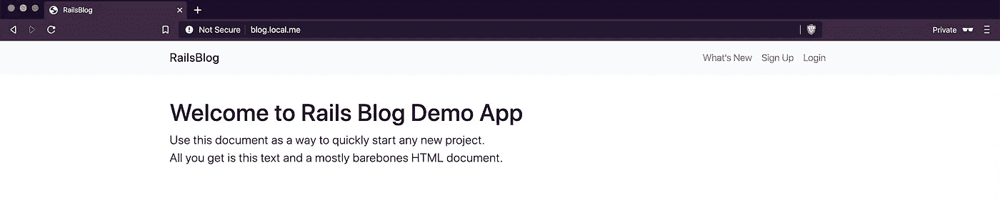

# **暴露管理员仪表板和 Ping 端点**

Traefik 提供了一个管理员仪表板，帮助管理员检查和查看路由器、服务和中间件等 Traefik 资源。默认情况下，该仪表板不公开，因此我们需要显式配置流量来公开它。以下是执行该任务所需的配置:

*   `api=true`:启用 Traefik API 服务。
*   `api.insecure=true`:启用 API 不安全模式。
*   `api.dashboard`:启用 Traefik 仪表盘。

此外，为了启用`ping`端点，我们需要以下配置。此端点可用于从监控服务或负载平衡器检查 Traefik 服务的运行状况。

*   `ping.entrypoint=web`

可以使用下面的命令来部署新的更改

```
$> make clean
$> DEPLOY_VERSION=v3 make deploy
```

部署后，您应该能够访问仪表板和 ping 端点，如下图所示:

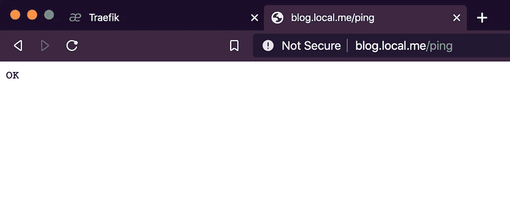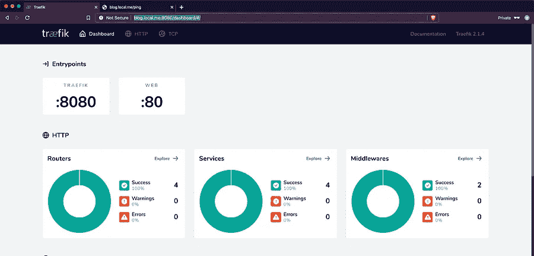

# **公开指标端点并使用基本身份验证凭证保护它**

Traefik 支持几个度量后端，比如 [Datadog](https://docs.traefik.io/observability/metrics/datadog/) 和 [InfluxDB](https://docs.traefik.io/observability/metrics/influxdb/) 。每个受支持的后端都有自己的配置项，但它们都可以用相同的方式进行配置。

对于我们的示例，我们将配置 Traefik 来公开 [Prometheus](https://docs.traefik.io/observability/metrics/prometheus/) 指标，并使用`basic-auth`凭证保护指标端点。以下是启用 Prometheus 端点所需的 Traefik 配置的简要说明:

*   `entrypoint.metrics.address=:8082`:定义度量服务的内部端口。
*   `metrics.prometheus=true`:启用普罗米修斯服务。该服务将以以下名称提供“prometheus@internal”
*   `metrics.prometheus.addEntryPointLabels=true`:允许向暴露的指标添加入口点标签。
*   `metrics.prometheus.addServicesLabels=true`:支持向公开的指标添加服务标签。
*   `metrics.prometheus.manualrouting=true`:启用为普罗米修斯创建手动路由器。这个选项是必需的，因为我们想要添加一个`basic-auth`中间件来保护端点。如果你不想要`basic-auth`保护，你可以离开这个项目。

另一方面，保护度量端点可以通过定义 Traefik 服务本身的标签来完成。基本上，标签将指示 Traefik 创建一个基本身份验证中间件，并将其链接到用于访问度量端点的路由器。它们是:

*   `traefik.http.middlewares.${name}.basicauth.users`:定义基础认证中间件，分配中间件的凭证。这个标签的值可以使用下面的命令生成。

```
$> echo $(htpasswd -nb ${user} ${password}) | sed -e s/\\$/\\$\\$/g
$> echo $(htpasswd -nb traefik traefik2020) | sed -e s/\\$/\\$\\$/g
```

*   `traefik.http.services.prometheus.loadbalancer.port`:该标签定义了 Prometheus 服务的内部端口。
*   `traefik.http.routers.rule`:定义访问度量端点的路由器规则。我们将保持简单，使用`PathPrefix`规则`PathPrefix(`/metrics`)`。
*   `traefik.http.routers.service`:普罗米修斯服务名称。这个标签的值需要是“prometheus@internal”。
*   `traefik.http.routers.entrypoint`:定义普罗米修斯路由器的入口点。
*   `traefik.http.routers.middleware`:定义连接到 Prometheus 路由器的中间件。在我们的例子中，它将与上面定义的中间件相同。

使用以下命令部署新的更改:

```
$> make clean
$> DEPLOY_VERSION=v4 make deploy
```

部署新的变更后，您应该能够访问暴露端口`8082`上的指标端点，如下图所示。

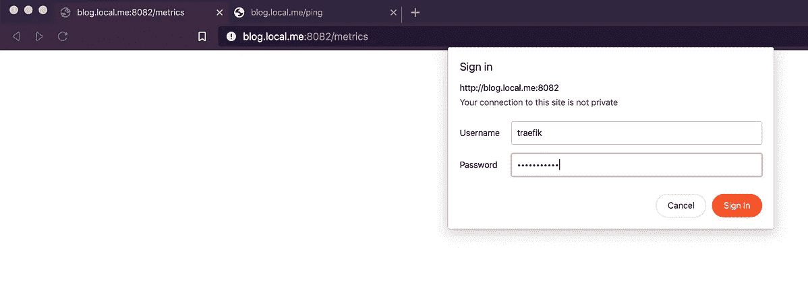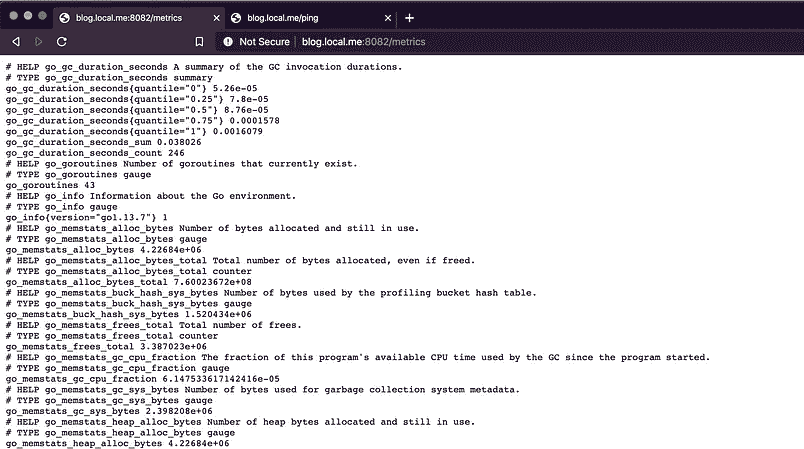

# **向请求和响应添加自定义标题**

这个任务可以很容易地实现只使用 Docker 群标签。例如，如果我们想将`X-REQUEST-SOURCE`和`X-RESPONSE-SOURCE`添加到 Rails 应用程序的请求和响应中，我们需要添加下面的中间件并将其附加到服务路由器上。

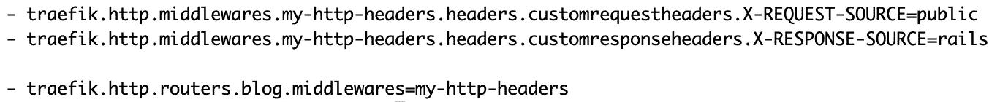

# **处理 HTTPS 的请求**

Traefik 也可以配置为处理 HTTPS 请求。可以在 Traefik 服务和 Rails 应用程序服务上使用以下配置项来完成此任务。

Traefik 标签:

*   `entrypoint.websecure.address`:定义将用于处理 HTTPS 请求的内部端口。入口点的名称也可以在这里配置，您可以为它选择除“**web secure”**之外的任何名称。

Rails 应用程序标签:

*   `traefik.http.routers.${router_name}.tls=true`:为 Rails 应用程序启用 TLS 连接。
*   `traefik.http.routers.${router_name}.entrypoints=websecure`:使用 TLS 端点处理 Rails 应用程序 web 请求。

部署新的更改是通过以下命令完成的:

```
$> make clean
$> DEPLOY_VERSION=v6 make deploy
```

部署新的更改后，您可以使用 HTTPS 协议访问 Rails 应用程序，如下图所示。但是，由于我们没有托管域的有效 TLS 证书，网络浏览器将要求确认对该页面的访问，并显示这是一个不安全的页面。

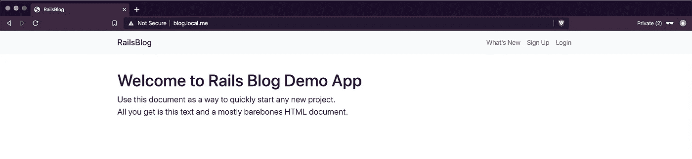

# **使用有效的 TLS 证书**

Traefik 支持多种处理 TLS 证书的选项。根据您的需要，您可以选择其中一个选项。例如，如果您已经拥有有效的 TLS 证书文件，您可以使用证书密钥和证书文件的路径来配置 Traefik，如这里的[所述](https://docs.traefik.io/https/tls/)。

Traefik 还支持使用[加密](https://letsencrypt.org/)来生成 TLS 证书。我将演示如何配置 Traefik 来使用[加密](https://letsencrypt.org/)和 AWS route53 服务生成 TLS 通配符证书。

*注意:此步骤的先决条件是拥有有效的 AWS 帐户和域。*

要从上面使用的内部域切换到具有有效 TLS 证书的有效域，我们需要在 Traefik 和 Rails 应用程序上执行以下操作。

添加或修改以下 Traefik 命令参数:

*   `provider.docker.defaultRule`:用注册域名更新此标签。
*   `certificateresolvers.route53.acme.dnschallange`:添加一个名为`route53` (可以取任何名字)的新证书解析器，并启用 DNS 质询。
*   `certificateresolvers.route53.acme.dnschallange.provider`:将 DNS 解析器提供商设置为`route53` **。**
*   `certificateresolvers.route53.acme.email`:定义 TLS 证书使用的电子邮件地址。
*   `certificateresolvers.route53.acme.storage`:定义 ACME 文件路径。该文件将保存 TLS 证书信息，您可能需要提供容器外部文件的路径。

添加 AWS 凭证:处理 DNS 质询需要 AWS 密钥和密码。凭证需要作为环境变量传递给 Traefik 服务。

添加 Traefik 标签以生成通配符证书。我们需要以下标签来添加通配符(名称可以是任何名称)路由器，并指示 Traefik 为配置的域生成通配符证书。

*   `traefik.http.routers.wildcard.tls`:启用通配符路由器的 TLS 支持。
*   `traefik.http.routers.wildcard.certresolver`:选择证书解析器。Traefik 支持[几个处理 DNS 挑战的提供者](https://docs.traefik.io/https/acme/)。在我们的例子中，我们将使用`route53`来处理 DNS 挑战。
*   `traefik.http.routers.wildcard.domain[0].main`:定义 TLS 证书的主域。
*   `traefik.http.routers.wildcard.domain[0].sans`:定义 TLS 证书中包含的其他域。

更新 Rails 应用程序标签:

*   `traefik.http.routers.${router_name}.rule`:我们需要将服务的主机名更新为有效的主机名`blog.wshihadeh.cloud`。

部署新的变更:

```
$> make clean
$> DEPLOY_VERSION=v7 make deploy
```

# **将传入的 HTTP 请求重定向到 HTTPS**

在网站上将 HTTP 流量重定向到 HTTPS 是一种常见的做法。Traefik 通过重定向中间件支持这一特性。下面是完成此任务所需配置项目的简要描述。

*   `traefik.http.middlewares.${name}.redirectscheme.scheme`:定义重定向方案中间件。这个标签的值应该是`https`。
*   `traefik.http.middlewares.${name}.redirectscheme.permanent`:在已定义的中间件上启用永久重定向。
*   `traefik.http.routers.${router_name}.rule`:为所有 HTTP 传入请求定义一个路由器。这个标签的值应该是一个通配符来包含所有的请求。
*   `traefik.http.routers.${router_name}.entrypoints`:设置路由器链接到“web”入口点。
*   `traefik.http.routers.${router_name}.middlewares`:将定义好的中间件链接到 HTTP 路由器。

下图显示了部署更改前后 Traefik 行为的差异。如您所见，如果不进行更改，Traefik 将会以 404 错误进行响应—部署后，它将会以 308 进行响应，这是一个到 HTTPS 的重定向。


部署前

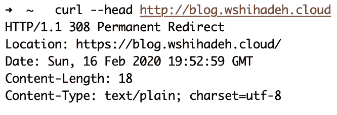

部署后

# **将收到的请求重定向到注册页面**

在这里，我将演示如何在特定服务上设置更高级的重定向规则。Rails 应用程序的路由器只处理来自主机的请求`blog.wshihadeh.cloud`。通过以下配置，我们可以扩展路由器，使其具有以下行为:

*   处理对 wshihadeh.cloud、www.wshihadeh.cloud 和 blog.wshihadeh.cloud 的传入请求。
*   将 www.wshihadeh.cloud 上的传入请求重定向到 blog.wshihadeh.cloud/users/sign_up
*   用基本身份验证凭证保护启动页面。

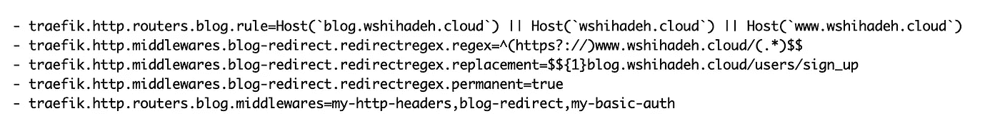

下图显示了部署版本 9 前后 Traefik 行为的差异。

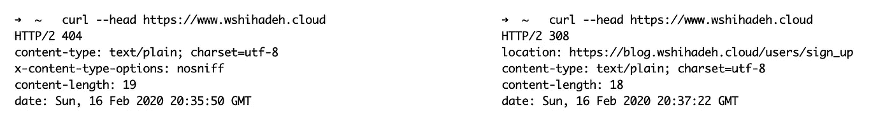

部署版本 9 之前(左)和之后(右)。

# **办理 TLS 客户证书**

在这一节中，我将展示如何配置 Traefik 来处理 TLS 客户端证书，以及如何将证书传递给 Rails 应用程序进行进一步处理。

将 Traefik 配置为请求客户端证书。不幸的是，我找不到用 Docker 提供者配置 TLS 客户端证书的方法。然而，使用文件提供者来实现这个目标是可能的。以下代码片段显示了在 TLS 连接上请求客户端证书所需的配置:

```
[tls.options]
  [tls.options.my-tls-opt]
    [tls.options.my-tls-opt.clientAuth]
      caFiles = ["/run/secrets/trusted_ca"]
      clientAuthType = "RequestClientCert"
```

为了用这些配置来配置我们的 Traefik 实例，我们需要执行以下操作:

*   `provider.file.filename`:定义一个文件提供者，并将其链接到包含配置的文件。
*   将配置文件作为卷附加到 Traefik 服务。
*   将用于验证客户端证书的 CA 证书作为机密附加到 Traefik 服务。

配置 Rails 应用程序路由器将客户端证书传递给服务。这个任务可以通过向 Rails 应用程序路由器添加以下中间件来完成:

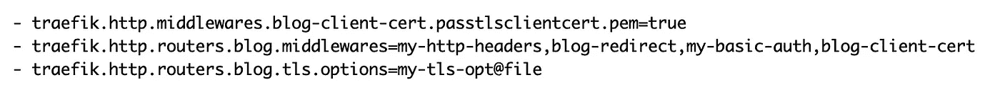

在部署了版本 10 中的最新变化后，您将在 Traefik 仪表板中看到 Rails 应用程序路由器以及所有附加的中间件，如下图所示。

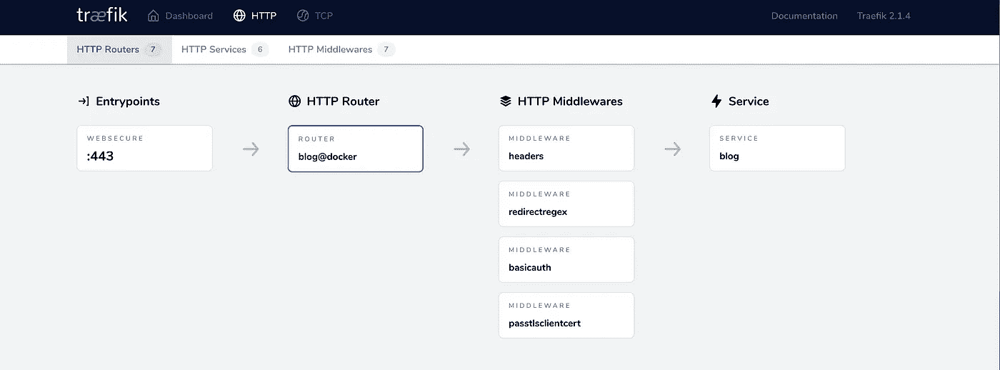

# **限制 Traefik 配置源**

在某些情况下，需要定义 Traefik 的多个实例来处理不同的服务集，这可能是由于将内部服务作为公共服务暴露在同一个反向代理上的安全风险。因此，需要将 Traefik 实例配置为只包含私有或公共服务，而不是两者都包含。这可以通过添加以下配置和标签来实现。

*   Traefik 命令参数，下面的配置将 Traefik 仅限制为具有值为`public`的`traefik.tags`标签的服务

```
--providers.docker.constraints=Label(`traefik.tags`,`public`)’
```

*   服务标签:以下标签需要添加到应由 Traefik 实例管理的每个服务中，包括 Traefik 服务本身。

```
- traefik.tags=public
```

下面的 docker-compose 文件显示了包含本文中讨论的所有特性的完整堆栈:

最后，您可以使用下面的命令部署具有所有已实现特性的最新版本:

```
$> make clean
$> DEPLOY_VERSION=v11 make deploy
```

# **结论**

Traefik 是一个伟大的工具和反向代理。它支持广泛的功能，最重要的是，它可以使用 Docker Swarm 标签进行动态配置——无需重启或重新加载 Traefik 来应用新的更改。

这篇文章中实现的所有特性都可以在这个[库](https://github.com/wshihadeh/traefik_v2)中找到。