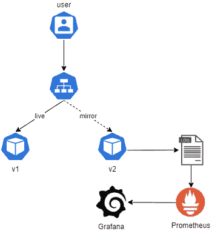

# 使用 Istio 在 Kubernetes 中进行流量镜像

> 原文：<https://betterprogramming.pub/traffic-mirroring-in-kubernetes-using-istio-dad0976b4e1>

## 如何为您的 Kubernetes 微服务运行可靠的运行验收测试


Ashim D'Silva 在 [Unsplash](https://unsplash.com/s/photos/mirror?utm_source=unsplash&utm_medium=referral&utm_content=creditCopyText) 上拍摄的照片

让应用程序的多个版本同时运行给了您相当大的灵活性。它使您能够根据需要在不同版本之间切换和转回流量。它允许您进行 canary 发布、A/B 测试以及受控的生产推广。

随着微服务和容器编排平台的出现，如 [Kubernetes](https://kubernetes.io/) 来支持它，它已经成为新的规范。借助 [Istio](https://istio.io) ，您可以通过流量镜像创建一个健壮的部署和发布策略。

本文是" [Kubernetes 通过 Istio 的安全网关在 HTTPS 提供服务的后续文章。](https://medium.com/better-programming/kubernetes-services-over-https-with-istios-secure-gateways-210b2ce91b71)“今天我们来讨论一下*流量镜像。*

流量镜像，也称为阴影，是一个强大的概念，近年来越来越受欢迎。这是在生产环境中测试您的版本的无风险方法，不会影响您的最终用户。

大多数传统企业都有一个生产前环境，它过去是生产的复制品。运营团队将版本部署到预生产环境中，测试人员在其中创建模拟真实环境的合成流量。

这使得团队能够理解代码在生产环境中的行为，以及代码在功能上和非功能上是否准备好部署到生产环境中。

他们使用预生产环境对其应用程序进行性能测试、容量测试和操作验收测试。

虽然这一切听起来不错，但也不是没有问题。在传统的基础设施中，您在创建静态测试环境上花费了大量的金钱和资源。你付钱给工程师来维护产品的复制品。

大多数合成流量不同于实时流量，因为实时流量是当前的用户交互，而人工流量依赖于历史数据。错过那里的许多场景也不是一个例外。

流量镜像允许您实施类似的操作验收测试设置。它允许您在不影响最终用户的情况下使用实时流量进行测试。

# 流量镜像的工作原理

流量镜像使用以下步骤工作:

1.  您部署了新版本的应用程序，并打开了流量镜像。
2.  旧版本像以前一样响应请求，但也向新版本发送异步副本。
3.  新版本处理流量，但不响应用户。
4.  运营团队监控新版本，并向开发团队报告任何问题。



流量镜像

当应用程序处理实时流量时，它可以帮助团队发现他们在预生产环境中通常不会发现的问题。您可以使用监控工具，如 [Prometheus](https://prometheus.io/) 和 [Grafana](https://grafana.com/) 来记录和监控您的测试结果。

# 先决条件

我将演示如何使用 Istio 在 Kubernetes 集群上进行流量镜像。要熟悉 Istio，请查看“[如何使用 Istio 管理 Kubernetes 上的微服务](https://medium.com/better-programming/how-to-manage-microservices-on-kubernetes-with-istio-c25e97a60a59)”

您需要有一个正在运行的 Kubernetes 集群来遵循实际操作指南。在本练习中，您可以使用一个托管的 Kubernetes 集群，比如 Google Kubernetes 引擎。

# 部署 Nginx 应用程序

按照“[Kubernetes 上的 Istio 入门](https://medium.com/better-programming/getting-started-with-istio-on-kubernetes-e582800121ea)”指南，在您的 Kubernetes 集群中安装 Istio。对于此演示，您不需要安装图书信息应用程序。

在 Kubernetes 上部署 [Nginx](https://www.nginx.com/) 的两个版本(`v1`和`v2`)。

部署`nginx:v1`。

展开`nginx:v2`。

通过服务公开 Nginx 应用程序。

部署睡眠微服务，向应用程序发送流量。

去拿豆荚看看是否准备好了。

```
$ kubectl get pod
NAME                        READY   STATUS    RESTARTS   AGE
nginx-v1-5ff9f64978-bwtqh   2/2     Running   0          3m36s
nginx-v2-596ffd86d7-89n99   2/2     Running   0          19s
sleep-674f75ff4d-cmt7p      2/2     Running   0          2m25s
```

现在让我们向 Nginx 服务发送一些流量。

```
$ export SLEEP_POD=$(kubectl get pod -l app=sleep -o jsonpath={.items..metadata.name})
$ kubectl exec -it $SLEEP_POD -c sleep -- sh -c 'curl  [http://nginx:8000'](http://nginx:8000')
This is version 1
$ kubectl exec -it $SLEEP_POD -c sleep -- sh -c 'curl  [http://nginx:8000'](http://nginx:8000')
This is version 2
$ kubectl exec -it $SLEEP_POD -c sleep -- sh -c 'curl  [http://nginx:8000'](http://nginx:8000')
This is version 2
```

`nginx:v1`和`nginx:v2`之间的交通流量相等。检查两个版本的日志。

```
$ export V1_POD=$(kubectl get pod -l app=nginx,version=v1 -o jsonpath={.items..metadata.name})
$ kubectl logs $V1_POD -c nginx
127.0.0.1 - - [13/May/2020:23:05:11 +0000] "GET / HTTP/1.1" 200 18 "-" "curl/7.35.0" "-"
$ export V2_POD=$(kubectl get pod -l app=nginx,version=v2 -o jsonpath={.items..metadata.name})
$ kubectl logs $V2_POD -c nginx
127.0.0.1 - - [13/May/2020:23:05:12 +0000] "GET / HTTP/1.1" 200 18 "-" "curl/7.35.0" "-"
127.0.0.1 - - [13/May/2020:23:05:13 +0000] "GET / HTTP/1.1" 200 18 "-" "curl/7.35.0" "-"
```

我们在两个豆荚上都看到了日志，这证实了我们的发现。让我们删除 pod 以清除日志。Kubernetes 用新鲜的豆荚替换被删除的豆荚。

```
$ kubectl delete pod $V1_POD
pod "nginx-v1-5ff9f64978-bwtqh" deleted
$ kubectl delete pod $V2_POD
pod "nginx-v2-596ffd86d7-89n99" deleted
$ kubectl get pod
NAME                        READY   STATUS    RESTARTS   AGE
nginx-v1-5ff9f64978-9vzhm   2/2     Running   0          46s
nginx-v2-7cb4b5c868-86s5m   2/2     Running   0          34s
sleep-674f75ff4d-cmt7p      2/2     Running   0          30m
```

# 创建虚拟服务和目标规则

现在让我们创建一个 destinations 规则来定义到两个版本的路由，并创建一个虚拟服务来将所有流量路由到`nginx:v1`。

让我们产生一些流量，看看它去哪里。

```
$ kubectl exec -it $SLEEP_POD -c sleep -- sh -c 'curl  [http://nginx:8000'](http://nginx:8000')
This is version 1
$ kubectl exec -it $SLEEP_POD -c sleep -- sh -c 'curl  [http://nginx:8000'](http://nginx:8000')
This is version 1
$ kubectl exec -it $SLEEP_POD -c sleep -- sh -c 'curl  [http://nginx:8000'](http://nginx:8000')
This is version 1
```

我们收到了来自`nginx:v1`的所有回复。查询两个版本的日志。

```
$ export V1_POD=$(kubectl get pod -l app=nginx,version=v1 -o jsonpath={.items..metadata.name})
$ kubectl logs $V1_POD -c nginx
127.0.0.1 - - [13/May/2020:23:08:11 +0000] "GET / HTTP/1.1" 200 18 "-" "curl/7.35.0" "-"
$ export V2_POD=$(kubectl get pod -l app=nginx,version=v2 -o jsonpath={.items..metadata.name})
$ kubectl logs $V2_POD -c nginx
<none>
```

没有记录`nginx:v2`的日志。不出所料，没有流量流向`v2`。

# 镜像流量

核心部分来了。让我们将流量镜像到`nginx:v2`，并通过应用下面的 YAML 来亲眼看看发生了什么。

如果观察 YAML，航线仍然以`nginx:v1`为目的地；但是，它包括一个镜像部分，将 100%的流量镜像到`nginx:v2`。因此，`nginx:v1`主动响应请求，`nginx:v2`异步接收流量。请记住，请求是一劳永逸的:`nginx:v2`不会响应请求者。

在这个设置中，我们将`mirror_percent`设置为 100，这意味着我们将整个流量镜像到`nginx:v2`。您可以将其更改为更适合您的用例的值。如果不包括`mirror_percent`字段，Istio 会将所有流量镜像到`nginx:v2`。

让我们发送流量三次，看看我们得到了什么。

```
$ kubectl exec -it $SLEEP_POD -c sleep -- sh -c 'curl  [http://nginx:8000'](http://nginx:8000')
This is version 1
$ kubectl exec -it $SLEEP_POD -c sleep -- sh -c 'curl  [http://nginx:8000'](http://nginx:8000')
This is version 1
$ kubectl exec -it $SLEEP_POD -c sleep -- sh -c 'curl  [http://nginx:8000'](http://nginx:8000')
This is version 1
```

每次发送请求时，我们都会得到“这是版本 1”。让我们检查两个服务的日志。

```
$ kubectl logs $V1_POD -c nginx
127.0.0.1 - - [13/May/2020:23:08:11 +0000] "GET / HTTP/1.1" 200 18 "-" "curl/7.35.0" "-"
127.0.0.1 - - [13/May/2020:23:15:27 +0000] "GET / HTTP/1.1" 200 18 "-" "curl/7.35.0" "-"
127.0.0.1 - - [13/May/2020:23:15:31 +0000] "GET / HTTP/1.1" 200 18 "-" "curl/7.35.0" "-"
127.0.0.1 - - [13/May/2020:23:15:33 +0000] "GET / HTTP/1.1" 200 18 "-" "curl/7.35.0" "-"$ kubectl logs $V2_POD -c nginx
127.0.0.1 - - [13/May/2020:23:15:27 +0000] "GET / HTTP/1.1" 200 18 "-" "curl/7.35.0" "10.4.2.9"
127.0.0.1 - - [13/May/2020:23:15:31 +0000] "GET / HTTP/1.1" 200 18 "-" "curl/7.35.0" "10.4.2.9"
127.0.0.1 - - [13/May/2020:23:15:33 +0000] "GET / HTTP/1.1" 200 18 "-" "curl/7.35.0" "10.4.2.9"
```

发生了什么事？我们得到了来自`nginx:v1`的所有响应，但是我们也看到了来自`v2` 的日志。如果您查看日志时间戳，在`v2`的日志与在`v1`的日志相匹配，并且它们是同时发生的。这表明流量镜像工作正常。

# 结论

感谢阅读！我希望你喜欢这篇文章

流量镜像可以帮助团队发现使用传统基础设施通常无法发现的错误。这是对您的发布进行操作验收测试的最有效的方法之一。这为您省去许多麻烦，并有助于避免客户事故。

下一个故事是“[使用 Istio](https://medium.com/better-programming/locality-based-load-balancing-in-kubernetes-using-istio-a4a9defa05d3) 在 Kubernetes 中实现基于位置的负载平衡”，所以我们在那里见！