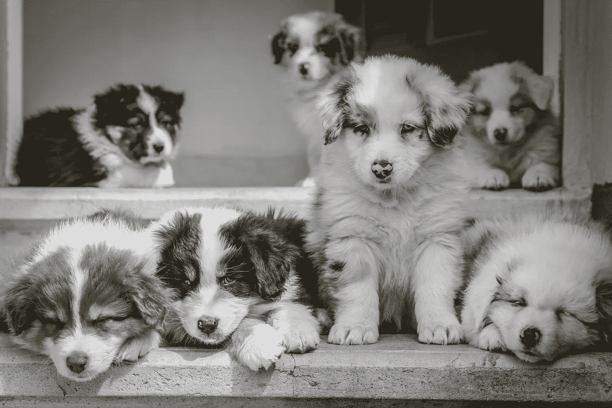
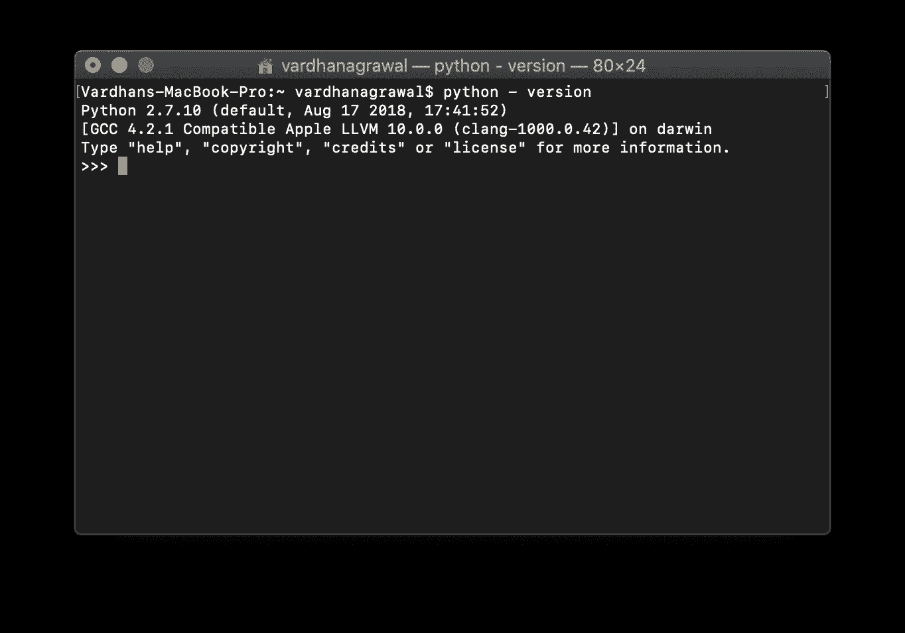
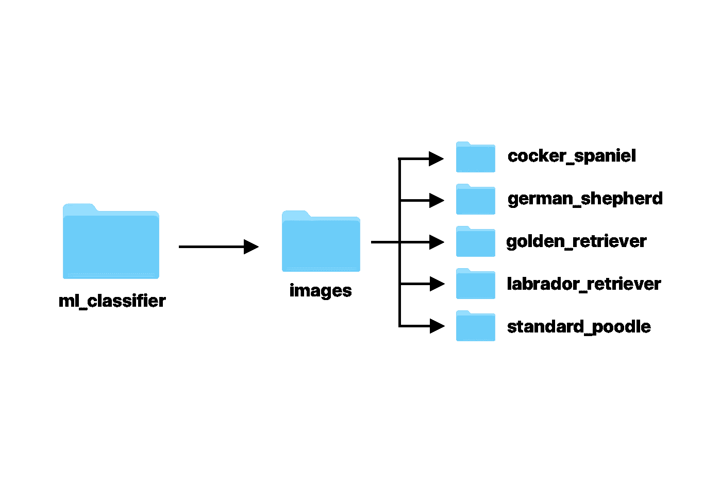
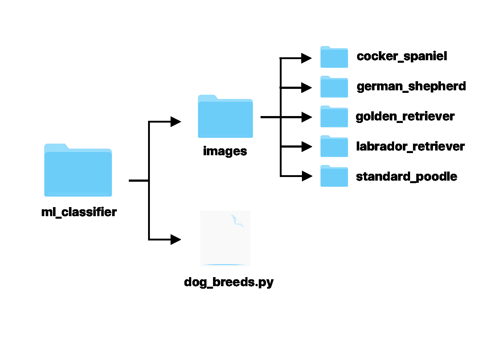
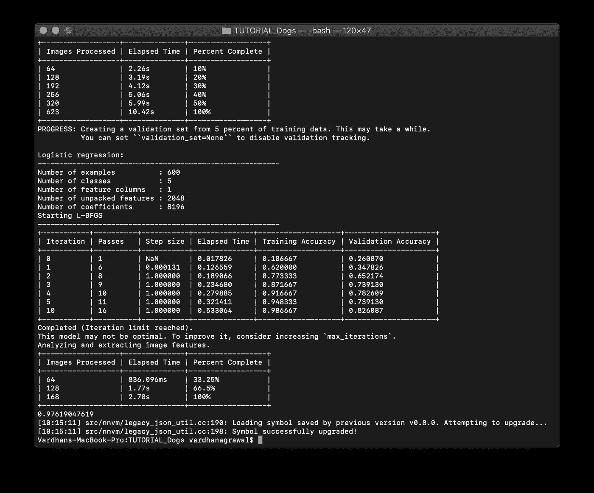

# 用 Turi Create 训练核心 ML 犬种分类器

> 原文：<https://betterprogramming.pub/train-a-core-ml-dog-breed-classifier-with-turi-create-2624f9272d22>

## 使用 Turi Create 训练犬种分类模型

在 [Unsplash](https://unsplash.com/search/photos/dog?utm_source=unsplash&utm_medium=referral&utm_content=creditCopyText) 上由 [Jametlene Reskp](https://unsplash.com/@reskp?utm_source=unsplash&utm_medium=referral&utm_content=creditCopyText) 拍摄的照片

在本教程中，您将学习如何训练一个定制的狗品种分类核心 ML 模型，以便在您的 iOS 和 macOS 应用程序中使用。本教程结束时，你的核心 ML 模型将能够区分五种不同的品种！

你可能还记得，苹果几年前以超过 2 亿美元的价格收购了机器学习和人工智能初创公司[*【Turi】*](https://turi.com/products/application-lifecycle.html)*。它提供了在短时间内创建高级机器学习模型的强大工具。*

*在本教程中，您将学习:*

*   *在 Mac 上安装 Turi Create*
*   *创建一个 [Python](https://www.python.org/) 脚本*
*   *使用该脚本来训练一个 [Core ML](https://developer.apple.com/documentation/coreml) 模型，您可以将其直接拖到您的 Xcode 项目中，并在您的应用程序中快速实现它。*

# *入门指南*

*在我们开始实际的机器学习部分之前，让我们先了解一下 Turi 和 Python 的安装。当然，首先你需要确保你的硬件和软件符合 Turi 的要求。*

# *要求*

*和你安装的任何软件一样，Turi Create 有一些特定的要求，这些要求可以在他们的官方 GitHub 页面上找到。*

## ***Turi 创建支持:***

*   *macOS 10.12 以上*
*   *Linux(使用 glibc 2.12+)*
*   *Windows 10(通过 WSL)*

## ***Turi 创建要求:***

*   *Python 2.7、3.5、3.6*
*   *x86_64 架构*
*   *至少 4 GB 内存*

*底线是，只要你的 Mac 是相当新的 T21，你应该可以运行 Turi Create。如果你愿意，你可以使用另一个操作系统；但是，您可能需要修改一些步骤才能让它们工作。*

## *装置*

*安装 Turi Create 相当简单，尤其是如果你熟悉命令行的话。虽然您可以选择使用较新版本的 Python，但在本教程中我将使用 Python 2.7。*

*在 macOS Mojave 中，Python 2.7 是默认安装的，所以你需要做的就是检查版本。在你的 Mac 上，打开**应用>实用程序>终端**，或者用键盘快捷键**命令空间**简单搜索。*

*要检查 Mac 上的 Python 版本，请输入:*

*这将告诉您 Python 的版本，您的控制台应该如下所示:*

**

***图 1:** 检查 Python 版本*

*如果你的版本不是 Python 2.7，或者由于某种原因没有安装在你的电脑上，你应该在这个链接安装[。如果您的输出看起来与我的相似，您就可以继续了。](https://www.python.org/downloads/release/python-2714/)*

***注:**有些人更喜欢用虚拟机来安装 Turi Create，因为这是苹果推荐的。但是为了简单起见，我们将直接安装它。*

*要安装 Turi Create，只需在您的终端窗口中输入以下内容:*

*仅此而已！Turi Create 已成功安装在您的 Mac 上，可以使用了。现在，您可以构建分类、检测、回归和其他类型的模型。*

# *资料组*

*对于任何机器学习模型，你都需要一个数据集。在本教程中，你将学习如何训练一个简单的狗品种分类模型，这需要图像分类。我将使用的数据来自斯坦福大学的狗数据集。*

*为了让 Turi 能够识别预先分类的图像，你需要根据它们所代表的内容来组织它们。例如，所有金毛猎犬的图片都在一个文件夹中，而所有拉布拉多犬的图片都在另一个文件夹中。*

*为了简单起见，我们将只使用斯坦福大学数据集中数百个品种中的五个，但是你可以随意使用。我已经开始为您组织它，并为它创建了一个[存储库](https://github.com/vhanagwal/dog-breed-dataset)。如果您选择添加更多的狗品种，只需添加更多的文件夹，并根据您的意愿命名。*

## *文件夹结构*

*到目前为止，您可能已经明白了排列数据集的方式对于正确训练模型至关重要——除此之外，Turi Create 没有其他方法可以知道什么东西去了哪里。现在花点时间整理一下自己。*

**

***图 2:** 起始文件夹结构*

*这个层次图应该解释了所有的事情，在继续学习本教程之前，你需要按照这个顺序放置你的文件夹。如果你想改变名字或安排不同的事情，你需要确保你记下这一点。*

# *训练分类器*

*完成设置后，您就可以开始学习本教程的内容了——实际上是训练您的分类器。我们将主要使用 Python，但是如果你以前从未使用过 Python，那也没关系。我会在我们进行的过程中解释每一步，如果您有任何问题，请不要犹豫，在下面留下您的评论。*

## *Python 文件*

*首先，我们需要一个地方来放下我们的想法(当然，是用 Python)。如果您已经有了一个支持 Python 的编辑器，比如 [Atom](https://atom.io) ，或者一个集成开发环境，比如 [PyCharm](https://www.jetbrains.com/pycharm/) ，那么您可以使用它们来创建一个名为`dog_breeds.py`的空白文件。*

*如果您像我一样喜欢开发人员路线，您可以使用终端来做同样的事情。你需要在你的`ml_classifier`文件夹中创建这个文件，在`images`文件夹旁边，这样你的层次结构看起来像这样:*

**

***图 3:**Python 文件的文件夹结构*

*要创建一个新文件，首先进入目标目录:*

*然后，创建一个名为`dog_breeds.py`的新文件。*

*瞧啊。您的文件夹、文件和图像都在它们需要的地方，您已经准备好继续下一步。我们将使用 [Xcode](https://developer.apple.com/xcode/) 来打开我们的文件，所以请确保您已经安装了 Xcode 并且是最新的。*

# *加载数据集图像*

*最后，是时候开始通过我们刚刚创建的 Python 文件告诉 Turi 它需要做什么了。如果你双击这个文件，默认情况下它会在 Xcode 中打开，如果你安装了 Xcode 的话。如果没有，您也可以使用另一个编辑器或 Python IDE。*

## *1.导入框架*

*在文件的顶部，您需要导入 Turi Create 框架。如果你愿意，你可以通过添加`as <your name>`来创建一个名字作为参考。例如，如果您想在代码中将其称为`tc`，您可以这样写:*

*这将允许你调用它`tc`而不是写出`turicreate`。在本教程中，我将使用完整版，称之为`turicreate`以减少歧义。*

*您还需要处理文件夹名称和其他与操作系统相关的任务，以便对图像进行分类。这将需要另一个名为`os`的 Python 库。要导入它，只需添加以下内容:*

## *2.加载图像*

*这里，我们将数据集中的所有图像存储到一个名为`data`的变量中。由于我们的`dog_breeds.py`文件与`images`文件夹在同一个目录中，我们可以简单地将`“images/”`作为路径。*

## *3.定义标签*

*现在 Turi Create 已经有了你所有的图片，你需要把文件夹名和标签名联系起来。当在 iOS 或 macOS 应用程序中使用时，这些标签名称将在您的核心 ML 模型中返回。*

*这允许你将所有的文件夹名映射到一个“标签”名，这告诉 Turi Create 所有在“可卡犬”文件夹中的图片确实是可卡犬。*

## *4.另存为`SFrame`*

*如果你不熟悉一个`SFrame`，简单来说，它是你所有数据(在这种情况下，一个图像)和所有标签(在这种情况下，狗的品种)的字典。像这样保存您的`SFrame`:*

*它允许您存储已标记的图像，以供下一步使用。这是机器学习行业中相当标准的数据类型。*

# *培训和测试*

*在 Turi Create 将你所有的标签图像都准备好之后，是时候进入最后阶段，最后训练你的模型了。我们还需要分割数据，以便 80%用于训练，20%在模型完成训练后用于测试——我们不必手动测试。*

## *1.加载 SFrame*

*现在，我们需要加载我们在上一步中刚刚创建的 SFrame。这是我们稍后将用来划分测试和训练数据的内容。*

*这将把类型为`SFrame`的`data`变量分配给我们在上一步中保存的 SFrame。现在，我们需要将数据分成测试和训练数据。如前所述，我们将对训练数据进行 80:20 的测试。*

## *2.拆分数据*

*是时候拆分数据了。在 SFrame 代码后，添加以下内容:*

*这段代码随机地将数据分成 80-20 份，并分别分配给两个变量`testing`和`training`。现在，Turi 将自动测试你的模型，而不需要你手动提供测试图像和创建应用程序。如果您需要进行调整，您不需要首先完全实现它，相反，您可以在您的 Python 文件中进行调整。*

## *3.培训、测试和导出*

*你的努力终于有了回报！在这一行 Python 代码中，您只需告诉 Turi Create 训练您的模型，同时指定您想要使用的架构。*

*你只是告诉 Turi 使用你的`testing`数据(之前指定的)，并使用它们来预测`labels`(基于之前的文件夹结构)，同时使用`resnet-50`，这是最准确的机器学习模型架构之一。*

*要使用您的测试数据并确保您的模型是准确的，请添加以下内容:*

*它使用您指定的`training`数据，并将测试后的结果存储在一个名为`testing`的变量中。供您参考，它打印出了准确性，但如果有足够的时间使用 Turi Create 的 API，您也可以打印其他内容。*

*最后但同样重要的是，在给模型起一个有用的名字后，可以用这个一行程序将模型保存到文件系统中:*

*当然，您也可以将您的模型保存为其他格式，但是对于这个例子，我将它保存为一个核心 ML 模型。*

# *运行和输出*

*对于所有的 iOS 开发者来说——不，这不是一个不断自动编译并抱怨错误的 Xcode 项目。为了执行您刚刚编写的代码，我们需要通过终端来执行。*

## *运行 Python 文件*

*运行 Python 文件很容易！确保您位于正确的目录中，您需要做的只是在终端窗口中输入以下内容:*

## *输出*

*经过几分钟的训练后，您的`images`文件夹和`dog_breeds.py`文件将伴随着一个 SFrame、一个 model 文件夹和一个`.mlmodel`文件，这就是您的核心 ML 模型！*

*您还会在终端窗口中看到输出，如下所示:*

**

***图 4:** 运行 Python 后的输出*

*这为您提供了有关训练和训练准确性、处理的图像数量以及其他有用信息的信息，您甚至可以在不使用模型的情况下使用这些信息来分析模型。*

# *结论*

*我希望你喜欢阅读这篇教程，就像我喜欢制作它一样！以下是从这里开始的一些步骤。如果你想学习如何在 iOS 应用程序中使用你的核心 ML 模型，请查看我的另一个教程:*

* [## Core ML 中的图像识别入门

### 随着技术的进步，我们的设备可以使用内置摄像头来准确识别…

code.tutsplus.com](https://code.tutsplus.com/tutorials/image-classification-through-machine-learning-using-coreml--cms-29819?_ga=2.101472841.993700883.1547096068-312075175.1521244044) 

本教程将向你展示如何使用你的`dog_classifier.mlmodel`模型，并在真实的 iOS 应用中实现它。它还将教你解析一个直播视频，并采取个别帧的图像分类。

如果你对本教程有任何问题或意见，请不要犹豫，在下面的评论区提出来！我总是渴望听到反馈，问题，或者你如何使用本教程中的知识。*