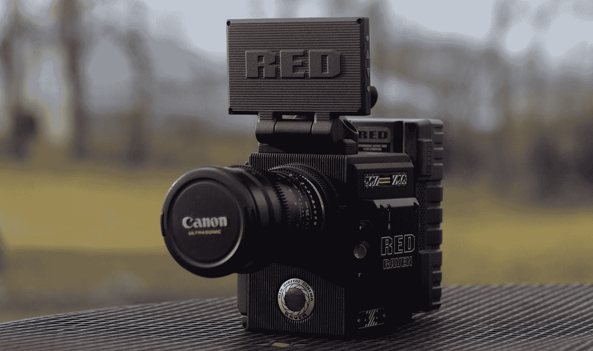
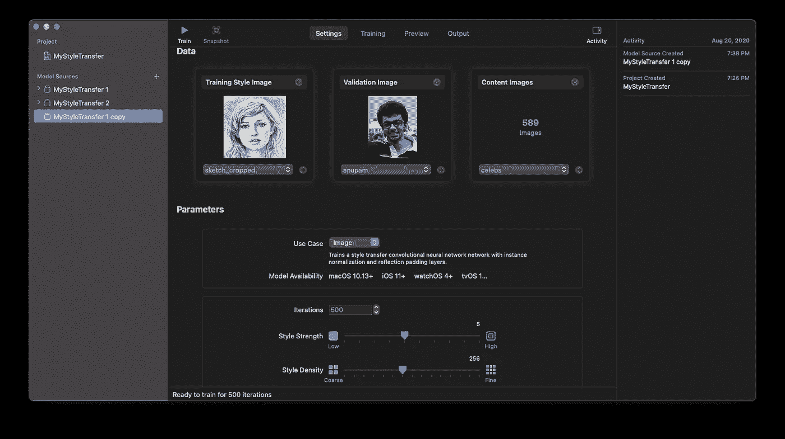
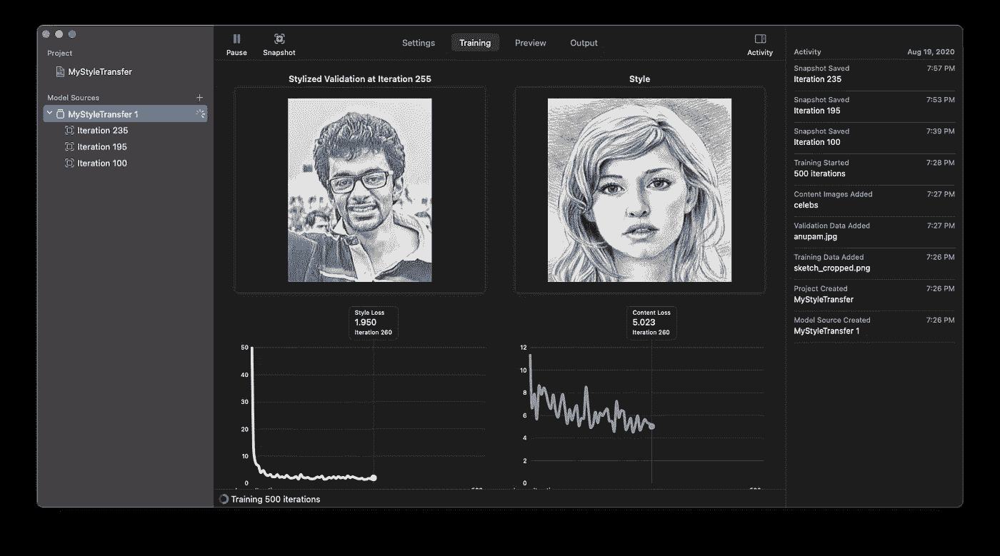
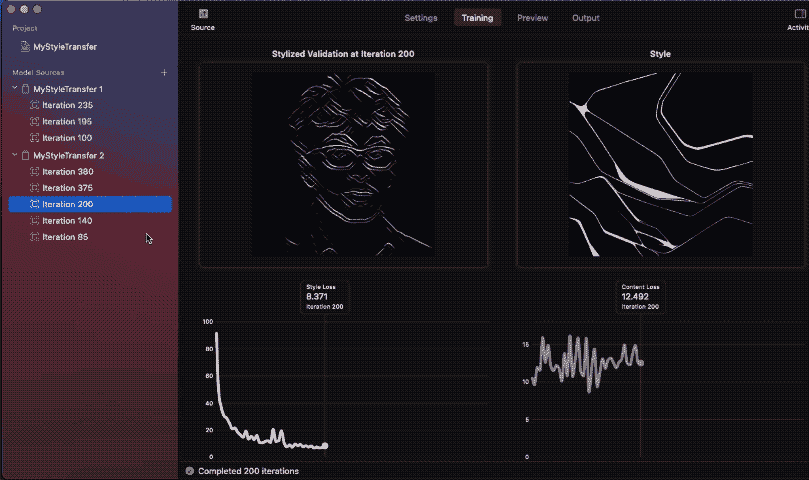
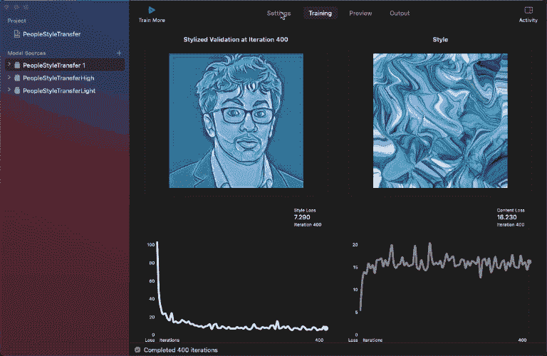
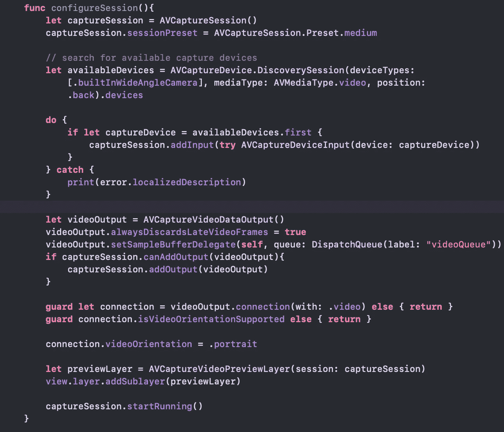
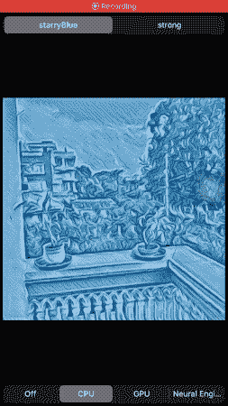
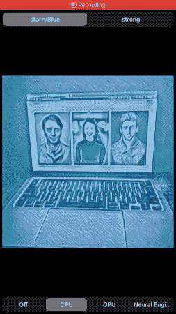
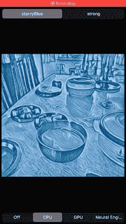

# 在 iOS 相机应用程序中运行创建 ML 风格传输模型

> 原文：<https://betterprogramming.pub/train-and-run-a-create-ml-style-transfer-model-in-an-ios-camera-application-84aab3b85458>

## 建立一个艺术相机，看看它如何在 A13 仿生芯片的神经引擎上执行



照片由 [Unsplash](https://unsplash.com?utm_source=medium&utm_medium=referral) 上的[扎克船只](https://unsplash.com/@zvessels55?utm_source=medium&utm_medium=referral)拍摄

风格转移是一个非常流行的深度学习任务，它让你通过应用另一个图像的视觉风格来改变一个图像的构图。

从构建艺术图片编辑器到通过[最先进的主题](https://9to5google.com/2019/03/19/google-stadia-style-transfer-ml/)给你的游戏设计赋予新的外观，你可以用神经风格转移模型构建许多令人惊叹的东西。它也可以是方便的或数据扩充。

[在 2020 年 WWDC 奥运会上，Create ML](https://developer.apple.com/videos/play/wwdc2020/10642/#:~:text=Style%20Transfer%20is%20a%20new,style%20and%20content%20image%20together.) (苹果的模型构建框架)因包含了风格转移模型而获得了巨大的推动。虽然 Xcode 12 更新附带了这个工具，但是你需要 macOS Big Sur(在撰写本文时还在测试阶段)来训练风格转换模型。

# 初探 Create ML 的风格转移

Create ML 现在释放了直接从 MacBook 训练风格转移模型的潜力。您可以训练图像和视频风格的传输卷积神经网络，后者仅使用有限的卷积滤波器集，使其为实时图像处理而优化。

要开始，你需要三样东西:

*   样式图像(也称为样式参考图像)。通常，您可以使用名画或抽象艺术图像来让您的模型学习和传授风格。在我们的例子中，我们将在第一个模型中使用铅笔素描图像(查看下面的截图)。
*   在训练过程中帮助可视化模型质量的验证图像。
*   作为我们训练数据的内容图像数据集。为了获得最佳结果，最好使用与运行推理时使用的图像目录相似的图像目录。

在本文中，我将使用[这个名人图像数据集](https://www.kaggle.com/jessicali9530/celeba-dataset)作为我们的内容图像。

这里有一个在训练模型之前，我的创建 ML 样式传递设置选项卡的外观。



下面的验证图像显示了在每个迭代间隔应用的实时样式转换。以下是它的一瞥:



值得注意的是，样式损失和内容损失图是理解样式和内容图像之间平衡的指标。典型地，风格损失应该随着时间减少，这表明神经网络正在学习采用风格图像的艺术特征。

虽然默认的模型参数工作得很好，但是 Create ML 允许我们为特定的用例定制它们。

“低风格强度”参数仅调整带有风格图像的背景部分，从而保持主要主体完整。同时，将“样式强度”参数设置为高会在图像边缘赋予更多样式纹理。

类似地，粗略的样式密度使用样式图像的高级细节(这样的模型被训练得更快)，而精细的密度让模型学习微小的细节。

创建 ML 风格转移模型训练，默认迭代次数设置为 500，这对于大多数用例来说是理想的。迭代是完成一个历元所需的批次数量。一个历元等于整个数据集的一个训练周期。例如，如果训练数据集由 500 个图像组成，批大小为 50，则表明 10 次迭代将完成一个时期(注意:创建 ML 模型训练不会告诉您批大小)。

今年，Create ML 还引入了一个名为模型快照的新功能。这使我们能够在培训期间捕获中间核心 ML 模型，并将其导出到您的应用中。然而，从快照中使用的模型没有针对大小进行优化，并且比训练完成时生成的模型大得多(具体来说，我拍摄的快照的核心 ML 模型大小在 5–6mb 的范围内，而最终的模型大小为 596 KB)。

下面的 gif 展示了一个这样的例子，其中我比较了不同迭代的模型快照结果:



这个女孩是一名演员。那个人就是我。

请注意，在其中一张图片上，样式并不是由完整的图片组成的。这是因为使用的造型图像尺寸较小。因此，网络无法学习足够的样式信息，导致合成的图像质量低于标准。

理想情况下，样式图像的最小尺寸为 512 px 将确保良好的效果。

# 我们的目标

在接下来的小节中，我们将构建一个 iOS 应用程序，实时运行风格转换模型。下面是我们下一步行动的概览:

*   分析三种视频风格传输神经网络模型的结果。其中一个使用默认参数训练，其他使用设置为高和低的风格强度参数。
*   在我们的 iOS 应用程序中使用 AVFoundation 实现自定义摄像机。
*   在实时摄像机上运行生成的核心 ML 模型。我们将使用视觉请求在屏幕上快速运行、推断和绘制风格化的摄像机画面。
*   查看 CPU、GPU 和神经引擎的结果。

找到一个能给出好的艺术效果的风格图像是很棘手的。幸运的是，[我通过简单的谷歌搜索找到了一张这样的图片](https://www.google.com/search?hl=en-IN&tbs=simg:CAQSpAIJkkL3sol2FMEamAILELCMpwgaYgpgCAMSKK8D-haFDPcWiRGhHpAXpxyhHIoRlCngKLgnhSOGJ-Ah3yjbJIYjnjcaMEWBtZsgkthHw07P5xre1gkdsfh4WFLK3PKZCL6k-vXjH_14Ga7h8HhFXsrDVBN2ZZyAEDAsQjq7-CBoKCggIARIEmiMCUwwLEJ3twQkakAEKHQoLdmlzdWFsIGFydHPapYj2AwoKCC9tLzBwOXh4Ch0KCm1vZGVybiBhcnTapYj2AwsKCS9tLzAxNXI2MQobCgl0dXJxdW9pc2XapYj2AwoKCC9tLzBmZ2toChgKBWxpbGFj2qWI9gMLCgkvbS8wNGZmY2oKGQoHcGF0dGVybtqliPYDCgoIL20vMGh3a3kM&sxsrf=ALeKk00kkDblF7mP6fxtp3wyd8r-4SVquQ:1597937500373&q=texture+graphic+design&tbm=isch&sa=X&ved=2ahUKEwiC2dSIjarrAhVTzjgGHdnmDg8Qwg4oAHoECAkQKQ&biw=1440&bih=820#imgrc=GeL5TbsFDvBUWM)。

# 分析不同优势的风格转移模型

我已经用相同的数据集训练了三个模型。以下是结果:



正如您在上面看到的，低强度模型几乎不会影响给定样式图像的内容图像，但是高强度模型会通过更多的样式效果来细化边缘。

这样，我们的模型(大小大约为半 MB)就可以加载到我们的应用程序中了。

Create ML 还可以让我们预览视频结果，但它非常慢。幸运的是，我们将很快在我们的演示应用程序中实时看到它们。

# AVFoundation 基础

AVFoundation 是一个高度可定制的苹果媒体内容框架。您可以绘制自定义叠加，微调相机设置，使用深度输出进行照片分割，以及分析帧。

我们将主要关注分析帧，特别是使用样式转换对它们进行转换，并在图像视图中显示它们，以构建一个实时摄像机馈送(您还可以使用 Metal 进行进一步优化，但为了简单起见，我们将在本教程中跳过这一步)。

在非常基本的层面上，构建自定义摄像机涉及以下组件:

*   `AVCaptureSession` —管理摄像机的整个会话。它的功能包括访问 iOS 输入设备并将数据传递给输出设备。AVCaptureSession 还允许我们为不同的捕获会话定义`[Preset](https://developer.apple.com/documentation/avfoundation/avcapturesession/preset)`类型。
*   `AVCaptureDevice` —让我们选择前置或后置摄像头。我们可以选择默认设置，或者使用`AVCaptureDevice.DiscoverySession`来过滤和选择硬件特定的功能，如 TrueDepth 或广角摄像头。
*   `AVCaptureDeviceInput` —从捕获设备提供媒体源，并将其发送到捕获会话。
*   `AVCaptureOutput` —向捕获会话提供输出媒体的抽象类。它也让我们处理相机的方向。我们可以设置多个输出(如摄像头和麦克风)。例如，如果你想捕捉照片和电影，添加`AVCaptureMovieFileOutput`和`AVCapturePhotoOutput`。在我们的例子中，我们将使用`AVCaptureVideoDataOutput`，因为它提供视频帧进行处理。
*   `AVCaptureVideoDataOutputSampleBufferDelegate`是一个协议，我们可以用它来访问`didOutput`委托方法中的每个帧缓冲区。为了开始接收帧，我们需要调用`AVCaptureVideoDataOutput`上的`setSampleBufferDelegate`方法
*   `AVCaptureVideoPreviewLayer` —基本上是一个`CALayer`，它直观地显示来自捕获会话输出的实时摄像机馈送。我们可以用叠加和动画来改变图层。为了示例缓冲区委托方法能够工作，设置这一点很重要。

# 设置我们的定制摄像机

首先，在 Xcode 的项目的`info.plist`文件中添加`NSCameraUsageDescription`摄像机权限。

现在，是时候在`ViewController.swift`中创建一个`AVCaptureSession`了:

```
let captureSession = AVCaptureSession()
captureSession.sessionPreset = AVCaptureSession.Preset.medium
```

接下来，我们将从出现在`AVCaptureDevic`实例中的可用摄像机类型列表中过滤并选择广角摄像机，并将其添加到`AVCaptureInput`中，后者又在`AVCaptureSession`上设置:

现在我们的输入已经设置好了，让我们将视频输出添加到捕获会话中:

```
let videoOutput = AVCaptureVideoDataOutput()videoOutput.alwaysDiscardsLateVideoFrames = truevideoOutput.**setSampleBufferDelegate**(self, queue: DispatchQueue(label: "videoQueue"))if captureSession.canAddOutput(videoOutput){
 **captureSession.addOutput(videoOutput)**
}
```

`alwaysDiscardsLateVideoFrames`属性确保晚到达的帧被丢弃，从而确保有更少的延迟。

最后，添加下面这段代码来防止旋转的相机进给:

```
guard let connection = videoOutput.connection(with: .video) 
else { return }guard connection.isVideoOrientationSupported else { return }
connection.videoOrientation = .portrait
```

> 注意:为了确保所有方向，您需要根据设备的当前方向设置`videoOrientation`。代码可以在本教程的末尾找到。

最后，我们可以添加我们的预览层，并开始相机会话:

```
let previewLayer = AVCaptureVideoPreviewLayer(session: captureSession)view.layer.addSublayer(previewLayer)captureSession.startRunning()
```

下面是我们刚刚创建的`configureSession()`方法:



# 使用视觉实时传递核心 ML 模型的跑步风格

现在，到机器学习部分。我们将使用视觉框架来为我们的风格转移模型处理输入图像预处理。

通过使我们的 ViewController 符合`AVCaptureVideoDataOutputSampleBufferDelegate`协议，下面的方法可以访问每个帧:

从上面的示例缓冲区实例中，我们将检索一个`CVPixelBuffer`实例，并将其传递给 Vision 请求:

`VNCoreMLModel`作为一个容器，在里面我们用下面的方式实例化了我们的核心 ML 模型:

```
StyleBlue.init(configuration: config).model
```

`config`是类型`MLModelConfiguration`的一个实例。它用于定义`computeUnits`属性，该属性允许我们设置`cpuOnly`、`cpuAndGpu`或`all`(神经引擎)在所需的设备硬件上运行。

```
let config = MLModelConfiguration()switch currentModelConfig {
case 1:
config.computeUnits = .cpuOnly
case 2:
config.computeUnits = .cpuAndGPU
default:
config.computeUnits = .all}
```

> 注意:我们已经设置了一个`UISegmentedControl` UI 控件，让我们在上面的每个模型配置之间切换。

`VNCoreMLModel`在`VNCoreMLRequest`请求中传递，该请求返回`VNPixelBufferObservation`类型的观察值。

`VNPixelBufferObservation`是`VNObservation`的子类，返回`CVPixelBuffer`的图像输出。

通过使用下面的扩展，我们将`CVPixelBuffer`转换成 UIImage 并在屏幕上绘制它。

唷！我们已经创建了我们的实时风格转移 iOS 应用程序。

以下是应用程序在 iPhone SE 上运行时的结果:



在每个图像中，顶部的片段选择器允许您在两个模型之间进行选择。StarryBlue 使用默认的样式强度进行训练，而选择“强”选项卡将运行第二个模型，该模型使用设置为“高”的样式强度进行训练

请注意，当在神经引擎上运行时，风格转换预测是如何近乎实时地发生的。

> 由于 gif 大小和质量的限制，我还 [**制作了一个视频**](https://youtu.be/rrZsRJW2R9I) ，展示了 CPU、GPU 和神经引擎上的实时风格转换演示。比上面的 gif 流畅了很多。

你可以在 GitHub 库中找到上述应用程序的完整源代码，以及核心的 ML 风格传输模型[。](https://github.com/anupamchugh/iOS14-Resources/tree/master/CreateMLVideoStyleTransfer)

iOS 14 中的 Core ML 引入了[模型加密](https://developer.apple.com/documentation/coreml/core_ml_api/encrypting_a_model_in_your_app)，所以理论上我可以保护这个模型。但是本着学习的精神，我选择免费提供上面创建的模型。

# 结论

机器学习的未来显然是无代码的，有 [MakeML](https://makeml.app/) 等平台，苹果的 Create ML 引领潮流，为快速训练移动就绪的机器学习模型提供易于使用的工具和平台。

Create ML 今年还引入了对人类活动分类的模型训练支持。但我相信风格转移会很快被 iOS 开发者采用。如果你想创建一个包含多种风格图像的单一模型，使用[图瑞创建](https://heartbeat.comet.ml/style-transfer-on-ios-using-convolutional-neural-networks-616fd748ece4)。

你现在可以以绝对零的成本构建基于人工智能的、类似 Prisma 的应用程序(除非你决定将你的应用程序上传到 App Store！).

风格转移也可以用在 ARKit 对象上，给它们一个完全不同的外观。我们将在下一个教程中讨论这个问题。敬请关注。

这一次到此为止。感谢阅读。