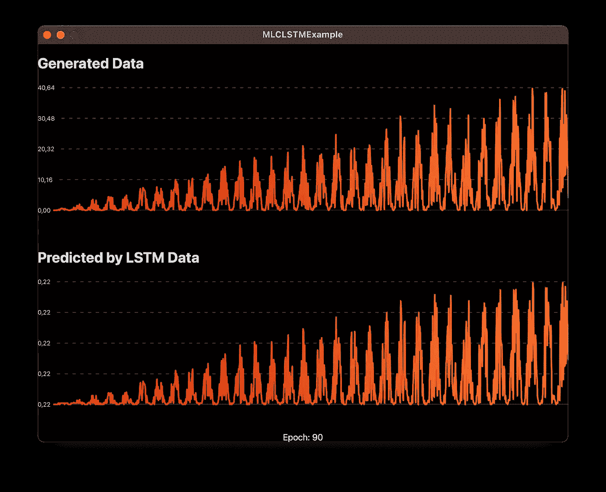

# 在 iOS 或 macOS 上使用 MLCompute 训练 LSTM 模型

> 原文：<https://betterprogramming.pub/train-lstm-with-mlcompute-on-ios-macos-8e9326ce948f>

## 使用 MLCompute 框架为您的 iOS 应用程序构建预测模型

来源: [Undraw](https://undraw.co/)

在 WWDC 2020 期间，苹果展示了一个新的 [MLCompute](https://developer.apple.com/documentation/mlc…) 框架。它提供了一个灵活的 API，用于在不同的计算单元上训练和推理神经网络。

我最近有一个任务，训练一个 LSTM 模型。

LSTM 是一个先进的 RNN(递归神经网络)，在预测之间有两个状态，不像香草 RNN。

这改善了预测结果，并保护我们在训练过程中免受梯度消失的影响。

# 时间数列预测法

我们的任务是利用当前状态预测未来趋势。我们可以训练 LSTM 来解决这个问题:

# 张量

`MLCompute`用`MLCTensor` 进行计算。我们需要设置一个`MLCTensor` 对象数组来设置 LSTM:

为了与`LSTM`一起工作，`MLCompute`提供了两个类:

下面是`MLCLSTMDescriptor`类的代码:

`MLCLSTMLayer` 的代码是:

# **建立管道**

*   对于推论，它使用:`MLCInferenceGraph`
*   对于火车，它使用: `MLCTrainingGraph`
*   初始化以上两个对象并设置我们的 LSTM 层，我们需要使用`MLCGraph`。

# **训练**

在训练之前，我们需要使用`MLCTensorData`对象包装我们的数据，然后执行如下所示的训练循环:

# **结果**

您可以从我的 GitHub 资源库下载一个示例项目:

 [## GitHub-dhrebeniuk/mlclstm 示例:如何将 LSTM 与 MLCompute 结合使用的示例

### 示例我们如何使用 LSTM 与 MLCompute。通过创建帐户，为 dhrebeniuk/MLCLSTMExample 开发做出贡献…

github.com](https://github.com/dhrebeniuk/MLCLSTMExample) 

仅此而已。感谢阅读。