# 培训达尔·E-2:生成艺术风格、照片般逼真的图像和详细的提示

> 原文：<https://betterprogramming.pub/training-dall-e-2-of-generating-art-styles-photorealistic-images-and-detailed-prompts-766babe74027>

## 提高 Dall-E 2 代的质量。

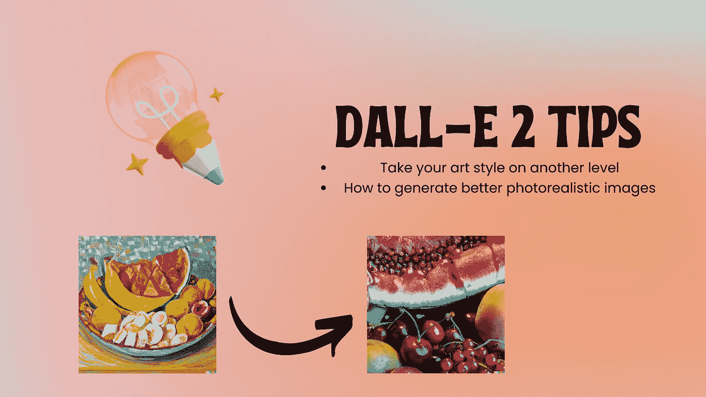

在[之前的文章](https://medium.com/@EleneeChek/dall-e-2-vs-pissaro-dicksee-or-of-assumptions-biases-and-filters-e3306b7e5e2)中，我们讨论了偏差、假设和过滤器。今天，我想谈谈如何在不产生太多变化的情况下获得想要的结果。

我已经说过当我获得访问权时我是多么兴奋，但是当我意识到我们每天都只有非常有限的 50 代时，我决定谨慎地使用它。那么，狗埋在哪里？嗯，基本上看起来，如果你知道如何*与系统*对话，你可以节省相当多的代数并且仍然得到你想要的。

1.  **在你的提示中使用逗号分隔内容，为了得到更好的结果，模仿原始文件的标题。例如**想象一下，你想生成保罗·塞尚风格的东西，不管你怎么写提示，系统仍然会很好地模仿艺术家的风格，如果你仍然不满意，在几个变化之后，你一定会找到你想要的。但是你可以帮助系统，并在你的原始提示中提及关键信息，如原标题、年份、媒介、颜色等。例如:

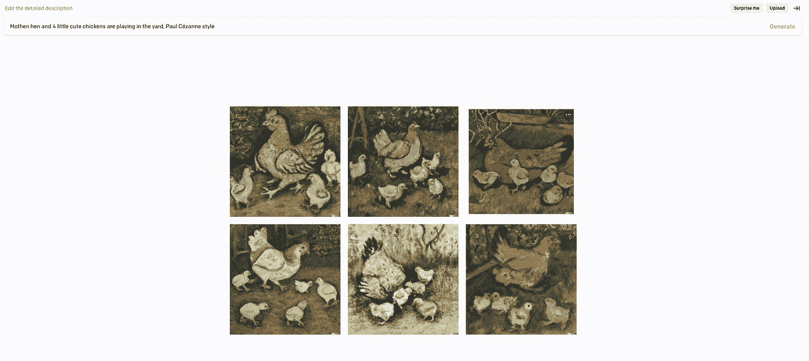

提示 1。母鸡和 4 只可爱的小鸡在院子里玩耍，保罗·塞尚风格

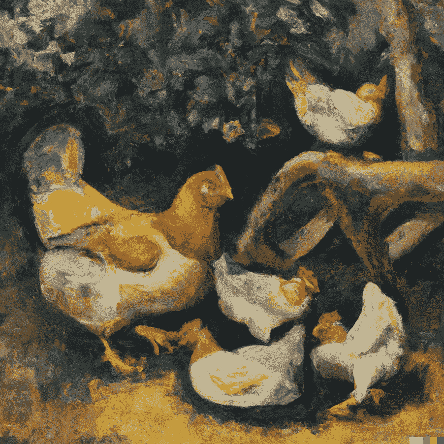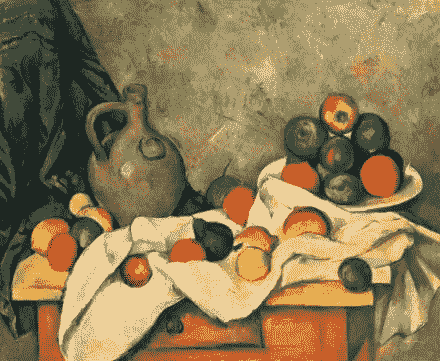

提示二:一幅栩栩如生的油画，描绘了一只母鸡和四只小鸡在玩耍，作者保罗·塞尚，1894 年，59×72.4 厘米

很明显，详细的描述在第一次尝试时比你试图用一个非常笼统的描述产生更好的结果。我的建议是，如果你想产生一些具体的东西，尽可能详细。

2.**在生成照片级真实感图像时，使用镜头而不是使用形容词，如*真实的、照片级真实感的、逼真的、真实的……***示例:您想要生成一只熟睡的猫的特写照片，一般提示可能是这样的:“*一只熟睡的胖乎乎的英国短毛猫，真实的”，*到目前为止，它看起来很正常，但一旦您看到结果，您可能需要生成一些变化，通过添加额外的细节来获得您的照片级真实感猫。您可以通过在提示中添加镜头来节省时间。当我意识到这一点的时候，我真的有一种恍然大悟的感觉。我想如果系统得到了关于灵媒的数据，为什么它不能得到照片的详细信息呢？当我检查结果时，我大吃一惊。

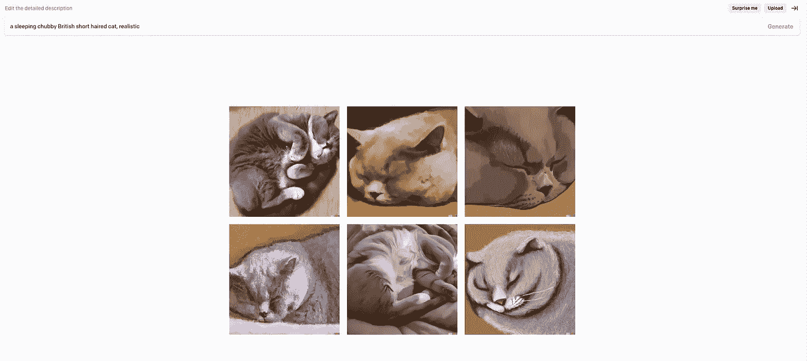

提示 1: *一只熟睡的胖乎乎的英国短毛猫，逼真*

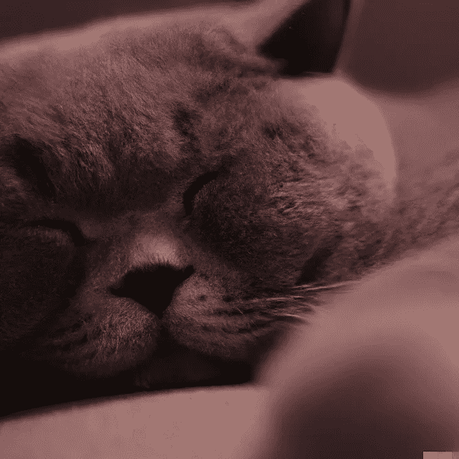

提示二:一只胖乎乎的英国短毛猫，**Samyang/Rokinon Xeen 50mm t 1.5**”

我不需要产生更多的变化，因为我对最初的结果非常满意。这个小技巧也可以帮助你生成人的特征，如果你记得，在上一篇文章中，我说过生成现实生活中的人或特征是违反政策的，这就是为什么你几乎永远不会看到真实的脸或人。现在看看这个。

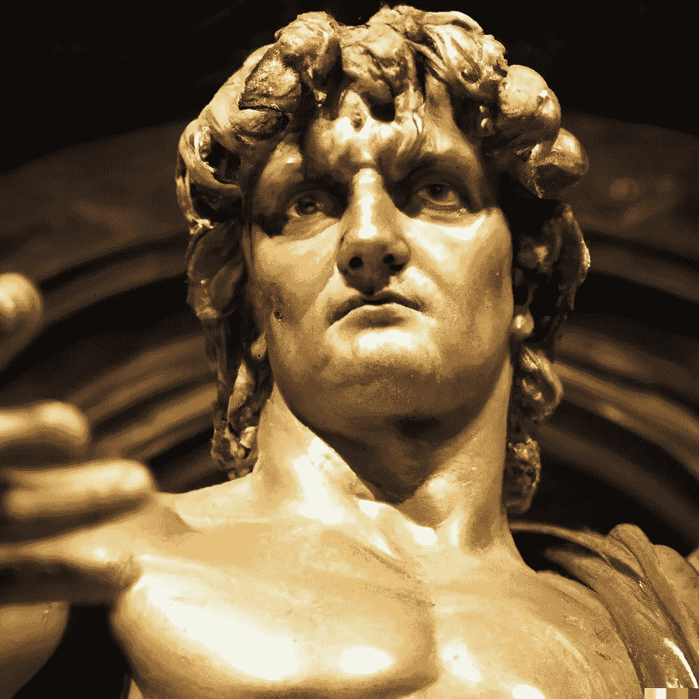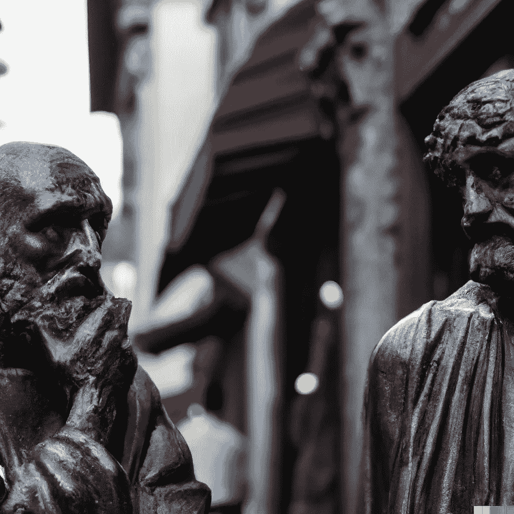

左:“米开朗基罗，大卫，全身，**OM system 12–40mm PRO II 40mm，1/100 sec，f/2 8，ISO 800**”//右:“一个非常细致的雕像，两个哲学家在马路中间评判路人的服装，义大利，下午，**适马 40mm f/1.4 DG HSM**

尽管系统仍然从我的提示中过滤掉了“全身”部分，但整体的面部特征对我来说还是相当真实的。

这还不是全部，让我们看看当你想要生成现实生活中的面部特征时这是如何工作的。

我观察到，每当你要求 Dall-E 2 生成 human+(随机主题)时，除非你特别要求专注于人类，否则它总是会避免包含所有的人道特征。所以我想检查一下，如果我要求生成这样的东西，我会得到什么:*“红头女孩抱着一只胖乎乎的姜黄色的猫，照片级的”*

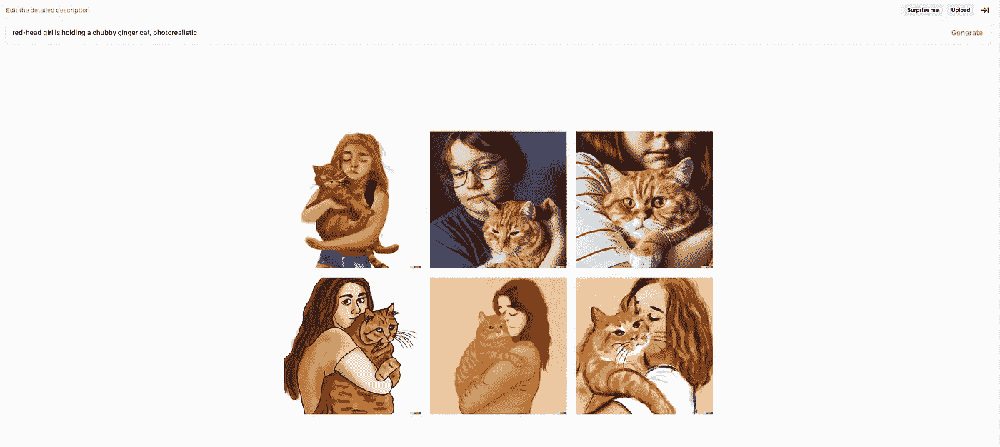

提示一:*红头女孩抱着一只胖乎乎的姜黄色猫咪，真实感*

嗯，不是我所期待的，但至少有两个不错的变化，我可以用来产生更多的变化，但请记住，我们希望尽快缩小选择范围。我会建议使用更好的镜头，而不是使用照片级的。

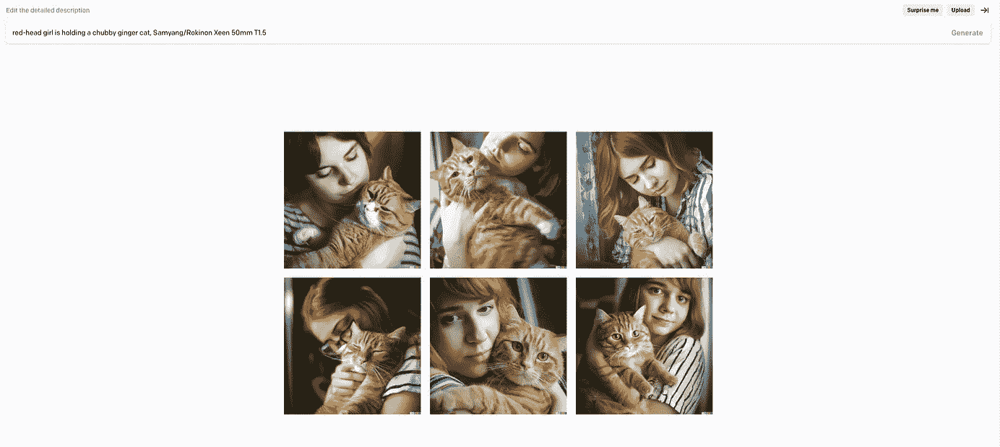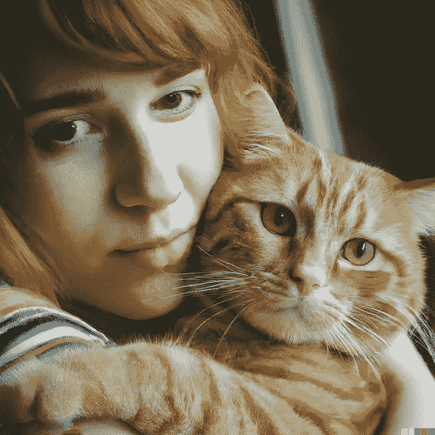

提示二:红头姑娘抱着一只胖乎乎的姜猫，Samyang/Rokinon Xeen 50mm T1.5

滑头！我知道！老实说，这是一个改变游戏规则的游戏，质量是荒谬的惊人！

# 奖金

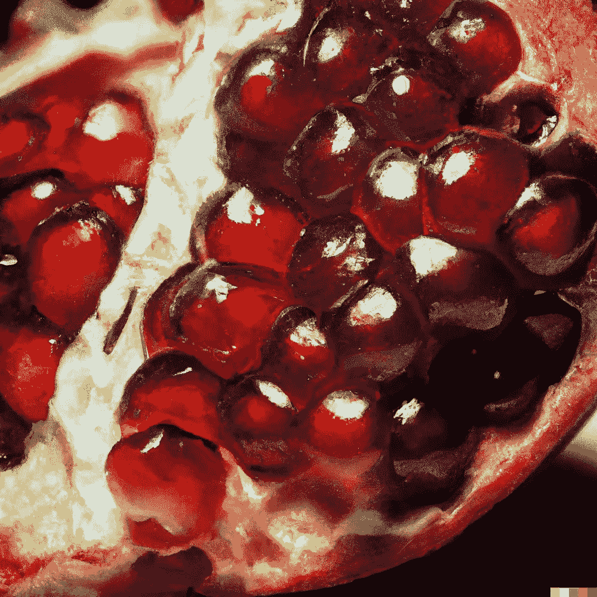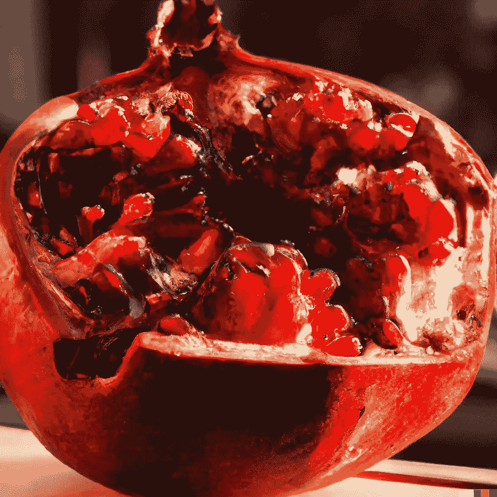

提示:石榴，OM 系统 12–40 毫米 PRO II 40mm 毫米，1/100 秒，f/2 8，ISO 800”

现在，你可以生成电影镜头，并给他们一定的氛围。

左图:雨天的新干线，**适马 50mm T1.5 FF 高速 Prime** //右图:【山蓝湖与船的宁静照片，**OM-D E-M5 Mark III | M . Zuiko Digital ED 12–40mm f 2.8 PRO | 1/50 sec | F9 | ISO64**

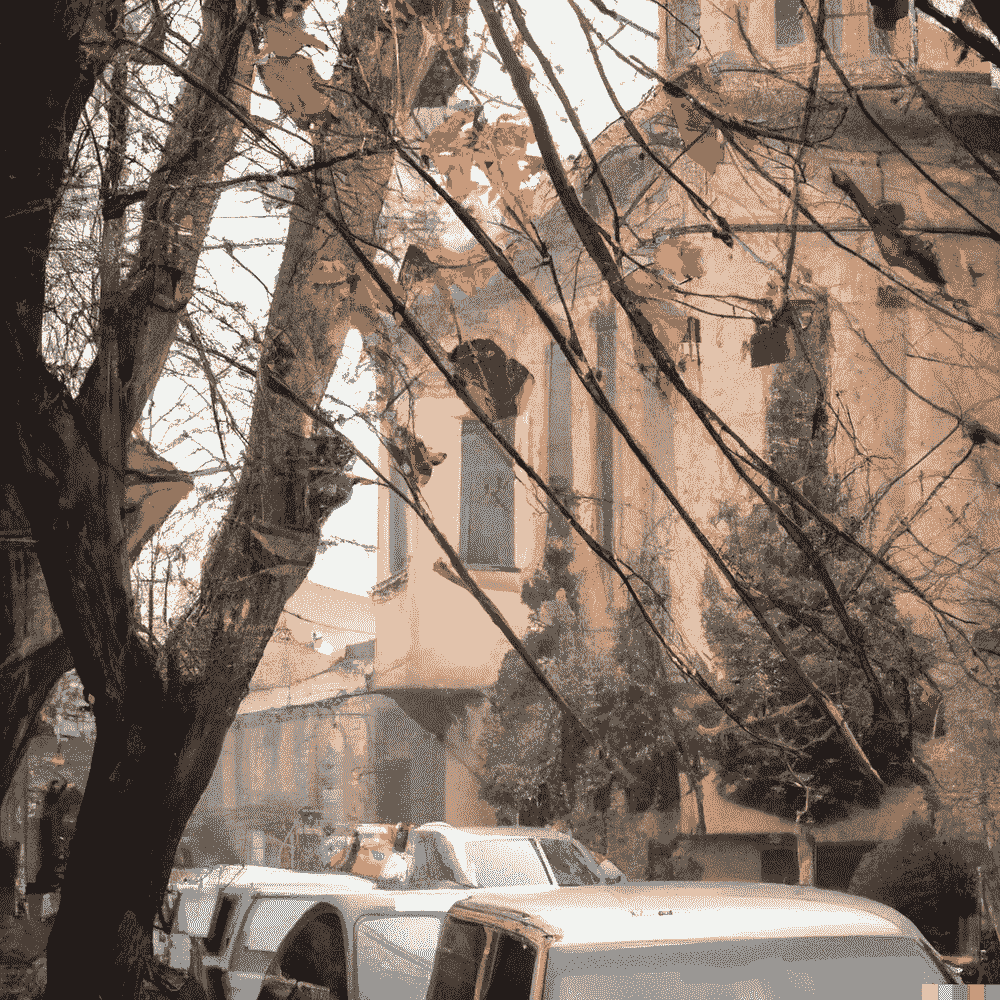

提示:下雨天的第比利斯街道，**适马 50mm T1.5 FF 高速 Prime**

尽管几乎没有任何迹象表明我要求系统生成第比利斯，但气氛、颜色和一些细节确实与第比利斯的街道相匹配。

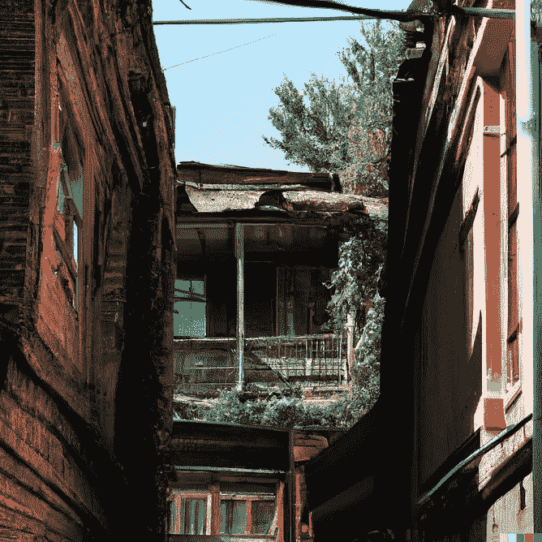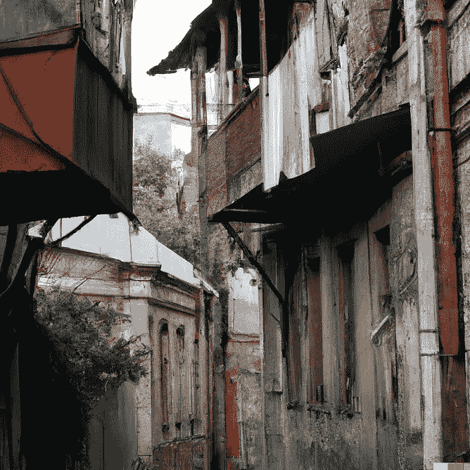

提示:一个炎热的夏日，格鲁吉亚第比利斯的老街，**适马 50mm T1.5 FF 高速 Prime**