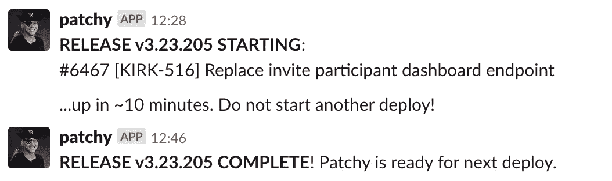
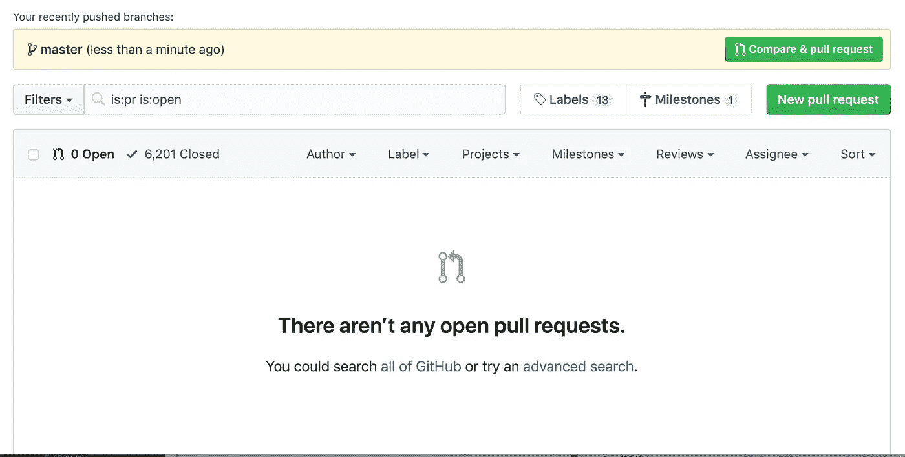
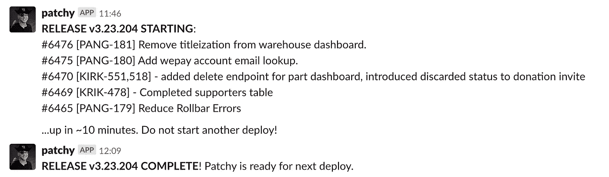

# 将工程组织从瀑布式转变为敏捷和精益

> 原文：<https://betterprogramming.pub/transforming-an-engineering-organization-5f2f3ecbe342>

## 一个开发运营采用和组织从瀑布到敏捷再到精益转型的故事

来源: [Pixabay](https://pixabay.com/photos/mood-nature-river-water-flow-1335737/)

# **结束的开始？**

这是 2018 年底，工程师们成群结队地离开了。由于一个项目，我们在几个月内失去了七名工程师。我们的营业额高达 38%。

**这是大批人离开的开始，一场组织崩溃即将来临。**

## **这是怎么回事？**

我们应该走上一条坚实的道路。Product 进行了为期两周的冲刺，并完成了所有的 scrum 仪式。我们与所有的工程师进行了一对一的会谈。按照任何组织标准，我们都应该做得很好。

我们的问题是，虽然在理论上我们是敏捷的，但在精神上我们远非如此。我们有高度集中的、自顶向下的命令和控制，由产品管理驱动，确切地告诉开发人员做什么和什么时候做。

**产品计划与业务根本不一致**。开发人员最终创建了一个又一个业务从未使用过甚至没有要求过的功能。

累死累活的项目是一个历时数月的瀑布技术项目，它提供了零价值，几乎没有任何计划就开始了，并且触及了我们软件系统和业务流程的每一个核心部分。尽管工程师提出了多次警告，但都被否决了，项目继续进行。

组织付出了紧张而集中的努力来完成这项工作，产品部门承诺最终将解决所有的业务问题。这是一个空洞的承诺，但我们仍在努力。

一方面，看到这种水平的组织协调非常好。另一方面，开发者讨厌死亡游行。当然，我们在两周的冲刺中跑完了，但是两周的瀑布仍然是瀑布。到最后，开发者们都筋疲力尽了。

**适可而止。**离职率不可持续，尚未结束。作为一名与团队关系密切的工程经理，我知道不少开发人员正在积极寻找其他工作。

我们必须做出改变。

# 我们是谁？产品还是工程？

该公司的组织结构与初创时相比没有太大变化。虽然该公司的规模扩大了近 600%，但其流程和结构却没有相应增长。这种结构与它的创业根基非常相似。

没有“工程”部门。它只是“产品”，包括单一组织实体下的所有产品经理、设计师和工程师。工程部门没有单独的预算、OKRs、KPI 甚至路线图。

因此，产品是所有事情的唯一权威。

## 这导致了一些挑战

**很难对工程需求进行优先排序或宣传**。像解决技术债务这样的事情总是会输给“下一个伟大的产品创意”,而“下一个伟大的产品创意”(在理想世界中)会产生数百万美元的收入。

因此，多年来，系统积累了大量的技术债务，使得开发甚至像改变所有页面上按钮的颜色这样的基本事情都是一项巨大的努力。我们为此开了一个玩笑——我们称之为“承重 CSS ”,因为我们知道在某个地方，关键的业务逻辑取决于按钮的颜色。

**这使得资源和规划变得困难。**我们与产品共享可替代预算，这意味着当一名工程师离开时，该分配通常会消失，要么流向设计或产品，要么彻底消失。

这让人们很难加薪。在公司的高速增长阶段，由于无效的招聘实践，我们的开发人员存在显著的薪酬差距。许多低于市场 30-50 %,有些高于市场 50%。在某些情况下，同一级别的人有高达 60%的工资差异！

**最后，给工程带来了困难**。我们服从于产品组织，这意味着我们必须毫无例外地按照产品经理说的去做。我们最终让一个检票员团队构建产品经理指定的小东西，而不是利用我们集体解决问题的技能来找到解决问题的好办法。

## 缺少声音

就公司的其他部门而言，产品就是技术团队，因此，产品经理就是技术、设计和工程的代言人。

不幸的是，产品经理并不像他们认为的那样了解这项技术。他们有很多关于它是如何建造和如何运作的假设——这些假设是不正确的。

部分问题在于他们的技能水平。新手产品经理最终只能向工程师提供信息或项目，而没有连贯的最终愿景。因此，这些东西是作为单独的项目或现有系统的次要附件来构建的。当需要将它们结合成一个协同的整体时，这是不可能的，因为它们不是为了与系统的其他部分集成或分离而构建的。

挑战的一部分是团队结构。我们有在层级别运营的团队，包括前端、后端和移动团队。它们不是跨职能的，并且每个计划都需要大量的交叉和同步。结果呢？不必要的移交、把关和延迟，这些事情原本可以由单个跨职能团队快速完成。

**这种情况反复发生。**当产品经理向公司其他人传达他们的功能时，他们被认为拥有与实际构建完全不同的功能。然而，由于产品经理被视为技术的代言人，他们不准确的陈述被组织中的其他部分当成了福音，导致了严重的混乱。

工程需要独特的声音。

## 我们是如何到达那里的？

像任何重大的组织变革一样，它需要大量的对话和一些幸运的突破。

要解决的第一个问题是分层的团队。这相对容易解决——让工程师在全栈团队中工作。这意味着将不同技能的工程师混合到每个团队中，去除层级。

一旦证明这种方式更有效，就该说明需要独立的部门了。我谈到了将它们结合在一起所导致的混乱和开发问题。我谈到了即使在部门分离的情况下，仍然有可能保持协作和组织凝聚力，并引用了新成立的全栈团队的成功作为例子。

我强调了领导结构的必要性，它代表了工程需求，并能管理与工程相关的人员和结构问题。

我有备而来。从理想的组织结构图、职业发展阶梯到预算，我什么都有。我和所有愿意倾听的人谈论团队结构、开发过程。

我直接与高管利益相关者以及整个公司的中层经理和 IC 合作，分享这一信息，了解它将导致或解决的问题，然后为高管团队总结出必要的细节。

我们最终得到了高管利益相关者的认可，并因此组建了 PED 团队——产品、工程和设计作为独立的部门协同工作。我成了工程总监，负责新成立的工程部门及其所有开发人员。

这意味着我们有自己的声音、自主权和预算。

# 第一站:公平薪酬

如前所述，开发人员薪酬无处不在，与实际绩效完全脱节，相差高达 60%。

同样质量的工作却有如此大的薪酬差距，这不是一个好策略。薪酬差距让高绩效者失去动力，他们想知道为什么他们应该更努力地工作以赚取更少的收入，这导致低绩效者变得自满。毕竟，如果高绩效不是获得他们想要的薪水的必要条件，那就少了一件激励他们提高和表现良好的事情。

我尽快阻止了这一切。这种分离使我能够做的第一件事就是统一所有人的工资级别。通过与我们的财务团队合作，我将严重落后于市场的工程师带到了市场。工程师们最大的抱怨之一是他们的薪酬，我确保满足卫生因素，这样我们就可以专注于更重要的问题。

**我为那些大大超出市场水平的工程师提供了清晰的思路，并重新设定了期望**。对于有些人，我告诉他们，鉴于我们的公司和他们的技能水平，他们的薪资期望是不切实际的。对于其他人来说，这是关于关注他们，为他们提供培训和职业发展，以便他们能够在与他们所获得的报酬相匹配的水平上工作。

在某些情况下，对话变成了绩效改进计划。一些员工得到了提升和发展。其他人没有，和我们分道扬镳。我确保离职员工的部分工资重新投资到当前团队，使我能够提升表现良好或有所进步的员工。

# 名字赋予权力——权力带来责任

因为我们现在是工程部门，我们对公司的其他部门负有一些责任。他们需要了解我们组织的表现，以及这种改变是否值得。

## 每个人的号码

我们当时的处境是，我们所看到的指标并不是特别有用。我们有团队级别容量的产品指标，如速度，但没有其他的。我们无法使用它们来了解我们在持续改进的过程中处于什么位置。

我们经历了幸运的时机。 [2018 年 DevOps 状态](https://cloudplatformonline.com/rs/248-TPC-286/images/DORA-State%20of%20DevOps.pdf)报告已于 2018 年底发布，它提供了一套易于采用的指标，我们可以将其用作我们测量文化的基础。作为《加速》一书的狂热粉丝，这本书极大地提醒了我们工程成功的一系列原则的存在。

我们选择了四个基本的:

*   周期时间。
*   平均恢复时间。
*   部署频率。
*   改变故障率。

我们过去从未测量过这些。我看了一些工具来检索这些，但是它们很复杂，不是我们需要的，或者很贵。我们根本没有资源去探索它们。此外，就在工程部门开始的时候，突然增加数百或数千美元的成本并不是最棒的主意。我们首先需要证明自己。

**我们采取了 DIY 的方式。**我立即编写了一个 bash 脚本，它获取我们的 Git 提交数据，并从中计算部署频率。我还编写了第二个脚本，该脚本采用相同的 Git 数据并估计变更失败率，查找类似“hotfix”的词语并将其与部署频率进行比较。

我还实施了一个流程来手动记录每一个事件或停机，包括时间表、开始时间、检测时间、解决时间、根本原因以及随后采取的措施。它被记录在一期 Github 中，所有的工程师都可以获得。通过这样做，我们有了平均恢复时间—至少是手动恢复时间。

我不知道如何从我们已经跟踪的数据中得到周期时间，所以我用了一个代理方法来衡量交付时间。我创建了一个电子表格，其中记录了我们的 JIRA 问题，并根据问题产生和解决的时间估计了交付周期。这并不精确或准确，但它是一个足够好的大致范围，以获得我们在哪里的照片。

## 结果并不乐观

回顾 2018 年的数据作为基准，结果至少令人失望。

**部署频率为 0.25 次/天。**这意味着我们平均每四天部署一次。深究这些数字，通常是一些小的调整和错误修复——功能部署发生得更少了。

**我们的变更失败率是 25%** ，这意味着每四个部署中就有一个需要修补。查看 2018 年之前的数据，我们的变更失败率一度达到 400%，这意味着每次部署都会导致四个补丁。

**我们的平均恢复时间大约是八个小时。**这主要是由我们完全没有准备好的数据库中断造成的。

**我们的交付周期是 14 天—** 巧合的是，与短跑的时间长度相同。我想工作总是占满分配的时间！

# 变瘦

DevOps 和精益原则有很多重叠之处。后敏捷基础不会改变。减少批量，创建和驱动反馈循环，迭代——这些都是我们可以做的事情。

然而，技术并没有使它成为可能。如果我告诉我们的团队“我们应该每天都部署”，这不可能不对我们的产出产生很大的负面影响。

我们的部署花了将近半个小时。我们没有暂存环境。我们的测试经常因为随机原因而失败。

**这是一个先有鸡还是先有蛋的问题** —我们如何改进我们的流程、改进我们的技术、改进我们的流程、改进我们的技术……？

# 首先从原则开始——小批量

精益和 DevOps 的主要实践之一是通过小批量降低风险。通过降低每次部署的风险，我们提高了交付流程的信心和稳定性，从而增强了交付能力。

如果没有大爆炸式的发布，我们的技术平台就无法交付任何东西。我们将拥有长期存在的特性分支，一切都将在那里进行(通过 git-flow 方法，这是我第一次开始时介绍的)。这些分支可能一次部署了几千行代码。

这是因为我们没有能力在不影响用户的情况下交付小零件。

**解决办法？创造能力。**

# 特征标志救援

我着手在平台内创建一个功能标记基础设施，使我们能够以一致的方式开关功能。我的希望是，这将鼓励部署不完整的功能，但良好的代码，这意味着它将减少批量大小/部署大小。

**这并不像听起来那么简单。**多年来，多种伪标记技术遍布整个系统。有些东西使用 ENV 变量，有些使用硬编码的条件检查，等等。我们甚至有表示给定表的特性标志的列！

管理和集成所有这些以使其一致地工作是一个挑战，需要花费不止几个阶段。我们的系统设计方式使得这变得更加困难——由于遗留代码，我们必须在不同的阶段处理系统级功能标志和上下文级功能标志。

我们坚持基本原则。我们将所有的特性检查都移到了一个接口后面，构建了一个服务类来封装我们使用的各种不同类型的标志检查。一旦我们将一切都转换为使用新的服务类，我们就创建了一个新的数据模型来保存特性标志，并并行运行两个系统。在系统被证明可以工作之后，我们淘汰了旧的数据模型，然后最终废弃了旧的代码。我们还进行了开发人员培训，以确保所有开发人员都知道新的功能标记系统以及如何使用它。

一旦我们有了控制平台中所有特性标志的服务层和数据模型，扩展其功能就变得更加容易了。我们增加了 A/B 测试、标志选项等等！

因为接口是以一种通用的方式构建的，所以我们可以很容易地用一个更健壮的标记库替换它，不会有任何问题。

## 部署！=发布

功能标记导致了*部署* 与*发布*的分离——这是一个术语上的差异，人们以前甚至没有在可能性范围内考虑过。部署是代码集成和交付到生产环境中，而发布是一个或多个用户使用的特性。

# **意外的惊喜**

令人惊讶的是，特征标志的引入实际上改善了工程、产品和设计之间的交互。

在构建正确的事物、构建正确的事物和立即构建事物之间总是存在一种紧张关系。

**特性标记让工程师们很高兴**,因为它提供了一种快速集成和解决问题的方法，有助于降低大型项目的风险。工程师们在开发过程的早期就开始部署代码，这可以防止代码堆积成大规模、高风险的部署。

这让产品经理很高兴，因为他们可以测试一个想法的商业影响，风险更小，但仍然可以控制它何时实现。他们可以在需要的时候发布一个特性，或者在更小范围内进行测试，以管理风险并尽早获得反馈，而不会对业务产生重大影响。如果该功能没有按预期工作或导致问题，他们可以通过点击按钮轻松关闭它。在更大范围的发布之前，特性可以迭代多次以解决问题。

**这反过来让设计者很高兴**,因为通过部署东西，而不是广泛发布，它们可以被迭代以最终匹配设计保真度。这有助于我们确保不会向客户交付不合格的交互和体验。

对于团队协作来说，这是一个意想不到但受欢迎的效果。我不会说特性标记是解决我们协作问题的灵丹妙药，但它确实帮助我们意识到我们头脑中有着相同的目标，并克服了较小的执行争论。

# 小批量=更多批量=更多开销

特性标志在一定程度上帮助降低了风险和批量大小，但是我们仍然用近千行代码来部署发布。

为什么？

我们的部署是痛苦的。开发人员花费了 30 到 45 分钟的全部精力，合并 PRs，编写发布说明，并执行冒烟测试。

结果，大多数开发人员讨厌部署。几名敬业的工程师完成了大部分部署工作，而其他人则为他们加油鼓劲。

在这种模式下，部署的频率较低。这种情况一周只发生过几次，而且每次部署都相对较大且有风险。

我们需要减少生产批处理/部署的开销。

## 自动化拯救世界

我在 bash 中编写了一个工具来自动化这个繁琐的过程，至少对于我们的一些部署来说是这样。这个工具，我们称之为 *Patchy* ，允许任何工程师用一个 PR 创建一个发布，并且用一个命令直接部署到生产中。

例如，运行`./patchy.sh 6486`将部署 PR #6486。

它处理与部署相关的所有事情，这些事情以前都是开发人员关注的:发布说明、增加版本号、检查测试结果，甚至用说明通知人们。

Patchy 将开发人员的部署时间从 30 分钟缩短到了一分钟。虽然部署本身需要大约 15 分钟，但开发人员只是以一种“一劳永逸”的方式触发它。

Patchy 将部署时间从 30 分钟减少到 1 分钟。

**结果立竿见影。**部署频率从 0.25 次/天，到平均 6.5 次/天。更多的开发人员参与到部署过程中。15-20 人的公关队伍不见了。我们甚至有几天达到了零 PRs 开放，而没有降低我们的生产率或产量。

一个工程师的美丽网站。

## 增加部署批量

我们遇到的一个问题是，虽然我们的部署频率很高，但是较小的部署批量导致部署多个项目时开销增加。

我们有“部署列车”,工程师将轮流“修补”他们的 PRs。这些部署训练有时会运行几个小时——一个工程师会为他们的 PR 运行补丁，自动发送一个部署，一旦完成，另一个工程师会为他们的 PR 运行补丁，等等。这导致了一连串的变化，虽然表面上是好的，但却是低效的表现。

我将 Patchy 重写到一个 Ruby 脚本中，添加了指定多个 PRs 进行部署的功能。

补丁 V2 允许一次部署多个 PRs。

通过使 Patchy 能够以自动化的方式部署多个项目，我们能够通过略微增加部署批量来降低部署多个项目的成本。

结果是:部署频率下降到大约 3 次/天，而变更量却没有随之下降。实际发布的项目数量根本没有下降。

我仔细监控了变更失败率，没有看到任何增加。人们仍然小心翼翼地保持他们的发布是低风险的:相信你的工程师是有回报的！

补丁 V2 只是消除了部署多种东西的开销。

# 迭代度量

大约在这个时候，我能够更新我们的跟踪能力。JIRA 发布了新的项目类型(*谢谢 Atlassian！)*，它允许我根据项目何时进入特定状态来自动设置时间戳和其他项目。这使我能够自动计算周期时间，将其与交付时间区分开来。

我还结合使用 Pingdom 和 Statuspage 实现了自动正常运行时间监控。这使得我们可以每分钟进行一次基本的服务器检查，如果我们的网站返回任何问题，就会向我们发送警报。

为了提高透明度，我们还与公司的其他部门共享了状态页面，让运营、销售和其他部门从内部了解我们的正常运行时间，以帮助我们承担责任。

# 这不仅仅是技术的问题

很多人将 DevOps 等同于技术。当他们听到“DevOps”时，他们会想到 Docker、Kubernetes 等。一些人想到了实践—容器化、流程编排等。

对我来说，这些只是完成文化转变的工具或方法。DevOps 始于头脑，其主要重点是转变思维模式和文化。

我们组织向 DevOps 模式转变的最大障碍之一是我们自己对变化、所有权和责任的心态。

它必须改变。

# 模糊和未知

## “唉，要求变了。”

“改变”已经成了一个不好的词。

**退一步说，这个团队不喜欢含糊不清的**。以前，这种高度集中的工作在交给工程师之前，被期望有精细的计划、错综复杂的细节和完美的准确性。这是产品和工程师之间越来越不信任的结果。

任何变更或缺失的信息都会导致“不完整的需求！！!"以及来自工程师的许多抱怨和牢骚。当然，完美的需求是不可能的，但是团队从来没有真正想到过。

让工程师适应环境是一个巨大的转变。

**“改变”成了一个不好的词。**如果我们想要成功并真正做到敏捷，我们必须拥抱变化。我立即开创了一种宽容和接受变化的反文化，将视角转移到一种新的心态上，在这种心态下，变化是一个获得更多关于现实所代表的洞察力的机会。

## 让问题变得明显

有时候，没有比直观地展示问题更好的方式了。

我通过在我们办公区的共享电视上发布图表，让每个人都能看到提前期指标，以迫使开发人员直观地看到要求完美的规划和细节会产生什么影响。我在 1:1 和会议上分享过。

这是一个激烈的衡量标准。有些请求甚至在开始处理之前就在计划中等待了 60 多天。从客户的角度来看，这是在事情发生前的近两个月——难怪我们组织中的人觉得产品是请求的黑洞！

## 解决问题

既然问题是可见的，我可以明确地解决它。

我鼓励限制我们计划项目的时间长度，作为一种强迫功能，迫使事情不能完全充实。我们遇到了真正的分析瘫痪，鼓励短的交付时间提高了团队的适应性。

然而，较短的交付周期导致需求更加模糊。我与工程师、领导和产品经理进行了重要的 1 对 1 培训，以克服不愿意处理细节的问题。我教他们问什么样的问题，他们应该寻找什么样的问题，以及他们自己能找到的解决方法。

我给了他们处理歧义的战略和战术，比如做出“70%的决定”，或者“猜对了”。我教他们架构和模式，以帮助他们的代码更灵活，更少地依赖于随时可能改变的策略细节。

这些基本技巧帮助他们更好地适应失去明确细节的情况，也推动他们利用更多自己解决问题的技能。

当然，一些项目需求在短期内是仓促的，但是对文化的长期积极影响是无价的。这可能是一次不舒服的经历，但它极大地提高了团队适应和操作模糊信息的能力。

# 规划未来与规划未来

虽然我们在缩短交付周期方面取得了进展，但产品方向仍然以长期的方式运作，无法适应不断变化的业务需求。路线图将在三个月到一年后制定。

初创公司在短时间内会发生巨大的变化。公司的关注点可能在一个月内是一件事，但下个月就完全不同了。在一个变化是唯一不变的环境中，为什么要尝试创建一个 12 个月的路线图呢？

对长期前景的预测很快就会过时。更糟糕的是，路线图实施一个月后，我们会对我们的环境和问题有更好的了解，这使得我们的路线图变得毫无意义。既然知道不会长久，为什么还要坚持？我们如何改变这种心态？

*在一个变化是唯一不变的环境中，为什么要试图制定一个 12 个月的路线图呢？*

## 失败是一种选择，而且是一种非常好的选择

我们在文化和技术上所做的所有改变都有一个巨大的好处——它让失败变得廉价。

降低失败的成本使我们能够追求以前可能有难以置信的风险或过去需要高度规划的机会。在失败容易逆转，或者范围和影响有限的情况下，搞砸了也无所谓。

我和几名工程师组建了一个团队，唯一的目的是专注于企业想要追求的机会——那些很有可能失败的机会，或者那些没有想好的机会。这些通常是干扰性的任务，以前会让团队烦恼，并把他们的注意力从路线图项目上转移开。

为了与这个团队一起执行，我们实践了看板并采用了精益原则。其他团队都在运行 Scrum，仪式和盛况一应俱全，但我觉得这不是这个团队的正确方法。

我们希望成为一支快速反应部队，一支能够适应商业变化的敏捷团队。我们不可能一边制定季度路线图，一边这么做。因此，我在没有路线图的情况下管理团队，密切关注我们的队列大小，并确保我们从不计划超过下周的工作。

一些产品经理认为这种方法混乱，与路线图不一致。他们认为这占用了我们计划工作的宝贵人力。

我不同意。我认为这是对产品路线图的支持。通过承担所有中断的项目和业务需求，it 将其他团队解放出来，专注于他们计划的路线图的主要工作。

**你知道吗？成功了。**业务部门将一个又一个问题抛给我们，精益团队立即适应并执行。我们能够保护其余的团队不受这些项目的影响，如果我们没有完成这些项目，无论如何都必须完成，除了在一个更紧的时间表上。当其他团队忙于预定义的季度路线图时，我们的团队能够处理业务的紧急接纳请求。

**生意兴隆。**以前，一旦产品开发的方向确定下来，他们就没有能力改变或影响它。现在，我们有了合作关系，这使我们作为一个完整的产品开发组织能够在路线图项目上取得进展，同时仍然能够适应业务需求。

**其他团队后来采用了这种精益执行模式**，虽然没有达到我建立的快速反应部队的程度。通过将他们的预测和路线图项目限制在一两个月内，他们避免了在永远不会执行的项目上做额外的工作。他们还会让他们的路线图开放，以回应他们从客户那里得到的关于他们发布的反馈。这意味着我们开始更多地倾听客户，这导致了更好的反馈循环和更多的迭代执行。

通过坚持精益原则，例如在制品限制和管理队列大小，团队能够建立对执行和交流有用的工作积压，但是能够适应和仍然响应在反馈和业务方向中发现的变化。

# 促进分散控制

我们行动越来越快，交付越来越多，这种速度让一些人感到不舒服。速度，加上所有这些变化和日益增加的模糊性，导致一些人试图让自己参与每一个决定和会议，试图跟上所有正在发生的事情。这导致速度变慢，因为他们的把关成为执行和交付的瓶颈。

这是不可持续或无效的，首席工程师必须改变他们的思维模式。

问题变成了，“你如何鼓励以前被高度集中控制的首席工程师走出他们的舒适区，开始做决策？”当人们在中央指挥模式下运作了很长一段时间后，请求许可并按命令行事就成了他们的第二天性。

“习得性无助”具有传染性。在没有任何警告的情况下被推入一个完全自由的环境，这是一种文化冲击。

## 我们从小处着手

我们从小处着手。我们为证明了自己能力的人提供决策能力。我们将范围限制得足够小，以确保我们不会误入歧途，并且我们可以很容易地从糟糕的决策中恢复过来。

我亲自指导首席工程师和其他有前途的初级领导如何翻转领导的思维模式。我和他们谈到了容忍失败、有目的地领导、不问不说，以及其他旨在建立主动文化的基本实践。我告诉他们，通过放弃直接的控制和监督，他们将使团队能够及时地做出本地决策。

通过提供高度的清晰性和一致性，您可以间接地促进对业务有益的自主决策。

## 这种文化并不适合所有人

当你定义一种文化时，有些人会选择加入，有些人会选择退出。

这是一次长途旅行。不幸的是，并不是每个人都跟随我们踏上了那段旅程。

有的人就是不太好操作带暧昧，或者明确不要那种工作环境。没关系。

这就是定义文化的坏处。当你定义一种文化时，有些人会选择加入，有些人会选择退出。这是每个人都会做的选择。

我祝那些选择退出的人好运！

# 值得吗？

所有这些努力都奏效了吗？它们有用吗？答案是响亮的*是的*！

## 组织文化

该公司使用名为 155 的工具对团队进行了快速的每周调查，询问他们一周过得如何。我添加了 155 年 Accelerate Westrum 组织文化调查中的其他问题，以衡量工程团队的结果。

这个想法很简单:如果有效组织的最大预测指标是工作满意度，那么如何衡量导致工作满意度提高的因素呢？维斯特伦为与组织健康相关的因素创建了一个模型。我们考虑了这些因素，并在一年中定期调查我们的团队。

随着我们的文化转变，结果从平均 3.1 分变成了 4.3 分。这是一个巨大的飞跃，标志着我们走上了正确的道路。

## 保留

我们的留存率也显著提高。那一年，只有三名开发人员辞职——两人出于个人原因，一人出于性能原因。

人们不再因为我们的公司而离开。

## 交付

我们的交付在速度和质量上都有显著提高。

从每一项指标来看，我们的运营都比以前好了三到五倍。

我们的周期时间达到了三天的最低点。我们的变更失败率下降并保持在 2%以下。在引入批量部署工具后，我们的部署频率徘徊在 3.5 次部署/天左右。我们引入了变更量作为衡量指标，并且每月持续发布大约 120-180 个拉取请求。

我们发布了多项变革，推动了留存率、采购量和收入的大幅增长。企业很高兴——他们不断看到切实的进步和成果。

## 技术

在技术方面，我们大大提高了系统的稳定性、性能、可扩展性和安全性。我们开发了帮助我们更快开发的子系统——设计系统、模块化组件库、隔离子系统等。

商业价值的交付没有牺牲技术质量，技术质量也没有牺牲商业价值的交付。它工作得很和谐。

# 还没完呢！

在短短的一年里，我们彻底改变了开发组织的运作方式。我们所做的改变被证明是有效的。今天，我们一天发布多次，并且在任何给定的时间运行多个实验和测试。

更重要的是，我们的运营方式提高了整个公司的运营水平。该公司现在比以往任何时候都合作得更好、更一致。有很多跨部门的合作，而且每天都在改进。

我非常期待下一年的到来！