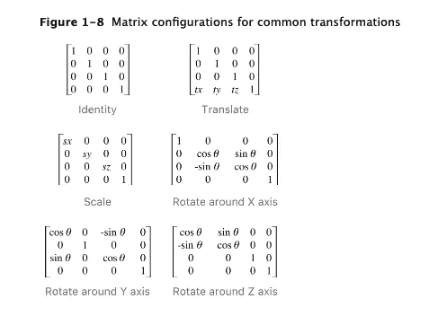

# 在 SwiftUI 中转换视图

> 原文：<https://betterprogramming.pub/transforming-views-in-swiftui-2cbb4e7b8b13>

## 在 SwiftUI 中使用线性代数的强大功能


由[克里斯·劳顿](https://unsplash.com/@chrislawton?utm_source=unsplash&utm_medium=referral&utm_content=creditCopyText)在 [Unsplash](https://unsplash.com/s/photos/transformations?utm_source=unsplash&utm_medium=referral&utm_content=creditCopyText) 上拍摄

我必须承认，在我攻读计算机科学学位的第二年，我可以选修计算机图形学的课程。

那是 1988 年，因为我在计算机科学数学课的第一年成绩不好。当时这是一个很容易的决定，我选择了不同的选择。

几十年后，我仍然被 CS 数学所困扰，所以也许是时候咬紧牙关做点什么了。加入我的旅程，尝试了解核心动画`CATransform3DIdentity`如何工作，以及如何与 SwiftUI 一起使用。

它从一个 4x4 矩阵开始，该矩阵具有一组“标准”值，代表您要在坐标空间内变换的对象。默认的坐标是这样的，所以没有变换。

```
[ 1 0 0 0 ]
[ 0 1 0 0 ]
[ 0 0 1 0 ]
[ 0 0 0 1 ]
```

用一组预定义的名称来引用每个单元格，所以又是另一个矩阵。

```
[ m11, m12, m13, m14 ]
[ m21, m22, m23, m24 ]
[ m31, m32, m33, m34 ]
[ m41, m42, m43, m44 ]
```

现在按照惯例，或者更准确地说是线性代数，改变不同框中的值决定了将要应用的变换。在矩阵中，你可以描述剪切、挤压、缩放或旋转，甚至是反射。它的效果取决于您在不同框中放置的值。



快照取自 CATransform3DTranslate 网页

令人欣慰的是，将这些编写成代码要容易一些。如果你想引用矩阵的不同部分的名字，你可以这样做，尽管你不需要这样做。使用 CA 框架，您可以走一条更容易的路，使用方便的方法为您预加载它们。如果你想知道，这个页面来自[这里](https://developer.apple.com/library/archive/documentation/Cocoa/Conceptual/CoreAnimation_guide/CoreAnimationBasics/CoreAnimationBasics.html#//apple_ref/doc/uid/TP40004514-CH2-SW3)。

## 案情摘要

但是等等——在我们进一步讨论之前，让我们先来区别一下 SwiftUI 代码。我想要一个上面有一个`SFSymbol`的简单视图。这是一个符号，我想在按下按钮时显示或隐藏，这是我的代码。当我隐藏或显示它时，我想对形状做一些变换。

第 13 行是这段代码的关键代码，这个转换引用了一个我称为`trans3`的翻译。现在，这段代码引用了一个`AnyTransition`扩展，它定义了一个将扭曲和旋转我的视图的`viewModifier`。它的代码看起来像这样:

它工作得很好，看起来也不错——我相信你会同意——并且确实想知道为什么我在核心动画中提到那些可怕的矩阵。


回答你的问题，这是因为这个动画，尽管它很好——是一个正在*平行*进行的转变。所以它同时在旋转和扭曲。

如果您的客户需要视图在*系列*中进行变换，那么他们可能希望动画中途改变方向。要做到这一点，我们需要走一条不同的路——我们需要在 SwiftUI 框架内使用核心动画。

## 核心动画

回到数学和一些不同的方法。现在，核心动画使用我已经提到的矩阵和这些传统的方法。

*   `CATransform3DTranslate`
*   `CATransform3DRotate`
*   `CATransform3DScale`

他们将在我在本文开头概述的矩阵中预加载值。你还需要一个叫做`CGAffineTransform`的方法。我们的目标是这样做:


乍一看可能和其他动画一样，但事实并非如此。这一次，树叶不仅没有消失，而且在动画中途改变了方向。代码是什么样子的？

SwiftUI 代码或多或少是相同的，正如它在其中引用的`AnyTransition`一样，但是由`AnyTransition`模板代码调用的动画完全不同。该代码如下所示:

动画运行时，pct 变量表示动画完成的百分比，因此 0 表示无，1 表示完成。我们用这个值来计算转弯的角度。巧妙的事情发生在`CATransform3DIdentity`、`CATransform3DTranslate`、`CATransform3DRotate`和`CGAffineTransform`调用中。

他们使用 pct 值来选择返回哪个`CGAffineTransform`，这就是为什么动画中途改变方向。请注意，我将它配置为 360 度，但由于我中途更改了动画，所以它只能单向移动 180 度。

还要注意，在我旋转之前，我使用`CATransform3DTranslate`来移动`SFSymbol`以确保它在中心旋转。我把符号的尺寸定为 64 磅，因此来回翻译了 32 磅。

尽管如此，我强烈怀疑这里面隐藏着更多的数学知识，如果你开始尝试并创造自己的组合，你会发现这是可行的组合。

在我看来，这个技巧是两个动画，它们的路径会在某个点交叉。一个你可以轻松切换它们的点。这是 SwiftUI 的代码。

总而言之，这就把我们带到了这篇文章的结尾。感谢阅读。