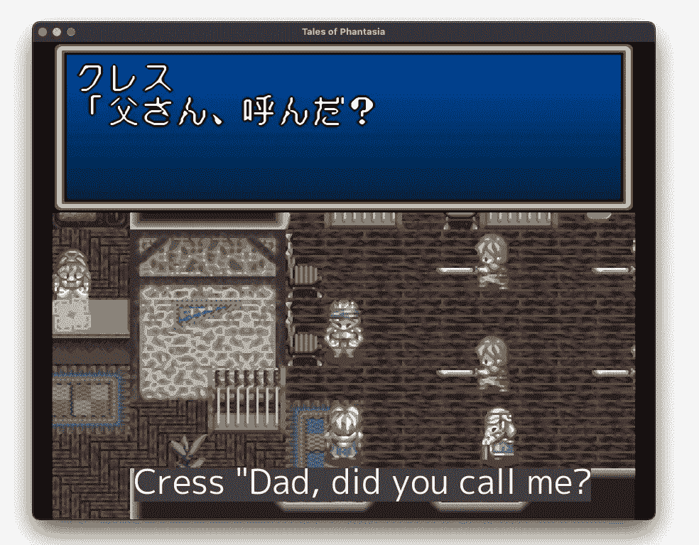
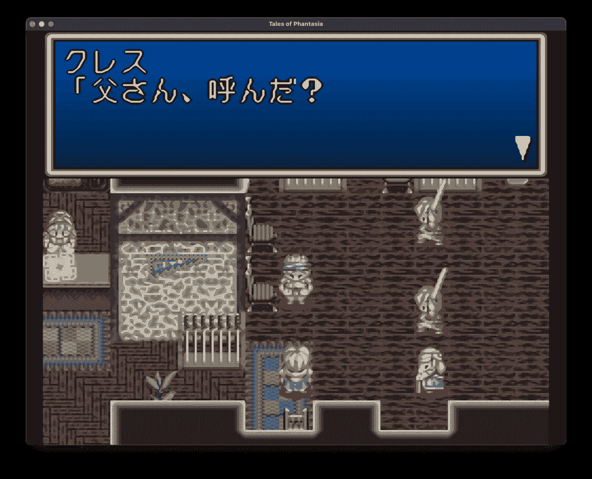
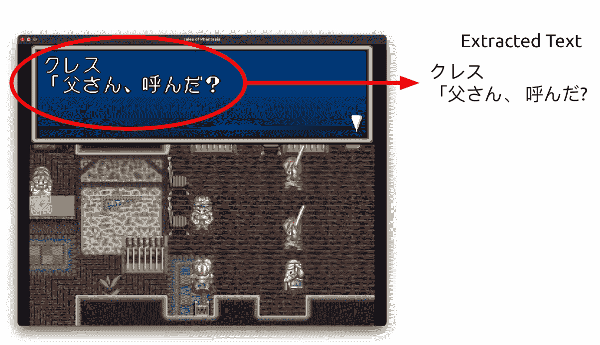
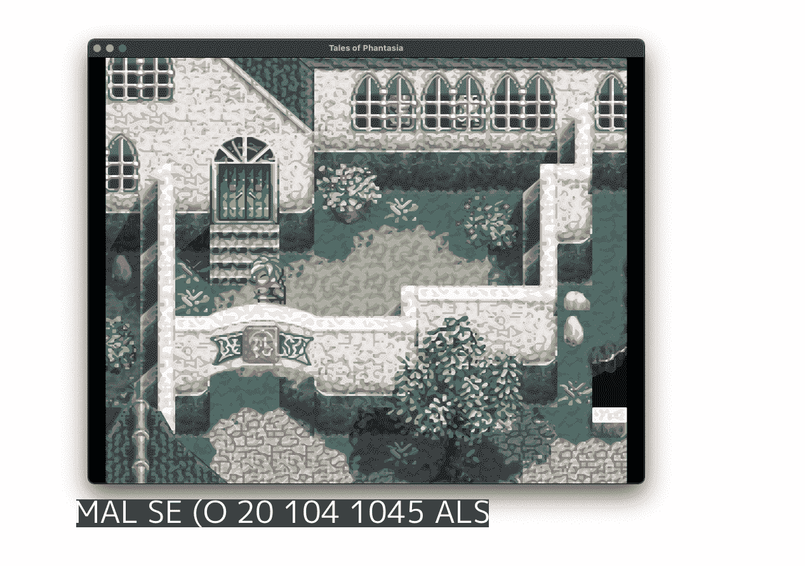
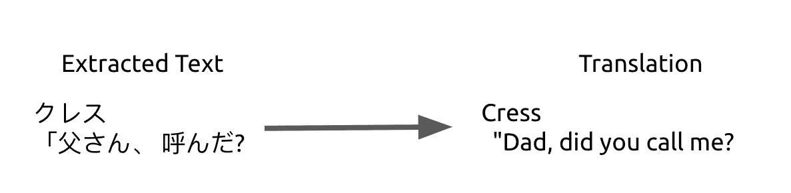

# 使用谷歌云人工智能即时翻译任何复古游戏并运行

> 原文：<https://betterprogramming.pub/translate-any-retro-game-on-the-fly-with-google-cloud-ai-and-go-c0692ab40547>

## 追忆经典游戏？这是给你的指南


维维安娜·里什在 [Unsplash](https://unsplash.com?utm_source=medium&utm_medium=referral) 上拍摄的照片

如果你喜欢玩复古游戏，尤其是老 RPG，你可能已经经历过发现这个令人敬畏的老日本 RPG 的高潮和低谷，你现在拼命想玩，但立即意识到它从未被翻译成英语，你只是带着你的希望破灭了。

感谢谷歌云人工智能服务，这已经成为历史！

使用谷歌云视觉和谷歌翻译 API，我组装了一个名为[解释器](https://github.com/bquenin/interpreter)的小型 Go 应用程序，它可以将屏幕上的任何内容翻译成你喜欢的语言。



带翻译的实时字幕

# 它是如何工作的？

这个过程其实很简单:

*   给我们要翻译的窗口截图
*   使用谷歌视觉从其中提取任何文本
*   用谷歌翻译翻译一下
*   在屏幕上作为字幕显示出来

# **截图**

为了截取特定窗口的截图，我不得不写了一个名为[的小库 captured](https://github.com/bquenin/captured) 。它只是截取了一个特定窗口的屏幕截图:

```
// Capture window
screenshot, err := captured.CaptureWindowByTitle(a.windowTitle, captured.*CropTitle*)
if err != nil {
   log.Fatal().Err(err).Send()
}
```



游戏截图

# **从截图中提取文本**

一旦你有了一张图片，你就可以把它发送到谷歌云视觉，从中提取任何文本:

```
// Extract text from image
annotations, err := vision.DetectTexts(context.Background(), screenshot, nil, 1)
if err != nil {
   log.Fatal().Err(err).Send()
}
```



谷歌视觉从截图中提取文本

# 一切看起来都很好…嘿，等一下？



这是什么胡言乱语？肯定不是屏幕上的！事实证明，神经网络试图解释任何类似文本的东西。

快速浏览一下[文档](https://cloud.google.com/vision/docs/samples/vision-fulltext-detection)告诉我们，每个结果都带有一个置信度得分和摘录文本。经过一些测试后，看起来任何真实的文本都有 99%或更高的置信度，但那些胡言乱语的结果的置信度远低于 50%。所以我们只需要过滤掉结果，保留置信度在 90%以上的。

# **翻译提取的文本**

一旦我们从截图中提取了文本，我们就可以通过调用 Google Translate API 来翻译它。你甚至不需要指定源语言，它会自动检测。

```
// Translate text
resp, err := a.translationClient.Translate(context.Background(), []string{detectedText}, "en", nil)
if err != nil {
   log.Fatal().Err(err).Send()
}
```



谷歌翻译

# **显示字幕**

这部分有点复杂，因为它需要一个图形库在屏幕上绘制。为此，我一直在使用神奇的围棋库。我省略了细节，但它本质上是在一个透明的、总是在顶部的窗口上显示翻译的文本。


在游戏窗口顶部显示字幕

# **正在试用**

前往 https://github.com/bquenin/interpreter 的，按照[自述文件](https://github.com/bquenin/interpreter#readme)中的说明进行操作，你应该在几分钟内准备就绪！