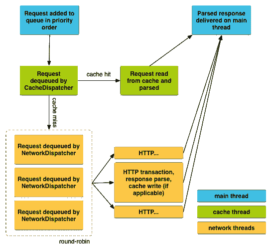

# 在 Android 中使用凌空传输网络数据

> 原文：<https://betterprogramming.pub/transmit-network-data-using-volley-in-android-6afd142f9130>

## 一个 HTTP 库，使 Android 应用程序的联网更容易，更重要的是，更快



图片来自[安卓](https://developer.android.com/training/volley/simple)

通过阅读本文，您将学会直接从 Android 应用程序中调用 REST API。我们将使用 Android 官方支持的名为[凌空](https://developer.android.com/training/volley/)的 HTTP 库。

根据其中一位读者的反馈，谷歌已经离开了这个图书馆，不再主动更新它。最后一次发布是在 2018 年 7 月 17 日。如果您打算在项目中使用它，请考虑这一点。

根据[官方文件](https://developer.android.com/training/volley/)，

> “凌空擅长用于填充 UI 的 RPC 类型的操作，例如以结构化数据的形式获取一页搜索结果。它很容易与任何协议集成，并且开箱即用，支持原始字符串、图像和 JSON。通过为您需要的功能提供内置支持，凌空将您从编写样板代码中解放出来，并允许您专注于特定于应用程序的逻辑。”

该文档列出了以下优点:

*   网络请求的自动调度
*   多个并发网络连接
*   具有标准 HTTP 缓存一致性的透明磁盘和内存响应缓存
*   支持请求优先级
*   取消请求 API。您可以取消单个请求，也可以设置要取消的请求的块或范围
*   易于定制，例如重试和回退
*   强有序性使得用从网络异步获取的数据正确填充用户界面变得容易
*   调试和跟踪工具

因此，对于调用 REST API 和传输网络数据来说，凌空是一个非常有用的库。但是，由于在解析过程中会将所有响应存储在内存中，因此凌空不适合大型下载或流操作。如果您正在寻找流操作，请考虑其他选择，如[下载管理器](https://developer.android.com/reference/android/app/DownloadManager)。

本教程分为三个部分:

1.  设置
2.  履行
3.  结论

# 1.设置

确保您已经安装了 [Android Studio](https://developer.android.com/studio) 和开发所需的 SDK。转到`build.gradle (Module: app)`，在依赖项中添加以下代码:

```
implementation 'com.android.volley:volley:1.1.1'
```

同步 gradle 文件并等待它完成。在`AndroidManifest.xml`中增加以下权限。我们需要互联网接入来发送网络数据。

```
<uses-permission android:name="android.permission.INTERNET"/>
```

让我们进入下一部分，启动您的 Android 项目。

# 2.履行

我们将建立一个`RequestQueue`类，作为我们应用程序的服务。让我们创建一个名为`RequestSingleton.java`的新类。强烈推荐使用单例方法，这样效率会高很多。

## 导入

将以下导入添加到类中。

```
import android.content.Context;
import android.graphics.Bitmap;

import com.android.volley.DefaultRetryPolicy;
import com.android.volley.Request;
import com.android.volley.RequestQueue;
import com.android.volley.toolbox.StringRequest;
import com.android.volley.toolbox.Volley;
```

## 初始化

在您的类中初始化下列变量。

```
private static RequestSingleton *instance*;
private RequestQueue requestQueue;
private static Context *ctx*;
```

## 单一对象

创建一个名为`getInstance`的同步方法。我们传递一个`Context` 对象作为参数。我们将调用这个方法来获取 singleton。

```
public static synchronized RequestSingleton getInstance(Context context) {
    if (*instance* == null) {
        *instance* = new RequestSingleton(context);
    }
    return *instance*;
}
```

## 构造器

用下面的初始化创建`RequestSingleton`的构造函数。(您将看到一个错误，因为`getRequestQueue`功能尚未实现。)

```
private RequestSingleton(Context context) {
    *ctx* = context;
    requestQueue = getRequestQueue();

}
```

用下面的代码实现缺少的`getRequestQueue`方法。

```
public RequestQueue getRequestQueue() {
    if (requestQueue == null) {requestQueue = Volley.*newRequestQueue*(*ctx*.getApplicationContext());
    }
    return requestQueue;
}
```

## 通用请求方法

一旦完成，继续添加下面的通用函数，以确保我们的 singleton 能够支持所有类型的`Request`。

```
public <T> void addToRequestQueue(Request<T> req) {
    //retry policy

    getRequestQueue().add(req);
}
```

如果 API 调用需要相当长的时间才能完成，您可以设置`RetryPolicy`来防止它超时。在注释下添加以下内容，将超时设置为一秒。

```
req.setRetryPolicy(new DefaultRetryPolicy(
        1000, 
        DefaultRetryPolicy.DEFAULT_MAX_RETRIES, 
        DefaultRetryPolicy.DEFAULT_BACKOFF_MULT))
```

它接受以下参数:

*   `Timeout` —指定每次重试的套接字超时，单位为毫秒
*   `Number Of Retries` —尝试重试的次数
*   `Back Off Multiplier` —一个乘数，用于确定为每次重试尝试设置到套接字的指数时间

## `StringRequest`

返回到`MainActivity.java`并添加一个新功能。它接受一个字符串输入参数。让我们使用内置的`StringRequest`来尝试一个简单的`GET`调用。创建一个新的`StringRequest`对象。将有两个侦听器事件，在这两个事件中，您成功地获得了响应或者请求失败了。通过`addToRequestQueue`方法添加对象。

调用`ConnectURL`并传入一个有效的 URL。您应该能够看到来自服务器的反馈。

## `JSONObjectRequest`

如果你要用 JSON 数据做一个`POST`请求，你需要预先构造一个`JSONObject`。在项目的顶部添加以下导入。

```
import org.json.JSONException;
import org.json.JSONObject;
```

创建一个新函数并初始化一个`JSONObject`。需要调用`put`函数将数据插入其中。需要将其包装在一个 try-catch 块中，以捕获`JSONException`错误。根据接受的`POST`调用输入相应地修改数据。您甚至可以通过函数的输入参数传递它。其余的实现类似于`StringRequest`，唯一的例外是在创建`JsonObjectRequest`时传递`jsonObj`变量。

您可以通过调用`ConnectURLJson`函数并传入一个有效的 URL 来测试它。

## `JSONObjectRequest`带图像

发送图像数据有点棘手，需要转换成 Base64 格式。首先，从您的`ImageView`或任何本地文件中获取相应的位图。将其转换为字节数组，并通过`java.util.Base64`函数进行编码。它现在是字符串格式，您可以很容易地将其添加到`JSONObject`中。

需要在服务器中将编码的字符串解码回正确的格式。

# 3.结论

让我们回顾一下今天所学的内容。我们从一个简单的设置开始，在 gradle 文件中添加库。然后，我们在`AndroidManifest.xml`中添加了所需的互联网权限。

然后我们创建了一个新的 singleton 类，它为我们添加各种类型的`Request`提供了一个通用方法。

在实现部分，我们尝试了三种不同的方法。第一个是使用`StringRequest`的简单 GET 调用。接下来是接受一个`JSONObject`的 POST 调用。最后，我们还尝试以 Base64 字符串的形式发送图像数据。

感谢阅读这篇文章。希望在下一篇文章中再见到你！

# 参考

*   [凌空的文档](https://developer.android.com/training/volley/)
*   [凌空的 GitHub](https://github.com/google/volley)