# 使用 React-Three-Fiber 进出 3D 对象

> 原文：<https://betterprogramming.pub/travel-in-and-out-of-3d-objects-using-react-three-fiber-36fa514ab6b5>

## 探索 3D 对象外部和内部的纹理

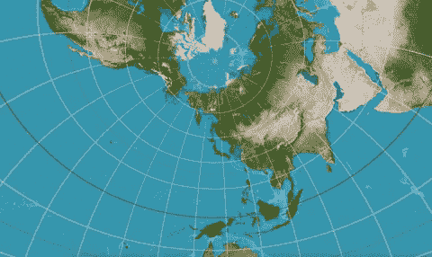

图片作者—纹理来自[https://en . Wikipedia . org/wiki/File:equi rectangle _ projection _ SW . jpg](https://en.wikipedia.org/wiki/File:Equirectangular_projection_SW.jpg)

我们已经写过 [three.js 基础](/working-with-three-js-the-popular-3d-javascript-library-bd2e9b03c95a)、 [3D 建模](/working-with-3d-model-in-three-js-e228621141af)、[颜色纹理](/working-with-texture-in-three-js-40ce5e8b96c4)和[通过反射和折射的环境纹理](/10-javascript-code-techniques-to-manipulate-textures-in-three-js-f73131f8321b)。

在这篇文章中，我们将在 3D 物体的外部和内部应用纹理，并探索进出 3D 物体的例子。

我们重用了上一篇文章中的[Create React App 工作环境，安装了以下包:](/working-with-texture-in-three-js-40ce5e8b96c4)

*   [three.js](https://github.com/mrdoob/three.js/) ( `three`):是一个在网页上渲染 3D 内容的 3D JavaScript 库。它旨在创建一个易于使用、轻量级、跨浏览器、通用的 3D 库。
*   [react-three-fiber](https://github.com/pmndrs/react-three-fiber) ( `@react-three/fiber`):是 three.js 的 react 渲染器，它允许我们使用 JSX 编写 three.js，更具声明性。React 包装器还在幕后处理很多事情，比如调整画布大小和处理卸载的对象。
*   `[@react-three/drei](https://github.com/pmndrs/drei)`:这是一个渲染 react-three-fiber 的有用助手集合。它使得使用多种类型的对象变得更加容易，例如相机、控件、图像、形状、3D 模型、环境等。

通过以下示例，我们一步一步地进出 3D 对象:

*   [从外面看立方体](#7b24)
*   [从里面看立方体](#220c)
*   [进出立方体](#bac4)
*   [从外面看球体](#94a8)
*   [从内部观察球体](#e654)
*   [进出球体](#8a07)
*   [两面纹理不同的球体](#dee1)

# 从外面看这个立方体

在 three.js 中，纹理是通过将图像应用到表面，或者作为反射或折射贴图来创建的。一个立方体需要六个图像来构建六个面的纹理。这些图像按以下顺序指定:`pos-x`、`neg-x`、`pos-y`、`neg-y`、`pos-z`和`neg-z`。

我们用芥菜田的图像。

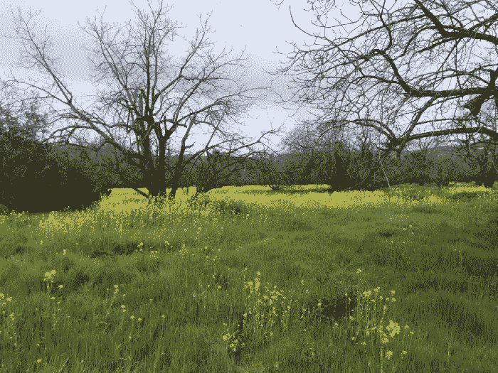

作者图片

将其拆分成四个文件，分别命名为`mustard1.jpg`、`mustard2.jpg`、`mustard3.jpg`、`mustard4.jpg`。将它们放在`public/textures`文件夹下。

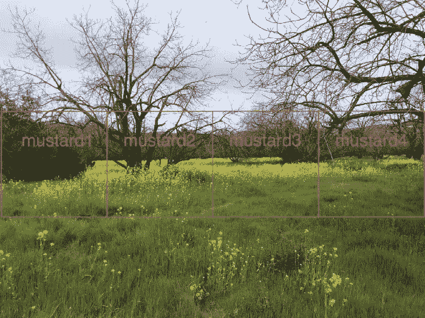

作者图片

这里是`public/sky.jpg`:

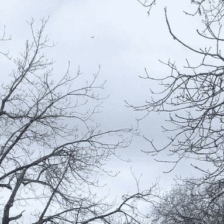

作者图片

这里是`public/grass.jpg`:

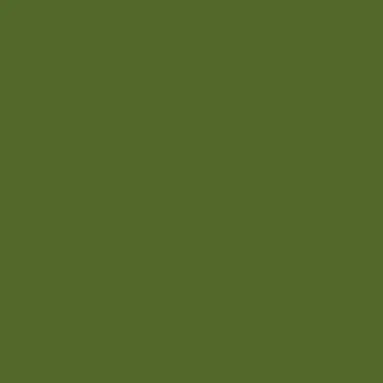

作者图片

这些 DIY 图像并不完美，但足以证明这个概念。

类似于纹理文章中的例子，我们使用下面的`src/App.js`从外部观察立方体:

我们已经[详细解释了](/working-with-three-js-the-popular-3d-javascript-library-bd2e9b03c95a)什么是 three.js 以及它在 React 中是如何工作的。网格是一种基于三角形多边形网格的对象。骨骼构成了三维物体的外形。它由几何体(形状)、材质(表面)和场景(位置)定义。

*   在上面的代码中，纹理图像在第 7–14 行被加载。每个纹理被设置为`meshBasicMaterial`的`map`道具(第 31 行)。
*   `Box`组件(第 6–37 行)调用`useFrame`执行旋转(第 16–22 行)。它定义了一个`mesh`(第 25–35 行)，其中包括一个盒子/立方体(第 26 行)，带有定义为`[3, 3, 3]`的`width`、`height`和`depth`。
*   材质(第 27–34 行)配置有`meshBasicMaterial`，一种用于绘制不受灯光影响的几何图形的材质。在第 32 行，材料`side`被设置为`THREE.FrontSide`。
*   `Box`显示在`Canvas`(第 41-48 行)上，呈现三的组件。`Canvas`将`camera`的道具设置为`{ fov: 70, near: 0.01, far: 100, position: [0, 0, 6] }`(第 42 行)，以天蓝色背景占据整个视口(第 43 行)。
*   执行`npm start`。我们在盒子外面的`[0, 0, 6]`位置观看。

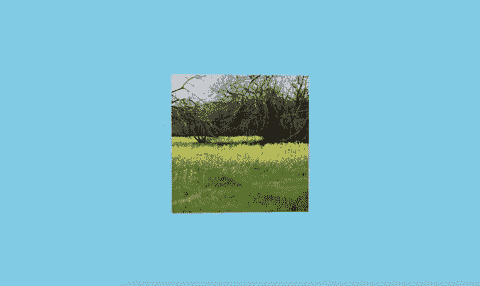

作者图片

# 从里面看立方体

进入立方体很容易——只需将相机位置移动到盒子内部。

这里是`src/App.js`:

*   在第 32 行，物料`side`被设置为`THREE.BackSide`。
*   在第 42 行，摄像机位于`[0, 0, 1]`。
*   执行`npm start`。我们在盒子内部的`[0, 0, 1]`位置观察摄像机。

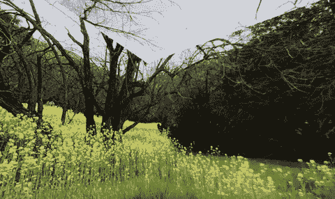

作者图片

# 进出立方体

我们可以从外面和里面看立方体。它允许我们进出立方体。实现这一目标需要两件事:

*   将相机移进移出立方体。
*   将材料做成两面的。

这里是`src/App.js`:

*   在`useFrame`(第 17–34 行)中，摄像机在每次调用时移动。它从立方体的内部移动到外部。如果它太靠后(`z`在第 23 行超过 8)，它向前移动并在立方体中行进。如果它太近(`z`在第 25 行达到 1)，它将向后移动并移出立方体。这个动作重复进行。
*   在第 44 行，材料`side`被设置为`THREE.DoubleSide`。
*   执行`npm start`。我们进出立方体。

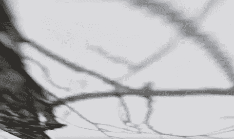

作者图片

# 从外面看这个球体

我们已经在一个球体表面投射了一张反射/折射贴图。这里，我们将图像直接应用到球体表面。

因为球体表面不是平的，所以需要一个等矩形的贴图。等矩形地图是一种 2D 图像，它将球体的曲面投影到平面上。

下面这张等矩形图是从维基百科下载的，放在`public/textures`文件夹下，名为`map.jpeg`。

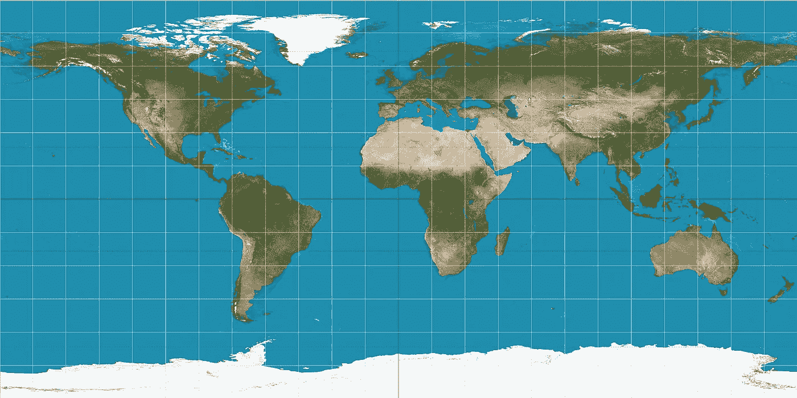

图片来自[https://en . Wikipedia . org/wiki/File:equi rectangle _ projection _ SW . jpg](https://en.wikipedia.org/wiki/File:Equirectangular_projection_SW.jpg)

这里是`src/App.js`:

*   在第 6 行，为纹理加载等矩形贴图，设置为`meshBasicMaterial`的`map`道具(第 20 行)。
*   `Sphere`组件(第 5–23 行)调用`useFrame`执行旋转(第 9–15 行)。它定义了一个`mesh`(第 18–21 行)，其中包括一个球体(第 19 行)，其`radius`、`widthSegments`和`heightSegments`被定义为`[3, 64, 32]`。
*   物料(第 20 行)配置有`meshBasicMaterial`，其中`side`设置为`THREE.FrontSide`。
*   `Sphere`显示在`Canvas`(第 27-34 行)上，呈现三的组件。`Canvas`将`camera`的道具设置为`{ fov: 70, near: 0.01, far: 100, position: [0, 0, 6] }`(第 28 行)，并以淡天蓝色的背景占据整个视口(第 29 行)。
*   执行`npm start`。我们观察球体外面`[0, 0, 6]`的摄像机位置。

图片作者—纹理来自[https://en . Wikipedia . org/wiki/File:equi rectangle _ projection _ SW . jpg](https://en.wikipedia.org/wiki/File:Equirectangular_projection_SW.jpg)

# 从内部观察球体

通过移动相机位置在球体内部移动。

这里是`src/App.js`:

*   在第 20 行，材料`side`被设置为`THREE.BackSide`。
*   在第 28 行，摄像机位于`[0, 0, 1]`。
*   执行`npm start`。我们观察球体内部`[0, 0, 1]`处的摄像机位置。

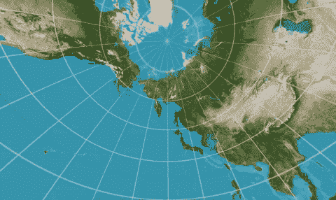

图片作者—纹理来自[https://en . Wikipedia . org/wiki/File:equi rectangle _ projection _ SW . jpg](https://en.wikipedia.org/wiki/File:Equirectangular_projection_SW.jpg)

# 在球体内外旅行

类似于立方体，我们可以进出球体。我们所需要做的就是移动相机，使材料两面都有。

这里是`src/App.js`:

*   在`useFrame`(第 9–26 行)中，相机在每次调用时移动。它从球体内部移动到外部。如果它太靠后(`z`在第 23 行超过了 8)，它就会向前移动并在球体中运行。如果距离太近(`z`在第 25 行达到 1)，则向后移动并移出球体。这个动作重复进行。
*   在第 44 行，材料`side`被设置为`THREE.DoubleSide`。
*   执行`npm start`。我们在球体内外旅行。

图片作者—纹理来自[https://en . Wikipedia . org/wiki/File:equi rectangle _ projection _ SW . jpg](https://en.wikipedia.org/wiki/File:Equirectangular_projection_SW.jpg)

# 两面有不同纹理的球体

我们把彩色地图放在正面、背面和两面。我们怎样才能在正面和背面显示不同的纹理？

为此，我们需要创建两个对象——一个显示正面，另一个显示背面。

我们用球体来说明它是如何实现的。首先下载另一面的等矩形图片，放在`public/textures`文件夹下，命名为`map2.png`。

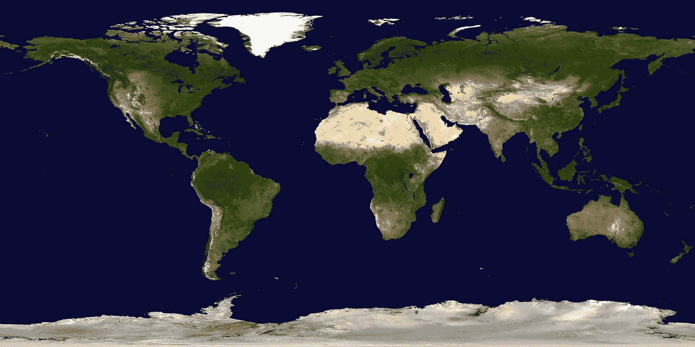

图片来自[https://en.wikipedia.org/wiki/File:Blue_Marble_2002.png](https://en.wikipedia.org/wiki/File:Blue_Marble_2002.png)

下面是`src/App.js`:

*   在第 5–34 行，`Sphere`组件接受两个道具`mapName`和`side`。
*   在第 43 行，第一个`Sphere`放置在`Canvas`中，其中`textures/map2.png`位于前侧。
*   在第 44 行，第二个`Sphere`放置在`Canvas`中，背面为`textures/map.jpeg`。
*   执行`npm start`。我们带着两面不同的纹理进出球体。

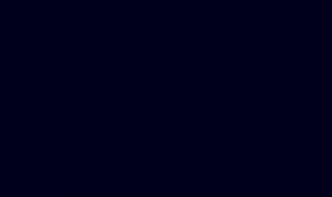

图片作者—外部纹理来自[https://en.wikipedia.org/wiki/File:Blue_Marble_2002.png](https://en.wikipedia.org/wiki/File:Blue_Marble_2002.png)，内部纹理来自[https://en . Wikipedia . org/wiki/File:equi rectangle _ projection _ SW . jpg](https://en.wikipedia.org/wiki/File:Equirectangular_projection_SW.jpg)

# 结论

我们已经展示了代码示例来查看 3D 对象内部和外部的纹理。也可以对外部和内部 3D 对象应用不同的纹理。通过移动相机，我们可以进出三维物体。

感谢阅读。我希望这有所帮助。如果你有兴趣，可以看看[我的其他媒体文章](https://jenniferfubook.medium.com/jennifer-fus-web-development-publications-1a887e4454af)。