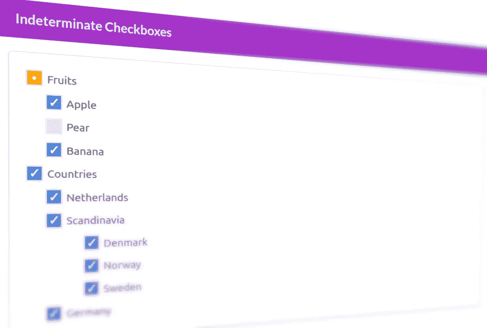
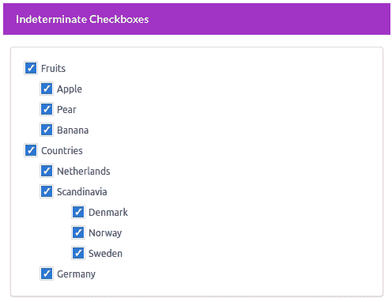
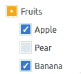
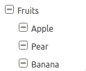
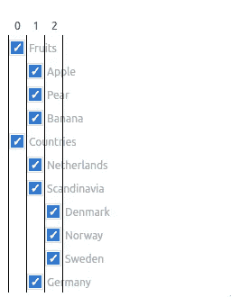
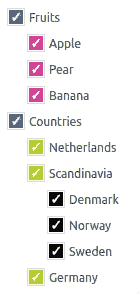

# React 中带有不确定复选框的树列表

> 原文：<https://betterprogramming.pub/tree-lists-with-indeterminate-checkboxes-in-react-31445784ac90>

## 在树形结构的数据列表中创建和更新不确定的复选框(或“半选中的复选框”)可能是一个相当大的挑战。创建解决方案的完整指南

我们今天将创造什么！

> 和往常一样，你可以在我的 [GitLab 资源库](https://gitlab.com/gvanderput/gerard-checkboxes/)中找到所有相关代码。

也许你在野外遇到过带复选框的多级列表(见上图)。它们可以在很多地方找到，在我 20 多年的开发生涯中，我已经创建了几个。

每个项目都包含一个复选框，其中一个(或多个)复选框的状态可能会影响其他复选框的状态。这是一个层次结构，在结构中有几个层次(项目的*树*),事情会很快变得非常复杂。尤其是如果你希望你的逻辑是动态的，并为未来做好准备。

所以让我们直接投入进去吧！我会解释一路上的点点滴滴。我们将讨论以下主题:

*   递归
*   复选框组件
*   列表项目
*   项目状态
*   树组件
*   `CheckboxList`组件
*   `updateItemStates`功能

**动画**:我们的应用在行动。

# 递归

在我们看第一部分之前，先简单说一下。如果您不熟悉递归地呈现 React 组件，或者一般来说不熟悉递归，我强烈建议您在继续阅读之前学习一些相关知识。这是非常必要的。我的另一篇文章可能会很有趣:

 [## 使用 React 组件进行递归渲染

### 呈现嵌套数据结构的快速指南

better 编程. pub](/recursive-rendering-with-react-components-10fa07c45456) 

# 复选框组件

首先:我们需要一个相对简单的复选框组件。抽象地说，它是一个小组件(在我们的例子中是一个正方形)，可以处于三种预定状态之一。要么是:

*   未加抑制的
*   检查
*   或者*不确定*

**不确定**只是一个花哨的词，用来表示我们不太确定复选框的当前状态。是*半检*，还是*半检*。此屏幕截图中的第一个橙色复选框是一个示例:

我们的复选框可以有三种状态:未选中、选中或不确定。

`Fruits`有三个子节点。其中两个已勾选(`Apple`和`Banana`，另一个未勾选(`Pear`)。因此不可能说出它们的父节点(`fruits)`是否被检查。是…既检查了又没检查？

这就是我们所说的*不确定*状态。

在复选框的 [MDN 页面上，您可以读到一些关于`<input type="checkbox />`元素的——很少使用——`**indeterminate**`属性的信息。该属性只能用 JavaScript 设置，如果您将其值设置为`true`，大多数浏览器将呈现带有水平条纹的(本地)复选框:](https://developer.mozilla.org/en-US/docs/Web/HTML/Element/input/checkbox#indeterminate_state_checkboxes)

铬渲染本机不确定复选框。

然而，我认为这有点令人困惑。用户可能会认为这些是*展开-折叠*按钮，而不是复选框。这就是为什么我们在本文中选择了一个简单的自定义复选框，用一个点来呈现不确定的复选框。

我们的**复选框**组件如下所示:

出于本文演示的目的，它只是一个简单的 span 元素，其样式取决于复选框的状态。我们还可以向组件传递一个点击处理程序。

完整的组件及其样式可以在[这里](https://gitlab.com/gvanderput/gerard-checkboxes/-/tree/main/components/Checkbox)找到。

# 列表项目

为了呈现(多级)列表，我们需要一些数据来定义结构。我们需要定义我们的*列表项*。每个物品都有一个唯一的`id`、一个`name`和一个`parent id`。

请看定义我们的演示列表的 JSON 文件的第一行:

> 注意，第一个项目(水果)有一个值为 0(零)的`parentId`。这表明该项是顶级项:它没有父项。

您可以看到我们如何通过使用`parentId`属性来定义苹果、梨和香蕉属于第一个项目(水果)。请记住这一点，因为这在本文中非常重要。你可以在这里查看完整的文件[。](https://gitlab.com/gvanderput/gerard-checkboxes/-/blob/main/data/items.json)

让我们继续前进！

# 项目状态说明

在我们开始渲染组件之前，我们需要考虑列表项的状态。我们需要一些状态数据来跟踪所有复选框及其各自的状态(未选中、选中或不确定)。

在 [Tree.tsx](https://gitlab.com/gvanderput/gerard-checkboxes/-/blob/main/components/Tree/Tree.tsx#L6-L15) 中定义的相关类型:

然后，我们可以为所有复选框定义默认(初始)状态:

我们在我们的`Tree` 组件中使用这个状态。我们现在就来看看这个组件。

# 树组件

树组件是我们的根组件。它包含所有内容，负责呈现所有列表项及其复选框，并跟踪它们的状态。

首先，我们初始化我们的状态，这样我们可以跟踪所有复选框的状态:

然后，我们定义一个(helper)函数，该函数可用于查找单个列表项的状态。稍后我们呈现复选框时会用到它:

最后，在开始渲染之前，我们定义了一个函数来帮助我们更新状态，我们还定义了一个单击处理程序，当我们单击其中一个复选框时，该处理程序将被执行:

> **注意**:本文最后一章解释了`updateItemStates`函数的主体和逻辑，下面会进一步解释。

我们最终的树组件如下所示:

说到渲染，你可以看到我们只渲染了一个`CheckboxList` 组件。请注意传递给它的属性。我们现在来看看这个组件。

# 复选框列表组件

这个组件可能有点难以理解，因为我们将递归地呈现它。但是和我在一起。首先，我们来介绍一下术语*缩进级别*。在我们的演示数据中，我们有三个级别(0、1 和 2):

`CheckboxList`组件呈现*属于同一组*的复选框。在下列情况下，它们属于同一组:

*   …它们具有相同的缩进级别
*   …它们共享同一个直系父代

因此，根据这些规则和我们的虚拟数据，我们可以区分这 4 组:

在我们回顾渲染逻辑之前，我们可以看一下组件属性，我们可以传递给它:

`**items**`是我们树上的所有项目。当你有一个非常大的树时，你应该考虑重构它。但是对于我们的演示来说，这就够了。

`**idsToRender**`是一个数组，包含我们要呈现的 id(*一个组中所有项目的 id—见上文)。*该属性是可选的。如果没有给定值，它将从根级别的项目中获取 id(例如，没有父级的项目，在我们的例子中是`fruits`和`countries`):

`**indentLevel**`仅用于造型目的。我们可以使用这个值为我们正在渲染的项目添加额外的边距。

`**onClick**`和`**getStateForId**`是不言自明的:一个项目(复选框)的点击处理程序，以及我们前面讨论过的`getStateForId`。这是一个返回给定项目 id 的当前复选框状态的函数。
点击处理程序的逻辑我们将在本文的最后一章单独讨论。

当呈现一个`CheckboxList`组件时，会发生以下情况:

*   对于`idsToRender`中的所有 id，我们将其呈现为复选框和标签
*   在渲染完每一个条目之后，我们检查它们是否有直接的子节点(例如，在我们的数据中指向当前条目 id 的条目，在它们的`parentId`属性中)。

如果我们找到这些子节点中的任何一个，我们获取它们的 id 并立即将它们呈现为…另一个`CheckboxList`。该过程将递归重复，直到我们的完整的树被渲染。

如果你感兴趣，我写了一篇关于递归渲染 React 组件的文章。在那篇文章中，我更详细地解释了这个概念:

 [## 使用 React 组件进行递归渲染

### 呈现嵌套数据结构的快速指南

better 编程. pub](/recursive-rendering-with-react-components-10fa07c45456) 

您可以在 GitLab 的资源库中查看完整的`CheckboxList`组件[的代码。](https://gitlab.com/gvanderput/gerard-checkboxes/-/blob/main/components/CheckboxList/CheckboxList.tsx)

# updateItemStates(复选框单击处理程序)

最后，我们来看看名为`updateItemStates`的复选框点击处理程序的逻辑。这个函数在一个单独的文件中定义，因为它包含相当多的逻辑。它需要三个参数:

我们接收所有项目的旧(当前)状态、项目本身以及被点击项目的 id。它返回所有项目的新状态。事实上，对所有项目而言。因为单击一个复选框会影响多个复选框的状态。

那么当用户点击复选框时会发生什么呢？这取决于被点击的复选框的当前状态。

该复选框当前是否已选中？在这种情况下:

*   我们为被点击的复选框调用函数`setUnchecked`
*   我们为被点击的 checkbox 的所有子节点调用函数`setUnchecked`(递归调用，因为这些子节点本身可能有子节点，等等。)
*   我们检查被点击的复选框是否有父项，如果有，我们更新它(也是一个递归调用，因为父项本身可能有父项，等等。)

复选框目前**未选中**还是**未确定？**在这种情况下，我们运行相同的逻辑，只是我们用`setChecked`调用替换了`setUnchecked`调用。

> 请注意，我们在这里做出了选择。每当复选框当前具有不确定的状态(意味着它的一些子复选框被选中，一些子复选框未被选中)并且用户单击这个不确定的复选框时，我们可以选择选中或取消选中所有子复选框。在这种情况下，我们选择将它们全部设置为选中状态。

您可以在 GitLab 存储库的文件[中查看所有逻辑。](https://gitlab.com/gvanderput/gerard-checkboxes/-/blob/main/components/Tree/updateItemStates.ts)

不要被它吓倒。再读一遍这一章，回顾代码，你应该能够理解它的每一部分。

# 一锤定音

我喜欢创建这样的自定义组件。对我们中的一些人来说，它们有时非常复杂，递归并没有使它变得更简单。

但是不要让这吓到你！投入进去。努力理解所有的点点滴滴。

一旦你做到了，你会为你能创造这样的组件而自豪。也许有一天它会派上用场。

感谢您的宝贵时间！