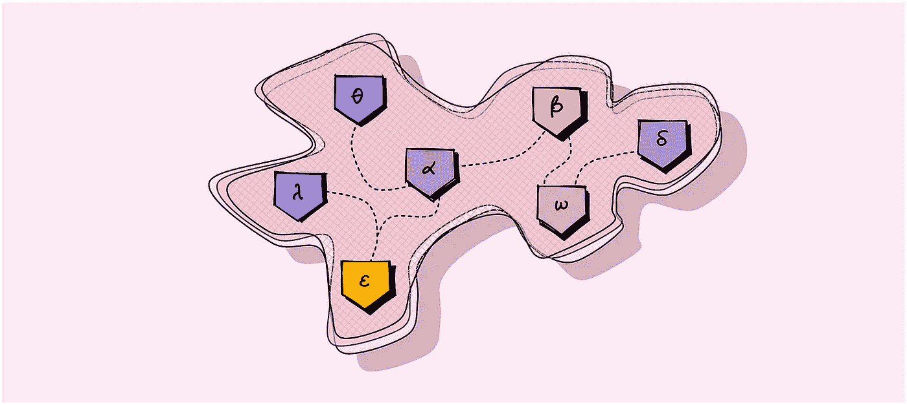
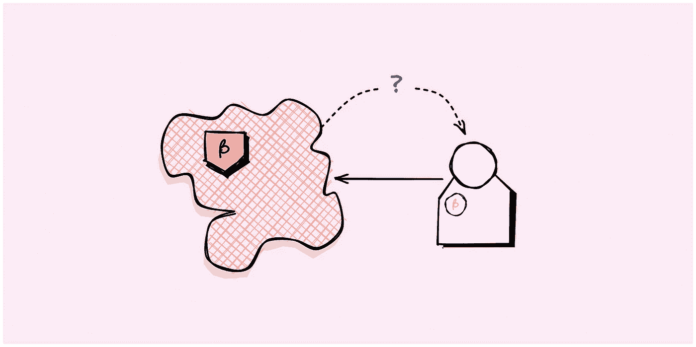
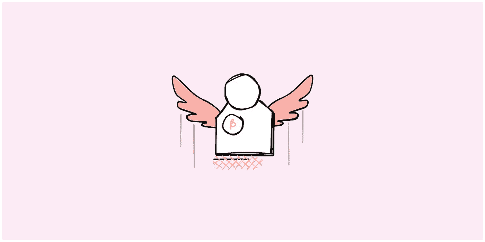
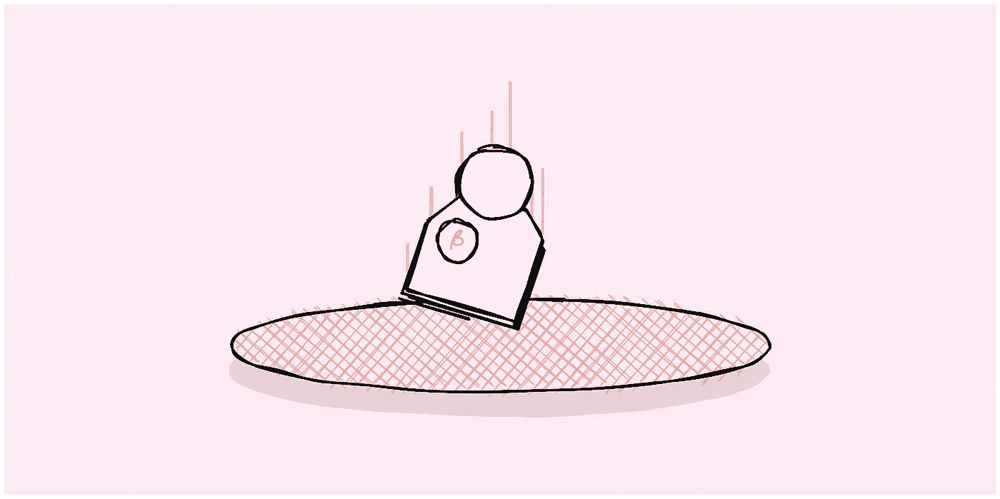

# 部落主义和领导

> 原文：<https://betterprogramming.pub/tribalism-and-leadership-25adaf2d023d>

## 什么是部落主义，为什么它在领导世界中占据如此重要的位置？

*“人是部落的。定居的东西越多，部落就可以越大。搅动器来了，部落又变小了。”* *—阿莫斯·伯顿，一望无垠。图片鸣谢*:作者

你有没有想过为什么科技公司喜欢给你印有他们商标的 t 恤？为什么人们愿意在全球范围内疯狂工作并获得报酬？

除了个人和职业原因，一个是基于我们祖先的生存本能。尤瓦尔·诺亚·哈拉里(Yuval Noah Harari)在他的书《智人》(Sapiens)中声称，人类通过与陌生人合作，成功到达了食物链的顶端。听起来很熟悉？

公司本质上是一群陌生人合作获取市场份额。最成功的公司是那些建立了强大的合作文化，并在定义自己独特的文化方面非常成功的公司。然而，外面有那么多公司。有这么多选择怎么可能有人留下来？

> “蚂蚁和蜜蜂也可以在大量的情况下一起工作，但它们的合作方式非常严格，而且只和近亲合作。狼和黑猩猩的合作比蚂蚁灵活得多，但它们只能与少数熟悉的个体合作。智人能够以极其灵活的方式与无数陌生人合作。这就是为什么智人统治世界，而蚂蚁吃我们的剩饭，黑猩猩被关在动物园和研究实验室里。”——尤瓦尔·诺亚·哈拉里，智人。

部落主义是人类学中的一个概念，指的是一种文化现象，通过这种现象，个人创建了具有社会性质的群体或组织。这些团体或组织使个人能够认同并重申自己是更大事物的一部分。

领导者必须认识到这种趋势及其对公司员工的巨大影响。部落主义产生了双向影响。人们试图在组织中留下他们走过的痕迹，反过来，组织本身也对这个人施加影响。

# 忠诚:如果这种感觉是双向的？

你得到你所投入的了吗？

在当前的停工期，当科技公司不断裁员时，忠诚度开始变得负面。这是一种耻辱，因为如果双方都受到尊重，忠诚可能是有益的。

鉴于我们的部落性质，我相信我们大多数人都在寻找一种忠诚的关系，这种关系将为我们提供安全(以不同的形状和颜色)。我也相信公司是一个很好的地方。你怎么知道这种感觉是双向的？在最近的低迷时期，许多人在收到一封感谢他们抽出时间并祝他们下一步好运(他们被解雇了)的电子邮件后，发现自己会问这个问题。

管理者必须认识到，当他们要求高忠诚度时，他们必须提供一些东西作为回报。在某些情况下，回报可以是简单的忠诚，但精明的经理知道在快节奏的环境中工作是不可能的。该公司需要确保其生存，这意味着忠诚度不能不惜一切代价。尽管如此，你还是可以给些别的东西作为回报。可能是个人成长，尊重，或者优秀的薪酬。最主要的一点是，忠诚不是免费的，作为管理者，不要靠能力去回馈。

一旦忠诚建立起来，你就有道德义务避免利用它。在许多情况下，人们不愿意解除甚至可能具有潜在破坏性的有毒关系，因为他们害怕打破社会纽带。经理们经常利用这一点来留住员工，尽管他们知道这对他们不利，或者在截止日期前把他们的工资提高 200%，尽管他们知道这是胡扯。记住，忠诚需要时间来建立，但是一旦失去，就几乎不可能重新获得。

# 自信:我一直在假装(假装)

依靠你团队的自信

> “象棋和我，很难把它们分开。这就像是山鬼”。—鲍比·费舍尔

在技术行业工作可能压力很大。一种非常注重结果的文化会让人们处于一种持续的骗子综合症状态。尽管你受过教育，有经验，有成就，但自我怀疑和个人无能的感觉依然存在虽然管理者无法控制外部环境，但他们可以创造一种可以提升自信的共享身份。

员工可以用第二个身份来利用同事的信心和承诺:*“我很自豪成为这个团队的一员；我们一起做出改变。”创造一个小部落和一个“团队身份”可以让人们感觉自己是比他们更大的东西的一部分。*

称你的团队为“我们”我们决定，我们需要，我们会。只要有可能，就在团队的频道里讨论事情。例如，当您需要为团队成员分配新任务时，在团队的频道中向他们发送消息。另外，发展一种团队语言，你的说话方式，以及你谈论的内容。

> “改变了部落里的语言，你就改变了部落本身。” *―戴夫·洛根，“部落领导:利用自然群体建立繁荣的组织”*

平衡部落心态至关重要，这样才不会成为美国对抗他们心态的牺牲品。作为部落主义的结果，你无法完全避免这一点。因此，确保你的团队与“外部世界”有着牢固而稳定的联系另一个重要的警告是，公司身份永远不应该放在个人身份之前。这可能导致不接受多样性的同质文化。而不是取代，增加。

# 安全区:如果你掉下来，我会接住你。我会等着的

你的团队；你的安全网

一位团队成员曾经告诉我，“我觉得我应该有压力，但出于某种原因，我就是没有。”他们的归属感让他们觉得这是团队的责任，而不是个人的责任。没有部落的人可能会经历巨大的压力，因为他们没有人支持他们。研究甚至表明，组织归属感可以缓解消防员的压力和创伤后应激反应 [1](https://newsletter.engstuff.xyz/p/tribalism-and-leadership#footnote-1) ，这类似于职业倦怠。

衡量一个安全区域的“质量”的一个方法是通过观察团队在多大程度上分享了它的弱点。如果人们公开分享他们的失败和错误，这是一个好迹象。但如果每次会议都很愉快，没有人谈论负面话题，这就是一个危险信号。

管理者可以通过提供相关和真实的例子来帮助他们的团队发展这种技能。谈论令人不舒服的话题，提出通常被“私下沟通”的问题，会向团队表明可以分享。

# **参考歌曲**

*   如果这种感觉是双向的？北极猴子——我想知道吗？
*   我一直在假装(假装)——[西蒙&加芬克尔——假装](https://www.youtube.com/watch?v=XLjHt5tkRFo)
*   如果你跌倒，我会接住你，我会等着你——[辛迪·劳博尔——一次又一次](https://www.youtube.com/watch?v=VdQY7BusJNU)

*原载于 2022 年 7 月 26 日*[*https://newsletter . engstuff . XYZ*](https://newsletter.engstuff.xyz/p/tribalism-and-leadership)*。*