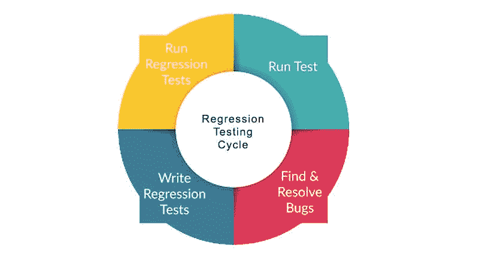

# 2022 年掌握回归测试的窍门

> 原文：<https://betterprogramming.pub/tricks-to-master-regression-testing-in-2022-3eb3c78dda31>

## 测试您的应用程序的一个非常有益的方法

凯文·Ku 在 [Unsplash](https://unsplash.com?utm_source=medium&utm_medium=referral) 上的照片

我们收到的每一个软件更新都经过了开发人员的全面测试和其他努力。一切都应该经过大量的测试，并且应该通过组织创建的所有测试用例。此外，为了确保在应用软件升级后不会出现缺陷或错误，应该执行回归测试来评估新软件程序的功能。

因此，回归测试非常重要，因为新的更新可能会破坏应用程序的功能，例如，导致应用程序崩溃或不正确地运行。组织通常有大量不同的测试用例，在应用新的补丁程序后对应用程序进行审查，以确保新的更新不会在评估过程中损害软件的功能。

# 掌握回归测试

## 自动化回归测试

手动回归测试有时会变得耗时且不方便。执行手动回归测试还有其他的限制，例如不同平台的需求，这导致在不同平台上测试时的许多挑战，以及在多个平台上测试很耗时的事实。

对于[自动化回归测试](https://www.perfecto.io/blog/automated-regression-testing)，有大量的设备可用于在不同的平台上测试，允许我们同时在多种平台或设备上测试代码，并更容易地查明错误。此外，因为这些测试是自动的，所以不需要手动运行它们。它们也可以自动执行。

所以，测试人员只需要审查报告。他们可以利用他们的时间专注于消除他们发现的错误。这些报告包含大量特定信息，可用于快速确定问题的根本原因。

## 变更的新影响测试用例

设备有许多新的功能，并且修改不断地被集成到软件中。由于开发了大量的集成，因此存在发生错误的风险，并且新功能会对其他模块和[集成](https://www.mulesoft.com/resources/integration)产生负面影响。因此，测试用例应该经常修改，以跟上软件的改进。当新软件发布时，更新基于它的测试用例也是必要的。因此，测试用例应该经常更新，以确保所有软件及其升级在发布给公众之前都经过了彻底的测试。

## 清理过时的测试用例

当软件定期进行代码变更和更新时，一些测试用例可能会过时。这是因为，当代码改变时，一些模块被移除，新的模块被添加到它们的位置。因此，有必要删除与已删除功能相关的所有测试用例，因为测试套件将花费一些时间来运行这些测试用例，并且因为它们是不相关的，所以花费在这些测试用例上的时间将被浪费。

在开始测试具有新模块和其他更新的新软件之前，有必要评估测试用例，并删除任何与当前情况不再相关的用例。

## 确定导致问题的领域

[图片来源](https://www.fleekitsolutions.com/regression-testing-approach-tools/)

一个软件有大量不同类型的模块，每个模块负责执行特定的任务。鉴于这些模块执行不同的任务，它们的工作和编程环境是不同的。因此，所有这些模块中可能都有错误，根据功能的不同，有些错误比其他错误更普遍。

例如，由于开发人员缺乏技术理解，或者因为开发人员没有得到关于如何实现[需求](https://searchsoftwarequality.techtarget.com/definition/requirements-analysis)的明确指示，某些模块可能有大量的错误。可能有其他模块顺利通过。这是可能的。

因此，有必要确定有问题的领域。一旦找到这些区域，就有可能开发特定于这些区域的测试用例，允许在将更新发布到生产环境之前识别并解决这些模块上的错误。

# 结论

一种叫做回归测试的简单技术可以用来快速发现软件升级造成的错误。有许多技巧和策略可以用来确保高效和有效地执行回归测试。理解回归测试可以带来各种好处，包括它更节省成本和资源。

总是建议遵循上面的提示和技术来掌握回归测试，这在未来将是有益的，并且允许容易地部署更新而不出错。