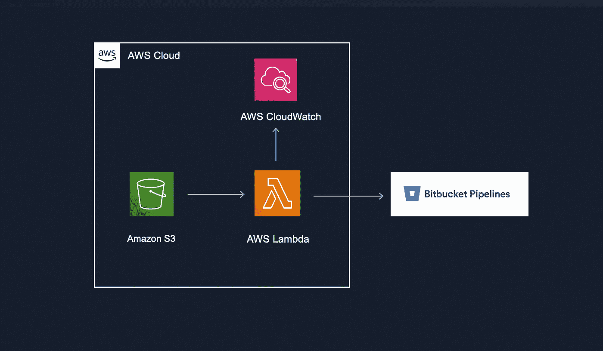

# 在 S3 改变时触发位桶流水线

> 原文：<https://betterprogramming.pub/trigger-bitbucket-pipeline-upon-s3-changes-6600ec5bd26b>

## 帮助你更快完成的小指南

使用 AWS 触发位桶管道

位桶管道使创建 CI/CD 管道成为一项快速、简单的工作。使用 Bitbucket，您可以调度管道，也可以选择特定的分支，一旦检测到任何代码更改，就触发管道。

在最近的一个项目中，每当我的 AWS S3 桶的特定文件夹中有新文件时，我需要触发一个 bitbucket 管道。这比我想象的要简单！

# Python Lambda 函数

使用 AWS Python 3.9 Lambda 函数，我们可以轻松地向 Bitbucket 的 API 发送 POST 请求。为了存储用户凭证，建议使用 AWS Secrets Manager。代码可能是这样的:

这里，函数`run_pipeline()` 向 Bitbucket API 发送一个`POST`请求。这个 Lambda 函数每次运行都会发送一个`POST`请求，这个请求会自动运行相关的管道。如果您的 bitbucket 管道运行成功，您将在 Cloudwatch 日志中看到 200 状态代码。

同时，`get_secret()`函数从 AWS Secrets Manager 中检索用户凭证。如果您目前不关心与安全相关的问题，您也可以在测试时对凭证进行硬编码。

# **S3 事件通报**

一旦设置了 Lambda 函数，就需要在 S3 桶中设置一个事件通知。这将确保您的 Lambda 函数在您的 bucket 中每次发生变化(例如一个新文件)时都会运行。

如果转到 S3 存储区的“属性”选项卡，则可以为所有对象“创建”事件(或“删除”事件，具体取决于您的要求)设置事件通知。对于目的地，您可以选择在第一步中创建的 Lambda 函数。

如果您只想在触发 Lambda 函数时考虑特定的文件类型，您可以在`Filters`下指定相关的文件类型。你也可以给你的事件通知设置添加一个前缀，例如，如果你只想运行你的 lambda，如果文件被上传到 S3 桶中的特定文件夹。

# 许可

为了让 Lambda 函数顺利工作，您需要给所使用的 AWS 角色一定的权限。例如，正在使用的角色将需要访问 S3、CloudWatch 和 Secrets Manager 的策略。

我将很快写另一篇文章，描述如何使用 Terraform 创建相同的架构。敬请关注！