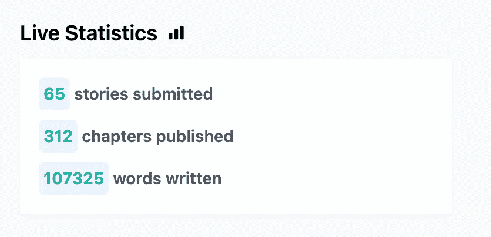
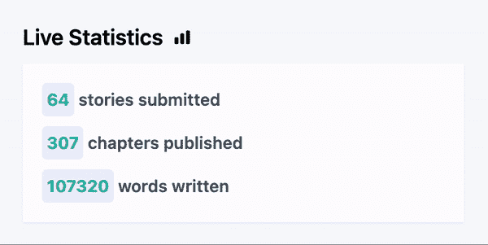

# 在 LiveView 和 Elixir 中从服务器触发可重复的动画

> 原文：<https://betterprogramming.pub/triggering-repeatable-animations-from-the-server-in-liveview-and-elixir-970961085f12>

## 灵药开发者指南(以及你为什么想这么做)


由[詹·雅各布·纳尼斯塔](https://unsplash.com/@janjakubnanista?utm_source=medium&utm_medium=referral)在 [Unsplash](https://unsplash.com?utm_source=medium&utm_medium=referral) 上拍摄的照片

# 凤凰城实时景观

Phoenix LiveView 是我目前最喜欢的创建 web 应用程序的方式——花瓣堆栈使用起来非常有趣，并且(在我看来)很快就会成为 web 开发人员的主流堆栈选择，他们希望创建实时应用程序，而不必担心当今最流行的工具所带来的客户端问题。

Chris McCord 在他的关于 LiveView 如何成为的[fly . io 博客文章中雄辩地描述了你获得的力量以及能够几乎忘记大约 90%的客户端代码的天赋——强烈推荐阅读。](https://fly.io/blog/liveview-its-alive/)

我已经开发了一些 LiveView 应用程序(我认为自己足够幸运，能够在工作中使用它)，包括:

*   一款受 wordle 启发的网页游戏
*   [nicice . io](https://niceice.io/)——一项 SaaS 服务，用于尽可能容易地获取用户的反馈

```
Petal Stack?
Phoenix, Elixir, Tailwind, Alpine & LiveView.
```

# 为什么要从后端触发前端动画？

LiveView 在构建实时应用程序方面非常出色——当我说实时时，我指的是对当前浏览该网站的所有用户的即时反应。

我目前正在开发一个平台，可以在网上分享用户创造的虚构故事，当我试图给生活带来一个新的功能时，我偶然发现了为什么需要这个教程的基础。

作为我的新平台的一部分，用户可以提交故事和章节，并制作内容供用户阅读。想要给我的应用程序添加更多的活力——我觉得在我的网站首页上有一个实时的全球统计组件会很酷，这样用户可以实时看到网站有多活跃！

# 所以我做了一个简单的 LiveView 组件



```
def mount(_params, _session, socket) do
    socket =
      socket
      |> assign(:story_count, total_story_count())
      |> assign(:word_count, total_word_count())
      |> assign(:chapter_count, total_chapter_count()) {:ok, socket}
  end

  def render(assigns) do
    ~H"""
     <p><span id="stories-count"><%= @stories_count %></span> stories submitted</p>
     <p><span id="chapters-count"><%= @chapters_count %></span> chapters published</p>
     <p><span id="word-count"><%= @word_count %></span> words written</p>
    """
  end
```

这很酷——我有一个组件，每当用户访问页面时，它就会更新，但这不是很实时，不是吗？

目前信息只在`mount`更新——让我们用默认情况下 Phoenix 附带的`Phoenix.PubSub`模块的魔力来改变它。

为此，我们需要为我们的 PubSub 创建一个要订阅的主题(并在我的应用主管树中启用 PubSub):

```
# MyApplication.Submissions @topic inspect(__MODULE__) def subscribe do
    PubSub.subscribe(MyApplication.PubSub, @topic)
  end defp notify_subscribers({:ok, result}, event) do
    PubSub.broadcast(MyApplication.PubSub, @topic, {__MODULE__, event, result})
    {:ok, result}
  end
```

现在，每当我想提醒订阅了我感兴趣的更新的内容时，我就可以使用这个`notify_subscribers/2`功能，如下所示:

```
def update_story(%Story{} = story, attrs) do
    story
    |> Story.update_changeset(attrs)
    |> Repo.update() 
    |> notify_subscribers([:story, :updated]) # ⬅️ the interesting bit
  end
```

然后我们需要确保当我们的`live_component`挂载并连接到 WebSocket 时，它订阅了主题。

```
def mount(_params, _session, socket) do
    if connected?(socket) do
        MyApplication.Submissions.subscribe()
    end

    # and add an event listener to ensure our LiveView knows to react when it receives a message from our subscribed topic
    def handle_info({MyApplication.Submissions, [:story, _], _}, socket) do
        socket =
            socket
            |> assign(:story_count, total_story_count()) {:noreply, socket}
    end
  end
```

现在，当我们更新我们的故事时——*注意，我忽略了第二个 atom，所以每当发生任何故事变化时，我都会调用我的新任务*——我们的前端将为所有用户更新！

不过，我们有个问题。

没有动画！这对于用户来说可能很不和谐，所以让我们进入这篇文章的真正要点；从后端触发动画来真正取悦我们的读者。

# 动画时间

对于我的例子，我使用顺风(耶，花瓣🌸stack ),但只要动画和关键帧属性设置正确，这将适用于任何 CSS 类。

首先，让我们在 CSS 中定义我们的动画(在我们的`tailwind.config.js`):

```
theme: {
    extend: {
      keyframes: {
        wiggle: {
          '0%': { transform: 'translateY(0px) scale(1,1)' },
          '25%': { transform: 'translateY(-4px) scale(1.05,1.05)', background: 'aquamarine' },
          '100%': { transform: 'translateY(0px) scale(1,1)' },
        }
      },
      animation: {
        wiggle: 'wiggle 0.5s linear 1 forwards',
      }
    },
  },
```

我们所做的只是让它跳一点点。让我们继续整合这个。

# 第一次尝试

起初，我认为我可以简单地使用`LiveView.JS`库从后端向有问题的元素添加一个类，并将其传递到前端，如下所示:

```
def do_animation do
    JS.add_class("animate-wiggle", to: "#word-count")
  end
```

记住，我也是用一个带有点击处理程序`phx-click={do_animation}`的简单按钮来测试的，这样就不用每次都触发后端事件了——所以我用的是 phx-click...

这增加了类，动画做了一点跳跃——太棒了。

我又点了一下，什么也没发生，不太好。

这是因为类依赖于元素，所以再次添加它意味着什么也不会发生——我的动画是不可重复的。哎呦。

# 第二次尝试

添加完类后，让我们删除该类。

```
def do_animation do
    JS.add_class("animate-wiggle", to: "#word-count")
    send(self(), JS.remove_class("animate-wiggle", to: "#word-count"))
  end
```

这不起作用，因为该类在添加的同时被删除。我本来可以增加一个暂停，但这似乎太不礼貌了。

# 第三次尝试

```
def animate_wiggle(element_id) do
    JS.transition(%JS{}, "animate-wiggle", to: element_id, time: 500)
  end
```

`JS.transition/2`来救援了！LiveView 团队构建了一个特定的功能来重复触发转换。

但是有一个问题——`LiveView.JS`函数只是生成 JavaScript，所以它们必须在页面中呈现！

那我们该怎么办？

[RTFM](https://hexdocs.pm/phoenix_live_view/js-interop.html#handling-server-pushed-events) 当然！向前！

# 第四次尝试

我必须将事件推送到浏览器，以便一些 JavaScript 可以为我执行 wiggle 动画——所以流程是这样的:

*   发布订阅广播事件
*   每个订阅的 LiveView 进程都会监听该事件，并向其客户端触发一个事件
*   客户端有一个 JavaScript 事件监听器来获取`phx`事件并对其做出反应
*   JavaScript 向客户端发出一个调用来触发动画
*   `JS.transition/2`火灾
*   摆动摆动

让我们在`App.js`中添加 JS 事件监听器:

```
window.addEventListener(`phx:wiggle`, (e) => {
  let el = document.getElementById(e.detail.id)
  if(el) {
    liveSocket.execJS(el, el.getAttribute("data-wiggle"))
  }
})
```

让我们更新事件处理程序，确定何时将事件推送到客户端:

```
def handle_info({MyApplication.Submissions, [:story, _], _}, socket) do
    socket =
        socket
        |> assign(:story_count, total_story_count())
        |> push_event("wiggle", %{id: "stories-count"}) # ⬅️ the new addition

    {:noreply, socket}
end
```

我们还需要确保向想要摆动的元素添加 id 和数据属性，以便 JavaScript 可以找到它并知道如何处理它:

```
<p><span id="stories-count" data-wiggle={animate_wiggle("#stories-count")}><%= @stories_count %></span> stories submitted</p>
```

# 结果



你看不到的是我有另一个窗口来触发上述事件。

我们完了！

我们已经用最少的代码(实际上只有 6 行 JavaScript)成功地触发了来自应用程序其他用户的实时事件的可重复前端动画。

我爱`LiveView`，我希望这篇文章能让你知道为什么。

[在 Twitter 上关注我](https://twitter.com/codestirring) & [订阅我的 Substack](https://chrisgregori.substack.com/) 获取更多 LiveView、Elixir 和一般编程教程和技巧。