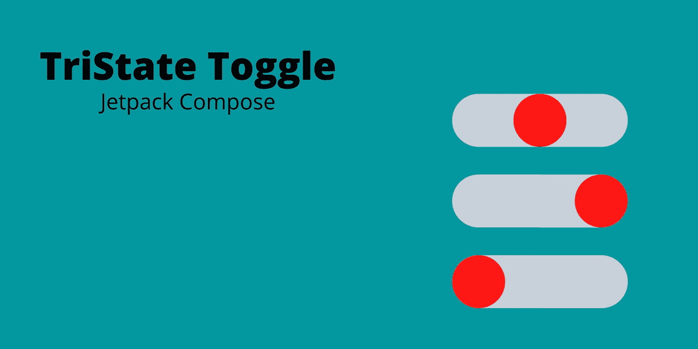
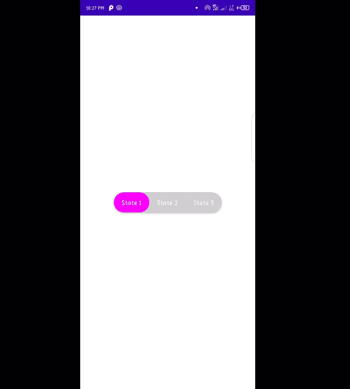

# 如何在 Jetpack 撰写中使用三态切换

> 原文：<https://betterprogramming.pub/tristate-toggle-in-jetpack-compose-5b080e537c64>

## 在 Android 用户界面的多个状态之间切换



为了在 Jetpack Compose 中处理双重状态(例如:在白天和夜晚模式之间切换),我们使用开关，如下所示:

```
val checkedState = remember { mutableStateOf(true) }Switch( checked = checkedState.value, onCheckedChange = { checkedState.value = it })
```

但是，Compose 没有提供任何可以让我们处理多种状态的组件。

例如，除了白天和夜晚模式，我们还想拥有白天、夜晚和夜晚状态。或者这些州的数量会增加。一个解决方案是我们可以将`RadioGroup`和`RadioButtons`一起使用，但是这样看起来不太好。

为了克服这一点，我们可以设计我们的自定义切换状态按钮，将有两个以上的状态。首先，让我们看一下代码。

首先，我们正在创建一个状态列表，它将决定切换按钮有多少个状态。

然后，我们通过记住保存配置更改来创建`selectedOption`，这将存储当前活动状态的值。

然后用λ来更新`selected`选项的值。

```
val onSelectionChange = { text: String ->        
    selectedOption = text    
}
```

然后我们创建顶层视图作为一个表面，给我们的按钮一个漂亮的外观。并使其围绕我们正在使用的`children`视图的内容:

```
Modifier.wrapContentSize()
```

然后，为了模仿一个漂亮的切换按钮的外观，我们使用了一个`Row`。给它一个圆形的外观。

然后我们遍历我们的`states`列表，在该行中添加所需的状态。在`clickable`属性中，我们用被点击项目的文本更新`selectedOption`的值。

```
.clickable {
    onSelectionChange(text)                        
}
```

在`background`属性中，我们检查该项目是否是选中的项目，如果是，则将其背景颜色更改为“洋红色”,否则保持为“浅灰色”。

这是模仿切换按钮的主要成分。因为被选择的项目将与其余项目具有不同的颜色。

注意:您可以更改此背景属性，以符合您自己的设计要求。

```
.background(  
if (text == selectedOption) {
     Color.Magenta
} else {                                
     Color.LightGray                           
  }                       
)
```

您可以利用`selectedItem`的值来实现您的结果。

最后，最后的结果会是这样的。



谢谢，就这些。