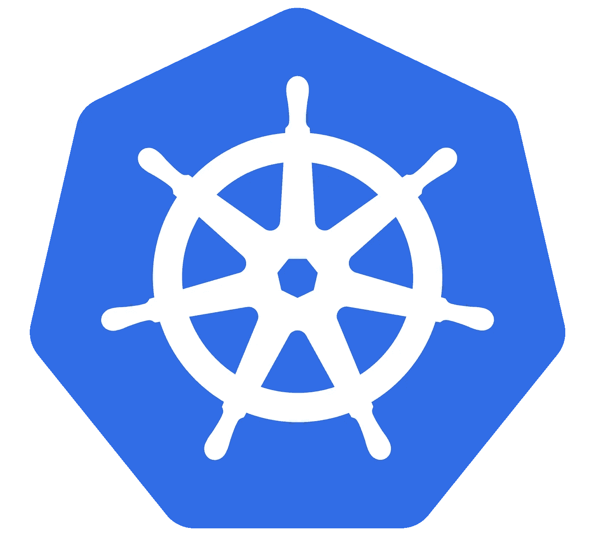

# Kubernetes 故障排除:初学者指南

> 原文：<https://betterprogramming.pub/troubleshooting-kubernetes-the-beginners-guide-2440ec400155>



如果你和 [Kubernetes](https://kubernetes.io/) 一起工作或者曾经一起工作过，你很可能会遇到这里描述的一些问题。

我们大多数人都会遇到这种情况:你在周一来到办公室，你的 NMS 全部处于红色，你的 Kubernetes 集群节点已经死亡，你的负载平衡器已经损坏。

我在这里通过回顾我在自己的部署中看到的常见问题，为您节省一些故障排除时间。

我运行了许多开发和前沿代码，并且总是喜欢尝试部署 Kubernetes 节点和各种覆盖网络的新方法。我的大多数 Kubernetes 问题就是在这些部署中出现的。

让我们开始吧。

# 远程 Kubectl 没有响应

`The connection to the server localhost:8080 was refused — did you specify the right host or port?`

大多数 Kubernetes 管理员都在某个时候看到过这个错误。如果在指定的 URL 上无法访问 Kubernetes API，或者 Kubernetes API 有问题，就会出现这种情况。

请注意，Kubernetes API 的权限问题很可能会产生不同的错误。

首先，让我们确保安装了 [kubectl](https://kubernetes.io/docs/tasks/tools/install-kubectl/) 并且是正确的版本:

```
kubectl version
```

输出应该如下所示:

```
Client Version: version.Info{Major:”1", Minor:”12", GitVersion:”v1.12.1", GitCommit:”4ed3216f3ec431b140b1d899130a69fc671678f4", GitTreeState:”clean”, BuildDate:”2018–10–05T16:46:06Z”, GoVersion:”go1.10.4", Compiler:”gc”, Platform:”linux/amd64"}
```

如果有任何其他错误(找不到命令等):

*   确保您是通过有权执行 kubectl 命令的用户来运行 kubectl 的。
*   确保 kubectl 路径设置正确。
*   默认情况下，kubectl 不会使用“root”帐户。

如果 kubectl 本身工作正常，我们就可以继续对集群进行故障排除了。

`ssh`到您的一个主节点:

```
ssh lyokowarrior@192.168.2.52
```

最常见的问题之一是一个或多个主节点上的`etcd`服务失败。

您可以通过以下方式检查服务状态:

```
service etcd status
```

如果服务报告*死亡*，您的问题就在那里。

`etcd`服务失败的最常见原因之一(尤其是在主节点重启之后)是在节点上启用了交换。在 kubeadm 管理的集群中尤其如此。

[](https://github.com/kubernetes/kubeadm/issues/610) [## [错误交换]:不支持在交换打开的情况下运行。请禁用交换问题#610 …

### 这是错误报告还是功能请求？BUG 报告版本 kubeadm 版本(使用 kubeadm 版本):1.9.0 环境…

github.com](https://github.com/kubernetes/kubeadm/issues/610) 

以 root 用户身份运行:

```
swapoff -ased -i '/ swap / s/^/#/' /etc/fstab
```

然后，禁止在引导时启动交换:

```
nano /etc/fstab# Comment out the second line mentioning swap
# Save the file
```

Swap 也可能影响`[kubelet](https://kubernetes.io/docs/reference/command-line-tools-reference/kubelet/)`服务。

您可以通过以下方式检查服务状态:

```
service kubelet status
```

您还可以在`/var/log`中找到这两种服务的日志，以便进行进一步的故障排除。

在整个`etcd`集群(所有主节点)上运行这些检查。

现在您应该有一个健康的集群，kubectl 应该可以工作了。

# 持久性卷的问题

持久性卷的故障排除分为两个部分:

*   批量索赔故障排除。
*   卷盒绑定故障排除。

# 卷可用性

第一步是看 Kubernetes 集群是否能看到 PV。查看集群中 PV 的最简单方法是通过 Kubernetes 仪表板。

如果您没有安装仪表板，您有几个选项:

*   获得一个名为*俱吠罗*的 iOS 或 Android 应用程序，并连接到您的集群。
*   设置仪表板。(这里有一个[详细指南](https://medium.com/@lyokowarrior14/the-ultimate-guide-to-on-perm-kubernetes-84b564f0acc#b874-a524095623cf))。
*   使用 kubectl。

要通过 kubectl 查看 PV，请运行:

```
lyokowarrior@kube-client:~$ kubectl get pv
NAME             CAPACITY   ACCESS MODES   RECLAIM POLICY   STATUS   CLAIM                   STORAGECLASS   REASON   AGE
task-pv-volume   10Gi       RWO            Retain           Bound    default/task-pv-claim   manual                  20h
```

上面的输出列出了一个健康的绑定卷。

常见故障排除步骤:

*   如果您使用 NFS，请确保群集可以访问 NFS 共享。
*   确保卷运行正常并处于“已绑定”状态。
*   点击此处查看 PV 指南示例:

[](https://kubernetes.io/docs/tasks/configure-pod-container/configure-persistent-volume-storage/) [## 将 Pod 配置为使用持久卷进行存储

### 编辑此页面此页面显示如何配置 Pod 以使用 PersistentVolumeClaim 进行存储。以下是对…的总结

kubernetes.io](https://kubernetes.io/docs/tasks/configure-pod-container/configure-persistent-volume-storage/) 

# 服务不可访问

任何集群上的一个常见问题是，部署的服务在部署时不可达，或者由于某种原因变得不可达。

例如，我们有一个运行在端口 3182 上的 HTTPD 部署，它应该通过一个负载平衡器暴露给本地 LAN。

*   场景 1:服务根本不可达。(curl localhost 没有回复:3182)。
*   场景 2:服务只能在内部访问。

这里的一个常见问题是部署没有正确公开，或者服务发布部署发生了一些问题。

同样，Kubernetes 仪表板可以帮助您了解服务的状态。如果没有仪表板，可以使用 kubectl。

要重新部署服务:

```
kubectl delete service affected-service
```

(用您自己的名称替换服务名称)。

```
kubectl expose deployment affected-deployment -n=default --type=LoadBalancer --name=affected-service --external-ip=192.168.2.54 --port=3182
```

重新创建公开的服务。(用您自己的名称、IP 和命名空间替换它们)。

注意:检查 pod 配置，并确保 HTTPD 服务器侦听的端口与显示的端口匹配。

# 无法登录仪表板

自托管 Kubernetes 集群上的仪表板可能很棘手。一个常见的问题是无法登录仪表板。

登录大多数安装都需要令牌，第一步是检查令牌是否有效，以及是否选择了正确的令牌:

```
kubectl get secrets -n=kube-system | grep dashboard
```

这将显示与仪表板相关的所有`secrets`的列表。如果没有显示任何内容，则仪表板部署可能有问题。

请查看我的部署指南或下面的链接之一，了解有关部署仪表板的说明。

现在，让我们来看看`secret`的内容:

```
kubectl describe secret kubernetes-dashboard-token-xxx0x-n=kube-system
```

(用上一步列表中的名称替换`secret`的名称)。

将`secret`复制并粘贴到仪表板登录页面。您现在应该可以登录了。

一个常见的问题是尝试访问仪表板时出现 HTTP 身份验证错误。

解决方法是使用 Firefox，因为它在验证网站有效性时不像其他浏览器那样严格。此问题的实际解决方案是在受支持的部署配置中重新部署仪表板。

注意:要完全删除所有仪表板组件:

```
kubectl delete deployment kubernetes-dashboard --namespace=kube-system 
kubectl delete service kubernetes-dashboard  --namespace=kube-system 
kubectl delete role kubernetes-dashboard-minimal --namespace=kube-system 
kubectl delete rolebinding kubernetes-dashboard-minimal --namespace=kube-system
kubectl delete sa kubernetes-dashboard --namespace=kube-system 
kubectl delete secret kubernetes-dashboard-certs --namespace=kube-system
kubectl delete secret kubernetes-dashboard-key-holder --namespace=kube-system
```

验证所有仪表板组件均已移除:

```
kubectl get secret,sa,role,rolebinding,services,deployments --namespace=kube-system | grep dashboard
```

一如既往，我欢迎评论和问题。

# 资源

如需完整的仪表板指南，请查看:

[](https://kubernetes.io/docs/tasks/access-application-cluster/web-ui-dashboard/) [## Web 用户界面(仪表板)

### 编辑此页面仪表板是一个基于 web 的 Kubernetes 用户界面。您可以使用 Dashboard 部署集装箱化的…

kubernetes.io](https://kubernetes.io/docs/tasks/access-application-cluster/web-ui-dashboard/) [](https://github.com/kubernetes/dashboard) [## kubernetes/仪表板

### Kubernetes 集群的通用 web UI。通过创建帐户为 kubernetes/dashboard 开发做出贡献…

github.com](https://github.com/kubernetes/dashboard) [](https://www.edureka.co/blog/kubernetes-dashboard/) [## Kubernetes Dashboard |安装 Kubernetes Dashboard 的步骤| Edureka

### 8.5K Views Kubernetes Dashboard 是一个用于 Kubernetes 集群的通用的、基于 web 的 UI。它允许用户管理…

www.edureka.co](https://www.edureka.co/blog/kubernetes-dashboard/) 

~帕维尔