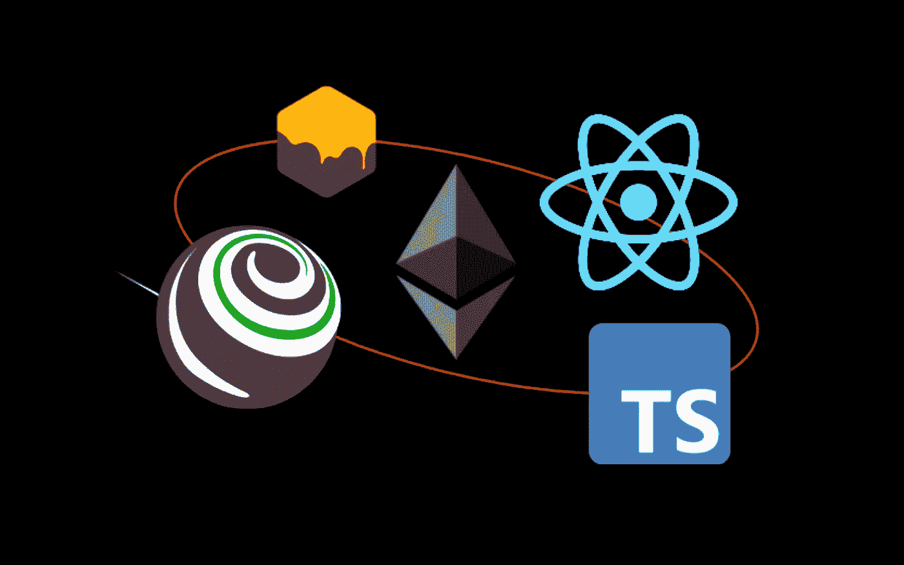
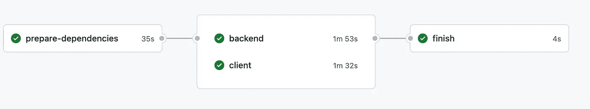
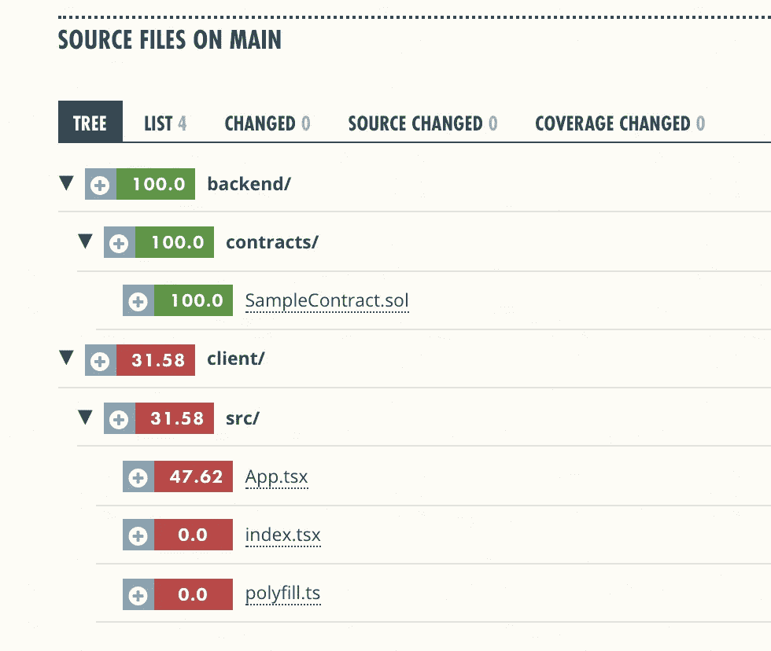

# truffle * React * mono repo With TypeScript:构建以太坊 dApp

> 原文：<https://betterprogramming.pub/truffle-react-monorepo-with-typescript-4421039d4ba8>

## 使用 TypeScript、Truffle、Ganache 和 React 开始 web3 开发



作者图片

有很多关于如何为 dApp 开发建立项目的例子。但是他们中的大多数仍然使用 JavaScript。

我想使用 TypeScript 来获得更高的生产率和更好的代码质量。此外，我希望在一个回购中包含所有内容，并为我的代码提供一份有价值的覆盖报告。GitHub 库可以在这里[找到](https://github.com/mseemann/truffle-react-typescript)——所以你可以把它作为你自己项目的起点。

# 积木

让我们明确我们想要实现的目标:

*   块菌用于后端开发
*   React 用于客户端
*   尽可能使用 TypeScript 而不是 Javascript
*   整个项目在一个根文件夹中——所以我们可以利用 monorepo 模式
*   该项目托管在 GitHub 上，每次提交时，我们都要为整个项目运行测试和构建
*   代码质量通过代码覆盖率来衡量，并提交给`coveralls`

您的机器上应该有什么:

*   我将使用 yarn 作为包管理器，但是你也可以使用 npm
*   `truffle`应全球安装
*   `ganache`应该可以在你的机器上找到

请参考[块菌文档](https://trufflesuite.com/)以了解如何在您的机器上安装块菌文档。

要开始，只需创建项目根文件夹:`mkdir truffle-react-typescript` 和`cd`。

# 后端

后端会存在一个文件夹`backend`。

因此，让我们创建文件夹并在其中运行`truffle init`:

```
mkdir backend
cd backendtruffle init
```

这将产生一个最低限度的松露项目。

除此之外，我们还可以为它创建一个样本契约和一个相应的测试:

```
truffle create contract SampleContract
truffle create test SampleContract
```

如您所见，迁移和测试文件都是作为 JavaScript 文件生成的。

在我们添加 TypeScript 特性之前，让我们将一些示例代码添加到我们的契约中，为我们的契约创建迁移，并检查一切是否按预期工作。

契约只是存储和读取一个值:

在`1_initial_migration.js`旁边添加文件`2_deploy_contracts.js`，并粘贴以下内容:

```
var SampleContract = artifacts.require("SampleContract");

module.exports = function (deployer) {
    deployer.deploy(SampleContract);
};
```

使用默认设置启动 [ganache](https://trufflesuite.com/ganache/) 后，您应该能够无任何错误地运行`truffle migrate`和`truffle test`。

## 后端打字

首先，我们需要将后端项目初始化为节点项目。

只需在`backend`文件夹中运行`yarn init`——您可以使用提供的默认值。之后，我们可以添加所需的 npm 包来启用类型化功能。这些软件包是:

*   `typescript`
*   一些打字(`truffle-typings`、`@typechain/truffle-v5`、`@types/bn.js, @types/chai`、`@types/mocha`、`@types/web3`)
*   `typechain`

所有这些都在一个命令中:

```
yarn add — dev typescript truffle-typings [@typechain/truffle-v5](http://twitter.com/typechain/truffle-v5)       [@types/bn](http://twitter.com/types/bn).js [@types/chai](http://twitter.com/types/chai) [@types/mocha](http://twitter.com/types/mocha) [@types/web3](http://twitter.com/types/web3) typechain
```

现在我们可以使用`typechain`来生成我们的契约的类型定义。

这应该在项目初始化后自动完成，因为我们不希望生成的代码成为 git 项目的一部分。

这可以通过我们的`package.json`中的`postinstall`脚本来实现:

```
"scripts": {
  "generate-types": "typechain --target=truffle-v5 './build/contracts/*.json'",
  "postinstall": "truffle compile && yarn generate-types"
 },
```

现在，每次`yarn install`针对我们的项目运行时，契约都被编译(这将在`build`文件夹中生成契约JSON 文件),并且`typechain`将在`types`文件夹中生成类型定义。

必须指定目标，以便生成的类型定义匹配我们的`truffle`项目。稍后我们将为 web3 添加类型。

让我们看看能否将单元测试转换成 TypeScript。

将文件`sample_contract.js`重命名为`sample_contract.ts`。现在将以下内容粘贴到其中:

如果您检查 IDE 中的代码，您会发现没有可用的类型信息。

这可以通过项目文件夹中的适当的`tsconfig.json`来解决:

现在测试应该可以工作了，即使它们是类型脚本文件，如果你的测试不再匹配 solidity contracts API，你会得到编译错误。

如果我们想要合同测试的覆盖报告，我们可以使用`[solidity-coverage](https://github.com/sc-forks/solidity-coverage)`。

因此，让我们将它添加到我们的后端项目:`yarn add — dev solidity-coverage`，并向包中添加一个脚本。

```
"coverage": "truffle run coverage"
```

此外，我们需要告诉`truffle`有一个新的插件可用。

这需要在插件属性:`plugins: [“solidity-coverage”]`内的`truffle-config.js` 文件中完成。

如果脚本现在被执行`truffle test`被执行，覆盖率被测量并且结果被存储在项目中。报告以不同的格式生成。例如作为 HTML:


将迁移脚本转换成 TypeScript 稍微复杂一点，因为 truffle 希望迁移文件夹中有`*.js`文件。

为了实现这一点，我们需要在运行迁移之前生成`*.js`文件。这可以通过`package.json`文件中的特殊脚本来实现:

```
"migrate": "tsc -p ./tsconfig.migrate.json --outDir migrations && truffle migrate",
```

另外，需要一个特殊的`tsconfig`文件来包含类型定义。`tsconfig.migrate.json`文件应该是:

```
{
  "extends": "./tsconfig.json",
  "include": ["./migrations/*.ts", "./types/truffle-contracts/**/*.ts"]
}
```

正如你所看到的，这个配置继承了默认的`tsconfig`，并包含了`*.ts`和类型定义文件。

如果运行迁移脚本,`*.js`和`*.map`文件将被写入迁移文件夹。

如果存在同名的`*.ts`文件，并且我已经从 git 中排除了生成的文件，我的 IDE 就会隐藏这些文件。如果这不适合您，您可以在`truffle`配置中更改迁移文件夹。房产为`migrations_directory`。

就是这样。后端现在已经完全类型化了，我们可以关心客户端了。

# 客户

要生成客户端存根，我们可以将`react-script`与 TypeScript 模板一起使用:

```
yarn create react-app client --template typescript
```

这是有趣的部分:所有相关文件已经是`*.ts`或`*.tsx`文件。因此，让我们开始构建一个示例应用程序来演示我们的后端契约的用法。

因为我们将使用 web3，所以我们需要将 web3 库添加到客户端项目:`yarn add web3`。`App.tsx`文件将包含以下内容(一个非常简单的例子——肯定不适合真实的应用程序):

你可能已经注意到了，会有一堆打字错误。所以让我们来解决它们:

## 纱线工作空间

您可以看到我们引用了来自`backend`项目的已编译合同。为了让这个工作，我们需要设置一个`yarn workspace`。

在整个项目的根文件夹中放置一个`package.json`，例如在文件夹`backend`和`client` *旁边。*内容应该是以下一条:

```
{
  "private": true,
  "workspaces": {
    "packages": [
      "backend",
      "client"
    ],
    "nohoist": [
      "client/**"
    ]
  }
}
```

删除现有的`node_modules`文件文件夹和`backend`和`client`文件夹中的`yarn.lock`文件，并将`“backend”: “1.0.0”`作为依赖添加到客户端。

一旦完成，从根文件夹运行`yarn install`。您现在可以通过在导入中引用带有前缀`backend`的文件来引用来自`backend`项目的文件。

不幸的是，`nohoist`是必需的，因为`backend`和`client`提供的库之间存在类型冲突。

有可能将特定包装排除在提升之外。但我最终排除了完整的客户。如果你有更好的解决方案，请告诉我。

## 我们合同的网络 3 打字

下一个缺失的导入是来自`backend`项目的类型`SimpleContract`。这里我们需要的是`web3`库的特殊类型定义。

因此，我们必须将`@typechain/web3`作为依赖项添加到我们的`backend`项目中，并以我们为`truffle`生成它们的相同方式生成它们。

这也应该在我们纱线项目的`postinstall`阶段完成:

```
"generate-types-client": "./node_modules/.bin/typechain --target=web3-v1 './build/contracts/*.json'",
"postinstall": "truffle compile && yarn generate-types && yarn generate-types-client",
```

## 提供 window.ethereum 的类型

代码中的类型错误现在几乎已经修复。

编译器抱怨`window`对象上的`ethereum`属性。

我们可以在 r *eact-app-env.d.ts* 文件中添加所需的类型:

```
interface Window {
    ethereum: any;
}
```

现在代码应该编译没有任何错误，我们可以启动开发服务器。因为我们现在有了 monorepo，所以我们可以从根项目启动 dev 服务器:

```
yarn workspace client start
```

您的浏览器将会打开，并尝试与我们的合同进行交互。

请确保元掩码连接到您的本地 ganache 实例，并且您的合同已部署。如果一切顺利，您应该在 UI 中看到存储的值。

只有一个小问题。当前版本 5 的`react-script`在引擎盖下使用 webpack 5。并且 webpack 5 不再为节点包提供`polyfills`。

但是`web3`需要它们，这样我们的代码才能工作。如果你遇到这个问题，请看看这个[问题评论](https://github.com/ChainSafe/web3.js/issues/4659#issuecomment-1004660167)。我已经描述了一个暂时解决这个问题的方法。

对于单元测试，`package.json`中已经有一个脚本，如果我们想要客户项目的覆盖报告，我们可以提供一个特殊的选项，告诉`react-scripts`生成报告:

```
"coverage": "react-scripts test --coverage",
```

该报告被写入客户端文件夹中的`coverage`目录。

# GitHub 行动和工作服

既然后端和客户端可以在本地测试、构建、部署和运行，让我们确保我们的 monorepo 有一个自动测试和构建流程。

为了尽可能简单，我们将使用 GitHub 动作，因为代码已经托管在 GitHub 上。我将只强调重要的方面。

## 缓存节点 _ 模块

作为开发人员，我们想要的是快速响应，如果我们的 lint、测试和构建运行时没有任何错误。

monorepo 使运行一个`yarn install`命令和缓存`node_modules`文件夹成为可能，以备将来或后续 ci 运行。

此外，后端和客户端步骤可以并行运行。

为了避免应用程序的每个部分执行两次`yarn install`，我们可以运行一次，确保`node_modules`文件夹被缓存，后端和客户端使用这些缓存的文件。这将看起来像这样:



现在请忽略`finish job`，因为我们稍后会处理它。`prepare-dependencies`工作看起来是这样的:

```
prepare-dependencies:
  runs-on: ubuntu-latest
  steps:
    - uses: actions/checkout@v2
    - name: Use Node.js
      uses: actions/setup-node@v2
      with:
        node-version: '14'
    - uses: actions/cache@v2
      id: yarn-cache
      with:
        path: '**/node_modules'
        key: ${{ runner.os }}-yarn-${{ hashFiles('**/yarn.lock') }}
        restore-keys: |
          ${{ runner.os }}-yarn-
    - name: Install Deps
      if: steps.yarn-cache.outputs.cache-hit != 'true'
      run: yarn install --immutable --immutable-cache --check-cache
```

在步骤 checkout 和`node setup` 之后，一个缓存作业用来恢复缓存的`node_modules` 文件夹。这将恢复每个`*node_module*`文件夹的缓存，甚至包括子文件夹。如果缓存无法恢复(例如没有`cache-hit`)，则执行`yarn install`。

另外两个作业(后端和客户端)在`prepare-dependencies`作业运行后执行。因此，我们可以始终确保缓存可用，并且不需要再次运行`yarn install`。

但是我们需要再次调用`postinstall`脚本来编译 solidity 代码并生成我们的类型。

每个工作的步骤都是一样的:

```
- uses: actions/cache@v2
  id: yarn-cache
  with:
    path: '**/node_modules'
    key: ${{ runner.os }}-yarn-${{ hashFiles('**/yarn.lock') }}
    restore-keys: |
      ${{ runner.os }}-yarn-
- name: Run Postinstall
  run: yarn workspace backend postinstall
```

如您所见，我们不需要 cd 到子文件夹中。这由纱线工作区处理。

## 测试可靠性代码

可靠性测试的执行需要一个正在运行的 ganache 实例和迁移的契约。

为此，我们需要在执行可靠性测试之前启动一个`ganache`实例。

我们可以使用`ganache-cli`包(`yarn workspace backend add` *—* `dev ganache-cli`)。

安装完成后，我们在`package.json`中创建一个脚本:

```
"ganache-cli": "ganache-cli -p 7545 --gasLimit=0x1fffffffffffff --allowUnlimitedContractSize -e 1000000000 > /dev/null &"
```

..以及一个 GitHub 动作作业，它将启动 ganache 实例并停止作业执行，直到`ganache`实例准备好在 TCP 端口接受调用:

```
- name: Start ganache
  run: |
    yarn workspace backend ganache-cli
    while netstat -lnt | awk '$4 ~ /:7545/ {exit 1}'; do sleep 5; done
```

果不其然，如果我们完成了所有其他工作，我们需要停止`ganache`:

```
- name: Stop ganache
  run: kill $(lsof -t -i:7545)
```

就是这样。现在我们可以执行`yarn workspace backend migrate`、`test`和`coveralls`。

## monorepo 的工作服

执行 CI 作业后，我们可以将覆盖报告上传到`coveralls`。我们唯一需要注意的是:我们有两个作业正在运行，并且希望`coveralls`将结果组合起来，得到一个总的代码覆盖率。

对于后端，我们定义了以下作业:

```
- name: Coveralls
  uses: coverallsapp/github-action@master
  with:
    github-token: ${{ secrets.GITHUB_TOKEN }}
    flag-name: Backend
    path-to-lcov: ./backend/coverage/lcov.info
    parallel: true
```

连体工作服需要项目的读取权限。为此，我们可以使用自动生成的`GITHUB_TOKEN`(默认权限是读/写。

如果需要，可以在动作设置中将其更改为只读)。需要`flag-name`来识别作业。我们需要告诉`coverall`我们有并行运行的作业。

客户端的代码是:

```
- name: Coveralls
  uses: coverallsapp/github-action@master
  with:
    github-token: ${{ secrets.GITHUB_TOKEN }}
    flag-name: Client
    path-to-lcov: ./client/coverage/lcov.info
    parallel: true
    base-path: ./client
```

如您所见，`client`作业的`flag-name`不同于后端作业。

我们告诉工作服`monorepo`中的客户端文件夹的`base-path`来对齐路径信息。后端使用`lcov.info`文件中的绝对路径信息，不需要这些额外的信息。

最后一步是告诉工作服，所有的工作已经执行。如果`backend`和`client`作业已经完成，我们工作流程中的作业必须运行:

```
finish:
  needs: [backend, client]
  runs-on: ubuntu-latest
  steps:
    - name: Coveralls Finished
      uses: coverallsapp/github-action@master
      with:
        github-token: ${{ secrets.github_token }}
        parallel-finished: true
```

如果我们的工作流完成了，我们可以在工作服用户界面中看到组合的覆盖率结果，并有可能深入到每一行代码。



# 结论——还有哪些可以改进的地方

如您所见，获得完整的类型化代码和运行的工作流需要付出很多努力——比我想象的要多。值得吗？

我会说:是的。

因为我们现在可以依靠类型代码和两个受益于类型信息的项目(后端和客户端)。然而，它们是分开的，每个项目都有自己的职责。我们可以很容易地将不同的客户项目添加到我们的 yarn 工作空间中。

目前的一个难点是客户端 npm 包的禁用提升，因为后端和客户端所需的包中的类型信息会导致类型冲突。

请记住，他们使用不同的测试框架。此外，web3 类型需要显式类型转换。也许`[eth-sdk](https://github.com/dethcrypto/eth-sdk)`项目可以克服这些限制。

如果你有任何改进上述方法的想法，请告诉我。

# 源代码

你会在这个 [GitHub Repo](https://github.com/mseemann/truffle-react-typescript) 中找到当前的代码——只要分叉它。