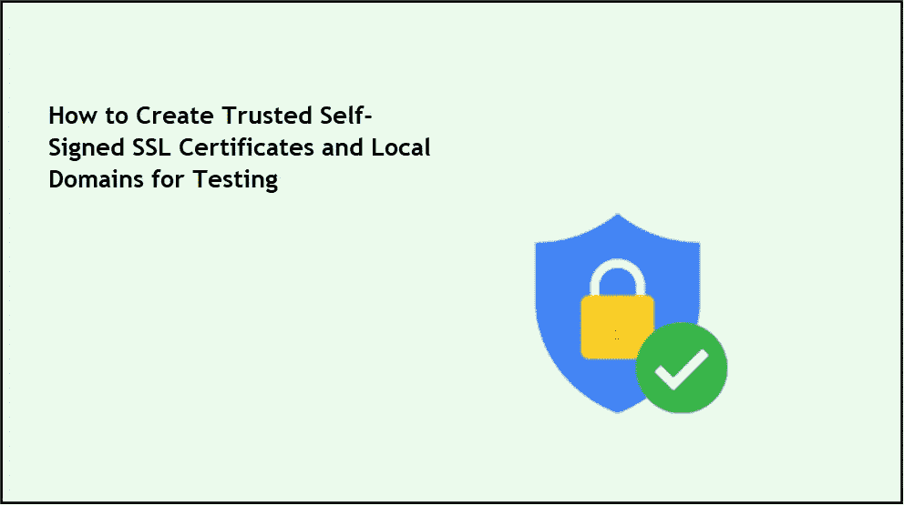
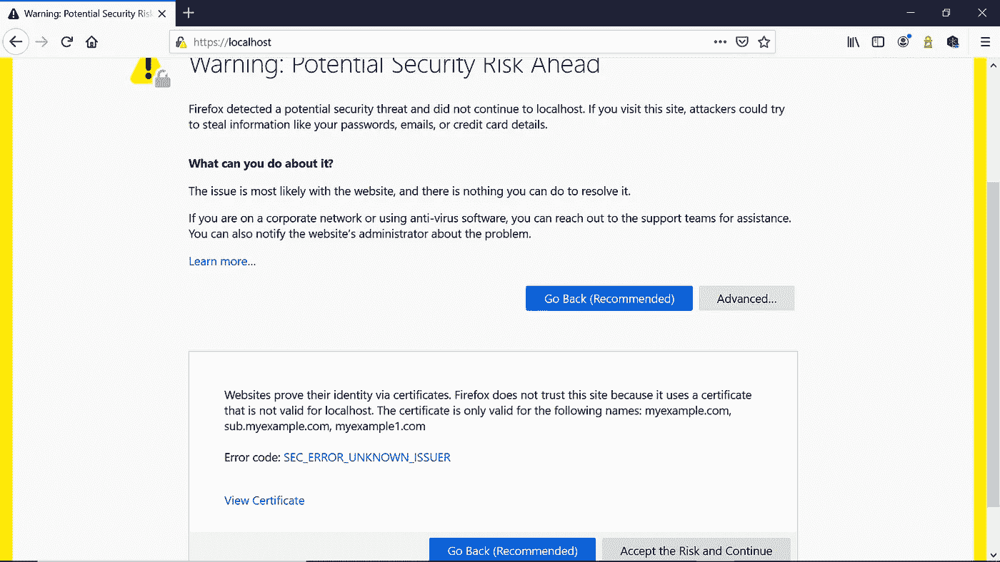
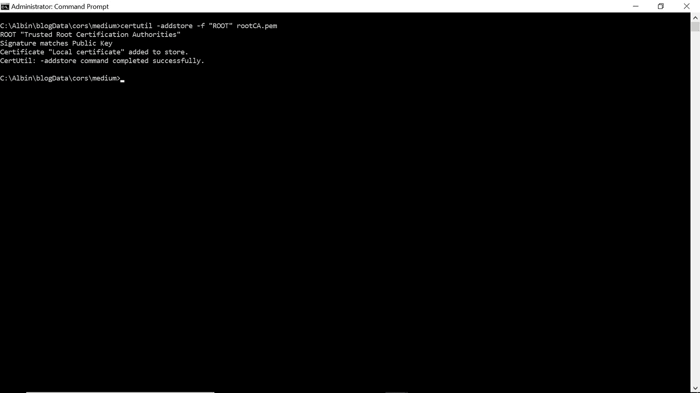
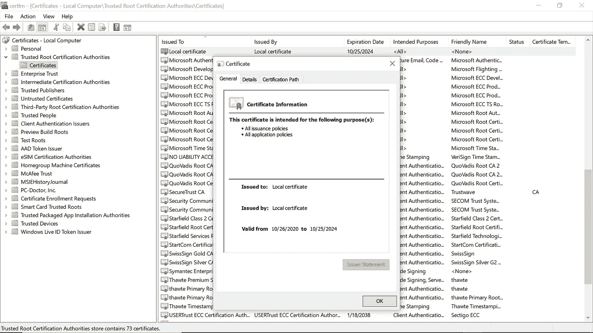
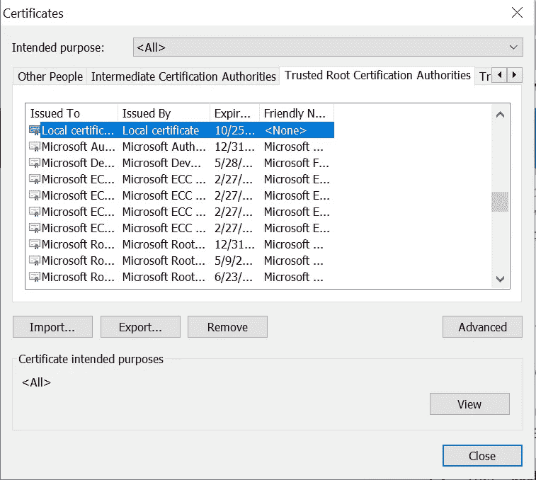
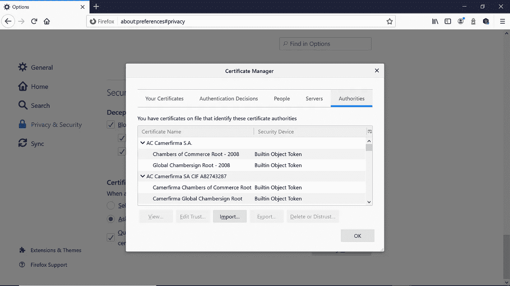
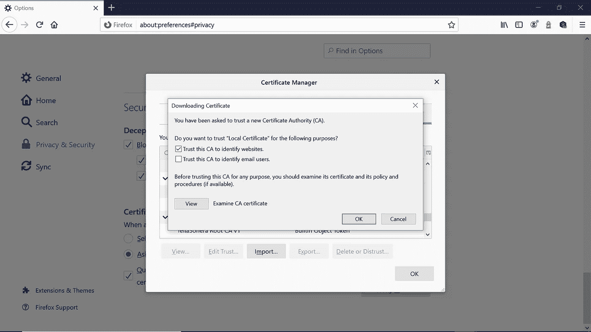
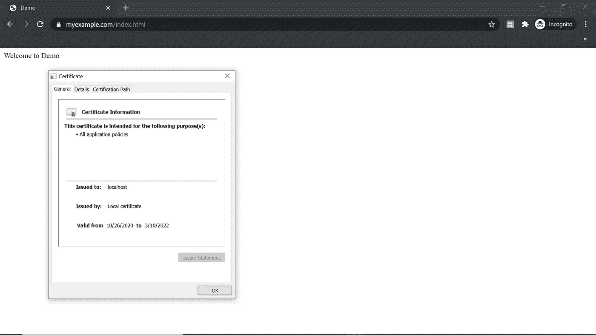
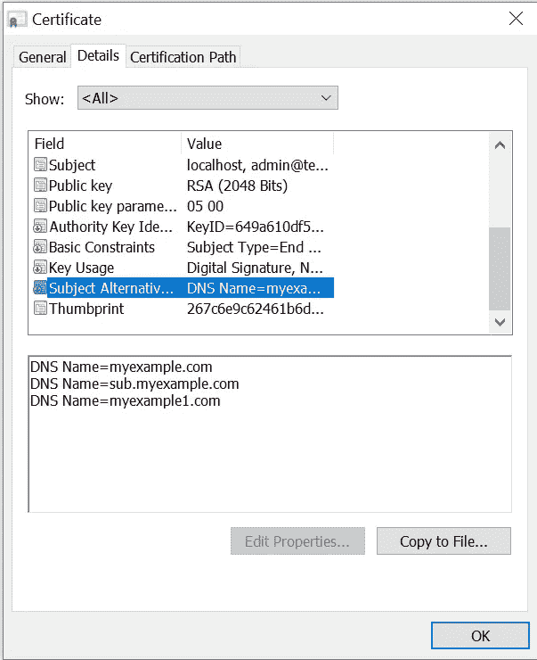

# 如何创建用于测试的可信自签名 SSL 证书和本地域

> 原文：<https://betterprogramming.pub/trusted-self-signed-certificate-and-local-domains-for-testing-7c6e6e3f9548>

## 设置本地测试域，并为快速本地测试启用可信的自签名证书



大多数情况下，我们会使用本地主机以外的域来测试本地应用程序，并且我们还需要可信的自签名 SSL 证书。

# 自签名证书

*自签名证书*是由创建它的人签名的证书，而不是由可信的证书颁发机构签名的证书。开发服务器可以启用自签名证书，这将有助于我们降低证书成本和管理开销。

默认情况下，在浏览器中访问网站时，自签名证书会抛出一个证书验证错误，但允许我们通过接受风险来进入实际页面。在某些情况下，自签名证书不会帮助我们测试一些只能通过有效 SSL 工作的浏览器功能，例如，测试不同浏览器的 API，如地理定位。



现在让我们看看如何快速设置本地域和可信自签名证书，以便在 Windows 中进行测试。通过一些额外的步骤，同样可以用于其他系统。

# 本地域

有时我们可能需要不同的领域来测试开发环境中的应用程序。DNS 设置将消耗更多的时间和成本；本地域帮助我们在开发环境中快速测试应用程序。

我将定义以下测试域— `myexample.com`、`sub.myexample.com`和`myexample1.com`。

编辑 Windows `hosts`文件，`C:\Windows\System32\drivers\etc\hosts`。添加下面的条目，将测试域映射到`127.0.0.1`，这样定义的域将能够在同一台机器上访问本地主机上运行的应用程序。

```
127.0.0.1 myexample.com 
127.0.0.1 sub.myexample.com 
127.0.0.1 myexample1.com
```

现在让我们通过 OpenSSL 创建一个自签名证书。

# 生成根 SSL 证书

创建一个 RSA-2048 密钥，并将其保存到文件`rootCA.key`。

```
openssl genrsa -des3 -out rootCA.key 2048
```

当您收到“输入 rootCA.key 的密码短语”时，请输入一个密码短语并将其安全存储。

通过生成的密钥创建根证书。

```
openssl req -x509 -new -nodes -key rootCA.key -sha256 -days 1460 -out rootCA.pem
```

根据需要更改有效期。

当出现“输入 rootCA.key 的密码”时，输入生成根密钥时使用的密码。

输入其它可选信息:

*   国家名称(2 个字母的代码)[AU]:美国
*   州或省名(全名)[某些州]: MN
*   地点名称(例如，城市)[]: Eagan
*   组织名称(如公司)[互联网 Widgits Pty Ltd]:技术论坛
*   组织单位名称(如部门)[]:营销
*   公用名(例如，服务器 FQDN 或您的名字)[]:本地证书
*   电子邮件地址[]: `[admin@techforum.com](mailto:admin@techforum.com)`

# 信任根 SSL 证书:

现在根证书准备好了。让我们信任本地系统中的根 SSL 证书。

通过命令提示符运行以下命令(通过提升的访问权限运行):

```
certutil -addstore -f "ROOT" rootCA.pem
```

现在，根证书被添加为受信任的根证书颁发机构的一部分。



您可以通过证书管理器或`Certmgr.msc`验证证书。



甚至可以通过浏览器管理根证书:在 Chrome 中，导航到设置→隐私和安全→安全→管理证书→受信任的根证书颁发机构。

您可以导入/导出和删除证书(如果是通过`Certmgr.msc`导入的，则不能删除证书):



如果使用 Firefox 进行本地测试，它不会考虑来自 Windows cert store 的根证书(Chrome 和 Edge 指的是来自 Windows cert store 的根证书)。自签名根证书应该单独导入 Firefox。

导航到选项→隐私和安全→安全→证书→查看证书。



您可以导入/导出和删除证书。导入在前面步骤中生成的根 CA 证书。选择“信任此 CA 来识别网站”



# 使用根证书生成 SSL SAN 证书

根证书现在是可信的。让我们发布一个 SSL 证书来支持我们的本地域— `myexample.com`、`sub.myexample.com`、`myexample1.com`和`localhost`进行测试。

创建一个新的 OpenSSL 配置文件`server.csr.cnf`，以便在生成证书时可以使用配置细节。

```
[req]
default_bits = 2048
prompt = no
default_md = sha256
distinguished_name = dn

[dn]
C=US
ST=MN
L=Eagan
O=Tech Forum
OU=Marketing
emailAddress=admin@techforum.com
CN = localhost
```

创建一个包含本地 SAN 域列表的`v3.ext`文件:

```
authorityKeyIdentifier=keyid,issuer
basicConstraints=CA:FALSE
keyUsage = digitalSignature, nonRepudiation, keyEncipherment, dataEncipherment
subjectAltName = @alt_names[alt_names]
DNS.1 = myexample.com
DNS.2=sub.myexample.com
DNS.3=myexample1.com
DNS.4=localhost
```

为本地主机证书创建私钥和证书签名请求(CSR)。

```
openssl req -new -sha256 -nodes -out server.csr -newkey rsa:2048 -keyout server.key -config server.csr.cnf
```

该私钥存储在`server.key`上。

让我们通过根 SSL 证书和前面创建的 CSR 发布一个证书。

```
openssl x509 -req -in server.csr -CA rootCA.pem -CAkey rootCA.key -CAcreateserial -out server.crt -days 500 -sha256 -extfile v3.ext
```

当显示“输入 rootCA.key 的密码”时，输入生成根密钥时使用的密码。

输出证书存储在名为`server.crt`的文件中。

# 为本地服务器启用 SSL 证书

现在让我们为本地服务器启用证书。我将使用 Express.js 应用程序配置证书，以启用可信 SSL 通信。

## app.js

```
var express = require('express')
const path = require('path')
const https = require('https');
const fs = require('fs');var app = express ()app.get('/index.html', function (req, res) {res.sendFile('index.html', {
        root: path.join(__dirname, '.')
    })
})**https.createServer({
  key: fs.readFileSync('ssl\\server.key'),
  cert: fs.readFileSync('ssl\\server.crt')
}, app)
.listen(443, function () {
  console.log('Example app listening on port 443! Go to** [**https://localhost/**](https://localhost/)**')
})**
```

现在，对于测试域`myexample.com`、`sub.myexample.com`、`myexample1.com`和`localhost`，该证书在浏览器中是可信的。



可信的自签名证书以及本地域可用于开发和初始测试。这将帮助我们快速启用受信任的本地域来测试一些需要受信任的 SSL 证书的场景。