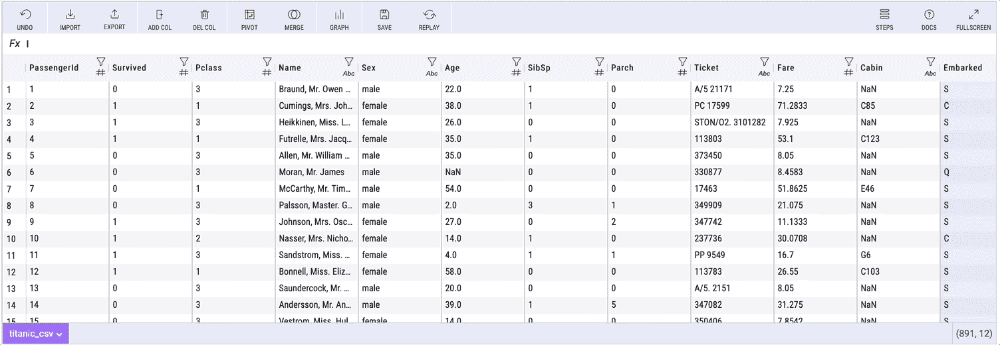
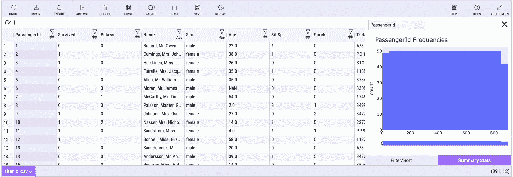
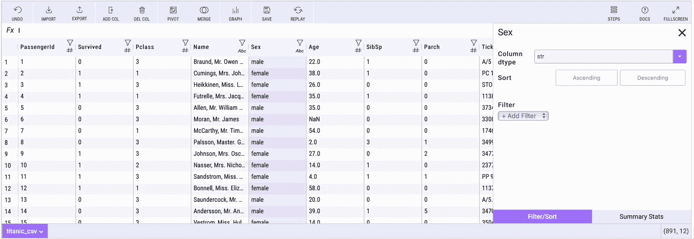
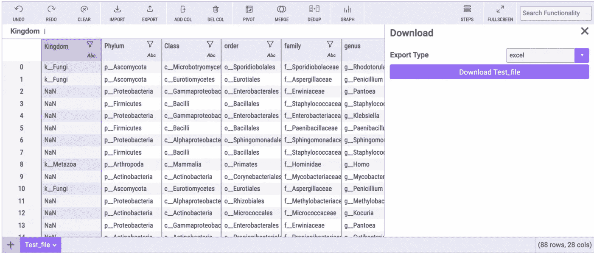

# 试试米托 Python 包:数据科学家的电子表格

> 原文：<https://betterprogramming.pub/try-mito-python-package-the-data-scientists-spreadsheet-69f1f4160810>

## 米托将您最喜爱的数据科学工具组合在一个整洁的 Python 包中


在 [Unsplash](https://unsplash.com?utm_source=medium&utm_medium=referral) 上由 [Samuel Sianipar](https://unsplash.com/@samthewam24?utm_source=medium&utm_medium=referral) 拍照

[米托](http://trymito.io/)是 Python 的电子表格接口。你可以将米托导入你的 Jupyter 笔记本，一个电子表格就会出现。

就像俗话说的，一个视频胜过千言万语—我知道…事情不是这样的:)

用米托 2.0 进行数据切片(视频由[米托](https://www.youtube.com/watch?v=VobWi0af-Tc))

您在电子表格中进行的每次编辑都会在下面的代码单元格中生成等效的 Python。例如，如果您在米托创建一个数据透视表，熊猫数据透视表代码将自动出现在下面的代码单元格中，并带有文档。

自动生成的代码非常适合在另一台机器上重复您的分析，并且适合数据科学新手使用 pandas 的数据处理方式。

米托最常用于以下两种情况之一:

*   首先是让 Python 用户快速编写代码。由于米托自动生成代码并自动归档，你不必再去谷歌或 Stack Overflow 寻找大量操作的正确语法。
*   第二个用例是从电子表格工作流过渡到 Python，这将在本文中介绍。

# 首先，让我们把米托安装好


Joel Filipe 在 [Unsplash](https://unsplash.com?utm_source=medium&utm_medium=referral) 上拍摄的照片

我假设您的机器上安装了最新的 Jupyter Lab 版本。如果不是这样，请参见 Jupyter 实验室的官方文档[开始。](https://jupyterlab.readthedocs.io/en/stable/getting_started/installation.html)

要安装米托，请运行以下命令:

```
python -m pip install mitoinstaller
python -m mitoinstaller install
```

然后打开 Jupyter Lab 并导入 Mitosheet:

```
import mitosheet
mitosheet.sheet()
```

您可以在[米托网站的“文档”页面查看完整的安装说明。](http://trymito.io/)

# 连接到电子表格

在米托，您可以导入 Excel 文件或 CSV。你所需要做的就是点击导入按钮，然后你就可以浏览你的本地文件了。

将数据导入米托(米托拍摄的视频)

在电子表格中处理大型数据集可能会慢得令人难以置信——更新公式、创建数据透视表或生成图表可能需要几分钟甚至几个小时的加载时间。如果你有一个大于一百万行的数据集，Excel 甚至不会接受它。

许多米托用户将他们的电子表格导入米托，以便快速处理数据。米托可以处理适合熊猫数据帧的任何数据大小(那是数百万行)，当你导入数据集时，米托会自动将其转换成数据帧。

# 用米托分析数据


在 [Unsplash](https://unsplash.com?utm_source=medium&utm_medium=referral) 上拍摄的 [ThisisEngineering RAEng](https://unsplash.com/@thisisengineering?utm_source=medium&utm_medium=referral)

借助米托，您可以执行电子表格和数据科学操作，例如:

*   绕轴旋转
*   绘制图形
*   电子表格公式
*   编辑数据框架中的特定单元格
*   合并
*   删除重复数据
*   查看汇总统计数据
*   过滤
*   整理
*   添加和删除列
*   还有更多！

在下面的可视化中，您可以看到过滤数据集、制作数据透视表、制作图表以及在下面的代码单元格中生成等效代码的情况。


用米托分析数据(作者制作的 gif)

## 数据透视表



用米托透视数据(gif 由作者制作)

## 汇总统计



用米托计算汇总统计(gif 由作者制作)

## 类似 Excel 的电子表格公式



米托的 Excel like 公式(作者制作的 gif)

# 导出您的分析:

在米托完成分析后，有几种方法可以分享您的结果。一些用户希望将生成的代码复制到另一个脚本中，或者在笔记本中应用更高级的东西，如 ML 模型。

许多用户希望将输出返回到电子表格中。在米托，你可以点击“导出按钮”,以 Excel 文件或 CSV 格式获取米托的当前状态。



导出米托电子表格(图片由作者制作)

这里是[米托网站](http://trymito.io/)，在这里你可以了解更多关于该工具的信息并获得安装说明。

# 结论

对于那些希望从 Excel 或 Google 电子表格环境过渡到 Python 的人来说，米托是一个强大的工具。

我使用米托进行初步的探索性数据分析，以获得对数据的感觉。一遍又一遍地输入同一套命令变得单调乏味。

您会将米托添加到您的数据科学工具箱中吗？请在下面的评论中告诉我。