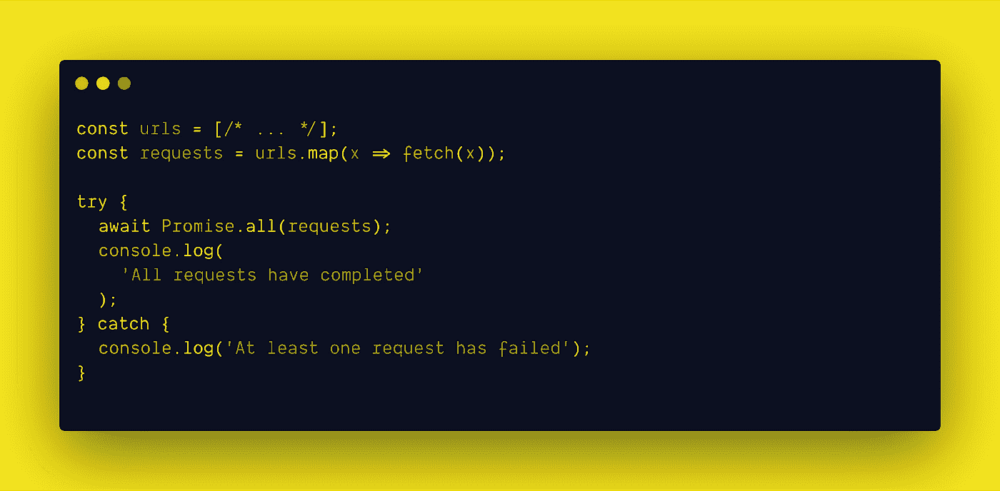
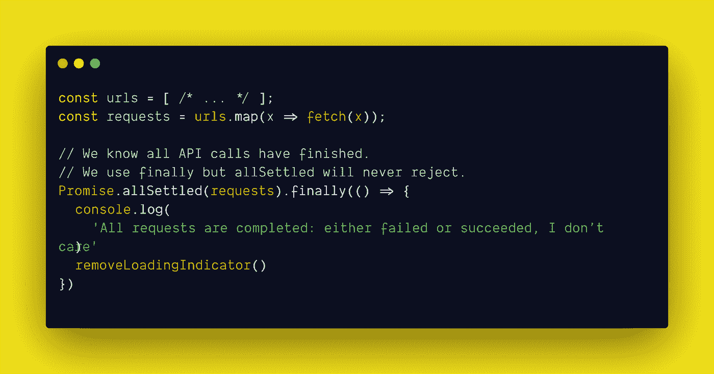
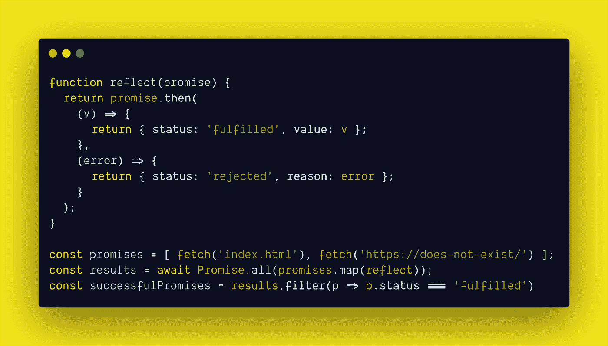
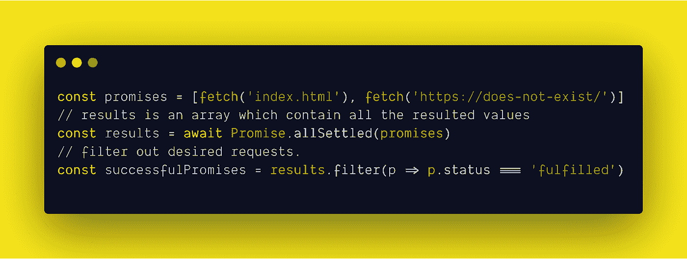

# 尝试承诺。allSettled Combinator

> 原文：<https://betterprogramming.pub/trying-out-the-promise-allsettled-combinator-8aec45edd676>

## 在解决所有潜在承诺后，返回承诺

由 [Pankaj Patel](https://unsplash.com/@pankajpatel?utm_source=medium&utm_medium=referral) 在 [Unsplash](https://unsplash.com?utm_source=medium&utm_medium=referral) 上拍摄。

您是否曾经遇到过这样的场景:您必须发出多个请求并执行一个操作，而所有这些请求都得到满足？或者您可能想检查有多少请求被解决，有多少被拒绝？

在大多数情况下，您会使用`Promise.all`，这是一个强大的组合器，在处理带有承诺的多个请求时非常有用。但是使用这个组合器也有一些缺点。为了解释这意味着什么，让我们看一下图 1:

图 1

让我们假设在 URL 的数组中有一些 API 端点，并且已经向所有这些端点发送了请求。如果您使用的是`Promise.all`，甚至有一个请求被拒绝，那么就会出现短路，剩下的请求就会丢失。您也将无法跟踪其余的请求，因为代码块将落入 try-catch 语句的 catch 情况中。

由于这些情况，贾森·威廉姆斯(BBC)、罗伯特·帕梅利(彭博)和冠军马蒂亚斯·拜恩斯(谷歌)提出了一个新的承诺组合子，被称为`Promise.allSettled`。

# **到底什么是 Promise.allSettled？**

`[Promise.allSettled](https://github.com/tc39/proposal-promise-allSettled)`是一个新的组合子，将于今年加入 JavaScript。目前，该提案处于完成状态。

`Promise.allSettled()`返回一个承诺，该承诺在所有给定承诺被解决或拒绝后解决，并带有一个描述每个承诺结果的对象数组。

## 用例#1

让我们修改下面给出的例子:

我们已经将请求数组传递给了`Promise.allSettled`并调用了`finally()`。这种实现完全没有短路。流动永远不会因为拒绝而停止。因此，不需要编写 try-catch 语句和额外的检查。看起来很酷，对吧？那我们为什么不看看另一个用例呢！

## **用例 2**

如果我们必须跟踪哪些请求被满足，哪些请求被拒绝，那该怎么办？传统上，我们会在一个 helper 函数的帮助下完成它，该函数接受一个承诺，并将其状态返回到已完成或已拒绝。

如果你浏览一下上面的例子，你会发现我们已经创建了一个名为`reflect`的助手函数。这个函数将一个承诺作为参数，并在 return 语句中调用它。如果承诺被成功解决，那么它将落入`.then()`块的第一个回调函数中，这就是所谓的`onFulfilled`。使用这个，我们从`onFulfilled`回调函数返回状态为 fulfilled 的已履行值。如果承诺被拒绝，那么它将陷入第二个回调函数，这就是所谓的`onRejected`。在这里，我们返回错误和从回调中拒绝的状态。

接下来，我们将把`reflect`作为回调函数传递给`promises.map()`，然后它将映射所有承诺并返回所有结果的数组。为了检查成功的承诺，我们在状态的帮助下过滤结果。`successfulPromises`数组将包含所有完成的请求。如你所见，这是一个很大的工作量。

让我们看看`Promise.allSettled`如何简化这一过程:

乍一看，您可以感觉到传统方法与使用`Promise.allSettled`的区别。没有必要编写自己的实现。

`Promise.allSettled`将映射承诺并返回一个包含所有结果的数组——满足或拒绝。我们可以像在传统方法中一样过滤请求。所有这些都是干净的、可读的、更易于维护的。

如果你想使用这个惊人的组合，那么你可以从这些惊人的资源中使用它:

*   [https://www.npmjs.com/package/promise.allsettled](https://www.npmjs.com/package/promise.allsettled)
*   [https://www.npmjs.com/package/q](https://www.npmjs.com/package/q)
*   [https://www.npmjs.com/package/rsvp](https://www.npmjs.com/package/rsvp)
*   [http://bluebirdjs.com/docs/api/reflect.html](http://bluebirdjs.com/docs/api/reflect.html)
*   [https://www.npmjs.com/package/promise-settle](https://www.npmjs.com/package/promise-settle)
*   [https://github . com/cujojs/when/blob/master/docs/API . MD # when settle](https://github.com/cujojs/when/blob/master/docs/api.md#whensettle)
*   [https://www.npmjs.com/package/es2015-promise.allsettled](https://www.npmjs.com/package/es2015-promise.allsettled)
*   https://www.npmjs.com/package/promise-all-settled
*   【https://www.npmjs.com/package/maybe 

# **底线**

您可以感受到这个神奇的组合器的力量，它使处理多个请求变得简单而安全。如果您现在想使用它，那么本文提供了一个很酷的实现。在那之前，让我们就等着这个惊人的特性被添加到 JavaScript 的世界中吧！