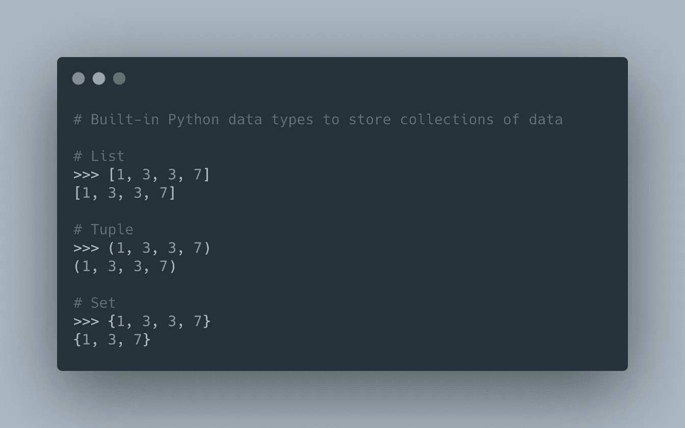

# Python 中的元组、列表和集合

> 原文：<https://betterprogramming.pub/tuples-vs-lists-vs-sets-in-python-3dff8a7b1f02>

## 你可能一直都用错了


[Bradyn Trollip](https://unsplash.com/@bradyn?utm_source=medium&utm_medium=referral) 在 [Unsplash](https://unsplash.com?utm_source=medium&utm_medium=referral) 上拍摄的照片。

在 Python 中，有四种内置的数据类型可以用来存储数据集合。这些内置的数据类型具有不同的性质和特点，分别被称为[列表](https://www.w3schools.com/python/python_lists.asp) ( `list`)、[元组](https://www.w3schools.com/python/python_tuples.asp) ( `tuple`)、[集合](https://www.w3schools.com/python/python_sets.asp) ( `set`)、[字典](https://www.w3schools.com/python/python_dictionaries.asp) ( `dict`)。

在本文中，我们将略微深入 Python 中的 List、Tuple 和 Set，讨论它们的区别以及何时使用这些数据类型。

由于 Dictionary 将键与它们各自的值相关联，这与 List、Tuple 和 Set(它们只包含值)相比是一个非常不同的用例，因此它不属于本次讨论的范围。

为了简单起见，我可能会互换使用 Set 和 Dictionary，因为它们是基于[哈希表](https://en.wikipedia.org/wiki/Hash_table)(或哈希映射)。



Python 内置数据类型来存储数据集合

## TL；速度三角形定位法(dead reckoning)

*   如果您需要存储副本，请使用列表或元组。
*   对于 List vs. Tuple，如果您不打算进行变异，请选择 Tuple。
*   如果您不需要存储副本，请始终使用集合或字典，因为在确定一个对象是否在集合中时，它们会快得多(例如`x in set_or_dict`)。

# 我们为什么关心？

在大多数情况下，这些数据类型可以在一个应用程序中互换使用，不会有太大的麻烦。然而，想象一下，如果给我们一个任务，检查在一个相当大的干草堆中是否存在一根针。就速度和内存而言，这样做最有效的方式是什么？

草堆应该是列表吗？元组呢？或者为什么不总是用一套(或者一本字典)？我们应该注意哪些警告？

让我们开始吃吧。

# 列表、元组和集之间的区别

## 复制

如果我要解释这一点，列表和元组就像 Python 中的兄弟姐妹。另一方面，Set(或 Dictionary)就像是这两者的表亲。

与列表或元组不同，集合不能包含重复项。换句话说，集合中的元素是唯一的。

```
set_example = {1, 1, 2, 3, 3, 3}
# {1, 2, 3}fruit_set = {'🍎', '🍓', '🍐', '🍎', '🍎', '🍓'}
# {'🍎', '🍐', '🍓'}
```

有了这些知识，我们现在知道 Set 也可以用来从列表中删除重复项！

## 命令

您可能听说过“Python 中的集合和字典是无序的”这句话现在，这只是事实的一半，这取决于你使用的 Python 版本。

在 Python 3.6 之前，字典和集合不会保留它们的插入顺序。如果您在 Python 3.5 中尝试，这里有一个示例:

```
# Example in Python 3.5fruit_size = {} 
>>> fruit_size['🍎'] = 12 
>>> fruit_size['🍐'] = 16 
>>> fruit_size['🍇'] = 20 
>>> fruit_size
{'🍎': 12, '🍇': 20, '🍐': 16}
```

*使用* [*pyenv*](https://github.com/pyenv/pyenv) *可以轻松切换到不同版本的 Python。试试吧！*

今天，这句话已经过时几年了。[从 Python 3.7](https://mail.python.org/pipermail/python-dev/2017-December/151283.html) 开始，字典和集合[正式](https://docs.python.org/3/whatsnew/3.7.html#summary-release-highlights)按插入时间排序。

无论如何，如果你想知道，列表和元组是对象的有序序列。

## 易变性

当你把一个对象描述为可变的时候，这仅仅是说对象的内部状态可以被改变的一种奇特的方式。

这里的关键区别是 Tuple 是不可变的，而 List 和 Set 是可变的。

尽管集合是可变的，但我们不能通过索引或切片来访问或更改集合中的任何元素。因此，我们只能向集合中添加新元素，而不能改变它们。

请注意集合中的`[update](https://www.geeksforgeeks.org/python-set-update/)`方法仅仅意味着一次添加多个元素的能力。

## 索引

Tuple 和 List 都支持索引和[切片](https://www.w3schools.com/python/python_strings_slicing.asp)，而 Set 不支持。

```
fruit_list = ['🍎', '🍓', '🍐']
fruit_list[1]
# '🍓'animal_tuple = ('🐶', '🐱', '🐮')
animal_tuple[2]
# '🐮'vehicle_set = {'🚐', '🏍', '🚗'}
vehicle_set[0]
# TypeError: 'set' object is not subscriptable
```

# 何时使用列表还是元组

正如我们前面提到的，元组是不可变的，而列表是可变的。同理，[元组](https://docs.python.org/3/tutorial/datastructures.html#tuples-and-sequences)本质上是固定大小的，而[列表](https://docs.python.org/3/tutorial/introduction.html#lists)是动态的。

```
a_tuple = tuple(range(1000))
a_list = list(range(1000))a_tuple.__sizeof__()  # 8024 bytes
a_list.__sizeof__()   # 9088 bytes
```

## 使用列表

1.  当你需要改变你的收藏时。
2.  当您需要在项目集合中移除或添加新项目时。

## 使用元组

1.  您的数据是否需要更改。
2.  元组比列表快。如果我们定义一组常量值，并且我们要做的只是遍历它，那么我们应该使用 Tuple 而不是 List。
3.  如果我们需要一个元素数组作为字典键，我们可以[使用元组](https://diveintopython3.net/native-datatypes.html#tuples)。由于列表是可变的，所以它们永远不能用作字典键。

# 何时使用集合与列表/元组

由于 Set 使用哈希表作为其底层数据结构，当检查一个元素是否在其中时(例如`x in a_set`)，Set*非常快*。

其背后的思想是，在哈希表中查找一个条目是一个 *O(1)(常数时间)*操作。

## 那么，我应该总是使用 Set 还是字典呢？

本质上，如果您不需要存储副本，Set 将比 List 更好。句号。

# 摘要

那么，主要的外卖有哪些呢？

*   如果您需要存储副本，请使用列表或元组。
*   对于 List vs. Tuple，如果您不打算进行变异，请选择 Tuple。
*   如果您不需要存储副本，请始终使用集合或字典，因为在确定集合中是否存在某个对象时，它们要快得多(例如`x in set_or_dict`)。

如果你像我一样是一个数字迷，当你迭代或检查一个对象是否存在于一个集合中时，看看这个 Tuple、List 和 Set 之间的速度比较。

最终，在很大程度上，我真的认为我们不应该过多考虑使用哪种数据结构。

> *“过早优化是万恶之源。”*

## 其他参考文献

*   [https://wiki.python.org/moin/TimeComplexity](https://wiki.python.org/moin/TimeComplexity)

## [最初发表于 jerrynsh.com](https://jerrynsh.com/tuples-vs-lists-vs-sets-in-python/)

[](/how-to-write-clean-code-in-python-5d67746133f2) [## 如何用 Python 写干净的代码

### 使用 Python 示例编写干净代码的 3 个技巧

better 编程. pub](/how-to-write-clean-code-in-python-5d67746133f2) [](/3-useful-python-f-string-tricks-you-probably-dont-know-f908f7ed6cf5) [## 你可能不知道的 3 个有用的 Python f-string 技巧

### 关于 Python 的格式化字符串(f-string)你需要知道的事情

better 编程. pub](/3-useful-python-f-string-tricks-you-probably-dont-know-f908f7ed6cf5)